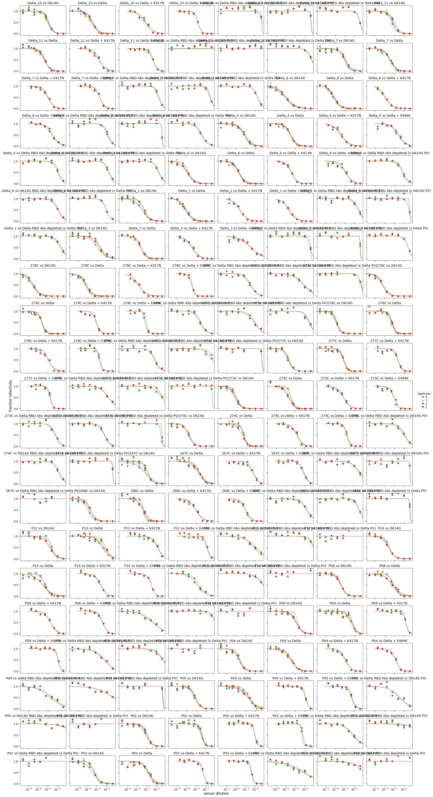
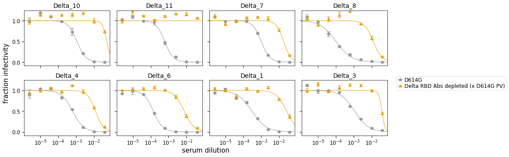
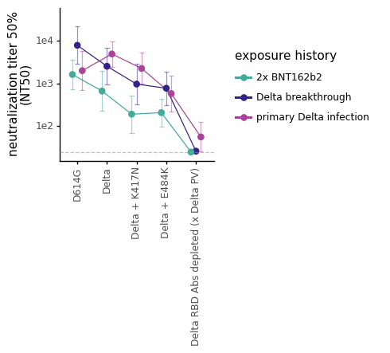

# Analyze neutralization data
This Python Jupyter notebook analyzes the neutralization data.

Import Python modules.
We use [neutcurve](https://jbloomlab.github.io/neutcurve/) to plot the neutralization curves:


```python
import os
import re
import warnings

from IPython.display import display, HTML
from matplotlib.backends.backend_pdf import PdfPages
import matplotlib as mpl
import matplotlib.pyplot as plt

import natsort
import numpy as np
import pandas as pd
from plotnine import *
from statistics import geometric_mean
from scipy import stats

import neutcurve
from neutcurve.colorschemes import CBMARKERS, CBPALETTE
import seaborn

import yaml

print(f"Using `neutcurve` version {neutcurve.__version__}")
```

    Using `neutcurve` version 0.5.7


Read config file


```python
with open('config.yaml') as f:
    config = yaml.safe_load(f)
```

Specify input / output files:


```python
# output directory
results='results/neut_titers'
os.makedirs(results, exist_ok = True)

# input files
fracinfect_file = 'results/neut_titers/fracinfect.csv'

# output files
neut_titers_file = f'{results}/neut_titers.csv'
neut_titers_summary_file = f'{results}/neut_titers_summary.csv'
all_replicate_curves = f'{results}/all_replicate_curves.pdf'
```

## Read in the neutralization data


```python
print(f"Reading neutralization data from {fracinfect_file}")
fracinfect = (pd.read_csv(fracinfect_file)
              .replace({'virus': config['virus_key_mutneuts']})
             )

# order the viruses
virus_order = config['virus_order']

fracinfect = (
    fracinfect
    .assign(replicate_with_date=lambda x: x['replicate'].astype(str) +
                                          ' (' + x['date'] + ')')
    .query('virus in @virus_order')
    .assign(virus=lambda x: pd.Categorical(x['virus'], virus_order, ordered=True))
    .rename(columns={'replicate': 'replicate_on_date'})
)
fracinfect = (
    fracinfect
    .merge(fracinfect
           .sort_values('date')
           [['serum', 'virus', 'replicate_with_date']]
           .drop_duplicates()
           .assign(replicate_all_dates=lambda x: x.groupby(['serum', 'virus'])
                                                  ['replicate_with_date']
                                                  .transform('cumcount') + 1
                   ),
            how='left', on=['serum', 'virus', 'replicate_with_date'], validate='many_to_one',
            )
    )

# show first few lines of data frame
display(HTML(fracinfect.head().to_html(index=False)))
```

    Reading neutralization data from results/neut_titers/fracinfect.csv


<table border="1" class="dataframe">
  <thead>
    <tr style="text-align: right;">
      <th>serum</th>
      <th>virus</th>
      <th>replicate_on_date</th>
      <th>concentration</th>
      <th>fraction infectivity</th>
      <th>date</th>
      <th>replicate_with_date</th>
      <th>replicate_all_dates</th>
    </tr>
  </thead>
  <tbody>
    <tr>
      <td>Delta_10</td>
      <td>D614G</td>
      <td>1</td>
      <td>0.040000</td>
      <td>0.000035</td>
      <td>2022-01-06</td>
      <td>1 (2022-01-06)</td>
      <td>4</td>
    </tr>
    <tr>
      <td>Delta_10</td>
      <td>D614G</td>
      <td>1</td>
      <td>0.010000</td>
      <td>0.007385</td>
      <td>2022-01-06</td>
      <td>1 (2022-01-06)</td>
      <td>4</td>
    </tr>
    <tr>
      <td>Delta_10</td>
      <td>D614G</td>
      <td>1</td>
      <td>0.002500</td>
      <td>0.188400</td>
      <td>2022-01-06</td>
      <td>1 (2022-01-06)</td>
      <td>4</td>
    </tr>
    <tr>
      <td>Delta_10</td>
      <td>D614G</td>
      <td>1</td>
      <td>0.000625</td>
      <td>0.640000</td>
      <td>2022-01-06</td>
      <td>1 (2022-01-06)</td>
      <td>4</td>
    </tr>
    <tr>
      <td>Delta_10</td>
      <td>D614G</td>
      <td>1</td>
      <td>0.000156</td>
      <td>0.993600</td>
      <td>2022-01-06</td>
      <td>1 (2022-01-06)</td>
      <td>4</td>
    </tr>
  </tbody>
</table>


```python
fits = neutcurve.curvefits.CurveFits(
            data=fracinfect,
            replicate_col='replicate_all_dates',
            )
```

Plot all replicate curves for each `serum x virus` condition.
However, note that this is *really slow* when there are a lot of curves to plot! 


```python
with warnings.catch_warnings():
    warnings.simplefilter('ignore')  # ignore fitting warnings
    fig, _ = fits.plotReplicates(ncol=8,
                                 legendtitle='replicate',
                                 xlabel='serum dilution',
                                 viruses=fracinfect['virus'].sort_values().unique(),
                                 colors=plt.rcParams['axes.prop_cycle'].by_key()['color'] * 2,
                                 markers=['o', '^', 's', 'D', 'v', '<', '>', 'p'] * 2,
                                 fix_lims={'ymax':1.25},
                                 )
    
print(f"Saving plot to {all_replicate_curves}\n")
fig.savefig(all_replicate_curves)
fig.tight_layout()
display(fig)
plt.close(fig)
```

    Saving plot to results/neut_titers/all_replicate_curves.pdf
    


    

    


Use [neutcurve](https://jbloomlab.github.io/neutcurve/) to fit neutralization curves to all of the data:


```python
fitparams = pd.DataFrame(columns=['serum', 'virus', 'ic50', 'NT50', 'ic50_bound', 'date'])

for d in fracinfect['date'].unique():
    fits = neutcurve.CurveFits(fracinfect.query('date==@d'),
                               replicate_col='replicate_on_date',
                              )

    fp = (
        fits.fitParams(average_only=False)
        .assign(NT50=lambda x: 1/x['ic50'],
                date=d
               )
        # .replace({'WT':'wildtype', 'B.1.351':'wildtype'})
        # get columns of interest
        [['serum', 'virus', 'ic50', 'NT50', 'ic50_bound', 'date', 'replicate', 'top']] 
        .assign(ic50_is_bound=lambda x: x['ic50_bound'].map({'lower': True,
                                                          'interpolated': False}))
        )
    fitparams=fitparams.append(fp, ignore_index=True)

fitparams.head()
```

    /fh/fast/bloom_j/computational_notebooks/agreaney/2021/SARS-CoV-2-RBD_Delta/env/lib/python3.8/site-packages/neutcurve/hillcurve.py:741: RuntimeWarning: invalid value encountered in power
    /fh/fast/bloom_j/computational_notebooks/agreaney/2021/SARS-CoV-2-RBD_Delta/env/lib/python3.8/site-packages/neutcurve/hillcurve.py:451: RuntimeWarning: invalid value encountered in sqrt
    /fh/fast/bloom_j/computational_notebooks/agreaney/2021/SARS-CoV-2-RBD_Delta/env/lib/python3.8/site-packages/scipy/optimize/minpack.py:833: OptimizeWarning: Covariance of the parameters could not be estimated


<div>
<style scoped>
    .dataframe tbody tr th:only-of-type {
        vertical-align: middle;
    }

    .dataframe tbody tr th {
        vertical-align: top;
    }

    .dataframe thead th {
        text-align: right;
    }
</style>
<table border="1" class="dataframe">
  <thead>
    <tr style="text-align: right;">
      <th></th>
      <th>serum</th>
      <th>virus</th>
      <th>ic50</th>
      <th>NT50</th>
      <th>ic50_bound</th>
      <th>date</th>
      <th>replicate</th>
      <th>top</th>
      <th>ic50_is_bound</th>
    </tr>
  </thead>
  <tbody>
    <tr>
      <th>0</th>
      <td>Delta_10</td>
      <td>D614G</td>
      <td>0.000942</td>
      <td>1061.588219</td>
      <td>interpolated</td>
      <td>2022-01-06</td>
      <td>1</td>
      <td>1.0</td>
      <td>False</td>
    </tr>
    <tr>
      <th>1</th>
      <td>Delta_10</td>
      <td>D614G</td>
      <td>0.001349</td>
      <td>741.511063</td>
      <td>interpolated</td>
      <td>2022-01-06</td>
      <td>2</td>
      <td>1.0</td>
      <td>False</td>
    </tr>
    <tr>
      <th>2</th>
      <td>Delta_10</td>
      <td>D614G</td>
      <td>0.001134</td>
      <td>882.157389</td>
      <td>interpolated</td>
      <td>2022-01-06</td>
      <td>average</td>
      <td>1.0</td>
      <td>False</td>
    </tr>
    <tr>
      <th>3</th>
      <td>Delta_10</td>
      <td>Delta RBD Abs depleted (x D614G PV)</td>
      <td>0.040000</td>
      <td>25.000000</td>
      <td>lower</td>
      <td>2022-01-06</td>
      <td>1</td>
      <td>1.0</td>
      <td>True</td>
    </tr>
    <tr>
      <th>4</th>
      <td>Delta_10</td>
      <td>Delta RBD Abs depleted (x D614G PV)</td>
      <td>0.040000</td>
      <td>25.000000</td>
      <td>lower</td>
      <td>2022-01-06</td>
      <td>2</td>
      <td>1.0</td>
      <td>True</td>
    </tr>
  </tbody>
</table>
</div>


Make a plot showing all viruses against each sera from each assay date:


```python
for d in fracinfect['date'].unique():
    fits = (neutcurve.CurveFits(fracinfect.query('date==@d'), 
                                replicate_col='replicate_on_date'
                               )
           )
    xlab= 'serum dilution'
    name= 'sera'

    fig, axes = fits.plotSera(xlabel=xlab,
                              # max_viruses_per_subplot=4,
                              colors=CBPALETTE*3, 
                              markers=CBMARKERS*3,
                              attempt_shared_legend=True,
                              fix_lims={'ymax':1.25}
                             )

    plotfile = f'{results}/{d}_mutant_neuts.pdf'
    print(f"Saving to {plotfile}")
    fig.savefig(plotfile, bbox_inches='tight')
```

    /fh/fast/bloom_j/computational_notebooks/agreaney/2021/SARS-CoV-2-RBD_Delta/env/lib/python3.8/site-packages/neutcurve/hillcurve.py:741: RuntimeWarning: invalid value encountered in power
    /fh/fast/bloom_j/computational_notebooks/agreaney/2021/SARS-CoV-2-RBD_Delta/env/lib/python3.8/site-packages/scipy/optimize/minpack.py:833: OptimizeWarning: Covariance of the parameters could not be estimated


    Saving to results/neut_titers/2022-01-06_mutant_neuts.pdf
    Saving to results/neut_titers/2021-11-25_mutant_neuts.pdf
    Saving to results/neut_titers/2021-12-19_mutant_neuts.pdf


    /fh/fast/bloom_j/computational_notebooks/agreaney/2021/SARS-CoV-2-RBD_Delta/env/lib/python3.8/site-packages/neutcurve/hillcurve.py:741: RuntimeWarning: invalid value encountered in power
    /fh/fast/bloom_j/computational_notebooks/agreaney/2021/SARS-CoV-2-RBD_Delta/env/lib/python3.8/site-packages/scipy/optimize/minpack.py:833: OptimizeWarning: Covariance of the parameters could not be estimated
    /fh/fast/bloom_j/computational_notebooks/agreaney/2021/SARS-CoV-2-RBD_Delta/env/lib/python3.8/site-packages/neutcurve/hillcurve.py:451: RuntimeWarning: invalid value encountered in sqrt


    Saving to results/neut_titers/2021-12-22_mutant_neuts.pdf


    /fh/fast/bloom_j/computational_notebooks/agreaney/2021/SARS-CoV-2-RBD_Delta/env/lib/python3.8/site-packages/neutcurve/hillcurve.py:741: RuntimeWarning: invalid value encountered in power
    /fh/fast/bloom_j/computational_notebooks/agreaney/2021/SARS-CoV-2-RBD_Delta/env/lib/python3.8/site-packages/scipy/optimize/minpack.py:833: OptimizeWarning: Covariance of the parameters could not be estimated


    Saving to results/neut_titers/2021-11-12_mutant_neuts.pdf


    /fh/fast/bloom_j/computational_notebooks/agreaney/2021/SARS-CoV-2-RBD_Delta/env/lib/python3.8/site-packages/neutcurve/hillcurve.py:741: RuntimeWarning: invalid value encountered in power


    Saving to results/neut_titers/2021-12-12_mutant_neuts.pdf


    

    


    

    


    

    


    

    


    

    


    

    


### Plot all neuts for each serum on the same axis


```python
fits = (neutcurve.CurveFits(fracinfect, 
                            replicate_col='replicate_all_dates'
                           )
       )
xlab= 'serum dilution'
name= 'sera'

fig, axes = fits.plotSera(xlabel=xlab,
                          max_viruses_per_subplot=8,
                          colors=CBPALETTE*3, 
                          markers=CBMARKERS*3,
                          attempt_shared_legend=True,
                          fix_lims={'ymax':1.25},
                          viruses=config['virus_order'],
                          sera=natsort.natsorted(fracinfect['serum'].unique()),
                         )

plotfile = f'{results}/all_mutant_neuts.pdf'
print(f"Saving to {plotfile}")
fig.savefig(plotfile, bbox_inches='tight')
```

    /fh/fast/bloom_j/computational_notebooks/agreaney/2021/SARS-CoV-2-RBD_Delta/env/lib/python3.8/site-packages/neutcurve/hillcurve.py:741: RuntimeWarning: invalid value encountered in power
    /fh/fast/bloom_j/computational_notebooks/agreaney/2021/SARS-CoV-2-RBD_Delta/env/lib/python3.8/site-packages/neutcurve/hillcurve.py:451: RuntimeWarning: invalid value encountered in sqrt
    /fh/fast/bloom_j/computational_notebooks/agreaney/2021/SARS-CoV-2-RBD_Delta/env/lib/python3.8/site-packages/scipy/optimize/minpack.py:833: OptimizeWarning: Covariance of the parameters could not be estimated


    Saving to results/neut_titers/all_mutant_neuts.pdf


    

    


### Calculate fold-change IC50 relative to the geometric mean of the wildtype virus against each serum on each date
* Get neutralization titers, 
* Drop "average" replicate
* Calculate the geometric mean of the wildtype virus against each serum
* Calculate fold-change IC50

No longer subset on date, because Delta virus wasn't run on D614G experiment days


```python
wildtype = config['wildtype_virus']

neut_titers = (
    fitparams
    .merge((fitparams
            .query('virus == @wildtype & replicate != "average"')
            .groupby(['serum'])
            
            # get the geometric mean of the two wildtype replicates 
            .agg(wildtype_ic50=pd.NamedAgg(column="ic50", aggfunc=geometric_mean))
            .reset_index()
           ),
           on=['serum'],
           how='left',
           validate='many_to_one',
           )
    .merge((pd.read_csv(config['sample_key_file'])
            [['subject_name', 'sample_type']]
            .rename(columns={'subject_name':'serum'})
           ),
           on='serum',
           how='left',
           validate='many_to_one',
          )
    .assign(fold_change=lambda x: x['ic50'] / x['wildtype_ic50'],
            sample_type=lambda x: pd.Categorical(x['sample_type'], ordered=True, categories=config['sample_type_order'])
           )
    )


display(HTML(neut_titers.head().to_html(index=False)))
neut_titers.to_csv(neut_titers_file, index=False)
```


<table border="1" class="dataframe">
  <thead>
    <tr style="text-align: right;">
      <th>serum</th>
      <th>virus</th>
      <th>ic50</th>
      <th>NT50</th>
      <th>ic50_bound</th>
      <th>date</th>
      <th>replicate</th>
      <th>top</th>
      <th>ic50_is_bound</th>
      <th>wildtype_ic50</th>
      <th>sample_type</th>
      <th>fold_change</th>
    </tr>
  </thead>
  <tbody>
    <tr>
      <td>Delta_10</td>
      <td>D614G</td>
      <td>0.000942</td>
      <td>1061.588219</td>
      <td>interpolated</td>
      <td>2022-01-06</td>
      <td>1</td>
      <td>1.0</td>
      <td>False</td>
      <td>0.000273</td>
      <td>primary Delta infection</td>
      <td>3.449611</td>
    </tr>
    <tr>
      <td>Delta_10</td>
      <td>D614G</td>
      <td>0.001349</td>
      <td>741.511063</td>
      <td>interpolated</td>
      <td>2022-01-06</td>
      <td>2</td>
      <td>1.0</td>
      <td>False</td>
      <td>0.000273</td>
      <td>primary Delta infection</td>
      <td>4.938653</td>
    </tr>
    <tr>
      <td>Delta_10</td>
      <td>D614G</td>
      <td>0.001134</td>
      <td>882.157389</td>
      <td>interpolated</td>
      <td>2022-01-06</td>
      <td>average</td>
      <td>1.0</td>
      <td>False</td>
      <td>0.000273</td>
      <td>primary Delta infection</td>
      <td>4.151261</td>
    </tr>
    <tr>
      <td>Delta_10</td>
      <td>Delta RBD Abs depleted (x D614G PV)</td>
      <td>0.040000</td>
      <td>25.000000</td>
      <td>lower</td>
      <td>2022-01-06</td>
      <td>1</td>
      <td>1.0</td>
      <td>True</td>
      <td>0.000273</td>
      <td>primary Delta infection</td>
      <td>146.482637</td>
    </tr>
    <tr>
      <td>Delta_10</td>
      <td>Delta RBD Abs depleted (x D614G PV)</td>
      <td>0.040000</td>
      <td>25.000000</td>
      <td>lower</td>
      <td>2022-01-06</td>
      <td>2</td>
      <td>1.0</td>
      <td>True</td>
      <td>0.000273</td>
      <td>primary Delta infection</td>
      <td>146.482637</td>
    </tr>
  </tbody>
</table>


As we can see below, the fold-change in IC50 for each wildtype replicate is no longer exactly 1 (because we are comparing to the geometric mean of the replicate measurements). Here I am pulling out the most extreme fold_change IC50s for wildtype (relative to the geometric mean):


```python
display(HTML(neut_titers.query('virus==@wildtype & replicate != "average" & (fold_change <0.8 | fold_change >1.2)').head(2).to_html(index=False)))
```


<table border="1" class="dataframe">
  <thead>
    <tr style="text-align: right;">
      <th>serum</th>
      <th>virus</th>
      <th>ic50</th>
      <th>NT50</th>
      <th>ic50_bound</th>
      <th>date</th>
      <th>replicate</th>
      <th>top</th>
      <th>ic50_is_bound</th>
      <th>wildtype_ic50</th>
      <th>sample_type</th>
      <th>fold_change</th>
    </tr>
  </thead>
  <tbody>
    <tr>
      <td>Delta_10</td>
      <td>Delta</td>
      <td>0.000216</td>
      <td>4631.420274</td>
      <td>interpolated</td>
      <td>2021-12-19</td>
      <td>1</td>
      <td>1.0</td>
      <td>False</td>
      <td>0.000273</td>
      <td>primary Delta infection</td>
      <td>0.790700</td>
    </tr>
    <tr>
      <td>276C</td>
      <td>Delta</td>
      <td>0.000398</td>
      <td>2514.655718</td>
      <td>interpolated</td>
      <td>2021-12-19</td>
      <td>2</td>
      <td>1.0</td>
      <td>False</td>
      <td>0.000522</td>
      <td>Delta breakthrough</td>
      <td>0.762389</td>
    </tr>
  </tbody>
</table>


### Plot the fold-change IC50 relative to wildtype.
We will also plot each wild type replicate (as each deviates slightly from 1).  

Plot IC50 and fold-change IC50 for each serum x virus


```python
for metric in ['fold_change', 'ic50']:
    for virus_set, virus_subsample in config['virus_subsets'].items():
        print(f'Making plot for {metric} for {virus_set}:')
        
        ylab={'fold_change':'fold decrease in neutralization', 'ic50':'inhibitory concentration 50% (IC50)'}

        p = (ggplot(neut_titers
                    .query("virus in @virus_subsample & replicate!= 'average'") # & date in @dates
                    .assign(virus=lambda x: pd.Categorical(x['virus'],
                                                              ordered=True,
                                                              categories=virus_subsample)
                           )
                    ) +
             aes('virus', metric, shape='ic50_is_bound',
                ) +
             geom_point(size=2, alpha=0.5, fill='#999999',) +  
             scale_y_log10(name=ylab[metric]) +
             facet_wrap('~serum+sample_type', ncol=8, ) +
             theme_classic() +
             theme(axis_text_x=element_text(angle=90),
               axis_title_x=element_blank(),
               strip_background_x=element_blank(),
               figure_size=(16, 6),
               ) +
             geom_hline(data=(neut_titers
                              .query('virus in [@wildtype, "RBD antibodies depleted (Delta)"] & replicate!="average" ') #& date in @dates
                              .groupby(['serum', 'virus', 'sample_type'])
                              .agg({metric: geometric_mean})
                              .reset_index()
                              .dropna()
                             ),
                        inherit_aes=False,
                        mapping=aes(yintercept=metric, color='virus'),
                        alpha=0.7,
                        size=0.5,
                        linetype='dotted',
                       ) +
             scale_shape_manual(values=['o','^'], name='limit of detection') +
             scale_color_manual(values=CBPALETTE*3, guide=False) 
             )

        _ = p.draw()

        plotfile = f'{results}/{metric}_{virus_set}.pdf'
        print(f"Saving to {plotfile}")
        p.save(plotfile, limitsize=False, verbose=False)
```

    Making plot for fold_change for mutneuts:
    Saving to results/neut_titers/fold_change_mutneuts.pdf
    Making plot for ic50 for mutneuts:
    Saving to results/neut_titers/ic50_mutneuts.pdf


    

    


    

    


### Plot the NT50 and fold-change IC50 for all individuals, faceting by cohort.

Add the geometric mean of all for each cohort as well. 


```python
for metric in ['fold_change', 'NT50']:
    for virus_set, virus_subsample in config['virus_subsets'].items():
        print(f'Making plot for {metric} for {virus_set}:')
        
        ylab={'fold_change':'fold decrease in neutralization', 
              'NT50':'neutralization titer 50%\n(NT50)'
             }
        
        yintercept={'fold_change':1,
                    'NT50': config['NT50_LOD']
                   }
        
        # define df to do plotting on:
        df=(neut_titers
            .query("virus in @virus_subsample & replicate== 'average'")
            .assign(virus=lambda x: pd.Categorical(x['virus'],
                                                       ordered=True,
                                                       categories=virus_subsample))
            .groupby(['serum', 'virus', 'sample_type'])
            .agg({metric: geometric_mean})
            .reset_index()
            .dropna()
           )
        
        # define the y-axis limits so I can make them exactly the same between plots
        limits=(df[metric].min()*0.9, df[metric].max()*1.1)
        print(limits)

        p = (ggplot(df) +
             aes('virus', metric, group='serum') +
             geom_line(aes(x='virus', y=metric, group='serum'), color=CBPALETTE[0]) +
             geom_point(size=2.5, alpha=0.5, fill=CBPALETTE[0]) + 
             geom_crossbar(data=(df
                                 .groupby(['virus', 'sample_type'])
                                 .agg({metric: geometric_mean})
                                 .reset_index()
                                 .dropna()
                                ),
                           inherit_aes=False,
                           mapping=aes(x='virus', y=metric, ymin=metric, ymax=metric),
                          ) +
             scale_y_log10(name=ylab[metric], limits=limits) +
             theme_classic() +
             theme(axis_text_x=element_text(angle=90),
                   axis_title_x=element_blank(),
                   strip_margin_y=0.35,
                   strip_background_x=element_blank(),
                   figure_size=(3*neut_titers['sample_type'].nunique(), 2.5),
                   ) +
             geom_hline(yintercept=yintercept[metric],
                        alpha=0.7,
                        size=0.5,
                        linetype='dotted',
                        color=CBPALETTE[0]
                       ) +
             scale_color_manual(values=CBPALETTE*3, guide=False) +
             facet_wrap('~sample_type', scales='free_x')
             )

        _ = p.draw()

        plotfile = f'{results}/{metric}_{virus_set}_aggregate_simple.pdf'
        print(f"Saving to {plotfile}")
        p.save(plotfile, limitsize=False, verbose=False)
```

    Making plot for fold_change for mutneuts:
    (0.22977515116553654, 695.9233012585322)
    Saving to results/neut_titers/fold_change_mutneuts_aggregate_simple.pdf
    Making plot for NT50 for mutneuts:
    (22.499999999999996, 40495.49949040342)
    Saving to results/neut_titers/NT50_mutneuts_aggregate_simple.pdf


    

    


    

    


Make plot to show NT50 by cohort. 


```python
for virus_set, virus_subsample in config['virus_subsets'].items():
    
    # define df to do plotting on:
    df=(neut_titers
        .query("virus in @virus_subsample & replicate== 'average'")
        .assign(virus=lambda x: pd.Categorical(x['virus'],
                                                   ordered=True,
                                                   categories=virus_subsample))
        .groupby(['serum', 'virus', 'sample_type'])
        .agg({'NT50': geometric_mean})
        .reset_index()
        .dropna()
       )

    # define the y-axis limits so I can make them exactly the same between plots
    limits=(df['NT50'].min()*0.9, df['NT50'].max()*1.1)
    print(limits)

    p = (ggplot(df
                .groupby(['virus', 'sample_type'])
                .agg(NT50=('NT50', geometric_mean), sem=('NT50', stats.gstd))
                .reset_index()
                .dropna()
                ) +
         aes('virus', 
             'NT50', 
             fill='sample_type', 
             color='sample_type',
            ) +
         geom_line(aes(x='virus', y='NT50', group='sample_type'), position=position_dodge(width=0.5)) +
         geom_point(size=2.5, alpha=1, position=position_dodge(width=0.5)) +
         geom_errorbar(aes(x="virus", ymin="NT50/sem",ymax="NT50*sem"),
                       alpha=0.5,
                       position=position_dodge(width=0.5)
                      )+
         geom_hline(yintercept=config['NT50_LOD'],
                    linetype='dashed', size=0.5,
                    alpha=0.6, 
                    color=CBPALETTE[0]) +
         scale_y_log10(name='neutralization titer 50%\n(NT50)', limits=limits) +
         theme_classic() +
         theme(axis_title_x=element_blank(),
               figure_size=(neut_titers.query('virus in @virus_subsample')['virus'].nunique()*0.5, 2.5),
               axis_text_x=element_text(rotation=90)
               ) +
         scale_fill_manual(values=['#44AA99', '#332288', '#AA4499'], name='exposure history\n')+
         scale_color_manual(values=['#44AA99', '#332288', '#AA4499'], name='exposure history\n')
         )

    _ = p.draw()

    plotfile = f'{results}/NT50_{virus_set}_aggregate_nofacet.pdf'
    print(f"Saving to {plotfile}")
    p.save(plotfile, limitsize=False, verbose=False)
```

    (22.499999999999996, 40495.49949040342)


    /fh/fast/bloom_j/computational_notebooks/agreaney/2021/SARS-CoV-2-RBD_Delta/env/lib/python3.8/site-packages/plotnine/layer.py:401: PlotnineWarning: geom_errorbar : Removed 1 rows containing missing values.


    Saving to results/neut_titers/NT50_mutneuts_aggregate_nofacet.pdf


    /fh/fast/bloom_j/computational_notebooks/agreaney/2021/SARS-CoV-2-RBD_Delta/env/lib/python3.8/site-packages/plotnine/layer.py:401: PlotnineWarning: geom_errorbar : Removed 1 rows containing missing values.


    

    


Make essentially the plot shown above, but with each individual point shown. 


```python
for metric in ['fold_change', 'ic50']:
    for virus_set, virus_subsample in config['virus_subsets'].items():
        print(f'Making plot for {metric} for {virus_set}:')
        
        if metric=="fold_change":
            virus_subsample=[v for v in virus_subsample if v!=wildtype]
        
        print(f"Making plot for {neut_titers.query('virus in @virus_subsample')['virus'].nunique()} viruses")
        
        ylab={'fold_change':'fold decrease in neutralization', 
              'ic50':'inhibitory concentration\n50% (IC50)'
             }
        yintercept={'fold_change':1, 
                    'ic50':(neut_titers
                            .query('virus==@wildtype')
                            ['ic50']
                            .agg(geometric_mean)
                           )
                   }

        p = (ggplot(neut_titers
                    .query("virus in @virus_subsample & replicate=='average'")
                    .assign(virus_labels=lambda x: pd.Categorical(x['virus'],
                                                                  ordered=True,
                                                                  categories=virus_subsample),
                           )
                    .groupby(['serum', 'virus', 'sample_type','ic50_is_bound'])
                    .agg({metric: geometric_mean})
                    .reset_index()
                    .dropna()
                    ) +
             aes('virus', 
                 metric, 
                 fill='sample_type', 
                 color='sample_type',
                 # shape='ic50_is_bound', 
                ) +
             # geom_line(aes(x='virus', y=metric, group='serum'),position=position_dodge(width=0.55),) +
             geom_point(position=position_dodge(width=0.55), size=2.5, alpha=0.5) +
             geom_crossbar(data=(neut_titers
                                 .query("virus in @virus_subsample & replicate=='average'")
                                 .groupby(['virus', 'sample_type'])
                                 .agg({metric: geometric_mean})
                                 .reset_index()
                                 .dropna()
                                ),
                           # inherit_aes=False,
                           mapping=aes(x='virus', y=metric, ymin=metric, ymax=metric,), #fill='sample_type', color='sample_type',
                           position=position_dodge(width=0.55),
                  ) +
             geom_hline(yintercept=yintercept[metric],
                        linetype='dashed', size=0.5,
                        alpha=0.6, 
                        color=CBPALETTE[0]) +
             scale_y_log10(name=ylab[metric]) +
             theme_classic() +
             theme(axis_title_x=element_blank(),
                   figure_size=(neut_titers.query('virus in @virus_subsample')['virus'].nunique()*0.75, 2.5),
                   axis_text_x=element_text(rotation=90)
                   ) +
             scale_fill_manual(values=['#44AA99', '#332288', '#AA4499'], name='exposure history\n')+
             scale_color_manual(values=['#44AA99', '#332288', '#AA4499'], name='exposure history\n')
             )

        _ = p.draw()

        plotfile = f'{results}/{metric}_{virus_set}_aggregate_nofacet.pdf'
        print(f"Saving to {plotfile}")
        p.save(plotfile, limitsize=False, verbose=False)
```

    Making plot for fold_change for mutneuts:
    Making plot for 6 viruses
    Saving to results/neut_titers/fold_change_mutneuts_aggregate_nofacet.pdf
    Making plot for ic50 for mutneuts:
    Making plot for 7 viruses
    Saving to results/neut_titers/ic50_mutneuts_aggregate_nofacet.pdf


    

    


    

    


```python
geomean_mut_effects=(neut_titers
                     .query("replicate=='average'")
                     
                     # if multiple measurements were taken on different days
                     # for a single serum x virus condition
                     # take the geometric_mean of the NT50 and fold_change
                     .groupby(['serum', 'virus', 'sample_type'])
                     .agg({'NT50': geometric_mean, 'fold_change':geometric_mean})
                     .reset_index()
                     .dropna()
                     .groupby(['virus', 'sample_type'])
                     
                     # now get summary statistics within cohorts
                     .agg(geomean_fold_change=('fold_change',geometric_mean), 
                          geomean_NT50=('NT50', geometric_mean), 
                          gstd=('NT50', stats.gstd),
                          sample_size=('serum', 'count'),
                         )
                     .reset_index()
                     .dropna()
                     
                     # calculate the error bars, 
                     # multiplying geometric standard error by geometric_mean
                     .assign(upper_error=lambda x: x['geomean_NT50']*x['gstd'],
                             lower_error=lambda x: x['geomean_NT50']/x['gstd'],
                            )
                    )

display(HTML(geomean_mut_effects.head().to_html(index=False)))

geomean_mut_effects.to_csv(neut_titers_summary_file, index=False)
```


<table border="1" class="dataframe">
  <thead>
    <tr style="text-align: right;">
      <th>virus</th>
      <th>sample_type</th>
      <th>geomean_fold_change</th>
      <th>geomean_NT50</th>
      <th>gstd</th>
      <th>sample_size</th>
      <th>upper_error</th>
      <th>lower_error</th>
    </tr>
  </thead>
  <tbody>
    <tr>
      <td>D614G</td>
      <td>Pfizer</td>
      <td>0.412284</td>
      <td>1614.796842</td>
      <td>2.205143</td>
      <td>8</td>
      <td>3560.857983</td>
      <td>732.286672</td>
    </tr>
    <tr>
      <td>D614G</td>
      <td>Delta breakthrough</td>
      <td>0.324272</td>
      <td>7758.108234</td>
      <td>2.738616</td>
      <td>8</td>
      <td>21246.477640</td>
      <td>2832.857493</td>
    </tr>
    <tr>
      <td>D614G</td>
      <td>primary Delta infection</td>
      <td>2.454338</td>
      <td>1984.414961</td>
      <td>2.819967</td>
      <td>8</td>
      <td>5595.985526</td>
      <td>703.701380</td>
    </tr>
    <tr>
      <td>D614G RBD Abs depleted (x D614G PV)</td>
      <td>Pfizer</td>
      <td>26.630221</td>
      <td>25.000000</td>
      <td>1.000000</td>
      <td>8</td>
      <td>25.000000</td>
      <td>25.000000</td>
    </tr>
    <tr>
      <td>D614G RBD Abs depleted (x D614G PV)</td>
      <td>Delta breakthrough</td>
      <td>45.242717</td>
      <td>55.605353</td>
      <td>2.332077</td>
      <td>8</td>
      <td>129.675991</td>
      <td>23.843699</td>
    </tr>
  </tbody>
</table>


```python

```
