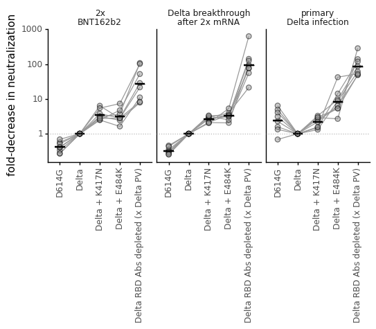
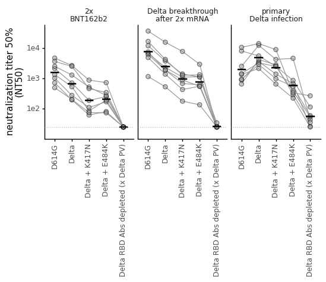
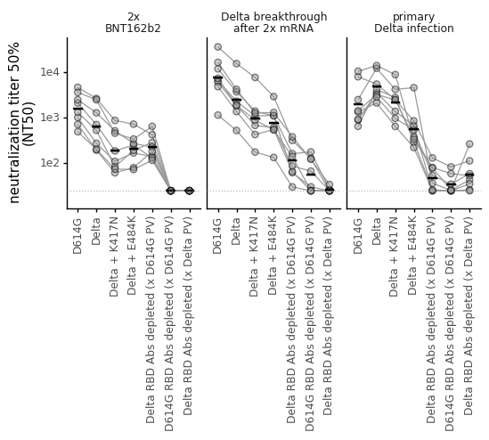
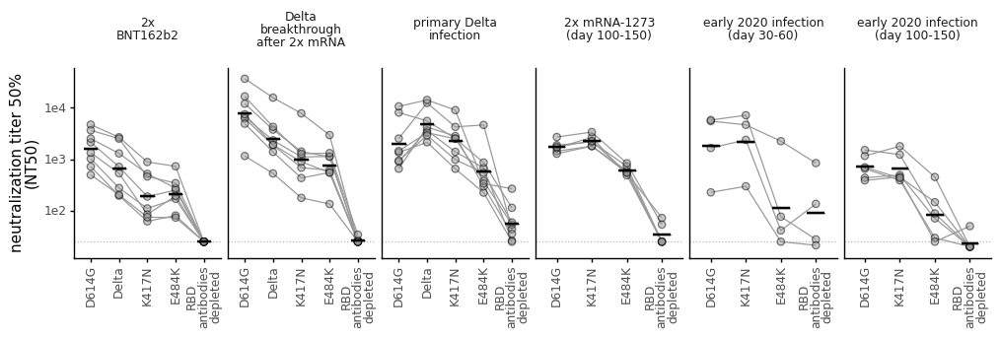
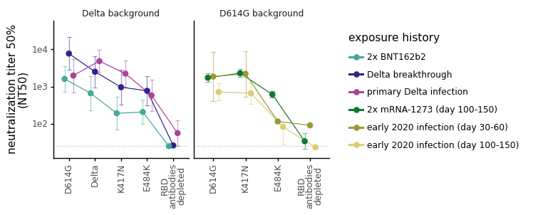

# Analyze neutralization data
This Python Jupyter notebook analyzes the neutralization data.

Import Python modules.
We use [neutcurve](https://jbloomlab.github.io/neutcurve/) to plot the neutralization curves:


```python
import os
import re
import warnings

from IPython.display import display, HTML
from matplotlib.backends.backend_pdf import PdfPages
import matplotlib as mpl
import matplotlib.pyplot as plt

import natsort
import numpy as np
import pandas as pd
from plotnine import *
from statistics import geometric_mean
from scipy import stats

import neutcurve
from neutcurve.colorschemes import CBMARKERS, CBPALETTE
import seaborn

import yaml

print(f"Using `neutcurve` version {neutcurve.__version__}")
```

    Using `neutcurve` version 0.5.7


Read config file


```python
with open('config.yaml') as f:
    config = yaml.safe_load(f)
```

Specify input / output files:


```python
# output directory
results='results/neut_titers'
os.makedirs(results, exist_ok = True)

# input files
fracinfect_file = 'results/neut_titers/fracinfect.csv'

# output files
neut_titers_file = f'{results}/neut_titers.csv'
neut_titers_summary_file = f'{results}/neut_titers_summary.csv'
all_replicate_curves = f'{results}/all_replicate_curves.pdf'
combined_neut_titers_file = f'{results}/combined_neut_titers.csv'
combined_neut_titers_summary_file = f'{results}/combined_neut_titers_summary.csv'
```

## Read in the neutralization data


```python
print(f"Reading neutralization data from {fracinfect_file}")
fracinfect = (pd.read_csv(fracinfect_file)
              .replace({'virus': config['virus_key_mutneuts']})
             )

# order the viruses
virus_order = config['virus_order']

fracinfect = (
    fracinfect
    .assign(replicate_with_date=lambda x: x['replicate'].astype(str) +
                                          ' (' + x['date'] + ')')
    .query('virus in @virus_order')
    .assign(virus=lambda x: pd.Categorical(x['virus'], virus_order, ordered=True))
    .rename(columns={'replicate': 'replicate_on_date'})
)
fracinfect = (
    fracinfect
    .merge(fracinfect
           .sort_values('date')
           [['serum', 'virus', 'replicate_with_date']]
           .drop_duplicates()
           .assign(replicate_all_dates=lambda x: x.groupby(['serum', 'virus'])
                                                  ['replicate_with_date']
                                                  .transform('cumcount') + 1
                   ),
            how='left', on=['serum', 'virus', 'replicate_with_date'], validate='many_to_one',
            )
    )

# show first few lines of data frame
display(HTML(fracinfect.head().to_html(index=False)))
```

    Reading neutralization data from results/neut_titers/fracinfect.csv


<table border="1" class="dataframe">
  <thead>
    <tr style="text-align: right;">
      <th>serum</th>
      <th>virus</th>
      <th>replicate_on_date</th>
      <th>concentration</th>
      <th>fraction infectivity</th>
      <th>date</th>
      <th>replicate_with_date</th>
      <th>replicate_all_dates</th>
    </tr>
  </thead>
  <tbody>
    <tr>
      <td>Delta_10</td>
      <td>D614G</td>
      <td>1</td>
      <td>0.040000</td>
      <td>0.000008</td>
      <td>2022-01-06</td>
      <td>1 (2022-01-06)</td>
      <td>4</td>
    </tr>
    <tr>
      <td>Delta_10</td>
      <td>D614G</td>
      <td>1</td>
      <td>0.010000</td>
      <td>0.004703</td>
      <td>2022-01-06</td>
      <td>1 (2022-01-06)</td>
      <td>4</td>
    </tr>
    <tr>
      <td>Delta_10</td>
      <td>D614G</td>
      <td>1</td>
      <td>0.002500</td>
      <td>0.228100</td>
      <td>2022-01-06</td>
      <td>1 (2022-01-06)</td>
      <td>4</td>
    </tr>
    <tr>
      <td>Delta_10</td>
      <td>D614G</td>
      <td>1</td>
      <td>0.000625</td>
      <td>0.823500</td>
      <td>2022-01-06</td>
      <td>1 (2022-01-06)</td>
      <td>4</td>
    </tr>
    <tr>
      <td>Delta_10</td>
      <td>D614G</td>
      <td>1</td>
      <td>0.000156</td>
      <td>0.961300</td>
      <td>2022-01-06</td>
      <td>1 (2022-01-06)</td>
      <td>4</td>
    </tr>
  </tbody>
</table>


```python
fits = neutcurve.curvefits.CurveFits(
            data=fracinfect,
            replicate_col='replicate_all_dates',
            )
```

Plot all replicate curves for each `serum x virus` condition.
However, note that this is *really slow* when there are a lot of curves to plot! 


```python
# with warnings.catch_warnings():
#     warnings.simplefilter('ignore')  # ignore fitting warnings
#     fig, _ = fits.plotReplicates(ncol=8,
#                                  legendtitle='replicate',
#                                  xlabel='serum dilution',
#                                  viruses=fracinfect['virus'].sort_values().unique(),
#                                  colors=plt.rcParams['axes.prop_cycle'].by_key()['color'] * 2,
#                                  markers=['o', '^', 's', 'D', 'v', '<', '>', 'p'] * 2,
#                                  fix_lims={'ymax':1.25},
#                                  )
    
# print(f"Saving plot to {all_replicate_curves}\n")
# fig.savefig(all_replicate_curves)
# fig.tight_layout()
# display(fig)
# plt.close(fig)
```

Use [neutcurve](https://jbloomlab.github.io/neutcurve/) to fit neutralization curves to all of the data:


```python
fitparams = pd.DataFrame(columns=['serum', 'virus', 'ic50', 'NT50', 'ic50_bound', 'date'])

for d in fracinfect['date'].unique():
    fits = neutcurve.CurveFits(fracinfect.query('date==@d'),
                               replicate_col='replicate_on_date',
                              )

    fp = (
        fits.fitParams(average_only=False)
        .assign(NT50=lambda x: 1/x['ic50'],
                date=d
               )
        # .replace({'WT':'wildtype', 'B.1.351':'wildtype'})
        # get columns of interest
        [['serum', 'virus', 'ic50', 'NT50', 'ic50_bound', 'date', 'replicate', 'top']] 
        .assign(ic50_is_bound=lambda x: x['ic50_bound'].map({'lower': True,
                                                          'interpolated': False}))
        )
    fitparams=fitparams.append(fp, ignore_index=True)

fitparams.head()
```

    /fh/fast/bloom_j/computational_notebooks/agreaney/2021/SARS-CoV-2-RBD_Delta/env/lib/python3.8/site-packages/neutcurve/hillcurve.py:741: RuntimeWarning: invalid value encountered in power
    /fh/fast/bloom_j/computational_notebooks/agreaney/2021/SARS-CoV-2-RBD_Delta/env/lib/python3.8/site-packages/neutcurve/hillcurve.py:451: RuntimeWarning: invalid value encountered in sqrt
    /fh/fast/bloom_j/computational_notebooks/agreaney/2021/SARS-CoV-2-RBD_Delta/env/lib/python3.8/site-packages/scipy/optimize/minpack.py:833: OptimizeWarning: Covariance of the parameters could not be estimated


<div>
<style scoped>
    .dataframe tbody tr th:only-of-type {
        vertical-align: middle;
    }

    .dataframe tbody tr th {
        vertical-align: top;
    }

    .dataframe thead th {
        text-align: right;
    }
</style>
<table border="1" class="dataframe">
  <thead>
    <tr style="text-align: right;">
      <th></th>
      <th>serum</th>
      <th>virus</th>
      <th>ic50</th>
      <th>NT50</th>
      <th>ic50_bound</th>
      <th>date</th>
      <th>replicate</th>
      <th>top</th>
      <th>ic50_is_bound</th>
    </tr>
  </thead>
  <tbody>
    <tr>
      <th>0</th>
      <td>Delta_10</td>
      <td>D614G</td>
      <td>0.001349</td>
      <td>741.511063</td>
      <td>interpolated</td>
      <td>2022-01-06</td>
      <td>1</td>
      <td>1.0</td>
      <td>False</td>
    </tr>
    <tr>
      <th>1</th>
      <td>Delta_10</td>
      <td>D614G</td>
      <td>0.000942</td>
      <td>1061.588219</td>
      <td>interpolated</td>
      <td>2022-01-06</td>
      <td>2</td>
      <td>1.0</td>
      <td>False</td>
    </tr>
    <tr>
      <th>2</th>
      <td>Delta_10</td>
      <td>D614G</td>
      <td>0.001134</td>
      <td>882.157389</td>
      <td>interpolated</td>
      <td>2022-01-06</td>
      <td>average</td>
      <td>1.0</td>
      <td>False</td>
    </tr>
    <tr>
      <th>3</th>
      <td>Delta_10</td>
      <td>Delta RBD Abs depleted (x D614G PV)</td>
      <td>0.040000</td>
      <td>25.000000</td>
      <td>lower</td>
      <td>2022-01-06</td>
      <td>1</td>
      <td>1.0</td>
      <td>True</td>
    </tr>
    <tr>
      <th>4</th>
      <td>Delta_10</td>
      <td>Delta RBD Abs depleted (x D614G PV)</td>
      <td>0.040000</td>
      <td>25.000000</td>
      <td>lower</td>
      <td>2022-01-06</td>
      <td>2</td>
      <td>1.0</td>
      <td>True</td>
    </tr>
  </tbody>
</table>
</div>


Make a plot showing all viruses against each sera from each assay date:


```python
# for d in fracinfect['date'].unique():
#     fits = (neutcurve.CurveFits(fracinfect.query('date==@d'), 
#                                 replicate_col='replicate_on_date'
#                                )
#            )
#     xlab= 'serum dilution'
#     name= 'sera'

#     fig, axes = fits.plotSera(xlabel=xlab,
#                               # max_viruses_per_subplot=4,
#                               colors=CBPALETTE*3, 
#                               markers=CBMARKERS*3,
#                               attempt_shared_legend=True,
#                               fix_lims={'ymax':1.25}
#                              )

#     plotfile = f'{results}/{d}_mutant_neuts.pdf'
#     print(f"Saving to {plotfile}")
#     fig.savefig(plotfile, bbox_inches='tight')
```

### Plot all neuts for each serum on the same axis


```python
fits = (neutcurve.CurveFits(fracinfect, 
                            replicate_col='replicate_all_dates'
                           )
       )
xlab= 'log10(serum dilution)'
name= 'sera'

fig, axes = fits.plotSera(xlabel=xlab,
                          max_viruses_per_subplot=8,
                          colors=CBPALETTE*3, 
                          markers=CBMARKERS*3,
                          attempt_shared_legend=True,
                          fix_lims={'ymax':1.25},
                          viruses=config['virus_order'],
                          sera=natsort.natsorted(fracinfect['serum'].unique()),
                          widthscale=0.75, 
                          heightscale=1,
                          titlesize=20, 
                          labelsize=20, 
                          ticksize=15, 
                          legendfontsize=16, 
                          ncol=8,
                         )
_ = axes.ravel()[-1].set_xticks([1e-5, 1e-4, 1e-3, 1e-2])
_ = axes.ravel()[-1].set_xticklabels(['-5', '-4', '-3', '-2',])

plotfile = f'{results}/all_mutant_neuts.pdf'
print(f"Saving to {plotfile}")
fig.savefig(plotfile, bbox_inches='tight')
```

    /fh/fast/bloom_j/computational_notebooks/agreaney/2021/SARS-CoV-2-RBD_Delta/env/lib/python3.8/site-packages/neutcurve/hillcurve.py:741: RuntimeWarning: invalid value encountered in power
    /fh/fast/bloom_j/computational_notebooks/agreaney/2021/SARS-CoV-2-RBD_Delta/env/lib/python3.8/site-packages/neutcurve/hillcurve.py:451: RuntimeWarning: invalid value encountered in sqrt
    /fh/fast/bloom_j/computational_notebooks/agreaney/2021/SARS-CoV-2-RBD_Delta/env/lib/python3.8/site-packages/scipy/optimize/minpack.py:833: OptimizeWarning: Covariance of the parameters could not be estimated


    Saving to results/neut_titers/all_mutant_neuts.pdf


    

    


### Calculate fold-change IC50 relative to the geometric mean of the wildtype virus against each serum on each date
* Get neutralization titers, 
* Drop "average" replicate
* Calculate the geometric mean of the wildtype virus against each serum
* Calculate fold-change IC50

No longer subset on date, because Delta virus wasn't run on D614G experiment days


```python
wildtype = config['wildtype_virus']

neut_titers = (
    fitparams
    .merge((fitparams
            .query('virus == @wildtype & replicate != "average"')
            .groupby(['serum'])
            
            # get the geometric mean of the two wildtype replicates 
            .agg(wildtype_ic50=pd.NamedAgg(column="ic50", aggfunc=geometric_mean))
            .reset_index()
           ),
           on=['serum'],
           how='left',
           validate='many_to_one',
           )
    .merge((pd.read_csv(config['sample_key_file'])
            [['subject_name', 'sample_type']]
            .rename(columns={'subject_name':'serum'})
           ),
           on='serum',
           how='left',
           validate='many_to_one',
          )
    .assign(fold_change=lambda x: x['ic50'] / x['wildtype_ic50'],
            sample_type=lambda x: pd.Categorical(x['sample_type'], ordered=True, categories=config['sample_type_order'])
           )
    )


display(HTML(neut_titers.head().to_html(index=False)))
neut_titers.to_csv(neut_titers_file, index=False)
```


<table border="1" class="dataframe">
  <thead>
    <tr style="text-align: right;">
      <th>serum</th>
      <th>virus</th>
      <th>ic50</th>
      <th>NT50</th>
      <th>ic50_bound</th>
      <th>date</th>
      <th>replicate</th>
      <th>top</th>
      <th>ic50_is_bound</th>
      <th>wildtype_ic50</th>
      <th>sample_type</th>
      <th>fold_change</th>
    </tr>
  </thead>
  <tbody>
    <tr>
      <td>Delta_10</td>
      <td>D614G</td>
      <td>0.001349</td>
      <td>741.511063</td>
      <td>interpolated</td>
      <td>2022-01-06</td>
      <td>1</td>
      <td>1.0</td>
      <td>False</td>
      <td>0.000273</td>
      <td>primary Delta infection</td>
      <td>4.938653</td>
    </tr>
    <tr>
      <td>Delta_10</td>
      <td>D614G</td>
      <td>0.000942</td>
      <td>1061.588219</td>
      <td>interpolated</td>
      <td>2022-01-06</td>
      <td>2</td>
      <td>1.0</td>
      <td>False</td>
      <td>0.000273</td>
      <td>primary Delta infection</td>
      <td>3.449611</td>
    </tr>
    <tr>
      <td>Delta_10</td>
      <td>D614G</td>
      <td>0.001134</td>
      <td>882.157389</td>
      <td>interpolated</td>
      <td>2022-01-06</td>
      <td>average</td>
      <td>1.0</td>
      <td>False</td>
      <td>0.000273</td>
      <td>primary Delta infection</td>
      <td>4.151261</td>
    </tr>
    <tr>
      <td>Delta_10</td>
      <td>Delta RBD Abs depleted (x D614G PV)</td>
      <td>0.040000</td>
      <td>25.000000</td>
      <td>lower</td>
      <td>2022-01-06</td>
      <td>1</td>
      <td>1.0</td>
      <td>True</td>
      <td>0.000273</td>
      <td>primary Delta infection</td>
      <td>146.482637</td>
    </tr>
    <tr>
      <td>Delta_10</td>
      <td>Delta RBD Abs depleted (x D614G PV)</td>
      <td>0.040000</td>
      <td>25.000000</td>
      <td>lower</td>
      <td>2022-01-06</td>
      <td>2</td>
      <td>1.0</td>
      <td>True</td>
      <td>0.000273</td>
      <td>primary Delta infection</td>
      <td>146.482637</td>
    </tr>
  </tbody>
</table>


As we can see below, the fold-change in IC50 for each wildtype replicate is no longer exactly 1 (because we are comparing to the geometric mean of the replicate measurements). Here I am pulling out the most extreme fold_change IC50s for wildtype (relative to the geometric mean):


```python
display(HTML(neut_titers.query('virus==@wildtype & replicate != "average" & (fold_change <0.8 | fold_change >1.2)').head(2).to_html(index=False)))
```


<table border="1" class="dataframe">
  <thead>
    <tr style="text-align: right;">
      <th>serum</th>
      <th>virus</th>
      <th>ic50</th>
      <th>NT50</th>
      <th>ic50_bound</th>
      <th>date</th>
      <th>replicate</th>
      <th>top</th>
      <th>ic50_is_bound</th>
      <th>wildtype_ic50</th>
      <th>sample_type</th>
      <th>fold_change</th>
    </tr>
  </thead>
  <tbody>
    <tr>
      <td>Delta_10</td>
      <td>Delta</td>
      <td>0.000216</td>
      <td>4631.420274</td>
      <td>interpolated</td>
      <td>2021-12-19</td>
      <td>1</td>
      <td>1.0</td>
      <td>False</td>
      <td>0.000273</td>
      <td>primary Delta infection</td>
      <td>0.790700</td>
    </tr>
    <tr>
      <td>276C</td>
      <td>Delta</td>
      <td>0.000398</td>
      <td>2514.655718</td>
      <td>interpolated</td>
      <td>2021-12-19</td>
      <td>2</td>
      <td>1.0</td>
      <td>False</td>
      <td>0.000522</td>
      <td>Delta breakthrough</td>
      <td>0.762389</td>
    </tr>
  </tbody>
</table>


### Plot the fold-change IC50 relative to wildtype.
We will also plot each wild type replicate (as each deviates slightly from 1).  

Plot IC50 and fold-change IC50 for each serum x virus


```python
# for metric in ['fold_change', 'ic50']:
#     for virus_set, virus_subsample in config['virus_subsets'].items():
#         print(f'Making plot for {metric} for {virus_set}:')
        
#         ylab={'fold_change':'fold decrease in neutralization', 'ic50':'inhibitory concentration 50% (IC50)'}

#         p = (ggplot(neut_titers
#                     .query("virus in @virus_subsample & replicate!= 'average'") # & date in @dates
#                     .assign(virus=lambda x: pd.Categorical(x['virus'],
#                                                               ordered=True,
#                                                               categories=virus_subsample)
#                            )
#                     ) +
#              aes('virus', metric, shape='ic50_is_bound',
#                 ) +
#              geom_point(size=2, alpha=0.5, fill='#999999',) +  
#              scale_y_log10(name=ylab[metric]) +
#              facet_wrap('~serum+sample_type', ncol=8, ) +
#              theme_classic() +
#              theme(axis_text_x=element_text(angle=90),
#                axis_title_x=element_blank(),
#                strip_background_x=element_blank(),
#                figure_size=(16, 6),
#                ) +
#              geom_hline(data=(neut_titers
#                               .query('virus in [@wildtype, "RBD antibodies depleted (Delta)"] & replicate!="average" ') #& date in @dates
#                               .groupby(['serum', 'virus', 'sample_type'])
#                               .agg({metric: geometric_mean})
#                               .reset_index()
#                               .dropna()
#                              ),
#                         inherit_aes=False,
#                         mapping=aes(yintercept=metric, color='virus'),
#                         alpha=0.7,
#                         size=0.5,
#                         linetype='dotted',
#                        ) +
#              scale_shape_manual(values=['o','^'], name='limit of detection') +
#              scale_color_manual(values=CBPALETTE*3, guide=False) 
#              )

#         _ = p.draw()

#         plotfile = f'{results}/{metric}_{virus_set}.pdf'
#         print(f"Saving to {plotfile}")
#         p.save(plotfile, limitsize=False, verbose=False)
```

### Plot the NT50 and fold-change IC50 for all individuals, faceting by cohort.

Add the geometric mean of all for each cohort as well. 


```python
for metric in ['fold_change', 'NT50']:
    for virus_set, virus_subsample in config['virus_subsets'].items():
        print(f'Making plot for {metric} for {virus_set}:')
        
        ylab={'fold_change':'fold decrease in neutralization', 
              'NT50':'neutralization titer 50%\n(NT50)'
             }
        
        yintercept={'fold_change':1,
                    'NT50': config['NT50_LOD']
                   }
        
        # define df to do plotting on:
        df=(neut_titers
            .query("virus in @virus_subsample & replicate== 'average'")
            .replace({'sample_type': config['sample_type_order']})
            .assign(virus=lambda x: pd.Categorical(x['virus'],
                                                       ordered=True,
                                                       categories=virus_subsample),
                    sample_type=lambda x: pd.Categorical(x['sample_type'], ordered=True,
                                                              categories=list(dict.fromkeys(config['sample_type_order'].values())))
                   )
            .groupby(['serum', 'virus', 'sample_type'])
            .agg({metric: geometric_mean})
            .reset_index()
            .dropna()
           )
        
        # define the y-axis limits so I can make them exactly the same between plots
        limits={'fold_change':(df[metric].min()*0.9, df[metric].max()*1.1),
               'NT50':(18, df[metric].max()*1.1),}
        print(limits)

        p = (ggplot(df) +
             aes('virus', metric, group='serum') +
             geom_line(aes(x='virus', y=metric, group='serum'), color=CBPALETTE[0]) +
             geom_point(size=2.5, alpha=0.5, fill=CBPALETTE[0]) + 
             geom_crossbar(data=(df
                                 .groupby(['virus', 'sample_type'])
                                 .agg({metric: geometric_mean})
                                 .reset_index()
                                 .dropna()
                                ),
                           inherit_aes=False,
                           mapping=aes(x='virus', y=metric, ymin=metric, ymax=metric),
                          ) +
             scale_y_log10(name=ylab[metric], limits=limits[metric]) +
             theme_classic() +
             theme(axis_text_x=element_text(angle=90),
                   axis_title_x=element_blank(),
                   strip_margin_y=0.35,
                   strip_background_x=element_blank(),
                   figure_size=(2*df['sample_type'].nunique(), 2.5),
                   ) +
             geom_hline(yintercept=yintercept[metric],
                        alpha=0.7,
                        size=0.5,
                        linetype='dotted',
                        color=CBPALETTE[0]
                       ) +
             scale_color_manual(values=CBPALETTE*3, guide=False) +
             facet_wrap('~sample_type', scales='free_x')
             )

        _ = p.draw()

        plotfile = f'{results}/{metric}_{virus_set}_aggregate_simple.pdf'
        print(f"Saving to {plotfile}")
        p.save(plotfile, limitsize=False, verbose=False)
```

    Making plot for fold_change for mutneuts:
    {'fold_change': (0.22977515116553654, 695.9233012585322), 'NT50': (18, 695.9233012585322)}
    Saving to results/neut_titers/fold_change_mutneuts_aggregate_simple.pdf
    Making plot for fold_change for mutneuts_het:
    {'fold_change': (0.22977515116553654, 695.9233012585322), 'NT50': (18, 695.9233012585322)}
    Saving to results/neut_titers/fold_change_mutneuts_het_aggregate_simple.pdf
    Making plot for NT50 for mutneuts:
    {'fold_change': (22.499999999999996, 40495.49949040342), 'NT50': (18, 40495.49949040342)}
    Saving to results/neut_titers/NT50_mutneuts_aggregate_simple.pdf
    Making plot for NT50 for mutneuts_het:
    {'fold_change': (22.499999999999996, 40495.49949040342), 'NT50': (18, 40495.49949040342)}
    Saving to results/neut_titers/NT50_mutneuts_het_aggregate_simple.pdf


    

    


    

    


    

    


    

    


Make plot to show NT50 by cohort. 


```python
for virus_set, virus_subsample in config['virus_subsets'].items():
    
    # define df to do plotting on:
    df=(neut_titers
        .query("virus in @virus_subsample & replicate== 'average'")
        .assign(virus=lambda x: pd.Categorical(x['virus'],
                                                   ordered=True,
                                                   categories=virus_subsample))
        .groupby(['serum', 'virus', 'sample_type'])
        .agg({'NT50': geometric_mean})
        .reset_index()
        .dropna()
       )

    # define the y-axis limits so I can make them exactly the same between plots
    limits=(18, df['NT50'].max()*1.1)
    print(limits)

    p = (ggplot(df
                .groupby(['virus', 'sample_type'])
                .agg(NT50=('NT50', geometric_mean), sem=('NT50', stats.gstd))
                .reset_index()
                .dropna()
                ) +
         aes('virus', 
             'NT50', 
             fill='sample_type', 
             color='sample_type',
            ) +
         geom_line(aes(x='virus', y='NT50', group='sample_type'), position=position_dodge(width=0.5)) +
         geom_point(size=2.5, alpha=1, position=position_dodge(width=0.5)) +
         geom_errorbar(aes(x="virus", ymin="NT50/sem",ymax="NT50*sem"),
                       alpha=0.5,
                       position=position_dodge(width=0.5)
                      )+
         geom_hline(yintercept=config['NT50_LOD'],
                    alpha=0.7,
                    size=0.5,
                    linetype='dotted',
                    color=CBPALETTE[0]
                    ) +
         scale_y_log10(name='neutralization titer 50%\n(NT50)', limits=limits) +
         theme_classic() +
         theme(axis_title_x=element_blank(),
               figure_size=(neut_titers.query('virus in @virus_subsample')['virus'].nunique()*0.5, 2.5),
               axis_text_x=element_text(rotation=90)
               ) +
         scale_fill_manual(values=['#44AA99', '#332288', '#AA4499'], name='exposure history\n')+
         scale_color_manual(values=['#44AA99', '#332288', '#AA4499'], name='exposure history\n')
         )

    _ = p.draw()

    plotfile = f'{results}/NT50_{virus_set}_aggregate_nofacet.pdf'
    print(f"Saving to {plotfile}")
    p.save(plotfile, limitsize=False, verbose=False)
```

    (18, 40495.49949040342)
    Saving to results/neut_titers/NT50_mutneuts_aggregate_nofacet.pdf
    (18, 40495.49949040342)
    Saving to results/neut_titers/NT50_mutneuts_het_aggregate_nofacet.pdf


    

    


    

    


Make essentially the plot shown above, but with each individual point shown. 


```python
# for metric in ['fold_change', 'ic50']:
#     for virus_set, virus_subsample in config['virus_subsets'].items():
#         print(f'Making plot for {metric} for {virus_set}:')
        
#         if metric=="fold_change":
#             virus_subsample=[v for v in virus_subsample if v!=wildtype]
        
#         print(f"Making plot for {neut_titers.query('virus in @virus_subsample')['virus'].nunique()} viruses")
        
#         ylab={'fold_change':'fold decrease in neutralization', 
#               'ic50':'inhibitory concentration\n50% (IC50)'
#              }
#         yintercept={'fold_change':1, 
#                     'ic50':(neut_titers
#                             .query('virus==@wildtype')
#                             ['ic50']
#                             .agg(geometric_mean)
#                            )
#                    }

#         p = (ggplot(neut_titers
#                     .query("virus in @virus_subsample & replicate=='average'")
#                     .assign(virus_labels=lambda x: pd.Categorical(x['virus'],
#                                                                   ordered=True,
#                                                                   categories=virus_subsample),
#                            )
#                     .groupby(['serum', 'virus', 'sample_type','ic50_is_bound'])
#                     .agg({metric: geometric_mean})
#                     .reset_index()
#                     .dropna()
#                     ) +
#              aes('virus', 
#                  metric, 
#                  fill='sample_type', 
#                  color='sample_type',
#                  # shape='ic50_is_bound', 
#                 ) +
#              # geom_line(aes(x='virus', y=metric, group='serum'),position=position_dodge(width=0.55),) +
#              geom_point(position=position_dodge(width=0.55), size=2.5, alpha=0.5) +
#              geom_crossbar(data=(neut_titers
#                                  .query("virus in @virus_subsample & replicate=='average'")
#                                  .groupby(['virus', 'sample_type'])
#                                  .agg({metric: geometric_mean})
#                                  .reset_index()
#                                  .dropna()
#                                 ),
#                            # inherit_aes=False,
#                            mapping=aes(x='virus', y=metric, ymin=metric, ymax=metric,), #fill='sample_type', color='sample_type',
#                            position=position_dodge(width=0.55),
#                   ) +
#              geom_hline(yintercept=yintercept[metric],
#                         linetype='dashed', size=0.5,
#                         alpha=0.6, 
#                         color=CBPALETTE[0]) +
#              scale_y_log10(name=ylab[metric]) +
#              theme_classic() +
#              theme(axis_title_x=element_blank(),
#                    figure_size=(neut_titers.query('virus in @virus_subsample')['virus'].nunique()*0.75, 2.5),
#                    axis_text_x=element_text(rotation=90)
#                    ) +
#              scale_fill_manual(values=['#44AA99', '#332288', '#AA4499'], name='exposure history\n')+
#              scale_color_manual(values=['#44AA99', '#332288', '#AA4499'], name='exposure history\n')
#              )

#         _ = p.draw()

#         plotfile = f'{results}/{metric}_{virus_set}_aggregate_nofacet.pdf'
#         print(f"Saving to {plotfile}")
#         p.save(plotfile, limitsize=False, verbose=False)
```


```python
geomean_mut_effects=(neut_titers
                     .query("replicate=='average'")
                     
                     # if multiple measurements were taken on different days
                     # for a single serum x virus condition
                     # take the geometric_mean of the NT50 and fold_change
                     .groupby(['serum', 'virus', 'sample_type'])
                     .agg({'NT50': geometric_mean, 'fold_change':geometric_mean})
                     .reset_index()
                     .dropna()
                     .groupby(['virus', 'sample_type'])
                     
                     # now get summary statistics within cohorts
                     .agg(geomean_fold_change=('fold_change',geometric_mean), 
                          geomean_NT50=('NT50', geometric_mean), 
                          gstd=('NT50', stats.gstd),
                          sample_size=('serum', 'count'),
                         )
                     .reset_index()
                     .dropna()
                     
                     # calculate the error bars, 
                     # multiplying geometric standard error by geometric_mean
                     .assign(upper_error=lambda x: x['geomean_NT50']*x['gstd'],
                             lower_error=lambda x: x['geomean_NT50']/x['gstd'],
                            )
                    )

display(HTML(geomean_mut_effects.head().to_html(index=False)))

geomean_mut_effects.to_csv(neut_titers_summary_file, index=False)
```


<table border="1" class="dataframe">
  <thead>
    <tr style="text-align: right;">
      <th>virus</th>
      <th>sample_type</th>
      <th>geomean_fold_change</th>
      <th>geomean_NT50</th>
      <th>gstd</th>
      <th>sample_size</th>
      <th>upper_error</th>
      <th>lower_error</th>
    </tr>
  </thead>
  <tbody>
    <tr>
      <td>D614G</td>
      <td>2x BNT162b2</td>
      <td>0.412284</td>
      <td>1614.796842</td>
      <td>2.205143</td>
      <td>8</td>
      <td>3560.857983</td>
      <td>732.286672</td>
    </tr>
    <tr>
      <td>D614G</td>
      <td>Delta breakthrough</td>
      <td>0.324272</td>
      <td>7758.108234</td>
      <td>2.738616</td>
      <td>8</td>
      <td>21246.477640</td>
      <td>2832.857493</td>
    </tr>
    <tr>
      <td>D614G</td>
      <td>primary Delta infection</td>
      <td>2.454338</td>
      <td>1984.414961</td>
      <td>2.819967</td>
      <td>8</td>
      <td>5595.985526</td>
      <td>703.701380</td>
    </tr>
    <tr>
      <td>D614G RBD Abs depleted (x D614G PV)</td>
      <td>2x BNT162b2</td>
      <td>26.630221</td>
      <td>25.000000</td>
      <td>1.000000</td>
      <td>8</td>
      <td>25.000000</td>
      <td>25.000000</td>
    </tr>
    <tr>
      <td>D614G RBD Abs depleted (x D614G PV)</td>
      <td>Delta breakthrough</td>
      <td>45.242717</td>
      <td>55.605353</td>
      <td>2.332077</td>
      <td>8</td>
      <td>129.675991</td>
      <td>23.843699</td>
    </tr>
  </tbody>
</table>


## Read in results from prior studies and make some of the same plots as above:
* NT50 by individual
* Grouped data
* CSV file with the per-group results


```python
moderna=(pd.read_csv(config['previous_studies_mutneuts']['moderna'])
         .assign(background='D614G background',
                 for_combined_plots=True
                )
        )

infection=(pd.read_csv(config['previous_studies_mutneuts']['infection'])
         .assign(background='D614G background',
                 for_combined_plots=True
                )
        )

combined_df = (pd.concat(
    [(neut_titers.query("replicate=='average'")
     [['serum', 'virus', 'ic50', 'NT50', 'date', 'ic50_is_bound', 'sample_type']]
      .assign(early_late='day 30-60',
              background='Delta background',
              for_combined_plots=lambda x: np.where(x['virus']
              .isin(["D614G RBD Abs depleted (x D614G PV)", 
                     "Delta RBD Abs depleted (x D614G PV)"]),
              False,
              True)
             )),
      # .query('virus not in ["D614G RBD Abs depleted (x D614G PV)", "Delta RBD Abs depleted (x D614G PV)"]')),
     moderna,
     infection])
               .assign(background=lambda x: 
                       pd.Categorical(x['background'],
                                      ordered=True,
                                      categories=config['combined_plot_background_order'])
                      )
              )

combined_df = (combined_df
               .merge((combined_df
                      .assign(is_wildtype=lambda x: 
                              np.where(
                                  ((x['background']=='Delta background') & (x['virus']=='Delta')) | 
                                  ((x['background']=='D614G background') & (x['virus']=='D614G')), 
                                  True, False)
                             )
                      .query('is_wildtype')
                      .groupby(['serum']) # get the geometric mean of any wildtype replicates 
                      .agg(wildtype_NT50=pd.NamedAgg(column="NT50", aggfunc=geometric_mean))
                      .reset_index()
                     ),
                      on=['serum'],
                      how='left',
                      validate='many_to_one'
                     )
               .assign(fold_change=lambda x: x['wildtype_NT50'] / x['NT50'],) # the numerator and denominator are swapped for NT50
              )

display(HTML(combined_df.head().to_html(index=False)))
len(combined_df)

combined_df.to_csv(combined_neut_titers_file, index=False)
```


<table border="1" class="dataframe">
  <thead>
    <tr style="text-align: right;">
      <th>serum</th>
      <th>virus</th>
      <th>ic50</th>
      <th>NT50</th>
      <th>date</th>
      <th>ic50_is_bound</th>
      <th>sample_type</th>
      <th>early_late</th>
      <th>background</th>
      <th>for_combined_plots</th>
      <th>wildtype_NT50</th>
      <th>fold_change</th>
    </tr>
  </thead>
  <tbody>
    <tr>
      <td>Delta_10</td>
      <td>D614G</td>
      <td>0.001134</td>
      <td>882.157389</td>
      <td>2022-01-06</td>
      <td>False</td>
      <td>primary Delta infection</td>
      <td>day 30-60</td>
      <td>Delta background</td>
      <td>True</td>
      <td>3638.349288</td>
      <td>4.124377</td>
    </tr>
    <tr>
      <td>Delta_10</td>
      <td>Delta RBD Abs depleted (x D614G PV)</td>
      <td>0.040000</td>
      <td>25.000000</td>
      <td>2022-01-06</td>
      <td>True</td>
      <td>primary Delta infection</td>
      <td>day 30-60</td>
      <td>Delta background</td>
      <td>False</td>
      <td>3638.349288</td>
      <td>145.533972</td>
    </tr>
    <tr>
      <td>Delta_11</td>
      <td>D614G</td>
      <td>0.000605</td>
      <td>1652.045233</td>
      <td>2022-01-06</td>
      <td>False</td>
      <td>primary Delta infection</td>
      <td>day 30-60</td>
      <td>Delta background</td>
      <td>True</td>
      <td>2145.286347</td>
      <td>1.298564</td>
    </tr>
    <tr>
      <td>Delta_11</td>
      <td>Delta RBD Abs depleted (x D614G PV)</td>
      <td>0.040000</td>
      <td>25.000000</td>
      <td>2022-01-06</td>
      <td>True</td>
      <td>primary Delta infection</td>
      <td>day 30-60</td>
      <td>Delta background</td>
      <td>False</td>
      <td>2145.286347</td>
      <td>85.811454</td>
    </tr>
    <tr>
      <td>Delta_7</td>
      <td>D614G</td>
      <td>0.001020</td>
      <td>979.958125</td>
      <td>2022-01-06</td>
      <td>False</td>
      <td>primary Delta infection</td>
      <td>day 30-60</td>
      <td>Delta background</td>
      <td>True</td>
      <td>2918.963720</td>
      <td>2.978662</td>
    </tr>
  </tbody>
</table>


```python
df=(combined_df
    .query("for_combined_plots & virus in @config['combined_plot']")
    .replace({'virus': config['combined_plot']})
    .assign(virus=lambda x: pd.Categorical(x['virus'],
                                               ordered=True,
                                               categories=list(dict.fromkeys(config['combined_plot'].values()))),
            sample_type=lambda x: pd.Categorical(x['sample_type'],
                                                 ordered=True,
                                                 categories=config['combined_plot_group_order']
                                                )
           )
    .groupby(['serum', 'virus', 'sample_type', 'background', 'early_late'])
    .agg({metric: geometric_mean})
    .reset_index()
    .dropna()
   )

# define the y-axis limits so I can make them exactly the same between plots
limits=(18, df[metric].max()*1.1)
print(limits)

p = (ggplot(df
            .replace({'sample_type': config['combined_plot_group_order']})
            .assign(sample_type=lambda x: pd.Categorical(x['sample_type'],
                                                 ordered=True,
                                                 categories=list(dict.fromkeys(config['combined_plot_group_order'].values()))
                                                ))
           ) +
     aes('virus', metric, group='serum') +
     geom_hline(yintercept=config['NT50_LOD'],
                alpha=0.7,
                size=0.5,
                linetype='dotted',
                color=CBPALETTE[0]
                ) +
     geom_line(aes(x='virus', y=metric, group='serum'), color=CBPALETTE[0]) +
     geom_point(size=2.5, alpha=0.5, fill=CBPALETTE[0]) + 
     geom_crossbar(data=(df
                         .replace({'sample_type': config['combined_plot_group_order']})
                         .assign(sample_type=lambda x: pd.Categorical(x['sample_type'],
                                                 ordered=True,
                                                 categories=list(dict.fromkeys(config['combined_plot_group_order'].values()))
                                                ))
                         .groupby(['virus', 'sample_type'])
                         .agg({metric: geometric_mean})
                         .reset_index()
                         .dropna()
                        ),
                   inherit_aes=False,
                   mapping=aes(x='virus', y=metric, ymin=metric, ymax=metric),
                  ) +
     scale_y_log10(name=ylab[metric], limits=limits) +
     theme_classic() +
     theme(axis_text_x=element_text(angle=90),
           axis_title_x=element_blank(),
           strip_margin_y=0.35,
           strip_background_x=element_blank(),
           figure_size=(2*df['sample_type'].nunique(), 2.5),
           ) +
     scale_color_manual(values=CBPALETTE*3, guide=False) +
     facet_wrap('~sample_type', scales='free_x', ncol=6)
     )

_ = p.draw()

plotfile = f'{results}/NT50_combined_aggregate.pdf'
print(f"Saving to {plotfile}")
p.save(plotfile, limitsize=False, verbose=False)
```

    (18, 40495.49949040342)
    Saving to results/neut_titers/NT50_combined_aggregate.pdf


    

    


```python
p = (ggplot(df
            .groupby(['virus', 'sample_type', 'background'])
            .agg(NT50=('NT50', geometric_mean), sem=('NT50', stats.gstd))
            .reset_index()
            .dropna()
            ) +
     aes('virus', 
         'NT50', 
         fill='sample_type', 
         color='sample_type',
        ) +
     geom_hline(yintercept=config['NT50_LOD'],
                alpha=0.7,
                size=0.5,
                linetype='dotted',
                color=CBPALETTE[0]) +
     geom_line(aes(x='virus', y='NT50', group='sample_type'), position=position_dodge(width=0.5)) +
     geom_point(size=2.5, alpha=1, position=position_dodge(width=0.5)) +
     geom_errorbar(aes(x="virus", ymin="NT50/sem",ymax="NT50*sem"),
                   alpha=0.5,
                   position=position_dodge(width=0.5)
                  )+
     scale_y_log10(name='neutralization titer 50%\n(NT50)', limits=limits) +
     facet_wrap('~background', scales='free_x')+
     theme_classic() +
     theme(axis_title_x=element_blank(),
           figure_size=(df['virus'].nunique()*df['background'].nunique()*0.5, 2.5),
           axis_text_x=element_text(rotation=90),
           strip_background_x=element_blank(),
           ) +
     scale_fill_manual(values=['#44AA99', '#332288', '#AA4499', '#117733', '#999933', '#DDCC77'], name='exposure history\n')+
     scale_color_manual(values=['#44AA99', '#332288', '#AA4499', '#117733', '#999933', '#DDCC77'], name='exposure history\n')
     )

_ = p.draw()

plotfile = f'{results}/NT50_combined_aggregate_nofacet.pdf'
print(f"Saving to {plotfile}")
p.save(plotfile, limitsize=False, verbose=False)
```

    /fh/fast/bloom_j/computational_notebooks/agreaney/2021/SARS-CoV-2-RBD_Delta/env/lib/python3.8/site-packages/plotnine/layer.py:401: PlotnineWarning: geom_errorbar : Removed 3 rows containing missing values.


    Saving to results/neut_titers/NT50_combined_aggregate_nofacet.pdf


    /fh/fast/bloom_j/computational_notebooks/agreaney/2021/SARS-CoV-2-RBD_Delta/env/lib/python3.8/site-packages/plotnine/layer.py:401: PlotnineWarning: geom_errorbar : Removed 3 rows containing missing values.


    

    


```python
geomean_mut_effects=(combined_df
                     
                     # if multiple measurements were taken on different days
                     # for a single serum x virus condition
                     # take the geometric_mean of the NT50 and fold_change
                     .groupby(['serum', 'virus', 'sample_type', 'background'])
                     .agg({'NT50': geometric_mean, 'fold_change':geometric_mean})
                     .reset_index()
                     .dropna()
                     .groupby(['virus', 'sample_type', 'background'])
                     
                     # now get summary statistics within cohorts
                     .agg(geomean_fold_change=('fold_change',geometric_mean), 
                          geomean_NT50=('NT50', geometric_mean), 
                          gstd=('NT50', stats.gstd),
                          sample_size=('serum', 'count'),
                         )
                     .reset_index()
                     .dropna()
                     
                     # calculate the error bars, 
                     # multiplying geometric standard error by geometric_mean
                     .assign(upper_error=lambda x: x['geomean_NT50']*x['gstd'],
                             lower_error=lambda x: x['geomean_NT50']/x['gstd'],
                            )
                    )

display(HTML(geomean_mut_effects.sort_values(by='sample_type').to_html(index=False)))
geomean_mut_effects.to_csv(combined_neut_titers_summary_file, index=False)
```


<table border="1" class="dataframe">
  <thead>
    <tr style="text-align: right;">
      <th>virus</th>
      <th>sample_type</th>
      <th>background</th>
      <th>geomean_fold_change</th>
      <th>geomean_NT50</th>
      <th>gstd</th>
      <th>sample_size</th>
      <th>upper_error</th>
      <th>lower_error</th>
    </tr>
  </thead>
  <tbody>
    <tr>
      <td>D614G</td>
      <td>2x BNT162b2</td>
      <td>Delta background</td>
      <td>0.410804</td>
      <td>1614.796842</td>
      <td>2.205143</td>
      <td>8</td>
      <td>3560.857983</td>
      <td>732.286672</td>
    </tr>
    <tr>
      <td>Delta</td>
      <td>2x BNT162b2</td>
      <td>Delta background</td>
      <td>1.000000</td>
      <td>663.364750</td>
      <td>2.890681</td>
      <td>8</td>
      <td>1917.575942</td>
      <td>229.483892</td>
    </tr>
    <tr>
      <td>Delta + K417N</td>
      <td>2x BNT162b2</td>
      <td>Delta background</td>
      <td>3.470850</td>
      <td>191.124580</td>
      <td>2.763088</td>
      <td>8</td>
      <td>528.094068</td>
      <td>69.170641</td>
    </tr>
    <tr>
      <td>D614G RBD Abs depleted (x D614G PV)</td>
      <td>2x BNT162b2</td>
      <td>Delta background</td>
      <td>26.534590</td>
      <td>25.000000</td>
      <td>1.000000</td>
      <td>8</td>
      <td>25.000000</td>
      <td>25.000000</td>
    </tr>
    <tr>
      <td>Delta RBD Abs depleted (x D614G PV)</td>
      <td>2x BNT162b2</td>
      <td>Delta background</td>
      <td>2.904779</td>
      <td>228.370164</td>
      <td>1.835415</td>
      <td>8</td>
      <td>419.154118</td>
      <td>124.424238</td>
    </tr>
    <tr>
      <td>Delta + E484K</td>
      <td>2x BNT162b2</td>
      <td>Delta background</td>
      <td>3.196882</td>
      <td>207.503691</td>
      <td>2.124967</td>
      <td>8</td>
      <td>440.938465</td>
      <td>97.650319</td>
    </tr>
    <tr>
      <td>Delta RBD Abs depleted (x Delta PV)</td>
      <td>2x BNT162b2</td>
      <td>Delta background</td>
      <td>26.534590</td>
      <td>25.000000</td>
      <td>1.000000</td>
      <td>8</td>
      <td>25.000000</td>
      <td>25.000000</td>
    </tr>
    <tr>
      <td>D614G + E484K</td>
      <td>2x mRNA-1273 (day 100-150)</td>
      <td>D614G background</td>
      <td>2.818936</td>
      <td>614.618985</td>
      <td>1.224988</td>
      <td>6</td>
      <td>752.900595</td>
      <td>501.734890</td>
    </tr>
    <tr>
      <td>D614G + K417N</td>
      <td>2x mRNA-1273 (day 100-150)</td>
      <td>D614G background</td>
      <td>0.754875</td>
      <td>2295.176813</td>
      <td>1.273351</td>
      <td>6</td>
      <td>2922.565200</td>
      <td>1802.470173</td>
    </tr>
    <tr>
      <td>D614G RBD Abs depleted (x D614G PV)</td>
      <td>2x mRNA-1273 (day 100-150)</td>
      <td>D614G background</td>
      <td>51.073290</td>
      <td>33.923238</td>
      <td>1.619481</td>
      <td>6</td>
      <td>54.938049</td>
      <td>20.946978</td>
    </tr>
    <tr>
      <td>D614G</td>
      <td>2x mRNA-1273 (day 100-150)</td>
      <td>D614G background</td>
      <td>1.000000</td>
      <td>1732.571373</td>
      <td>1.295054</td>
      <td>6</td>
      <td>2243.773093</td>
      <td>1337.837402</td>
    </tr>
    <tr>
      <td>Delta + E484K</td>
      <td>Delta breakthrough</td>
      <td>Delta background</td>
      <td>3.254762</td>
      <td>771.909409</td>
      <td>2.464179</td>
      <td>8</td>
      <td>1902.123211</td>
      <td>313.252124</td>
    </tr>
    <tr>
      <td>Delta + K417N</td>
      <td>Delta breakthrough</td>
      <td>Delta background</td>
      <td>2.605370</td>
      <td>964.308967</td>
      <td>2.959634</td>
      <td>8</td>
      <td>2854.001423</td>
      <td>325.820364</td>
    </tr>
    <tr>
      <td>D614G RBD Abs depleted (x D614G PV)</td>
      <td>Delta breakthrough</td>
      <td>Delta background</td>
      <td>45.182364</td>
      <td>55.605353</td>
      <td>2.332077</td>
      <td>8</td>
      <td>129.675991</td>
      <td>23.843699</td>
    </tr>
    <tr>
      <td>Delta RBD Abs depleted (x Delta PV)</td>
      <td>Delta breakthrough</td>
      <td>Delta background</td>
      <td>95.811396</td>
      <td>26.222155</td>
      <td>1.116984</td>
      <td>8</td>
      <td>29.289734</td>
      <td>23.475851</td>
    </tr>
    <tr>
      <td>D614G</td>
      <td>Delta breakthrough</td>
      <td>Delta background</td>
      <td>0.323839</td>
      <td>7758.108234</td>
      <td>2.738616</td>
      <td>8</td>
      <td>21246.477640</td>
      <td>2832.857493</td>
    </tr>
    <tr>
      <td>Delta</td>
      <td>Delta breakthrough</td>
      <td>Delta background</td>
      <td>1.000000</td>
      <td>2512.381309</td>
      <td>2.669072</td>
      <td>8</td>
      <td>6705.727413</td>
      <td>941.293830</td>
    </tr>
    <tr>
      <td>Delta RBD Abs depleted (x D614G PV)</td>
      <td>Delta breakthrough</td>
      <td>Delta background</td>
      <td>21.748698</td>
      <td>115.518702</td>
      <td>2.369659</td>
      <td>8</td>
      <td>273.739911</td>
      <td>48.749086</td>
    </tr>
    <tr>
      <td>D614G + E484K</td>
      <td>early 2020 infection (day 100-150)</td>
      <td>D614G background</td>
      <td>8.734922</td>
      <td>82.325864</td>
      <td>2.914776</td>
      <td>6</td>
      <td>239.961433</td>
      <td>28.244321</td>
    </tr>
    <tr>
      <td>D614G</td>
      <td>early 2020 infection (day 100-150)</td>
      <td>D614G background</td>
      <td>1.000000</td>
      <td>719.109965</td>
      <td>1.703376</td>
      <td>6</td>
      <td>1224.914330</td>
      <td>422.167600</td>
    </tr>
    <tr>
      <td>D614G RBD Abs depleted (x D614G PV)</td>
      <td>early 2020 infection (day 100-150)</td>
      <td>D614G background</td>
      <td>30.840230</td>
      <td>23.317270</td>
      <td>1.456307</td>
      <td>6</td>
      <td>33.957098</td>
      <td>16.011235</td>
    </tr>
    <tr>
      <td>D614G + K417N</td>
      <td>early 2020 infection (day 100-150)</td>
      <td>D614G background</td>
      <td>1.086246</td>
      <td>662.013719</td>
      <td>1.903423</td>
      <td>6</td>
      <td>1260.092101</td>
      <td>347.801692</td>
    </tr>
    <tr>
      <td>D614G RBD Abs depleted (x D614G PV)</td>
      <td>early 2020 infection (day 30-60)</td>
      <td>D614G background</td>
      <td>20.539854</td>
      <td>90.826601</td>
      <td>5.461293</td>
      <td>4</td>
      <td>496.030680</td>
      <td>16.630970</td>
    </tr>
    <tr>
      <td>D614G + K417N</td>
      <td>early 2020 infection (day 30-60)</td>
      <td>D614G background</td>
      <td>0.843348</td>
      <td>2212.094372</td>
      <td>4.093656</td>
      <td>4</td>
      <td>9055.552945</td>
      <td>540.371366</td>
    </tr>
    <tr>
      <td>D614G + E484K</td>
      <td>early 2020 infection (day 30-60)</td>
      <td>D614G background</td>
      <td>16.130810</td>
      <td>115.652289</td>
      <td>7.628061</td>
      <td>4</td>
      <td>882.202730</td>
      <td>15.161427</td>
    </tr>
    <tr>
      <td>D614G</td>
      <td>early 2020 infection (day 30-60)</td>
      <td>D614G background</td>
      <td>1.000000</td>
      <td>1865.565095</td>
      <td>4.557848</td>
      <td>4</td>
      <td>8502.962978</td>
      <td>409.308277</td>
    </tr>
    <tr>
      <td>Delta + E484K</td>
      <td>primary Delta infection</td>
      <td>Delta background</td>
      <td>8.391563</td>
      <td>579.566905</td>
      <td>2.592924</td>
      <td>8</td>
      <td>1502.773208</td>
      <td>223.518623</td>
    </tr>
    <tr>
      <td>D614G RBD Abs depleted (x D614G PV)</td>
      <td>primary Delta infection</td>
      <td>Delta background</td>
      <td>142.743066</td>
      <td>34.071513</td>
      <td>1.605872</td>
      <td>8</td>
      <td>54.714488</td>
      <td>21.216830</td>
    </tr>
    <tr>
      <td>Delta + K417N</td>
      <td>primary Delta infection</td>
      <td>Delta background</td>
      <td>2.175550</td>
      <td>2235.514124</td>
      <td>2.300774</td>
      <td>8</td>
      <td>5143.412414</td>
      <td>971.635754</td>
    </tr>
    <tr>
      <td>D614G</td>
      <td>primary Delta infection</td>
      <td>Delta background</td>
      <td>2.450834</td>
      <td>1984.414961</td>
      <td>2.819967</td>
      <td>8</td>
      <td>5595.985526</td>
      <td>703.701380</td>
    </tr>
    <tr>
      <td>Delta RBD Abs depleted (x D614G PV)</td>
      <td>primary Delta infection</td>
      <td>Delta background</td>
      <td>101.452496</td>
      <td>47.938419</td>
      <td>1.897148</td>
      <td>8</td>
      <td>90.946282</td>
      <td>25.268674</td>
    </tr>
    <tr>
      <td>Delta</td>
      <td>primary Delta infection</td>
      <td>Delta background</td>
      <td>1.000000</td>
      <td>4863.472244</td>
      <td>1.975576</td>
      <td>8</td>
      <td>9608.156835</td>
      <td>2461.800184</td>
    </tr>
    <tr>
      <td>Delta RBD Abs depleted (x Delta PV)</td>
      <td>primary Delta infection</td>
      <td>Delta background</td>
      <td>86.504878</td>
      <td>56.221942</td>
      <td>2.219946</td>
      <td>8</td>
      <td>124.809688</td>
      <td>25.325812</td>
    </tr>
  </tbody>
</table>


```python

```
