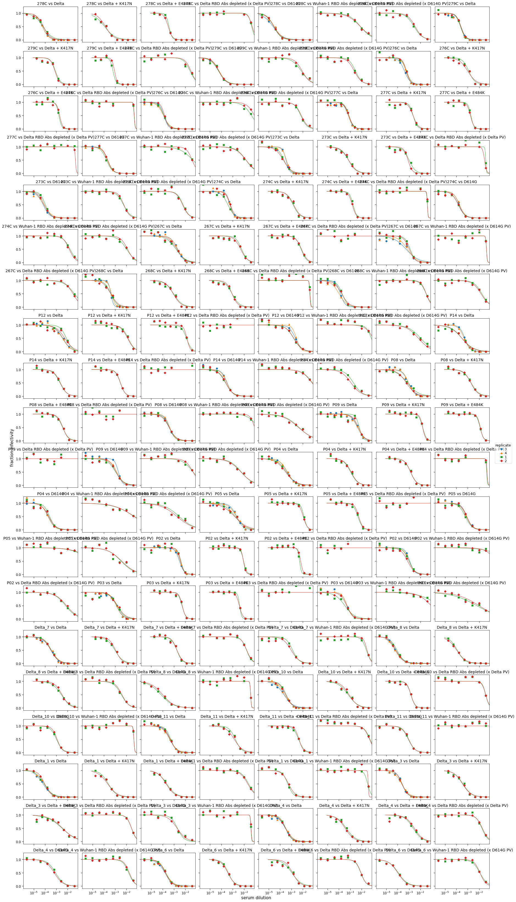
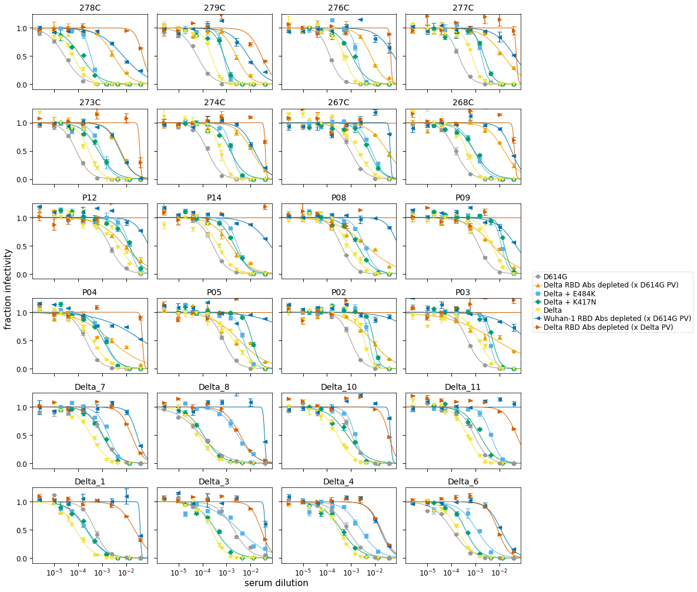
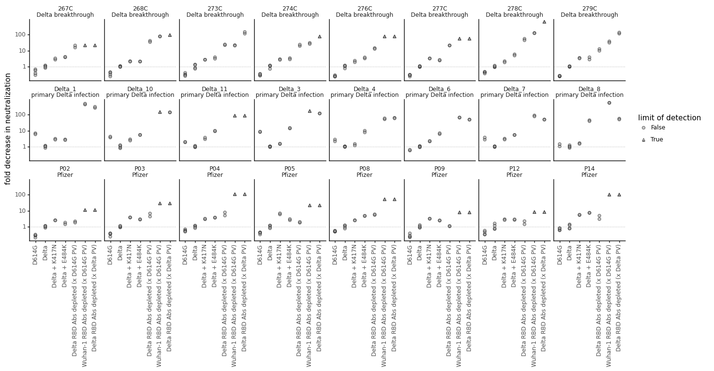
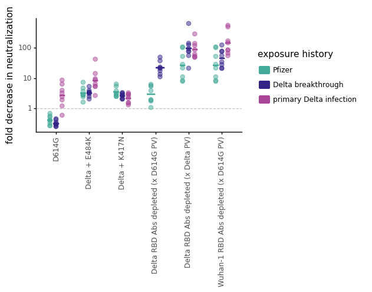
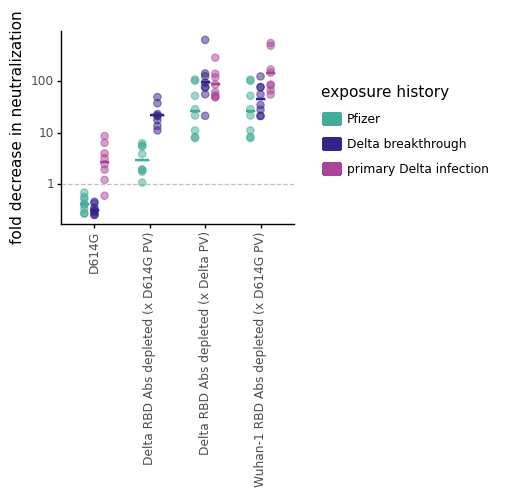
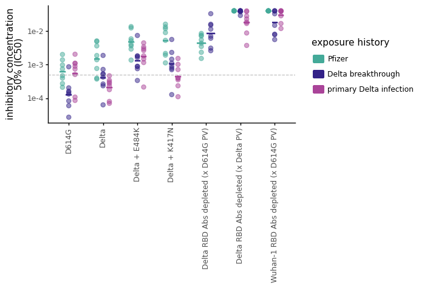
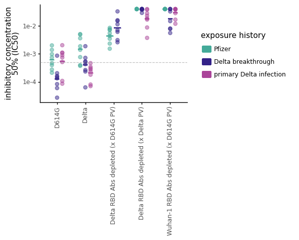

# Analyze neutralization data
This Python Jupyter notebook analyzes the neutralization data.

Import Python modules.
We use [neutcurve](https://jbloomlab.github.io/neutcurve/) to plot the neutralization curves:


```python
import os
import re
import warnings

from IPython.display import display, HTML
from matplotlib.backends.backend_pdf import PdfPages
import matplotlib as mpl
import matplotlib.pyplot as plt

import numpy as np
import pandas as pd
from plotnine import *
from statistics import geometric_mean

import neutcurve
from neutcurve.colorschemes import CBMARKERS, CBPALETTE
import seaborn

import yaml

print(f"Using `neutcurve` version {neutcurve.__version__}")
```

    Using `neutcurve` version 0.5.7


Read config file


```python
with open('config.yaml') as f:
    config = yaml.safe_load(f)
```

Specify input / output files:


```python
# output directory
results='results/neut_titers'
os.makedirs(results, exist_ok = True)

# input files
fracinfect_file = 'results/neut_titers/fracinfect.csv'

# output files
neut_titers_file = f'{results}/neut_titers.csv'
all_replicate_curves = f'{results}/all_replicate_curves.pdf'
```

## Read in the neutralization data


```python
print(f"Reading neutralization data from {fracinfect_file}")
fracinfect = (pd.read_csv(fracinfect_file)
              .replace({'virus': config['virus_key_mutneuts']})
             )

# order the viruses
virus_order = config['virus_order']

fracinfect = (
    fracinfect
    .assign(replicate_with_date=lambda x: x['replicate'].astype(str) +
                                          ' (' + x['date'] + ')')
    .query('virus in @virus_order')
    .assign(virus=lambda x: pd.Categorical(x['virus'], virus_order, ordered=True))
    .rename(columns={'replicate': 'replicate_on_date'})
)
fracinfect = (
    fracinfect
    .merge(fracinfect
           .sort_values('date')
           [['serum', 'virus', 'replicate_with_date']]
           .drop_duplicates()
           .assign(replicate_all_dates=lambda x: x.groupby(['serum', 'virus'])
                                                  ['replicate_with_date']
                                                  .transform('cumcount') + 1
                   ),
            how='left', on=['serum', 'virus', 'replicate_with_date'], validate='many_to_one',
            )
    )

# show first few lines of data frame
display(HTML(fracinfect.head().to_html(index=False)))
```

    Reading neutralization data from results/neut_titers/fracinfect.csv


<table border="1" class="dataframe">
  <thead>
    <tr style="text-align: right;">
      <th>serum</th>
      <th>virus</th>
      <th>replicate_on_date</th>
      <th>concentration</th>
      <th>fraction infectivity</th>
      <th>date</th>
      <th>replicate_with_date</th>
      <th>replicate_all_dates</th>
    </tr>
  </thead>
  <tbody>
    <tr>
      <td>278C</td>
      <td>D614G</td>
      <td>1</td>
      <td>0.040000</td>
      <td>0.000002</td>
      <td>2021-11-25</td>
      <td>1 (2021-11-25)</td>
      <td>1</td>
    </tr>
    <tr>
      <td>278C</td>
      <td>D614G</td>
      <td>1</td>
      <td>0.010000</td>
      <td>0.000002</td>
      <td>2021-11-25</td>
      <td>1 (2021-11-25)</td>
      <td>1</td>
    </tr>
    <tr>
      <td>278C</td>
      <td>D614G</td>
      <td>1</td>
      <td>0.002500</td>
      <td>-0.000003</td>
      <td>2021-11-25</td>
      <td>1 (2021-11-25)</td>
      <td>1</td>
    </tr>
    <tr>
      <td>278C</td>
      <td>D614G</td>
      <td>1</td>
      <td>0.000625</td>
      <td>0.002071</td>
      <td>2021-11-25</td>
      <td>1 (2021-11-25)</td>
      <td>1</td>
    </tr>
    <tr>
      <td>278C</td>
      <td>D614G</td>
      <td>1</td>
      <td>0.000156</td>
      <td>0.077880</td>
      <td>2021-11-25</td>
      <td>1 (2021-11-25)</td>
      <td>1</td>
    </tr>
  </tbody>
</table>


```python
fits = neutcurve.curvefits.CurveFits(
            data=fracinfect,
            replicate_col='replicate_all_dates',
            )
```


```python
with warnings.catch_warnings():
    warnings.simplefilter('ignore')  # ignore fitting warnings
    fig, _ = fits.plotReplicates(ncol=8,
                                 legendtitle='replicate',
                                 xlabel='serum dilution',
                                 viruses=fracinfect['virus'].sort_values().unique(),
                                 colors=plt.rcParams['axes.prop_cycle'].by_key()['color'] * 2,
                                 markers=['o', '^', 's', 'D', 'v', '<', '>', 'p'] * 2,
                                 fix_lims={'ymax':1.25},
                                 )
    
print(f"Saving plot to {all_replicate_curves}\n")
fig.savefig(all_replicate_curves)
fig.tight_layout()
display(fig)
plt.close(fig)
```

    Saving plot to results/neut_titers/all_replicate_curves.pdf
    


    

    


Use [neutcurve](https://jbloomlab.github.io/neutcurve/) to fit neutralization curves to all of the data:


```python
fitparams = pd.DataFrame(columns=['serum', 'virus', 'ic50', 'NT50', 'ic50_bound', 'date'])

for d in fracinfect['date'].unique():
    fits = neutcurve.CurveFits(fracinfect.query('date==@d'),
                               replicate_col='replicate_on_date',
                              )

    fp = (
        fits.fitParams(average_only=False)
        .assign(NT50=lambda x: 1/x['ic50'],
                date=d
               )
        # .replace({'WT':'wildtype', 'B.1.351':'wildtype'})
        # get columns of interest
        [['serum', 'virus', 'ic50', 'NT50', 'ic50_bound', 'date', 'replicate', 'top']] 
        .assign(ic50_is_bound=lambda x: x['ic50_bound'].map({'lower': True,
                                                          'interpolated': False}))
        )
    fitparams=fitparams.append(fp, ignore_index=True)

fitparams.head()
```

    /fh/fast/bloom_j/computational_notebooks/agreaney/2021/SARS-CoV-2-RBD_Delta/env/lib/python3.8/site-packages/neutcurve/hillcurve.py:741: RuntimeWarning: invalid value encountered in power
    /fh/fast/bloom_j/computational_notebooks/agreaney/2021/SARS-CoV-2-RBD_Delta/env/lib/python3.8/site-packages/scipy/optimize/minpack.py:833: OptimizeWarning: Covariance of the parameters could not be estimated
    /fh/fast/bloom_j/computational_notebooks/agreaney/2021/SARS-CoV-2-RBD_Delta/env/lib/python3.8/site-packages/neutcurve/hillcurve.py:451: RuntimeWarning: invalid value encountered in sqrt


<div>
<style scoped>
    .dataframe tbody tr th:only-of-type {
        vertical-align: middle;
    }

    .dataframe tbody tr th {
        vertical-align: top;
    }

    .dataframe thead th {
        text-align: right;
    }
</style>
<table border="1" class="dataframe">
  <thead>
    <tr style="text-align: right;">
      <th></th>
      <th>serum</th>
      <th>virus</th>
      <th>ic50</th>
      <th>NT50</th>
      <th>ic50_bound</th>
      <th>date</th>
      <th>replicate</th>
      <th>top</th>
      <th>ic50_is_bound</th>
    </tr>
  </thead>
  <tbody>
    <tr>
      <th>0</th>
      <td>278C</td>
      <td>D614G</td>
      <td>0.000028</td>
      <td>36156.872871</td>
      <td>interpolated</td>
      <td>2021-11-25</td>
      <td>1</td>
      <td>1.0</td>
      <td>False</td>
    </tr>
    <tr>
      <th>1</th>
      <td>278C</td>
      <td>D614G</td>
      <td>0.000028</td>
      <td>36194.773838</td>
      <td>interpolated</td>
      <td>2021-11-25</td>
      <td>2</td>
      <td>1.0</td>
      <td>False</td>
    </tr>
    <tr>
      <th>2</th>
      <td>278C</td>
      <td>D614G</td>
      <td>0.000028</td>
      <td>36090.374491</td>
      <td>interpolated</td>
      <td>2021-11-25</td>
      <td>average</td>
      <td>1.0</td>
      <td>False</td>
    </tr>
    <tr>
      <th>3</th>
      <td>278C</td>
      <td>L452-binding antibodies</td>
      <td>0.003455</td>
      <td>289.406060</td>
      <td>interpolated</td>
      <td>2021-11-25</td>
      <td>1</td>
      <td>1.0</td>
      <td>False</td>
    </tr>
    <tr>
      <th>4</th>
      <td>278C</td>
      <td>L452-binding antibodies</td>
      <td>0.002789</td>
      <td>358.494044</td>
      <td>interpolated</td>
      <td>2021-11-25</td>
      <td>2</td>
      <td>1.0</td>
      <td>False</td>
    </tr>
  </tbody>
</table>
</div>


Make a plot showing all viruses against each sera:


```python
for d in fracinfect['date'].unique():
    fits = (neutcurve.CurveFits(fracinfect.query('date==@d'), 
                                replicate_col='replicate_on_date'
                               )
           )
    xlab= 'serum dilution'
    name= 'sera'

    fig, axes = fits.plotSera(xlabel=xlab,
                              # max_viruses_per_subplot=4,
                              colors=CBPALETTE*3, 
                              markers=CBMARKERS*3,
                              attempt_shared_legend=True,
                              fix_lims={'ymax':1.25}
                             )

    plotfile = f'{results}/{d}_mutant_neuts.pdf'
    print(f"Saving to {plotfile}")
    fig.savefig(plotfile, bbox_inches='tight')
```

    Saving to results/neut_titers/2021-11-25_mutant_neuts.pdf
    Saving to results/neut_titers/2021-12-19_mutant_neuts.pdf


    /fh/fast/bloom_j/computational_notebooks/agreaney/2021/SARS-CoV-2-RBD_Delta/env/lib/python3.8/site-packages/neutcurve/hillcurve.py:741: RuntimeWarning: invalid value encountered in power
    /fh/fast/bloom_j/computational_notebooks/agreaney/2021/SARS-CoV-2-RBD_Delta/env/lib/python3.8/site-packages/scipy/optimize/minpack.py:833: OptimizeWarning: Covariance of the parameters could not be estimated


    Saving to results/neut_titers/2021-11-12_mutant_neuts.pdf


    /fh/fast/bloom_j/computational_notebooks/agreaney/2021/SARS-CoV-2-RBD_Delta/env/lib/python3.8/site-packages/neutcurve/hillcurve.py:741: RuntimeWarning: invalid value encountered in power


    Saving to results/neut_titers/2021-12-12_mutant_neuts.pdf


    

    


    

    


    

    


    

    


### Plot all neuts for each serum on the same axis


```python
fits = (neutcurve.CurveFits(fracinfect, 
                            replicate_col='replicate_all_dates'
                           )
       )
xlab= 'serum dilution'
name= 'sera'

fig, axes = fits.plotSera(xlabel=xlab,
                          max_viruses_per_subplot=8,
                          colors=CBPALETTE*3, 
                          markers=CBMARKERS*3,
                          attempt_shared_legend=True,
                          fix_lims={'ymax':1.25}
                         )

plotfile = f'{results}/all_mutant_neuts.pdf'
print(f"Saving to {plotfile}")
fig.savefig(plotfile, bbox_inches='tight')
```

    /fh/fast/bloom_j/computational_notebooks/agreaney/2021/SARS-CoV-2-RBD_Delta/env/lib/python3.8/site-packages/neutcurve/hillcurve.py:741: RuntimeWarning: invalid value encountered in power
    /fh/fast/bloom_j/computational_notebooks/agreaney/2021/SARS-CoV-2-RBD_Delta/env/lib/python3.8/site-packages/scipy/optimize/minpack.py:833: OptimizeWarning: Covariance of the parameters could not be estimated


    Saving to results/neut_titers/all_mutant_neuts.pdf


    

    


### Calculate fold-change IC50 relative to the gemetric mean of the wildtype virus against each serum on each date
* Get neutralization titers, 
* Drop "average" replicate
* Calculate the geometric mean of the wildtype virus against each serum
* Calculate fold-change IC50

No longer subset on date, because Delta virus wasn't run on D614G experiment days


```python
wildtype = config['wildtype_virus']

neut_titers = (
    fitparams
    .merge((fitparams
            .query('virus == @wildtype & replicate != "average"')
            .groupby(['serum'])
            
            # get the geometric mean of the two wildtype replicates 
            .agg(wildtype_ic50=pd.NamedAgg(column="ic50", aggfunc=geometric_mean))
            .reset_index()
           ),
           on=['serum'],
           how='left',
           validate='many_to_one',
           )
    .merge((pd.read_csv(config['sample_key_file'])
            [['subject_name', 'sample_type']]
            .rename(columns={'subject_name':'serum'})
           ),
           on='serum',
           how='left',
           validate='many_to_one',
          )
    .assign(fold_change=lambda x: x['ic50'] / x['wildtype_ic50'],)
    )


display(HTML(neut_titers.head().to_html(index=False)))
neut_titers.to_csv(neut_titers_file, index=False)
```


<table border="1" class="dataframe">
  <thead>
    <tr style="text-align: right;">
      <th>serum</th>
      <th>virus</th>
      <th>ic50</th>
      <th>NT50</th>
      <th>ic50_bound</th>
      <th>date</th>
      <th>replicate</th>
      <th>top</th>
      <th>ic50_is_bound</th>
      <th>wildtype_ic50</th>
      <th>sample_type</th>
      <th>fold_change</th>
    </tr>
  </thead>
  <tbody>
    <tr>
      <td>278C</td>
      <td>D614G</td>
      <td>0.000028</td>
      <td>36156.872871</td>
      <td>interpolated</td>
      <td>2021-11-25</td>
      <td>1</td>
      <td>1.0</td>
      <td>False</td>
      <td>0.000063</td>
      <td>Delta breakthrough</td>
      <td>0.437439</td>
    </tr>
    <tr>
      <td>278C</td>
      <td>D614G</td>
      <td>0.000028</td>
      <td>36194.773838</td>
      <td>interpolated</td>
      <td>2021-11-25</td>
      <td>2</td>
      <td>1.0</td>
      <td>False</td>
      <td>0.000063</td>
      <td>Delta breakthrough</td>
      <td>0.436981</td>
    </tr>
    <tr>
      <td>278C</td>
      <td>D614G</td>
      <td>0.000028</td>
      <td>36090.374491</td>
      <td>interpolated</td>
      <td>2021-11-25</td>
      <td>average</td>
      <td>1.0</td>
      <td>False</td>
      <td>0.000063</td>
      <td>Delta breakthrough</td>
      <td>0.438245</td>
    </tr>
    <tr>
      <td>278C</td>
      <td>L452-binding antibodies</td>
      <td>0.003455</td>
      <td>289.406060</td>
      <td>interpolated</td>
      <td>2021-11-25</td>
      <td>1</td>
      <td>1.0</td>
      <td>False</td>
      <td>0.000063</td>
      <td>Delta breakthrough</td>
      <td>54.651373</td>
    </tr>
    <tr>
      <td>278C</td>
      <td>L452-binding antibodies</td>
      <td>0.002789</td>
      <td>358.494044</td>
      <td>interpolated</td>
      <td>2021-11-25</td>
      <td>2</td>
      <td>1.0</td>
      <td>False</td>
      <td>0.000063</td>
      <td>Delta breakthrough</td>
      <td>44.119111</td>
    </tr>
  </tbody>
</table>


As we can see below, the fold-change in IC50 for each wildtype replicate is no longer exactly 1 (because we are comparing to the geometric mean of the replicate measurements). Here I am pulling out the most extreme fold_change IC50s for wildtype (relative to the geometric mean):


```python
display(HTML(neut_titers.query('virus==@wildtype & replicate != "average" & (fold_change <0.85 | fold_change >1.15)').head(100).to_html(index=False)))
```


<table border="1" class="dataframe">
  <thead>
    <tr style="text-align: right;">
      <th>serum</th>
      <th>virus</th>
      <th>ic50</th>
      <th>NT50</th>
      <th>ic50_bound</th>
      <th>date</th>
      <th>replicate</th>
      <th>top</th>
      <th>ic50_is_bound</th>
      <th>wildtype_ic50</th>
      <th>sample_type</th>
      <th>fold_change</th>
    </tr>
  </thead>
  <tbody>
    <tr>
      <td>Delta_8</td>
      <td>Delta</td>
      <td>0.000058</td>
      <td>17100.372817</td>
      <td>interpolated</td>
      <td>2021-12-19</td>
      <td>2</td>
      <td>1.0</td>
      <td>False</td>
      <td>0.000070</td>
      <td>primary Delta infection</td>
      <td>0.832411</td>
    </tr>
    <tr>
      <td>Delta_10</td>
      <td>Delta</td>
      <td>0.000216</td>
      <td>4631.420274</td>
      <td>interpolated</td>
      <td>2021-12-19</td>
      <td>1</td>
      <td>1.0</td>
      <td>False</td>
      <td>0.000273</td>
      <td>primary Delta infection</td>
      <td>0.790700</td>
    </tr>
    <tr>
      <td>Delta_1</td>
      <td>Delta</td>
      <td>0.000066</td>
      <td>15115.394507</td>
      <td>interpolated</td>
      <td>2021-12-19</td>
      <td>2</td>
      <td>1.0</td>
      <td>False</td>
      <td>0.000080</td>
      <td>primary Delta infection</td>
      <td>0.826808</td>
    </tr>
    <tr>
      <td>276C</td>
      <td>Delta</td>
      <td>0.000398</td>
      <td>2514.655718</td>
      <td>interpolated</td>
      <td>2021-12-19</td>
      <td>2</td>
      <td>1.0</td>
      <td>False</td>
      <td>0.000522</td>
      <td>Delta breakthrough</td>
      <td>0.762389</td>
    </tr>
    <tr>
      <td>267C</td>
      <td>Delta</td>
      <td>0.002206</td>
      <td>453.387064</td>
      <td>interpolated</td>
      <td>2021-12-19</td>
      <td>2</td>
      <td>1.0</td>
      <td>False</td>
      <td>0.001878</td>
      <td>Delta breakthrough</td>
      <td>1.174335</td>
    </tr>
    <tr>
      <td>273C</td>
      <td>Delta</td>
      <td>0.000356</td>
      <td>2810.049343</td>
      <td>interpolated</td>
      <td>2021-12-19</td>
      <td>1</td>
      <td>1.0</td>
      <td>False</td>
      <td>0.000265</td>
      <td>Delta breakthrough</td>
      <td>1.343292</td>
    </tr>
    <tr>
      <td>273C</td>
      <td>Delta</td>
      <td>0.000330</td>
      <td>3027.589222</td>
      <td>interpolated</td>
      <td>2021-12-19</td>
      <td>2</td>
      <td>1.0</td>
      <td>False</td>
      <td>0.000265</td>
      <td>Delta breakthrough</td>
      <td>1.246773</td>
    </tr>
    <tr>
      <td>P08</td>
      <td>Delta</td>
      <td>0.000905</td>
      <td>1105.112558</td>
      <td>interpolated</td>
      <td>2021-12-19</td>
      <td>1</td>
      <td>1.0</td>
      <td>False</td>
      <td>0.000768</td>
      <td>Pfizer</td>
      <td>1.178833</td>
    </tr>
    <tr>
      <td>P08</td>
      <td>Delta</td>
      <td>0.000926</td>
      <td>1080.453858</td>
      <td>interpolated</td>
      <td>2021-12-19</td>
      <td>2</td>
      <td>1.0</td>
      <td>False</td>
      <td>0.000768</td>
      <td>Pfizer</td>
      <td>1.205737</td>
    </tr>
    <tr>
      <td>P12</td>
      <td>Delta</td>
      <td>0.003414</td>
      <td>292.908383</td>
      <td>interpolated</td>
      <td>2021-12-19</td>
      <td>1</td>
      <td>1.0</td>
      <td>False</td>
      <td>0.004831</td>
      <td>Pfizer</td>
      <td>0.706673</td>
    </tr>
    <tr>
      <td>P12</td>
      <td>Delta</td>
      <td>0.003754</td>
      <td>266.357536</td>
      <td>interpolated</td>
      <td>2021-12-19</td>
      <td>2</td>
      <td>1.0</td>
      <td>False</td>
      <td>0.004831</td>
      <td>Pfizer</td>
      <td>0.777115</td>
    </tr>
    <tr>
      <td>P14</td>
      <td>Delta</td>
      <td>0.000548</td>
      <td>1825.437980</td>
      <td>interpolated</td>
      <td>2021-12-19</td>
      <td>1</td>
      <td>1.0</td>
      <td>False</td>
      <td>0.000395</td>
      <td>Pfizer</td>
      <td>1.386950</td>
    </tr>
    <tr>
      <td>P14</td>
      <td>Delta</td>
      <td>0.000479</td>
      <td>2089.854399</td>
      <td>interpolated</td>
      <td>2021-12-19</td>
      <td>2</td>
      <td>1.0</td>
      <td>False</td>
      <td>0.000395</td>
      <td>Pfizer</td>
      <td>1.211468</td>
    </tr>
    <tr>
      <td>P04</td>
      <td>Delta</td>
      <td>0.000431</td>
      <td>2318.502205</td>
      <td>interpolated</td>
      <td>2021-12-19</td>
      <td>2</td>
      <td>1.0</td>
      <td>False</td>
      <td>0.000372</td>
      <td>Pfizer</td>
      <td>1.160354</td>
    </tr>
    <tr>
      <td>P05</td>
      <td>Delta</td>
      <td>0.002177</td>
      <td>459.425152</td>
      <td>interpolated</td>
      <td>2021-12-19</td>
      <td>1</td>
      <td>1.0</td>
      <td>False</td>
      <td>0.001853</td>
      <td>Pfizer</td>
      <td>1.174855</td>
    </tr>
    <tr>
      <td>P05</td>
      <td>Delta</td>
      <td>0.002174</td>
      <td>460.003568</td>
      <td>interpolated</td>
      <td>2021-12-19</td>
      <td>2</td>
      <td>1.0</td>
      <td>False</td>
      <td>0.001853</td>
      <td>Pfizer</td>
      <td>1.173377</td>
    </tr>
    <tr>
      <td>276C</td>
      <td>Delta</td>
      <td>0.000602</td>
      <td>1660.048897</td>
      <td>interpolated</td>
      <td>2021-11-12</td>
      <td>1</td>
      <td>1.0</td>
      <td>False</td>
      <td>0.000522</td>
      <td>Delta breakthrough</td>
      <td>1.154873</td>
    </tr>
    <tr>
      <td>273C</td>
      <td>Delta</td>
      <td>0.000218</td>
      <td>4584.673177</td>
      <td>interpolated</td>
      <td>2021-11-12</td>
      <td>1</td>
      <td>1.0</td>
      <td>False</td>
      <td>0.000265</td>
      <td>Delta breakthrough</td>
      <td>0.823334</td>
    </tr>
    <tr>
      <td>273C</td>
      <td>Delta</td>
      <td>0.000192</td>
      <td>5204.968295</td>
      <td>interpolated</td>
      <td>2021-11-12</td>
      <td>2</td>
      <td>1.0</td>
      <td>False</td>
      <td>0.000265</td>
      <td>Delta breakthrough</td>
      <td>0.725214</td>
    </tr>
    <tr>
      <td>274C</td>
      <td>Delta</td>
      <td>0.000376</td>
      <td>2657.054596</td>
      <td>interpolated</td>
      <td>2021-11-12</td>
      <td>1</td>
      <td>1.0</td>
      <td>False</td>
      <td>0.000527</td>
      <td>Delta breakthrough</td>
      <td>0.713516</td>
    </tr>
    <tr>
      <td>274C</td>
      <td>Delta</td>
      <td>0.000620</td>
      <td>1612.732431</td>
      <td>interpolated</td>
      <td>2021-11-12</td>
      <td>2</td>
      <td>1.0</td>
      <td>False</td>
      <td>0.000527</td>
      <td>Delta breakthrough</td>
      <td>1.175552</td>
    </tr>
    <tr>
      <td>267C</td>
      <td>Delta</td>
      <td>0.001534</td>
      <td>651.846252</td>
      <td>interpolated</td>
      <td>2021-11-12</td>
      <td>1</td>
      <td>1.0</td>
      <td>False</td>
      <td>0.001878</td>
      <td>Delta breakthrough</td>
      <td>0.816801</td>
    </tr>
    <tr>
      <td>P12</td>
      <td>Delta</td>
      <td>0.007668</td>
      <td>130.407718</td>
      <td>interpolated</td>
      <td>2021-11-12</td>
      <td>1</td>
      <td>1.0</td>
      <td>False</td>
      <td>0.004831</td>
      <td>Pfizer</td>
      <td>1.587257</td>
    </tr>
    <tr>
      <td>P14</td>
      <td>Delta</td>
      <td>0.000306</td>
      <td>3266.681667</td>
      <td>interpolated</td>
      <td>2021-11-12</td>
      <td>1</td>
      <td>1.0</td>
      <td>False</td>
      <td>0.000395</td>
      <td>Pfizer</td>
      <td>0.775034</td>
    </tr>
    <tr>
      <td>P14</td>
      <td>Delta</td>
      <td>0.000303</td>
      <td>3297.017821</td>
      <td>interpolated</td>
      <td>2021-11-12</td>
      <td>2</td>
      <td>1.0</td>
      <td>False</td>
      <td>0.000395</td>
      <td>Pfizer</td>
      <td>0.767903</td>
    </tr>
    <tr>
      <td>P08</td>
      <td>Delta</td>
      <td>0.000582</td>
      <td>1717.055795</td>
      <td>interpolated</td>
      <td>2021-11-12</td>
      <td>2</td>
      <td>1.0</td>
      <td>False</td>
      <td>0.000768</td>
      <td>Pfizer</td>
      <td>0.758708</td>
    </tr>
    <tr>
      <td>P09</td>
      <td>Delta</td>
      <td>0.006350</td>
      <td>157.487527</td>
      <td>interpolated</td>
      <td>2021-11-12</td>
      <td>1</td>
      <td>1.0</td>
      <td>False</td>
      <td>0.005079</td>
      <td>Pfizer</td>
      <td>1.250193</td>
    </tr>
    <tr>
      <td>P04</td>
      <td>Delta</td>
      <td>0.000303</td>
      <td>3302.903211</td>
      <td>interpolated</td>
      <td>2021-11-12</td>
      <td>2</td>
      <td>1.0</td>
      <td>False</td>
      <td>0.000372</td>
      <td>Pfizer</td>
      <td>0.814520</td>
    </tr>
    <tr>
      <td>P05</td>
      <td>Delta</td>
      <td>0.001473</td>
      <td>678.854843</td>
      <td>interpolated</td>
      <td>2021-11-12</td>
      <td>2</td>
      <td>1.0</td>
      <td>False</td>
      <td>0.001853</td>
      <td>Pfizer</td>
      <td>0.795100</td>
    </tr>
    <tr>
      <td>Delta_10</td>
      <td>Delta</td>
      <td>0.000337</td>
      <td>2965.866863</td>
      <td>interpolated</td>
      <td>2021-12-12</td>
      <td>2</td>
      <td>1.0</td>
      <td>False</td>
      <td>0.000273</td>
      <td>primary Delta infection</td>
      <td>1.234737</td>
    </tr>
    <tr>
      <td>Delta_8</td>
      <td>Delta</td>
      <td>0.000086</td>
      <td>11692.964462</td>
      <td>interpolated</td>
      <td>2021-12-12</td>
      <td>1</td>
      <td>1.0</td>
      <td>False</td>
      <td>0.000070</td>
      <td>primary Delta infection</td>
      <td>1.217360</td>
    </tr>
    <tr>
      <td>Delta_1</td>
      <td>Delta</td>
      <td>0.000092</td>
      <td>10835.685581</td>
      <td>interpolated</td>
      <td>2021-12-12</td>
      <td>1</td>
      <td>1.0</td>
      <td>False</td>
      <td>0.000080</td>
      <td>primary Delta infection</td>
      <td>1.153368</td>
    </tr>
  </tbody>
</table>


### Plot the fold-change IC50 relative to wildtype.
We will also plot each wild type replicate (as each deviates slightly from 1).  

Plot IC50 and fold-change IC50 for each serum x virus


```python
for metric in ['fold_change', 'ic50']:
    for virus_set, virus_subsample in config['virus_subsets'].items():
        print(f'Making plot for {metric} for {virus_set}:')
        
        ylab={'fold_change':'fold decrease in neutralization', 'ic50':'inhibitory concentration 50% (IC50)'}

        p = (ggplot(neut_titers
                    .query("virus in @virus_subsample & replicate!= 'average'") # & date in @dates
                    .assign(virus=lambda x: pd.Categorical(x['virus'],
                                                              ordered=True,
                                                              categories=virus_subsample)
                           )
                    ) +
             aes('virus', metric, shape='ic50_is_bound',
                ) +
             geom_point(size=2, alpha=0.5, fill='#999999',) +  
             scale_y_log10(name=ylab[metric]) +
             facet_wrap('~serum+sample_type', ncol=8, ) +
             theme_classic() +
             theme(axis_text_x=element_text(angle=90),
               axis_title_x=element_blank(),
               strip_background_x=element_blank(),
               figure_size=(16, 6),
               ) +
             geom_hline(data=(neut_titers
                              .query('virus in [@wildtype, "RBD antibodies depleted (Delta)"] & replicate!="average" ') #& date in @dates
                              .groupby(['serum', 'virus', 'sample_type'])
                              .agg({metric: geometric_mean})
                              .reset_index()
                              .dropna()
                             ),
                        inherit_aes=False,
                        mapping=aes(yintercept=metric, color='virus'),
                        alpha=0.7,
                        size=0.5,
                        linetype='dotted',
                       ) +
             scale_shape_manual(values=['o','^'], name='limit of detection') +
             scale_color_manual(values=CBPALETTE*3, guide=False) 
             )

        _ = p.draw()

        plotfile = f'{results}/{metric}_{virus_set}.pdf'
        print(f"Saving to {plotfile}")
        p.save(plotfile, limitsize=False, verbose=False)
```

    Making plot for fold_change for mutneuts:
    Saving to results/neut_titers/fold_change_mutneuts.pdf
    Making plot for fold_change for depletions:
    Saving to results/neut_titers/fold_change_depletions.pdf
    Making plot for ic50 for mutneuts:
    Saving to results/neut_titers/ic50_mutneuts.pdf
    Making plot for ic50 for depletions:
    Saving to results/neut_titers/ic50_depletions.pdf


    

    


    

    


    

    


    

    


### Plot the results for all individuals on one plot and add the geometric mean of all 8 measurements (2 replicates * 4 sera) for each virus


```python
for metric in ['fold_change', 'ic50']:
    for virus_set, virus_subsample in config['virus_subsets'].items():
        print(f'Making plot for {metric} for {virus_set}:')
        
        ylab={'fold_change':'fold decrease in neutralization', 'ic50':'IC50'}

        p = (ggplot(neut_titers
                    .query("virus in @virus_subsample & replicate== 'average'") #& date in @dates
                    .assign(virus=lambda x: pd.Categorical(x['virus'],
                                                              ordered=True,
                                                              categories=virus_subsample))
                    ) +
             aes('virus', metric, shape='ic50_is_bound',
                ) +
             geom_point(size=2.5, alpha=0.5, ) + 
             geom_crossbar(data=(neut_titers
                                 .query("virus in @virus_subsample & replicate== 'average'") # & date in @dates
                                 .groupby(['virus', 'sample_type'])
                                 .agg({metric: geometric_mean})
                                 .reset_index()
                                 .dropna()
                                ),
                           inherit_aes=False,
                           mapping=aes(x='virus', y=metric, ymin=metric, ymax=metric),
                  ) +
             scale_y_log10(name=ylab[metric]) +
             theme_classic() +
             theme(axis_text_x=element_text(angle=90),
                   axis_title_x=element_blank(),
                   strip_margin_y=0.35,
                   strip_background_x=element_blank(),
                   figure_size=(3*neut_titers['sample_type'].nunique(), 2.5),
                   ) +
             geom_hline(data=(neut_titers
                              .query('virus in [@wildtype] & replicate=="average"') # & date in @dates
                              .groupby(['virus', 'sample_type'])
                              .agg({metric: geometric_mean})
                              .reset_index()
                             ),
                        inherit_aes=False,
                        mapping=aes(yintercept=metric, color='virus'),
                        alpha=0.7,
                        size=0.5,
                        linetype='dotted',
                       ) +
             scale_shape_manual(values=['o','^'], name='limit of detection') +
             scale_color_manual(values=CBPALETTE*3, guide=False) +
             scale_fill_manual(values=CBPALETTE*3) +
             facet_wrap('~sample_type', scales='free_x')
             )

        _ = p.draw()

        plotfile = f'{results}/{metric}_{virus_set}_aggregate.pdf'
        print(f"Saving to {plotfile}")
        p.save(plotfile, limitsize=False, verbose=False)
```

    Making plot for fold_change for mutneuts:


    /fh/fast/bloom_j/computational_notebooks/agreaney/2021/SARS-CoV-2-RBD_Delta/env/lib/python3.8/site-packages/plotnine/guides/guides.py:197: PlotnineWarning: Cannot generate legend for the 'fill' aesthetic. Make sure you have mapped a variable to it


    Saving to results/neut_titers/fold_change_mutneuts_aggregate.pdf


    /fh/fast/bloom_j/computational_notebooks/agreaney/2021/SARS-CoV-2-RBD_Delta/env/lib/python3.8/site-packages/plotnine/guides/guides.py:197: PlotnineWarning: Cannot generate legend for the 'fill' aesthetic. Make sure you have mapped a variable to it


    Making plot for fold_change for depletions:


    /fh/fast/bloom_j/computational_notebooks/agreaney/2021/SARS-CoV-2-RBD_Delta/env/lib/python3.8/site-packages/plotnine/guides/guides.py:197: PlotnineWarning: Cannot generate legend for the 'fill' aesthetic. Make sure you have mapped a variable to it


    Saving to results/neut_titers/fold_change_depletions_aggregate.pdf


    /fh/fast/bloom_j/computational_notebooks/agreaney/2021/SARS-CoV-2-RBD_Delta/env/lib/python3.8/site-packages/plotnine/guides/guides.py:197: PlotnineWarning: Cannot generate legend for the 'fill' aesthetic. Make sure you have mapped a variable to it


    Making plot for ic50 for mutneuts:


    /fh/fast/bloom_j/computational_notebooks/agreaney/2021/SARS-CoV-2-RBD_Delta/env/lib/python3.8/site-packages/plotnine/guides/guides.py:197: PlotnineWarning: Cannot generate legend for the 'fill' aesthetic. Make sure you have mapped a variable to it


    Saving to results/neut_titers/ic50_mutneuts_aggregate.pdf


    /fh/fast/bloom_j/computational_notebooks/agreaney/2021/SARS-CoV-2-RBD_Delta/env/lib/python3.8/site-packages/plotnine/guides/guides.py:197: PlotnineWarning: Cannot generate legend for the 'fill' aesthetic. Make sure you have mapped a variable to it


    Making plot for ic50 for depletions:


    /fh/fast/bloom_j/computational_notebooks/agreaney/2021/SARS-CoV-2-RBD_Delta/env/lib/python3.8/site-packages/plotnine/guides/guides.py:197: PlotnineWarning: Cannot generate legend for the 'fill' aesthetic. Make sure you have mapped a variable to it


    Saving to results/neut_titers/ic50_depletions_aggregate.pdf


    /fh/fast/bloom_j/computational_notebooks/agreaney/2021/SARS-CoV-2-RBD_Delta/env/lib/python3.8/site-packages/plotnine/guides/guides.py:197: PlotnineWarning: Cannot generate legend for the 'fill' aesthetic. Make sure you have mapped a variable to it


    

    


    

    


    

    


    

    


```python
neut_titers.query('virus==@wildtype')['ic50'].agg(geometric_mean)
```


    0.0004971162520255163


```python
for metric in ['fold_change', 'ic50']:
    for virus_set, virus_subsample in config['virus_subsets'].items():
        print(f'Making plot for {metric} for {virus_set}:')
        
        if metric=="fold_change":
            virus_subsample=[v for v in virus_subsample if v!=wildtype]
        
        print(f"Making plot for {neut_titers.query('virus in @virus_subsample')['virus'].nunique()} viruses")
        
        ylab={'fold_change':'fold decrease in neutralization', 
              'ic50':'inhibitory concentration\n50% (IC50)'
             }
        yintercept={'fold_change':1, 
                    'ic50':(neut_titers
                            .query('virus==@wildtype')
                            ['ic50']
                            .agg(geometric_mean)
                           )
                   }

        p = (ggplot(neut_titers
                    .query("virus in @virus_subsample & replicate=='average'")
                    .assign(virus_labels=lambda x: pd.Categorical(x['virus'],
                                                                  ordered=True,
                                                                  categories=virus_subsample),
                           )
                    ) +
             aes('virus', 
                 metric, 
                 fill='sample_type', 
                 color='sample_type',
                ) +
             geom_point(position=position_dodge(width=0.55), size=2.5, alpha=0.5) +
             geom_crossbar(data=(neut_titers
                                 .query("virus in @virus_subsample & replicate=='average'")
                                 .groupby(['virus', 'sample_type'])
                                 .agg({metric: geometric_mean})
                                 .reset_index()
                                 .dropna()
                                ),
#                            inherit_aes=False,
                           mapping=aes(x='virus', y=metric, ymin=metric, ymax=metric),
                           position=position_dodge(width=0.55),
                  ) +
             geom_hline(yintercept=yintercept[metric],
                        linetype='dashed', size=0.5,
                        alpha=0.6, 
                        color=CBPALETTE[0]) +
             scale_y_log10(name=ylab[metric]) +
             theme_classic() +
             theme(axis_title_x=element_blank(),
                   figure_size=(neut_titers.query('virus in @virus_subsample')['virus'].nunique()*0.75, 2.5),
                   axis_text_x=element_text(rotation=90)
                   ) +
             scale_fill_manual(values=['#44AA99', '#332288', '#AA4499'], name='infecting virus\n')+
             scale_color_manual(values=['#44AA99', '#332288', '#AA4499'], name='infecting virus\n')
             )

        _ = p.draw()

        plotfile = f'{results}/{metric}_{virus_set}_aggregate_nofacet.pdf'
        print(f"Saving to {plotfile}")
        p.save(plotfile, limitsize=False, verbose=False)
```

    Making plot for fold_change for mutneuts:
    Making plot for 6 viruses
    Saving to results/neut_titers/fold_change_mutneuts_aggregate_nofacet.pdf
    Making plot for fold_change for depletions:
    Making plot for 4 viruses
    Saving to results/neut_titers/fold_change_depletions_aggregate_nofacet.pdf
    Making plot for ic50 for mutneuts:
    Making plot for 7 viruses
    Saving to results/neut_titers/ic50_mutneuts_aggregate_nofacet.pdf
    Making plot for ic50 for depletions:
    Making plot for 5 viruses
    Saving to results/neut_titers/ic50_depletions_aggregate_nofacet.pdf


    

    


    

    


    

    


    

    


```python
geomean_mut_effects=(neut_titers
                     .query("replicate=='average'")
                     .groupby(['virus', 'sample_type'])
                     .agg({'fold_change': geometric_mean})
                     .reset_index()
                     .dropna()
                     .merge((neut_titers
                             .query("replicate=='average'")
                             .groupby(['virus', 'sample_type'])
                             .size()
                             .reset_index(name='counts')
                            ),
                            how='left',
                            on=['virus', 'sample_type'],
                            validate='one_to_one'
                           )
                    )

display(HTML(geomean_mut_effects.to_html(index=False)))
```


<table border="1" class="dataframe">
  <thead>
    <tr style="text-align: right;">
      <th>virus</th>
      <th>sample_type</th>
      <th>fold_change</th>
      <th>counts</th>
    </tr>
  </thead>
  <tbody>
    <tr>
      <td>D614G</td>
      <td>Delta breakthrough</td>
      <td>0.347788</td>
      <td>8</td>
    </tr>
    <tr>
      <td>D614G</td>
      <td>Pfizer</td>
      <td>0.412284</td>
      <td>16</td>
    </tr>
    <tr>
      <td>Delta</td>
      <td>Delta breakthrough</td>
      <td>1.001336</td>
      <td>16</td>
    </tr>
    <tr>
      <td>Delta</td>
      <td>Pfizer</td>
      <td>1.003604</td>
      <td>16</td>
    </tr>
    <tr>
      <td>Delta</td>
      <td>primary Delta infection</td>
      <td>1.001430</td>
      <td>16</td>
    </tr>
    <tr>
      <td>Delta + E484K</td>
      <td>Delta breakthrough</td>
      <td>3.259109</td>
      <td>8</td>
    </tr>
    <tr>
      <td>Delta + E484K</td>
      <td>Pfizer</td>
      <td>3.208403</td>
      <td>8</td>
    </tr>
    <tr>
      <td>Delta + E484K</td>
      <td>primary Delta infection</td>
      <td>8.403561</td>
      <td>8</td>
    </tr>
    <tr>
      <td>Delta + K417N</td>
      <td>Delta breakthrough</td>
      <td>2.608850</td>
      <td>8</td>
    </tr>
    <tr>
      <td>Delta + K417N</td>
      <td>Pfizer</td>
      <td>3.483359</td>
      <td>8</td>
    </tr>
    <tr>
      <td>Delta + K417N</td>
      <td>primary Delta infection</td>
      <td>2.178660</td>
      <td>8</td>
    </tr>
    <tr>
      <td>L452-binding antibodies</td>
      <td>Delta breakthrough</td>
      <td>21.777749</td>
      <td>8</td>
    </tr>
    <tr>
      <td>L452-binding antibodies</td>
      <td>Pfizer</td>
      <td>2.915247</td>
      <td>8</td>
    </tr>
    <tr>
      <td>RBD antibodies depleted (D614G)</td>
      <td>Pfizer</td>
      <td>26.630221</td>
      <td>8</td>
    </tr>
    <tr>
      <td>RBD antibodies depleted (Delta)</td>
      <td>Delta breakthrough</td>
      <td>95.939376</td>
      <td>8</td>
    </tr>
    <tr>
      <td>RBD antibodies depleted (Delta)</td>
      <td>Pfizer</td>
      <td>26.630221</td>
      <td>8</td>
    </tr>
    <tr>
      <td>RBD antibodies depleted (Delta)</td>
      <td>primary Delta infection</td>
      <td>86.628556</td>
      <td>8</td>
    </tr>
  </tbody>
</table>


```python

```
