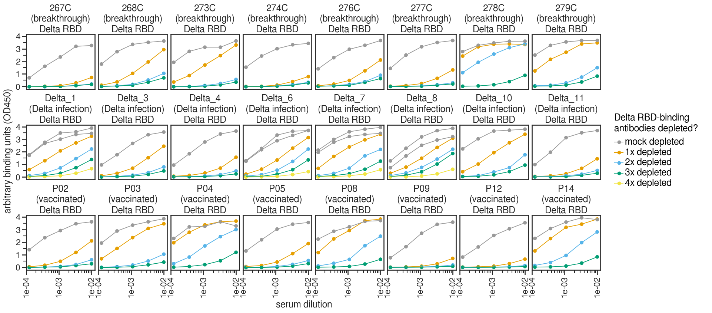
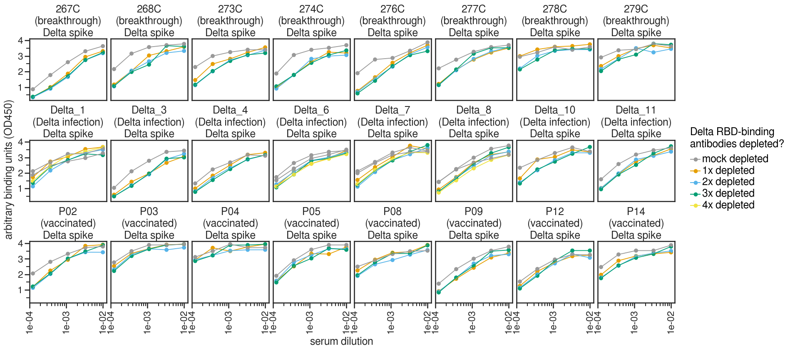

# Depleting serum/plasma samples of Delta RBD-binding antibodies

### Set up Analysis

Import packages.


```python
import itertools
import math
import os
import re
import warnings

from IPython.display import display, HTML

import matplotlib
from matplotlib.backends.backend_pdf import PdfPages
import matplotlib as mpl
import matplotlib.pyplot as plt
from mizani.formatters import scientific_format
import natsort

import numpy as np
import pandas as pd
from plotnine import *
import seaborn

import neutcurve
from neutcurve.colorschemes import CBMARKERS, CBPALETTE
import seaborn

import scipy.stats

import yaml
```


```python
warnings.simplefilter('ignore')
```

Use seaborn theme and change font:


```python
theme_set(theme_seaborn(style='white', context='talk', font='FreeSans', font_scale=1))
plt.style.use('seaborn-white')
```

Read config file:


```python
with open('config.yaml') as f:
    config = yaml.safe_load(f)
```


```python
datadir=config['elisa_data_dir']

resultsdir='results/rbd_depletion_elisas'
os.makedirs(resultsdir, exist_ok=True)
```


```python
pd.options.display.max_rows = 100
```

## RBD depletion ELISAs

Rachel performed 3 rounds of depletions (or mock) with a ratio of 3:1 beads:serum with commerical Delta RBD beads from ACROBioSystems (MBS-K037). She then performed ELISAs for binding of serum to commercial proteins purchased from ACRO, Delta RBD (SPD-C52Hh) or Delta spike (SPN-C52He).


```python
titration_df = pd.DataFrame()

for f in config['elisa_data_files']:
    data = os.path.join(datadir, f)

    df = (pd.read_csv(data)
                    .melt(
                            id_vars=['serum', 'serum_group', 'depleted', 'ligand', 'date'], 
                            var_name='dilution_factor', 
                            value_name='OD450'
                           )
                    .assign(dilution_factor=lambda x: x['dilution_factor'].astype(int),
                            dilution=lambda x: 1/x['dilution_factor'],
                           )
                   )
    titration_df=pd.concat([titration_df, df])

titration_df = (titration_df
                .assign(depleted=lambda x: pd.Categorical(x['depleted'], 
                                                          categories=config['depletions'], 
                                                          ordered=True
                                                         ),
                        serum_name=lambda x: x['serum']+'\n('+x['serum_group']+')'
                       )
               )

display(HTML(titration_df.tail().to_html(index=False)))

for genotype in set([i.split(' ')[0] for i in titration_df['ligand'].unique().tolist()]):
    
    df = titration_df.query('ligand.str.contains(@genotype)')
    
    ncol=8
    nrow=math.ceil(len(df[['ligand', 'serum', 'serum_group']].drop_duplicates())/8)

    p = (
        ggplot((df.assign(depleted_date=lambda x: x['depleted'].astype(str)+'_'+x['date'].astype(str))),
               aes('dilution', 
                   'OD450', 
                   color='depleted',
                   group='depleted_date',
                   )) +
        geom_point(size=3) +
        geom_path(aes(color='depleted'), size=0.75) +
        scale_x_log10(name='serum dilution', labels=scientific_format(digits=0)) +
        facet_wrap('~serum_name+ligand', ncol=ncol) +
        theme(figure_size=(2.5 * ncol, 2.75 * nrow),
              axis_text_x=element_text(angle=90),
              strip_background=element_blank(),
              strip_margin_y=0.35,
              subplots_adjust={'hspace':0.65},
             ) +
        scale_color_manual(values=CBPALETTE[0:], name=f'{genotype} RBD-binding\nantibodies depleted?') +
        ylab('arbitrary binding units (OD450)')
        )

    _ = p.draw()

    p.save(f'{resultsdir}/all_ELISAs_{genotype}.pdf', limitsize=False)
    p.save(f'{resultsdir}/all_ELISAs_{genotype}.png', limitsize=False)
```


<table border="1" class="dataframe">
  <thead>
    <tr style="text-align: right;">
      <th>serum</th>
      <th>serum_group</th>
      <th>depleted</th>
      <th>ligand</th>
      <th>date</th>
      <th>dilution_factor</th>
      <th>OD450</th>
      <th>dilution</th>
      <th>serum_name</th>
    </tr>
  </thead>
  <tbody>
    <tr>
      <td>Delta_7</td>
      <td>Delta infection</td>
      <td>4x depleted</td>
      <td>D614G RBD</td>
      <td>211220</td>
      <td>40500</td>
      <td>0.00345</td>
      <td>0.000025</td>
      <td>Delta_7\n(Delta infection)</td>
    </tr>
    <tr>
      <td>Delta_6</td>
      <td>Delta infection</td>
      <td>4x depleted</td>
      <td>D614G RBD</td>
      <td>211220</td>
      <td>40500</td>
      <td>0.00140</td>
      <td>0.000025</td>
      <td>Delta_6\n(Delta infection)</td>
    </tr>
    <tr>
      <td>Delta_4</td>
      <td>Delta infection</td>
      <td>4x depleted</td>
      <td>D614G RBD</td>
      <td>211220</td>
      <td>40500</td>
      <td>0.00195</td>
      <td>0.000025</td>
      <td>Delta_4\n(Delta infection)</td>
    </tr>
    <tr>
      <td>Delta_3</td>
      <td>Delta infection</td>
      <td>4x depleted</td>
      <td>D614G RBD</td>
      <td>211220</td>
      <td>40500</td>
      <td>0.03770</td>
      <td>0.000025</td>
      <td>Delta_3\n(Delta infection)</td>
    </tr>
    <tr>
      <td>Delta_1</td>
      <td>Delta infection</td>
      <td>4x depleted</td>
      <td>D614G RBD</td>
      <td>211220</td>
      <td>40500</td>
      <td>0.00095</td>
      <td>0.000025</td>
      <td>Delta_1\n(Delta infection)</td>
    </tr>
  </tbody>
</table>


    

    


    

    


```python

```
