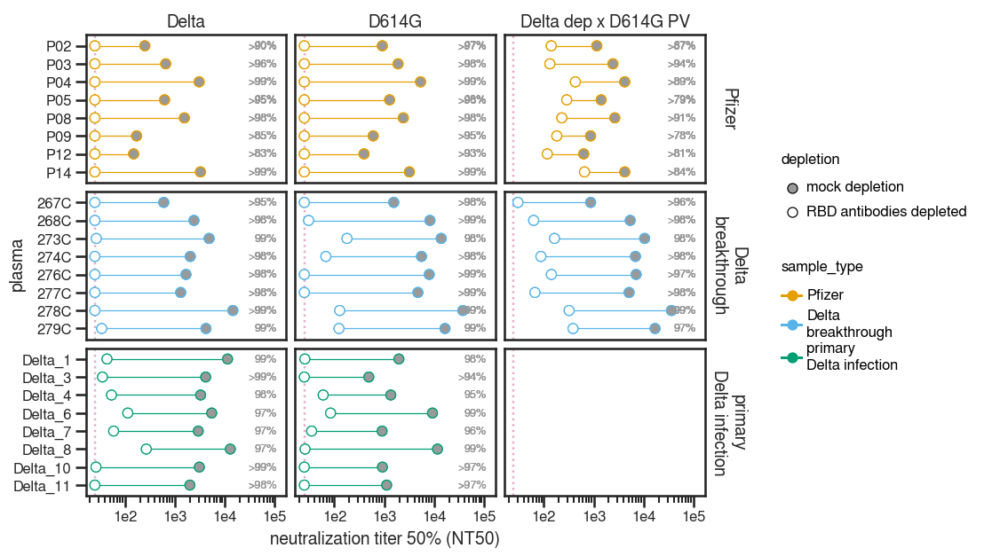
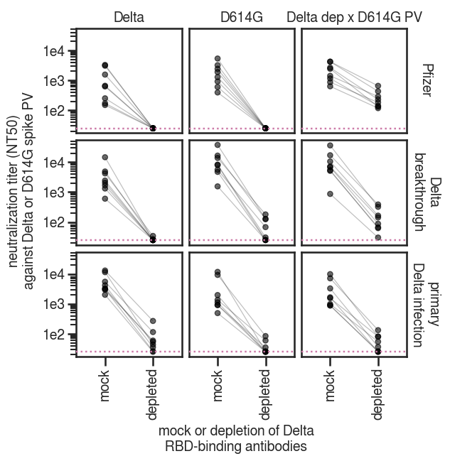

# Determine the amount of neutralizing activity directed towards the RBD elicited by infection with Delta variant

## Set up analysis
Import packages


```python
import os
import re
import warnings

from IPython.display import display, HTML

import matplotlib
from matplotlib.backends.backend_pdf import PdfPages
import matplotlib as mpl
import matplotlib.pyplot as plt
import natsort

import numpy as np
import pandas as pd
from plotnine import *
import seaborn

import neutcurve
from neutcurve.colorschemes import CBMARKERS, CBPALETTE
import seaborn

import lifelines
import sklearn
import scipy.stats

import yaml

print(f"Using `neutcurve` version {neutcurve.__version__}")
```

    Using `neutcurve` version 0.5.7


Use seaborn theme and change font:


```python
theme_set(theme_seaborn(style='white', context='talk', font='FreeSans', font_scale=1))
plt.style.use('seaborn-white')
```

Read in config file


```python
with open('config.yaml') as f:
    config = yaml.safe_load(f)
```

Define results directory


```python
resultsdir = 'results/rbd_depletion_neuts'
os.makedirs(resultsdir, exist_ok=True)
```

## Read in fracinfect file and plot curves

Read in the neut data for all experiments for this paper, but only select the date(s) that correspond to the RBD depletions experiment. Note that this is only configured to handle one experiment date currently (because the amazingly talented Rachel Eguia ran all these assays on a single date). So for future projects, this might need to be adjusted. 


```python
rbd_depletions_date = [str(i) for i in config['rbd_depletions_date']]
heterologous_depletions_dates = [str(i) for i in config['heterologous_depletions_dates']]
print(f'Getting data from {rbd_depletions_date}')

frac_infect = (pd.read_csv(config['aggregate_fract_infect_csvs'])
               .query('date in @rbd_depletions_date')
               .assign(virus=lambda x: np.where((x['virus']=="mock depletion (D614G spike)") & (x['date'].isin(heterologous_depletions_dates)), 
                                                'heterologous mock depletion (D614G spike)',
                                                x['virus']
                                               )
                      )
               .assign(virus=lambda x: np.where((x['virus']=="Delta RBD antibodies depleted x D614G spike PV"), 
                                                'heterologous Ab depletion (D614G spike)',
                                                x['virus']
                                               )
                      )
              )

fits = neutcurve.CurveFits(frac_infect)

fitparams = (
    fits.fitParams()
    .assign(spike=lambda x: np.where(x['virus'].str.contains('D614G'), 'D614G', 'Delta'))
    .assign(spike=lambda x: np.where(x['virus'].str.contains('heterologous'), 'Delta dep x D614G PV', x['spike']))
    # get columns of interest
    [['serum', 'virus', 'ic50', 'ic50_bound', 'spike']]
    .assign(NT50=lambda x: 1/x['ic50'])
    .assign(depletion=lambda x: np.where(x['virus'].str.contains('mock'), 'mock depletion', 'RBD antibodies depleted'))
    )

# couldn't get lambda / conditional statement to work with assign, so try it here:
fitparams['ic50_is_bound'] = fitparams['ic50_bound'].apply(lambda x: True if x!='interpolated' else False)

display(HTML(fitparams.to_html(index=False)))
```

    Getting data from ['2021-11-12', '2021-11-25', '2021-12-12', '2021-12-22']


    /fh/fast/bloom_j/computational_notebooks/agreaney/2021/SARS-CoV-2-RBD_Delta/env/lib/python3.8/site-packages/neutcurve/hillcurve.py:741: RuntimeWarning: invalid value encountered in power
    /fh/fast/bloom_j/computational_notebooks/agreaney/2021/SARS-CoV-2-RBD_Delta/env/lib/python3.8/site-packages/neutcurve/hillcurve.py:451: RuntimeWarning: invalid value encountered in sqrt
    /fh/fast/bloom_j/computational_notebooks/agreaney/2021/SARS-CoV-2-RBD_Delta/env/lib/python3.8/site-packages/scipy/optimize/minpack.py:833: OptimizeWarning: Covariance of the parameters could not be estimated


<table border="1" class="dataframe">
  <thead>
    <tr style="text-align: right;">
      <th>serum</th>
      <th>virus</th>
      <th>ic50</th>
      <th>ic50_bound</th>
      <th>spike</th>
      <th>NT50</th>
      <th>depletion</th>
      <th>ic50_is_bound</th>
    </tr>
  </thead>
  <tbody>
    <tr>
      <td>278C</td>
      <td>heterologous mock depletion (D614G spike)</td>
      <td>0.000028</td>
      <td>interpolated</td>
      <td>Delta dep x D614G PV</td>
      <td>36090.374491</td>
      <td>mock depletion</td>
      <td>False</td>
    </tr>
    <tr>
      <td>278C</td>
      <td>heterologous Ab depletion (D614G spike)</td>
      <td>0.003110</td>
      <td>interpolated</td>
      <td>Delta dep x D614G PV</td>
      <td>321.503802</td>
      <td>RBD antibodies depleted</td>
      <td>False</td>
    </tr>
    <tr>
      <td>278C</td>
      <td>mock depletion (D614G spike)</td>
      <td>0.000027</td>
      <td>interpolated</td>
      <td>D614G</td>
      <td>37552.318990</td>
      <td>mock depletion</td>
      <td>False</td>
    </tr>
    <tr>
      <td>278C</td>
      <td>RBD antibodies depleted (D614G spike)</td>
      <td>0.007820</td>
      <td>interpolated</td>
      <td>D614G</td>
      <td>127.879003</td>
      <td>RBD antibodies depleted</td>
      <td>False</td>
    </tr>
    <tr>
      <td>278C</td>
      <td>mock depletion (Delta spike)</td>
      <td>0.000069</td>
      <td>interpolated</td>
      <td>Delta</td>
      <td>14555.535963</td>
      <td>mock depletion</td>
      <td>False</td>
    </tr>
    <tr>
      <td>278C</td>
      <td>RBD antibodies depleted (Delta spike)</td>
      <td>0.040000</td>
      <td>lower</td>
      <td>Delta</td>
      <td>25.000000</td>
      <td>RBD antibodies depleted</td>
      <td>True</td>
    </tr>
    <tr>
      <td>279C</td>
      <td>heterologous mock depletion (D614G spike)</td>
      <td>0.000059</td>
      <td>interpolated</td>
      <td>Delta dep x D614G PV</td>
      <td>16972.603092</td>
      <td>mock depletion</td>
      <td>False</td>
    </tr>
    <tr>
      <td>279C</td>
      <td>heterologous Ab depletion (D614G spike)</td>
      <td>0.002597</td>
      <td>interpolated</td>
      <td>Delta dep x D614G PV</td>
      <td>385.099148</td>
      <td>RBD antibodies depleted</td>
      <td>False</td>
    </tr>
    <tr>
      <td>279C</td>
      <td>mock depletion (D614G spike)</td>
      <td>0.000061</td>
      <td>interpolated</td>
      <td>D614G</td>
      <td>16492.505100</td>
      <td>mock depletion</td>
      <td>False</td>
    </tr>
    <tr>
      <td>279C</td>
      <td>RBD antibodies depleted (D614G spike)</td>
      <td>0.008076</td>
      <td>interpolated</td>
      <td>D614G</td>
      <td>123.826975</td>
      <td>RBD antibodies depleted</td>
      <td>False</td>
    </tr>
    <tr>
      <td>279C</td>
      <td>mock depletion (Delta spike)</td>
      <td>0.000238</td>
      <td>interpolated</td>
      <td>Delta</td>
      <td>4209.770548</td>
      <td>mock depletion</td>
      <td>False</td>
    </tr>
    <tr>
      <td>279C</td>
      <td>RBD antibodies depleted (Delta spike)</td>
      <td>0.029179</td>
      <td>interpolated</td>
      <td>Delta</td>
      <td>34.270935</td>
      <td>RBD antibodies depleted</td>
      <td>False</td>
    </tr>
    <tr>
      <td>276C</td>
      <td>heterologous mock depletion (D614G spike)</td>
      <td>0.000141</td>
      <td>interpolated</td>
      <td>Delta dep x D614G PV</td>
      <td>7083.605666</td>
      <td>mock depletion</td>
      <td>False</td>
    </tr>
    <tr>
      <td>276C</td>
      <td>heterologous Ab depletion (D614G spike)</td>
      <td>0.007043</td>
      <td>interpolated</td>
      <td>Delta dep x D614G PV</td>
      <td>141.983209</td>
      <td>RBD antibodies depleted</td>
      <td>False</td>
    </tr>
    <tr>
      <td>276C</td>
      <td>mock depletion (D614G spike)</td>
      <td>0.000126</td>
      <td>interpolated</td>
      <td>D614G</td>
      <td>7959.022186</td>
      <td>mock depletion</td>
      <td>False</td>
    </tr>
    <tr>
      <td>276C</td>
      <td>RBD antibodies depleted (D614G spike)</td>
      <td>0.040000</td>
      <td>lower</td>
      <td>D614G</td>
      <td>25.000000</td>
      <td>RBD antibodies depleted</td>
      <td>True</td>
    </tr>
    <tr>
      <td>276C</td>
      <td>mock depletion (Delta spike)</td>
      <td>0.000597</td>
      <td>interpolated</td>
      <td>Delta</td>
      <td>1674.881462</td>
      <td>mock depletion</td>
      <td>False</td>
    </tr>
    <tr>
      <td>276C</td>
      <td>RBD antibodies depleted (Delta spike)</td>
      <td>0.040000</td>
      <td>lower</td>
      <td>Delta</td>
      <td>25.000000</td>
      <td>RBD antibodies depleted</td>
      <td>True</td>
    </tr>
    <tr>
      <td>277C</td>
      <td>heterologous mock depletion (D614G spike)</td>
      <td>0.000195</td>
      <td>interpolated</td>
      <td>Delta dep x D614G PV</td>
      <td>5116.888249</td>
      <td>mock depletion</td>
      <td>False</td>
    </tr>
    <tr>
      <td>277C</td>
      <td>heterologous Ab depletion (D614G spike)</td>
      <td>0.015073</td>
      <td>interpolated</td>
      <td>Delta dep x D614G PV</td>
      <td>66.343287</td>
      <td>RBD antibodies depleted</td>
      <td>False</td>
    </tr>
    <tr>
      <td>277C</td>
      <td>mock depletion (D614G spike)</td>
      <td>0.000212</td>
      <td>interpolated</td>
      <td>D614G</td>
      <td>4726.786415</td>
      <td>mock depletion</td>
      <td>False</td>
    </tr>
    <tr>
      <td>277C</td>
      <td>RBD antibodies depleted (D614G spike)</td>
      <td>0.040000</td>
      <td>lower</td>
      <td>D614G</td>
      <td>25.000000</td>
      <td>RBD antibodies depleted</td>
      <td>True</td>
    </tr>
    <tr>
      <td>277C</td>
      <td>mock depletion (Delta spike)</td>
      <td>0.000761</td>
      <td>interpolated</td>
      <td>Delta</td>
      <td>1313.585944</td>
      <td>mock depletion</td>
      <td>False</td>
    </tr>
    <tr>
      <td>277C</td>
      <td>RBD antibodies depleted (Delta spike)</td>
      <td>0.040000</td>
      <td>lower</td>
      <td>Delta</td>
      <td>25.000000</td>
      <td>RBD antibodies depleted</td>
      <td>True</td>
    </tr>
    <tr>
      <td>273C</td>
      <td>heterologous mock depletion (D614G spike)</td>
      <td>0.000095</td>
      <td>interpolated</td>
      <td>Delta dep x D614G PV</td>
      <td>10503.998779</td>
      <td>mock depletion</td>
      <td>False</td>
    </tr>
    <tr>
      <td>273C</td>
      <td>heterologous Ab depletion (D614G spike)</td>
      <td>0.006106</td>
      <td>interpolated</td>
      <td>Delta dep x D614G PV</td>
      <td>163.779421</td>
      <td>RBD antibodies depleted</td>
      <td>False</td>
    </tr>
    <tr>
      <td>273C</td>
      <td>mock depletion (D614G spike)</td>
      <td>0.000072</td>
      <td>interpolated</td>
      <td>D614G</td>
      <td>13844.767407</td>
      <td>mock depletion</td>
      <td>False</td>
    </tr>
    <tr>
      <td>273C</td>
      <td>RBD antibodies depleted (D614G spike)</td>
      <td>0.005582</td>
      <td>interpolated</td>
      <td>D614G</td>
      <td>179.143716</td>
      <td>RBD antibodies depleted</td>
      <td>False</td>
    </tr>
    <tr>
      <td>273C</td>
      <td>mock depletion (Delta spike)</td>
      <td>0.000206</td>
      <td>interpolated</td>
      <td>Delta</td>
      <td>4864.908160</td>
      <td>mock depletion</td>
      <td>False</td>
    </tr>
    <tr>
      <td>273C</td>
      <td>RBD antibodies depleted (Delta spike)</td>
      <td>0.037430</td>
      <td>interpolated</td>
      <td>Delta</td>
      <td>26.716594</td>
      <td>RBD antibodies depleted</td>
      <td>False</td>
    </tr>
    <tr>
      <td>274C</td>
      <td>heterologous mock depletion (D614G spike)</td>
      <td>0.000146</td>
      <td>interpolated</td>
      <td>Delta dep x D614G PV</td>
      <td>6869.687754</td>
      <td>mock depletion</td>
      <td>False</td>
    </tr>
    <tr>
      <td>274C</td>
      <td>heterologous Ab depletion (D614G spike)</td>
      <td>0.011438</td>
      <td>interpolated</td>
      <td>Delta dep x D614G PV</td>
      <td>87.429897</td>
      <td>RBD antibodies depleted</td>
      <td>False</td>
    </tr>
    <tr>
      <td>274C</td>
      <td>mock depletion (D614G spike)</td>
      <td>0.000179</td>
      <td>interpolated</td>
      <td>D614G</td>
      <td>5579.145795</td>
      <td>mock depletion</td>
      <td>False</td>
    </tr>
    <tr>
      <td>274C</td>
      <td>RBD antibodies depleted (D614G spike)</td>
      <td>0.014793</td>
      <td>interpolated</td>
      <td>D614G</td>
      <td>67.598900</td>
      <td>RBD antibodies depleted</td>
      <td>False</td>
    </tr>
    <tr>
      <td>274C</td>
      <td>mock depletion (Delta spike)</td>
      <td>0.000490</td>
      <td>interpolated</td>
      <td>Delta</td>
      <td>2042.235638</td>
      <td>mock depletion</td>
      <td>False</td>
    </tr>
    <tr>
      <td>274C</td>
      <td>RBD antibodies depleted (Delta spike)</td>
      <td>0.040000</td>
      <td>lower</td>
      <td>Delta</td>
      <td>25.000000</td>
      <td>RBD antibodies depleted</td>
      <td>True</td>
    </tr>
    <tr>
      <td>267C</td>
      <td>heterologous mock depletion (D614G spike)</td>
      <td>0.001152</td>
      <td>interpolated</td>
      <td>Delta dep x D614G PV</td>
      <td>867.751512</td>
      <td>mock depletion</td>
      <td>False</td>
    </tr>
    <tr>
      <td>267C</td>
      <td>heterologous Ab depletion (D614G spike)</td>
      <td>0.032963</td>
      <td>interpolated</td>
      <td>Delta dep x D614G PV</td>
      <td>30.336790</td>
      <td>RBD antibodies depleted</td>
      <td>False</td>
    </tr>
    <tr>
      <td>267C</td>
      <td>mock depletion (D614G spike)</td>
      <td>0.000645</td>
      <td>interpolated</td>
      <td>D614G</td>
      <td>1550.066341</td>
      <td>mock depletion</td>
      <td>False</td>
    </tr>
    <tr>
      <td>267C</td>
      <td>RBD antibodies depleted (D614G spike)</td>
      <td>0.040000</td>
      <td>lower</td>
      <td>D614G</td>
      <td>25.000000</td>
      <td>RBD antibodies depleted</td>
      <td>True</td>
    </tr>
    <tr>
      <td>267C</td>
      <td>mock depletion (Delta spike)</td>
      <td>0.001664</td>
      <td>interpolated</td>
      <td>Delta</td>
      <td>601.081003</td>
      <td>mock depletion</td>
      <td>False</td>
    </tr>
    <tr>
      <td>267C</td>
      <td>RBD antibodies depleted (Delta spike)</td>
      <td>0.040000</td>
      <td>lower</td>
      <td>Delta</td>
      <td>25.000000</td>
      <td>RBD antibodies depleted</td>
      <td>True</td>
    </tr>
    <tr>
      <td>268C</td>
      <td>heterologous mock depletion (D614G spike)</td>
      <td>0.000185</td>
      <td>interpolated</td>
      <td>Delta dep x D614G PV</td>
      <td>5391.578554</td>
      <td>mock depletion</td>
      <td>False</td>
    </tr>
    <tr>
      <td>268C</td>
      <td>heterologous Ab depletion (D614G spike)</td>
      <td>0.015976</td>
      <td>interpolated</td>
      <td>Delta dep x D614G PV</td>
      <td>62.594594</td>
      <td>RBD antibodies depleted</td>
      <td>False</td>
    </tr>
    <tr>
      <td>268C</td>
      <td>mock depletion (D614G spike)</td>
      <td>0.000121</td>
      <td>interpolated</td>
      <td>D614G</td>
      <td>8236.400863</td>
      <td>mock depletion</td>
      <td>False</td>
    </tr>
    <tr>
      <td>268C</td>
      <td>RBD antibodies depleted (D614G spike)</td>
      <td>0.032783</td>
      <td>interpolated</td>
      <td>D614G</td>
      <td>30.504019</td>
      <td>RBD antibodies depleted</td>
      <td>False</td>
    </tr>
    <tr>
      <td>268C</td>
      <td>mock depletion (Delta spike)</td>
      <td>0.000413</td>
      <td>interpolated</td>
      <td>Delta</td>
      <td>2418.835663</td>
      <td>mock depletion</td>
      <td>False</td>
    </tr>
    <tr>
      <td>268C</td>
      <td>RBD antibodies depleted (Delta spike)</td>
      <td>0.040000</td>
      <td>lower</td>
      <td>Delta</td>
      <td>25.000000</td>
      <td>RBD antibodies depleted</td>
      <td>True</td>
    </tr>
    <tr>
      <td>P12</td>
      <td>heterologous mock depletion (D614G spike)</td>
      <td>0.001586</td>
      <td>interpolated</td>
      <td>Delta dep x D614G PV</td>
      <td>630.671890</td>
      <td>mock depletion</td>
      <td>False</td>
    </tr>
    <tr>
      <td>P12</td>
      <td>heterologous Ab depletion (D614G spike)</td>
      <td>0.008507</td>
      <td>interpolated</td>
      <td>Delta dep x D614G PV</td>
      <td>117.554925</td>
      <td>RBD antibodies depleted</td>
      <td>False</td>
    </tr>
    <tr>
      <td>P12</td>
      <td>mock depletion (Delta spike)</td>
      <td>0.006685</td>
      <td>interpolated</td>
      <td>Delta</td>
      <td>149.582116</td>
      <td>mock depletion</td>
      <td>False</td>
    </tr>
    <tr>
      <td>P12</td>
      <td>RBD antibodies depleted (Delta spike)</td>
      <td>0.040000</td>
      <td>lower</td>
      <td>Delta</td>
      <td>25.000000</td>
      <td>RBD antibodies depleted</td>
      <td>True</td>
    </tr>
    <tr>
      <td>P12</td>
      <td>mock depletion (D614G spike)</td>
      <td>0.002545</td>
      <td>interpolated</td>
      <td>D614G</td>
      <td>392.975455</td>
      <td>mock depletion</td>
      <td>False</td>
    </tr>
    <tr>
      <td>P12</td>
      <td>RBD antibodies depleted (D614G spike)</td>
      <td>0.040000</td>
      <td>lower</td>
      <td>D614G</td>
      <td>25.000000</td>
      <td>RBD antibodies depleted</td>
      <td>True</td>
    </tr>
    <tr>
      <td>P14</td>
      <td>heterologous mock depletion (D614G spike)</td>
      <td>0.000238</td>
      <td>interpolated</td>
      <td>Delta dep x D614G PV</td>
      <td>4197.920359</td>
      <td>mock depletion</td>
      <td>False</td>
    </tr>
    <tr>
      <td>P14</td>
      <td>heterologous Ab depletion (D614G spike)</td>
      <td>0.001530</td>
      <td>interpolated</td>
      <td>Delta dep x D614G PV</td>
      <td>653.699587</td>
      <td>RBD antibodies depleted</td>
      <td>False</td>
    </tr>
    <tr>
      <td>P14</td>
      <td>mock depletion (Delta spike)</td>
      <td>0.000306</td>
      <td>interpolated</td>
      <td>Delta</td>
      <td>3266.967593</td>
      <td>mock depletion</td>
      <td>False</td>
    </tr>
    <tr>
      <td>P14</td>
      <td>RBD antibodies depleted (Delta spike)</td>
      <td>0.040000</td>
      <td>lower</td>
      <td>Delta</td>
      <td>25.000000</td>
      <td>RBD antibodies depleted</td>
      <td>True</td>
    </tr>
    <tr>
      <td>P14</td>
      <td>mock depletion (D614G spike)</td>
      <td>0.000313</td>
      <td>interpolated</td>
      <td>D614G</td>
      <td>3191.997182</td>
      <td>mock depletion</td>
      <td>False</td>
    </tr>
    <tr>
      <td>P14</td>
      <td>RBD antibodies depleted (D614G spike)</td>
      <td>0.040000</td>
      <td>lower</td>
      <td>D614G</td>
      <td>25.000000</td>
      <td>RBD antibodies depleted</td>
      <td>True</td>
    </tr>
    <tr>
      <td>P08</td>
      <td>heterologous mock depletion (D614G spike)</td>
      <td>0.000378</td>
      <td>interpolated</td>
      <td>Delta dep x D614G PV</td>
      <td>2646.977077</td>
      <td>mock depletion</td>
      <td>False</td>
    </tr>
    <tr>
      <td>P08</td>
      <td>heterologous Ab depletion (D614G spike)</td>
      <td>0.004354</td>
      <td>interpolated</td>
      <td>Delta dep x D614G PV</td>
      <td>229.678742</td>
      <td>RBD antibodies depleted</td>
      <td>False</td>
    </tr>
    <tr>
      <td>P08</td>
      <td>mock depletion (Delta spike)</td>
      <td>0.000644</td>
      <td>interpolated</td>
      <td>Delta</td>
      <td>1553.130970</td>
      <td>mock depletion</td>
      <td>False</td>
    </tr>
    <tr>
      <td>P08</td>
      <td>RBD antibodies depleted (Delta spike)</td>
      <td>0.040000</td>
      <td>lower</td>
      <td>Delta</td>
      <td>25.000000</td>
      <td>RBD antibodies depleted</td>
      <td>True</td>
    </tr>
    <tr>
      <td>P08</td>
      <td>mock depletion (D614G spike)</td>
      <td>0.000415</td>
      <td>interpolated</td>
      <td>D614G</td>
      <td>2407.827643</td>
      <td>mock depletion</td>
      <td>False</td>
    </tr>
    <tr>
      <td>P08</td>
      <td>RBD antibodies depleted (D614G spike)</td>
      <td>0.040000</td>
      <td>lower</td>
      <td>D614G</td>
      <td>25.000000</td>
      <td>RBD antibodies depleted</td>
      <td>True</td>
    </tr>
    <tr>
      <td>P09</td>
      <td>heterologous mock depletion (D614G spike)</td>
      <td>0.001156</td>
      <td>interpolated</td>
      <td>Delta dep x D614G PV</td>
      <td>865.336838</td>
      <td>mock depletion</td>
      <td>False</td>
    </tr>
    <tr>
      <td>P09</td>
      <td>heterologous Ab depletion (D614G spike)</td>
      <td>0.005483</td>
      <td>interpolated</td>
      <td>Delta dep x D614G PV</td>
      <td>182.387262</td>
      <td>RBD antibodies depleted</td>
      <td>False</td>
    </tr>
    <tr>
      <td>P09</td>
      <td>mock depletion (Delta spike)</td>
      <td>0.005849</td>
      <td>interpolated</td>
      <td>Delta</td>
      <td>170.973545</td>
      <td>mock depletion</td>
      <td>False</td>
    </tr>
    <tr>
      <td>P09</td>
      <td>RBD antibodies depleted (Delta spike)</td>
      <td>0.040000</td>
      <td>lower</td>
      <td>Delta</td>
      <td>25.000000</td>
      <td>RBD antibodies depleted</td>
      <td>True</td>
    </tr>
    <tr>
      <td>P09</td>
      <td>mock depletion (D614G spike)</td>
      <td>0.001667</td>
      <td>interpolated</td>
      <td>D614G</td>
      <td>599.924157</td>
      <td>mock depletion</td>
      <td>False</td>
    </tr>
    <tr>
      <td>P09</td>
      <td>RBD antibodies depleted (D614G spike)</td>
      <td>0.040000</td>
      <td>lower</td>
      <td>D614G</td>
      <td>25.000000</td>
      <td>RBD antibodies depleted</td>
      <td>True</td>
    </tr>
    <tr>
      <td>P04</td>
      <td>heterologous mock depletion (D614G spike)</td>
      <td>0.000239</td>
      <td>interpolated</td>
      <td>Delta dep x D614G PV</td>
      <td>4186.940971</td>
      <td>mock depletion</td>
      <td>False</td>
    </tr>
    <tr>
      <td>P04</td>
      <td>heterologous Ab depletion (D614G spike)</td>
      <td>0.002330</td>
      <td>interpolated</td>
      <td>Delta dep x D614G PV</td>
      <td>429.191946</td>
      <td>RBD antibodies depleted</td>
      <td>False</td>
    </tr>
    <tr>
      <td>P04</td>
      <td>mock depletion (Delta spike)</td>
      <td>0.000325</td>
      <td>interpolated</td>
      <td>Delta</td>
      <td>3072.269832</td>
      <td>mock depletion</td>
      <td>False</td>
    </tr>
    <tr>
      <td>P04</td>
      <td>RBD antibodies depleted (Delta spike)</td>
      <td>0.040000</td>
      <td>lower</td>
      <td>Delta</td>
      <td>25.000000</td>
      <td>RBD antibodies depleted</td>
      <td>True</td>
    </tr>
    <tr>
      <td>P04</td>
      <td>mock depletion (D614G spike)</td>
      <td>0.000187</td>
      <td>interpolated</td>
      <td>D614G</td>
      <td>5339.949155</td>
      <td>mock depletion</td>
      <td>False</td>
    </tr>
    <tr>
      <td>P04</td>
      <td>RBD antibodies depleted (D614G spike)</td>
      <td>0.040000</td>
      <td>lower</td>
      <td>D614G</td>
      <td>25.000000</td>
      <td>RBD antibodies depleted</td>
      <td>True</td>
    </tr>
    <tr>
      <td>P05</td>
      <td>heterologous mock depletion (D614G spike)</td>
      <td>0.000708</td>
      <td>interpolated</td>
      <td>Delta dep x D614G PV</td>
      <td>1411.942757</td>
      <td>mock depletion</td>
      <td>False</td>
    </tr>
    <tr>
      <td>P05</td>
      <td>heterologous Ab depletion (D614G spike)</td>
      <td>0.003477</td>
      <td>interpolated</td>
      <td>Delta dep x D614G PV</td>
      <td>287.621777</td>
      <td>RBD antibodies depleted</td>
      <td>False</td>
    </tr>
    <tr>
      <td>P05</td>
      <td>mock depletion (Delta spike)</td>
      <td>0.001604</td>
      <td>interpolated</td>
      <td>Delta</td>
      <td>623.393574</td>
      <td>mock depletion</td>
      <td>False</td>
    </tr>
    <tr>
      <td>P05</td>
      <td>RBD antibodies depleted (Delta spike)</td>
      <td>0.040000</td>
      <td>lower</td>
      <td>Delta</td>
      <td>25.000000</td>
      <td>RBD antibodies depleted</td>
      <td>True</td>
    </tr>
    <tr>
      <td>P05</td>
      <td>mock depletion (D614G spike)</td>
      <td>0.000783</td>
      <td>interpolated</td>
      <td>D614G</td>
      <td>1277.868082</td>
      <td>mock depletion</td>
      <td>False</td>
    </tr>
    <tr>
      <td>P05</td>
      <td>RBD antibodies depleted (D614G spike)</td>
      <td>0.040000</td>
      <td>lower</td>
      <td>D614G</td>
      <td>25.000000</td>
      <td>RBD antibodies depleted</td>
      <td>True</td>
    </tr>
    <tr>
      <td>P02</td>
      <td>heterologous mock depletion (D614G spike)</td>
      <td>0.000867</td>
      <td>interpolated</td>
      <td>Delta dep x D614G PV</td>
      <td>1153.110262</td>
      <td>mock depletion</td>
      <td>False</td>
    </tr>
    <tr>
      <td>P02</td>
      <td>heterologous Ab depletion (D614G spike)</td>
      <td>0.007101</td>
      <td>interpolated</td>
      <td>Delta dep x D614G PV</td>
      <td>140.821081</td>
      <td>RBD antibodies depleted</td>
      <td>False</td>
    </tr>
    <tr>
      <td>P02</td>
      <td>mock depletion (Delta spike)</td>
      <td>0.003988</td>
      <td>interpolated</td>
      <td>Delta</td>
      <td>250.744956</td>
      <td>mock depletion</td>
      <td>False</td>
    </tr>
    <tr>
      <td>P02</td>
      <td>RBD antibodies depleted (Delta spike)</td>
      <td>0.040000</td>
      <td>lower</td>
      <td>Delta</td>
      <td>25.000000</td>
      <td>RBD antibodies depleted</td>
      <td>True</td>
    </tr>
    <tr>
      <td>P02</td>
      <td>mock depletion (D614G spike)</td>
      <td>0.001094</td>
      <td>interpolated</td>
      <td>D614G</td>
      <td>914.335212</td>
      <td>mock depletion</td>
      <td>False</td>
    </tr>
    <tr>
      <td>P02</td>
      <td>RBD antibodies depleted (D614G spike)</td>
      <td>0.040000</td>
      <td>lower</td>
      <td>D614G</td>
      <td>25.000000</td>
      <td>RBD antibodies depleted</td>
      <td>True</td>
    </tr>
    <tr>
      <td>P03</td>
      <td>heterologous mock depletion (D614G spike)</td>
      <td>0.000412</td>
      <td>interpolated</td>
      <td>Delta dep x D614G PV</td>
      <td>2424.427832</td>
      <td>mock depletion</td>
      <td>False</td>
    </tr>
    <tr>
      <td>P03</td>
      <td>heterologous Ab depletion (D614G spike)</td>
      <td>0.007564</td>
      <td>interpolated</td>
      <td>Delta dep x D614G PV</td>
      <td>132.202468</td>
      <td>RBD antibodies depleted</td>
      <td>False</td>
    </tr>
    <tr>
      <td>P03</td>
      <td>mock depletion (Delta spike)</td>
      <td>0.001521</td>
      <td>interpolated</td>
      <td>Delta</td>
      <td>657.490142</td>
      <td>mock depletion</td>
      <td>False</td>
    </tr>
    <tr>
      <td>P03</td>
      <td>RBD antibodies depleted (Delta spike)</td>
      <td>0.040000</td>
      <td>lower</td>
      <td>Delta</td>
      <td>25.000000</td>
      <td>RBD antibodies depleted</td>
      <td>True</td>
    </tr>
    <tr>
      <td>P03</td>
      <td>mock depletion (D614G spike)</td>
      <td>0.000530</td>
      <td>interpolated</td>
      <td>D614G</td>
      <td>1886.431039</td>
      <td>mock depletion</td>
      <td>False</td>
    </tr>
    <tr>
      <td>P03</td>
      <td>RBD antibodies depleted (D614G spike)</td>
      <td>0.040000</td>
      <td>lower</td>
      <td>D614G</td>
      <td>25.000000</td>
      <td>RBD antibodies depleted</td>
      <td>True</td>
    </tr>
    <tr>
      <td>Delta_10</td>
      <td>mock depletion (D614G spike)</td>
      <td>0.001088</td>
      <td>interpolated</td>
      <td>D614G</td>
      <td>918.856380</td>
      <td>mock depletion</td>
      <td>False</td>
    </tr>
    <tr>
      <td>Delta_10</td>
      <td>RBD antibodies depleted (D614G spike)</td>
      <td>0.040000</td>
      <td>lower</td>
      <td>D614G</td>
      <td>25.000000</td>
      <td>RBD antibodies depleted</td>
      <td>True</td>
    </tr>
    <tr>
      <td>Delta_10</td>
      <td>mock depletion (Delta spike)</td>
      <td>0.000322</td>
      <td>interpolated</td>
      <td>Delta</td>
      <td>3102.893168</td>
      <td>mock depletion</td>
      <td>False</td>
    </tr>
    <tr>
      <td>Delta_10</td>
      <td>RBD antibodies depleted (Delta spike)</td>
      <td>0.038017</td>
      <td>interpolated</td>
      <td>Delta</td>
      <td>26.304217</td>
      <td>RBD antibodies depleted</td>
      <td>False</td>
    </tr>
    <tr>
      <td>Delta_11</td>
      <td>mock depletion (D614G spike)</td>
      <td>0.000895</td>
      <td>interpolated</td>
      <td>D614G</td>
      <td>1117.538615</td>
      <td>mock depletion</td>
      <td>False</td>
    </tr>
    <tr>
      <td>Delta_11</td>
      <td>RBD antibodies depleted (D614G spike)</td>
      <td>0.040000</td>
      <td>lower</td>
      <td>D614G</td>
      <td>25.000000</td>
      <td>RBD antibodies depleted</td>
      <td>True</td>
    </tr>
    <tr>
      <td>Delta_11</td>
      <td>mock depletion (Delta spike)</td>
      <td>0.000499</td>
      <td>interpolated</td>
      <td>Delta</td>
      <td>2005.369715</td>
      <td>mock depletion</td>
      <td>False</td>
    </tr>
    <tr>
      <td>Delta_11</td>
      <td>RBD antibodies depleted (Delta spike)</td>
      <td>0.040000</td>
      <td>lower</td>
      <td>Delta</td>
      <td>25.000000</td>
      <td>RBD antibodies depleted</td>
      <td>True</td>
    </tr>
    <tr>
      <td>Delta_7</td>
      <td>mock depletion (D614G spike)</td>
      <td>0.001106</td>
      <td>interpolated</td>
      <td>D614G</td>
      <td>904.376427</td>
      <td>mock depletion</td>
      <td>False</td>
    </tr>
    <tr>
      <td>Delta_7</td>
      <td>RBD antibodies depleted (D614G spike)</td>
      <td>0.028527</td>
      <td>interpolated</td>
      <td>D614G</td>
      <td>35.054626</td>
      <td>RBD antibodies depleted</td>
      <td>False</td>
    </tr>
    <tr>
      <td>Delta_7</td>
      <td>mock depletion (Delta spike)</td>
      <td>0.000339</td>
      <td>interpolated</td>
      <td>Delta</td>
      <td>2949.064142</td>
      <td>mock depletion</td>
      <td>False</td>
    </tr>
    <tr>
      <td>Delta_7</td>
      <td>RBD antibodies depleted (Delta spike)</td>
      <td>0.016832</td>
      <td>interpolated</td>
      <td>Delta</td>
      <td>59.409437</td>
      <td>RBD antibodies depleted</td>
      <td>False</td>
    </tr>
    <tr>
      <td>Delta_8</td>
      <td>mock depletion (D614G spike)</td>
      <td>0.000086</td>
      <td>interpolated</td>
      <td>D614G</td>
      <td>11661.402316</td>
      <td>mock depletion</td>
      <td>False</td>
    </tr>
    <tr>
      <td>Delta_8</td>
      <td>RBD antibodies depleted (D614G spike)</td>
      <td>0.038672</td>
      <td>interpolated</td>
      <td>D614G</td>
      <td>25.858343</td>
      <td>RBD antibodies depleted</td>
      <td>False</td>
    </tr>
    <tr>
      <td>Delta_8</td>
      <td>mock depletion (Delta spike)</td>
      <td>0.000077</td>
      <td>interpolated</td>
      <td>Delta</td>
      <td>12933.842785</td>
      <td>mock depletion</td>
      <td>False</td>
    </tr>
    <tr>
      <td>Delta_8</td>
      <td>RBD antibodies depleted (Delta spike)</td>
      <td>0.003731</td>
      <td>interpolated</td>
      <td>Delta</td>
      <td>268.004129</td>
      <td>RBD antibodies depleted</td>
      <td>False</td>
    </tr>
    <tr>
      <td>Delta_4</td>
      <td>mock depletion (D614G spike)</td>
      <td>0.000740</td>
      <td>interpolated</td>
      <td>D614G</td>
      <td>1350.956604</td>
      <td>mock depletion</td>
      <td>False</td>
    </tr>
    <tr>
      <td>Delta_4</td>
      <td>RBD antibodies depleted (D614G spike)</td>
      <td>0.016761</td>
      <td>interpolated</td>
      <td>D614G</td>
      <td>59.661217</td>
      <td>RBD antibodies depleted</td>
      <td>False</td>
    </tr>
    <tr>
      <td>Delta_4</td>
      <td>mock depletion (Delta spike)</td>
      <td>0.000304</td>
      <td>interpolated</td>
      <td>Delta</td>
      <td>3290.082022</td>
      <td>mock depletion</td>
      <td>False</td>
    </tr>
    <tr>
      <td>Delta_4</td>
      <td>RBD antibodies depleted (Delta spike)</td>
      <td>0.018572</td>
      <td>interpolated</td>
      <td>Delta</td>
      <td>53.844651</td>
      <td>RBD antibodies depleted</td>
      <td>False</td>
    </tr>
    <tr>
      <td>Delta_6</td>
      <td>mock depletion (D614G spike)</td>
      <td>0.000108</td>
      <td>interpolated</td>
      <td>D614G</td>
      <td>9256.555956</td>
      <td>mock depletion</td>
      <td>False</td>
    </tr>
    <tr>
      <td>Delta_6</td>
      <td>RBD antibodies depleted (D614G spike)</td>
      <td>0.011925</td>
      <td>interpolated</td>
      <td>D614G</td>
      <td>83.857338</td>
      <td>RBD antibodies depleted</td>
      <td>False</td>
    </tr>
    <tr>
      <td>Delta_6</td>
      <td>mock depletion (Delta spike)</td>
      <td>0.000182</td>
      <td>interpolated</td>
      <td>Delta</td>
      <td>5484.688275</td>
      <td>mock depletion</td>
      <td>False</td>
    </tr>
    <tr>
      <td>Delta_6</td>
      <td>RBD antibodies depleted (Delta spike)</td>
      <td>0.008768</td>
      <td>interpolated</td>
      <td>Delta</td>
      <td>114.049696</td>
      <td>RBD antibodies depleted</td>
      <td>False</td>
    </tr>
    <tr>
      <td>Delta_1</td>
      <td>mock depletion (D614G spike)</td>
      <td>0.000509</td>
      <td>interpolated</td>
      <td>D614G</td>
      <td>1964.726911</td>
      <td>mock depletion</td>
      <td>False</td>
    </tr>
    <tr>
      <td>Delta_1</td>
      <td>RBD antibodies depleted (D614G spike)</td>
      <td>0.039018</td>
      <td>interpolated</td>
      <td>D614G</td>
      <td>25.629028</td>
      <td>RBD antibodies depleted</td>
      <td>False</td>
    </tr>
    <tr>
      <td>Delta_1</td>
      <td>mock depletion (Delta spike)</td>
      <td>0.000088</td>
      <td>interpolated</td>
      <td>Delta</td>
      <td>11419.878373</td>
      <td>mock depletion</td>
      <td>False</td>
    </tr>
    <tr>
      <td>Delta_1</td>
      <td>RBD antibodies depleted (Delta spike)</td>
      <td>0.022893</td>
      <td>interpolated</td>
      <td>Delta</td>
      <td>43.681377</td>
      <td>RBD antibodies depleted</td>
      <td>False</td>
    </tr>
    <tr>
      <td>Delta_3</td>
      <td>mock depletion (D614G spike)</td>
      <td>0.002040</td>
      <td>interpolated</td>
      <td>D614G</td>
      <td>490.104246</td>
      <td>mock depletion</td>
      <td>False</td>
    </tr>
    <tr>
      <td>Delta_3</td>
      <td>RBD antibodies depleted (D614G spike)</td>
      <td>0.040000</td>
      <td>lower</td>
      <td>D614G</td>
      <td>25.000000</td>
      <td>RBD antibodies depleted</td>
      <td>True</td>
    </tr>
    <tr>
      <td>Delta_3</td>
      <td>mock depletion (Delta spike)</td>
      <td>0.000241</td>
      <td>interpolated</td>
      <td>Delta</td>
      <td>4152.213820</td>
      <td>mock depletion</td>
      <td>False</td>
    </tr>
    <tr>
      <td>Delta_3</td>
      <td>RBD antibodies depleted (Delta spike)</td>
      <td>0.028135</td>
      <td>interpolated</td>
      <td>Delta</td>
      <td>35.542781</td>
      <td>RBD antibodies depleted</td>
      <td>False</td>
    </tr>
  </tbody>
</table>


```python
non_neut=[]

fig, axes = fits.plotSera(sera=natsort.natsorted(fitparams.query('serum not in @non_neut')['serum'].unique()),
                          xlabel='serum dilution',
                          ncol=4,
                          widthscale=1,
                          heightscale=1,
                          titlesize=20, labelsize=24, ticksize=15, legendfontsize=20, yticklocs=[0,0.5,1],
                          markersize=8, linewidth=2,
                          max_viruses_per_subplot=8,
                         )

plotfile = PdfPages(f'{resultsdir}/sera_frac_infectivity.pdf')
plotfile.savefig(bbox_inches='tight', transparent=True)
plotfile.close()
```


    

    


```python
# define which sera to exclude from downstream analyses
exclude_sera = []
```


```python
sample_key = pd.read_csv(config['sample_key_file'])

foldchange = (
    fitparams
    .query('serum not in @exclude_sera')
    .pivot_table(values='ic50', index=['serum','spike'], columns=['depletion'])
    .reset_index()
    .rename(columns={'RBD antibodies depleted': 'post-depletion_ic50', 'mock depletion': 'pre-depletion_ic50'})
    .assign(fold_change=lambda x: x['post-depletion_ic50'] / x['pre-depletion_ic50'],
            percent_RBD= lambda x: ((1-1/x['fold_change'])*100).astype(int),
            NT50_pre=lambda x: 1/x['pre-depletion_ic50'],
            NT50_post=lambda x: 1/x['post-depletion_ic50'],
           )
    .merge(fitparams.query('depletion=="RBD antibodies depleted"')[['serum', 'ic50_is_bound']], on='serum')
    .assign(perc_RBD_str = lambda x: x['percent_RBD'].astype(str)
           )
    .rename(columns={'ic50_is_bound': 'post_ic50_bound'})
    .merge(fitparams)
    .assign(depletion=lambda x: pd.Categorical(x['depletion'], categories=['mock depletion', 'RBD antibodies depleted'], ordered=True))
    .merge(sample_key, 
           left_on='serum',
           right_on='subject_name',
          )
    )

foldchange['perc_RBD_str'] = np.where(foldchange['post_ic50_bound'], '>'+foldchange['perc_RBD_str']+'%', foldchange['perc_RBD_str']+'%')
display(HTML(foldchange.head(10).to_html(index=False)))
```


<table border="1" class="dataframe">
  <thead>
    <tr style="text-align: right;">
      <th>serum</th>
      <th>spike</th>
      <th>post-depletion_ic50</th>
      <th>pre-depletion_ic50</th>
      <th>fold_change</th>
      <th>percent_RBD</th>
      <th>NT50_pre</th>
      <th>NT50_post</th>
      <th>post_ic50_bound</th>
      <th>perc_RBD_str</th>
      <th>virus</th>
      <th>ic50</th>
      <th>ic50_bound</th>
      <th>NT50</th>
      <th>depletion</th>
      <th>ic50_is_bound</th>
      <th>subject_name</th>
      <th>day</th>
      <th>sample_type</th>
      <th>sample</th>
      <th>sorting concentration</th>
    </tr>
  </thead>
  <tbody>
    <tr>
      <td>267C</td>
      <td>D614G</td>
      <td>0.04</td>
      <td>0.000645</td>
      <td>62.002654</td>
      <td>98</td>
      <td>1550.066341</td>
      <td>25.0</td>
      <td>False</td>
      <td>98%</td>
      <td>mock depletion (D614G spike)</td>
      <td>0.000645</td>
      <td>interpolated</td>
      <td>1550.066341</td>
      <td>mock depletion</td>
      <td>False</td>
      <td>267C</td>
      <td>38</td>
      <td>Delta breakthrough</td>
      <td>267C-day-38</td>
      <td>200</td>
    </tr>
    <tr>
      <td>267C</td>
      <td>D614G</td>
      <td>0.04</td>
      <td>0.000645</td>
      <td>62.002654</td>
      <td>98</td>
      <td>1550.066341</td>
      <td>25.0</td>
      <td>False</td>
      <td>98%</td>
      <td>RBD antibodies depleted (D614G spike)</td>
      <td>0.040000</td>
      <td>lower</td>
      <td>25.000000</td>
      <td>RBD antibodies depleted</td>
      <td>True</td>
      <td>267C</td>
      <td>38</td>
      <td>Delta breakthrough</td>
      <td>267C-day-38</td>
      <td>200</td>
    </tr>
    <tr>
      <td>267C</td>
      <td>D614G</td>
      <td>0.04</td>
      <td>0.000645</td>
      <td>62.002654</td>
      <td>98</td>
      <td>1550.066341</td>
      <td>25.0</td>
      <td>True</td>
      <td>&gt;98%</td>
      <td>mock depletion (D614G spike)</td>
      <td>0.000645</td>
      <td>interpolated</td>
      <td>1550.066341</td>
      <td>mock depletion</td>
      <td>False</td>
      <td>267C</td>
      <td>38</td>
      <td>Delta breakthrough</td>
      <td>267C-day-38</td>
      <td>200</td>
    </tr>
    <tr>
      <td>267C</td>
      <td>D614G</td>
      <td>0.04</td>
      <td>0.000645</td>
      <td>62.002654</td>
      <td>98</td>
      <td>1550.066341</td>
      <td>25.0</td>
      <td>True</td>
      <td>&gt;98%</td>
      <td>RBD antibodies depleted (D614G spike)</td>
      <td>0.040000</td>
      <td>lower</td>
      <td>25.000000</td>
      <td>RBD antibodies depleted</td>
      <td>True</td>
      <td>267C</td>
      <td>38</td>
      <td>Delta breakthrough</td>
      <td>267C-day-38</td>
      <td>200</td>
    </tr>
    <tr>
      <td>267C</td>
      <td>D614G</td>
      <td>0.04</td>
      <td>0.000645</td>
      <td>62.002654</td>
      <td>98</td>
      <td>1550.066341</td>
      <td>25.0</td>
      <td>True</td>
      <td>&gt;98%</td>
      <td>mock depletion (D614G spike)</td>
      <td>0.000645</td>
      <td>interpolated</td>
      <td>1550.066341</td>
      <td>mock depletion</td>
      <td>False</td>
      <td>267C</td>
      <td>38</td>
      <td>Delta breakthrough</td>
      <td>267C-day-38</td>
      <td>200</td>
    </tr>
    <tr>
      <td>267C</td>
      <td>D614G</td>
      <td>0.04</td>
      <td>0.000645</td>
      <td>62.002654</td>
      <td>98</td>
      <td>1550.066341</td>
      <td>25.0</td>
      <td>True</td>
      <td>&gt;98%</td>
      <td>RBD antibodies depleted (D614G spike)</td>
      <td>0.040000</td>
      <td>lower</td>
      <td>25.000000</td>
      <td>RBD antibodies depleted</td>
      <td>True</td>
      <td>267C</td>
      <td>38</td>
      <td>Delta breakthrough</td>
      <td>267C-day-38</td>
      <td>200</td>
    </tr>
    <tr>
      <td>267C</td>
      <td>Delta</td>
      <td>0.04</td>
      <td>0.001664</td>
      <td>24.043240</td>
      <td>95</td>
      <td>601.081003</td>
      <td>25.0</td>
      <td>False</td>
      <td>95%</td>
      <td>mock depletion (Delta spike)</td>
      <td>0.001664</td>
      <td>interpolated</td>
      <td>601.081003</td>
      <td>mock depletion</td>
      <td>False</td>
      <td>267C</td>
      <td>38</td>
      <td>Delta breakthrough</td>
      <td>267C-day-38</td>
      <td>200</td>
    </tr>
    <tr>
      <td>267C</td>
      <td>Delta</td>
      <td>0.04</td>
      <td>0.001664</td>
      <td>24.043240</td>
      <td>95</td>
      <td>601.081003</td>
      <td>25.0</td>
      <td>False</td>
      <td>95%</td>
      <td>RBD antibodies depleted (Delta spike)</td>
      <td>0.040000</td>
      <td>lower</td>
      <td>25.000000</td>
      <td>RBD antibodies depleted</td>
      <td>True</td>
      <td>267C</td>
      <td>38</td>
      <td>Delta breakthrough</td>
      <td>267C-day-38</td>
      <td>200</td>
    </tr>
    <tr>
      <td>267C</td>
      <td>Delta</td>
      <td>0.04</td>
      <td>0.001664</td>
      <td>24.043240</td>
      <td>95</td>
      <td>601.081003</td>
      <td>25.0</td>
      <td>True</td>
      <td>&gt;95%</td>
      <td>mock depletion (Delta spike)</td>
      <td>0.001664</td>
      <td>interpolated</td>
      <td>601.081003</td>
      <td>mock depletion</td>
      <td>False</td>
      <td>267C</td>
      <td>38</td>
      <td>Delta breakthrough</td>
      <td>267C-day-38</td>
      <td>200</td>
    </tr>
    <tr>
      <td>267C</td>
      <td>Delta</td>
      <td>0.04</td>
      <td>0.001664</td>
      <td>24.043240</td>
      <td>95</td>
      <td>601.081003</td>
      <td>25.0</td>
      <td>True</td>
      <td>&gt;95%</td>
      <td>RBD antibodies depleted (Delta spike)</td>
      <td>0.040000</td>
      <td>lower</td>
      <td>25.000000</td>
      <td>RBD antibodies depleted</td>
      <td>True</td>
      <td>267C</td>
      <td>38</td>
      <td>Delta breakthrough</td>
      <td>267C-day-38</td>
      <td>200</td>
    </tr>
  </tbody>
</table>


```python
foldchange['sample_type'].unique()
```


    array(['Delta breakthrough', 'primary Delta infection', 'Pfizer'],
          dtype=object)


```python
p = (ggplot(foldchange
            .replace({'Delta breakthrough': 'Delta\nbreakthrough',
                      'primary Delta infection': 'primary\nDelta infection',
                     }
                    )
            .assign(
                    serum=lambda x: pd.Categorical(x['serum'], natsort.natsorted(x['serum'].unique())[::-1], ordered=True),
                spike=lambda x: pd.Categorical (x['spike'], ordered=True, categories=['Delta', 'D614G', 'Delta dep x D614G PV']),
                sample_type=lambda x: pd.Categorical(x['sample_type'], ordered=True, categories=['Pfizer','Delta\nbreakthrough','primary\nDelta infection']))
            , 
            aes(x='NT50',
                y='serum',
                fill='depletion',
                group='serum',
                label='perc_RBD_str',
                color='sample_type',
               )) +
     scale_x_log10(name='neutralization titer 50% (NT50)', 
                   limits=[25,foldchange['NT50'].max()*3]) +
     geom_vline(xintercept=25, 
                linetype='dotted', 
                size=1, 
                alpha=0.6, 
                color=CBPALETTE[7]) +
     geom_line(alpha=1, ) + #color=CBPALETTE[0]
     geom_point(size=4, ) + #color=CBPALETTE[0]
     geom_text(aes(x=foldchange['NT50'].max()*3, y='serum'), #
               color=CBPALETTE[0],
               ha='right',
               size=9,
              ) +
     theme(figure_size=(3*foldchange['spike'].nunique(),0.75+0.25*foldchange['serum'].nunique()),
           axis_text=element_text(size=12),
           legend_text=element_text(size=12),
           legend_title=element_text(size=12),
           axis_title_x=element_text(size=14),
           axis_title_y=element_text(size=14, margin={'r': 16}),
           legend_position='right',
           strip_background=element_blank(),
           strip_text=element_text(size=14),
          ) +
     facet_grid('sample_type~spike', scales='free_y' )+
     ylab('plasma') +
     scale_fill_manual(values=['#999999', '#FFFFFF', ])+
     scale_color_manual(values=CBPALETTE[1:]) #+
     # labs(fill = '')
    )

_ = p.draw()

p.save(f'{resultsdir}/NT50_trackplot.pdf')

# save dataframe to CSV
csvfile=f'{resultsdir}/RBD_depletion_NT50.csv'
print(f'Writing to {csvfile}')
foldchange.to_csv(csvfile, index=False)
```

    /fh/fast/bloom_j/computational_notebooks/agreaney/2021/SARS-CoV-2-RBD_Delta/env/lib/python3.8/site-packages/plotnine/ggplot.py:719: PlotnineWarning: Saving 9 x 6.75 in image.
    /fh/fast/bloom_j/computational_notebooks/agreaney/2021/SARS-CoV-2-RBD_Delta/env/lib/python3.8/site-packages/plotnine/ggplot.py:722: PlotnineWarning: Filename: results/rbd_depletion_neuts/NT50_trackplot.pdf


    Writing to results/rbd_depletion_neuts/RBD_depletion_NT50.csv


    

    


```python
LOD = config['NT50_LOD']

NT50_lines = (ggplot((foldchange
                      .replace({'mock depletion':'mock',
                                'RBD antibodies depleted': 'depleted',
                                'Delta breakthrough': 'Delta\nbreakthrough',
                                'primary Delta infection': 'primary\nDelta infection',
                               }
                              )
                      .assign(spike=lambda x: pd.Categorical (x['spike'], ordered=True, categories=['Delta', 'D614G', 'Delta dep x D614G PV']),
                              sample_type=lambda x: pd.Categorical(x['sample_type'], ordered=True, categories=['Pfizer','Delta\nbreakthrough','primary\nDelta infection']),
                                                                   depletion=lambda x: pd.Categorical(x['depletion'], categories=['mock', 'depleted'], ordered=True))
                     )
                     , aes(x='depletion',
                           y='NT50',
                           group='serum'
                          )
                    ) + 
              geom_point(size=2.5, alpha=0.25) +
              geom_line(alpha=0.25) +
              facet_grid('sample_type~spike') +
              theme(axis_title_y=element_text(margin={'r': 6}),
                    strip_background=element_blank(),
                    figure_size=(6, 6),
                    axis_text_x=element_text(angle=90),
                    text=element_text(size=14),
                   ) +
              scale_y_log10(name='neutralization titer (NT50)\nagainst Delta or D614G spike PV') +
              xlab('mock or depletion of Delta\nRBD-binding antibodies') +
              geom_hline(yintercept=LOD,
                         color=CBPALETTE[7],
                         alpha=1,
                         size=1,
                         linetype='dotted',
                        )
             )

_ = NT50_lines.draw()
NT50_lines.save(f'{resultsdir}/compare_RBDtargeting.pdf')
```

    /fh/fast/bloom_j/computational_notebooks/agreaney/2021/SARS-CoV-2-RBD_Delta/env/lib/python3.8/site-packages/plotnine/ggplot.py:719: PlotnineWarning: Saving 6 x 6 in image.
    /fh/fast/bloom_j/computational_notebooks/agreaney/2021/SARS-CoV-2-RBD_Delta/env/lib/python3.8/site-packages/plotnine/ggplot.py:722: PlotnineWarning: Filename: results/rbd_depletion_neuts/compare_RBDtargeting.pdf


    

    


```python
p = (ggplot((foldchange.drop(columns=['depletion', 'NT50']).drop_duplicates())
           ) +
     aes('sample_type', 'percent_RBD') +
     geom_boxplot(width=0.65,
                  position=position_dodge(width=0.7),
                  outlier_shape='') +
     geom_jitter(position=position_dodge(width=0.7),
                 alpha=0.4, size=2.5) +
     theme(figure_size=(4*2, 3),
           strip_background=element_blank(),
           axis_text_x=element_text(angle=90),
           ) +
     facet_wrap('~spike')+
     scale_y_continuous(limits=[0, 100]) +
     ylab('percent neutralizing potency\ndue to RBD antibodies') +
     xlab ('')
     )

_ = p.draw()
p.save(f'{resultsdir}/compare_percentRBD.pdf')
```

    /fh/fast/bloom_j/computational_notebooks/agreaney/2021/SARS-CoV-2-RBD_Delta/env/lib/python3.8/site-packages/plotnine/geoms/geom_point.py:61: UserWarning: You passed a edgecolor/edgecolors (['#333333ff', '#333333ff', '#333333ff', '#333333ff']) for an unfilled marker ('').  Matplotlib is ignoring the edgecolor in favor of the facecolor.  This behavior may change in the future.
    /fh/fast/bloom_j/computational_notebooks/agreaney/2021/SARS-CoV-2-RBD_Delta/env/lib/python3.8/site-packages/plotnine/ggplot.py:719: PlotnineWarning: Saving 8 x 3 in image.
    /fh/fast/bloom_j/computational_notebooks/agreaney/2021/SARS-CoV-2-RBD_Delta/env/lib/python3.8/site-packages/plotnine/ggplot.py:722: PlotnineWarning: Filename: results/rbd_depletion_neuts/compare_percentRBD.pdf
    /fh/fast/bloom_j/computational_notebooks/agreaney/2021/SARS-CoV-2-RBD_Delta/env/lib/python3.8/site-packages/plotnine/geoms/geom_point.py:61: UserWarning: You passed a edgecolor/edgecolors (['#333333ff', '#333333ff', '#333333ff', '#333333ff']) for an unfilled marker ('').  Matplotlib is ignoring the edgecolor in favor of the facecolor.  This behavior may change in the future.


    

    


```python
stat_test_df = (foldchange
                [['serum', 'sample_type', 'fold_change', 'percent_RBD', 'post_ic50_bound']]
                .drop_duplicates()
               )

print(f"Comparing early 2020 to B.1.351")
percent_1 = stat_test_df.query('sample_type == "Delta breakthrough"')['percent_RBD']
percent_2 = stat_test_df.query('sample_type == "Pfizer"')['percent_RBD']
u, p = scipy.stats.mannwhitneyu(percent_1, percent_2)
print(f"  Mann-Whitney test:      P = {p:.2g}")
res = lifelines.statistics.logrank_test(percent_1, percent_2)
print(f"  Log-rank test:          P = {res.p_value:.2g}")
censored_1 = (~stat_test_df.query('sample_type == "Delta breakthrough"')['post_ic50_bound']).astype(int)
censored_2 = (~stat_test_df.query('sample_type == "Pfizer"')['post_ic50_bound']).astype(int)
res = lifelines.statistics.logrank_test(percent_1, percent_2, censored_1, censored_2)
print(f"  Log-rank test censored: P = {res.p_value:.2g}")
# actually, Cox regression is recommended over log-rank test, see here:
# https://lifelines.readthedocs.io/en/latest/lifelines.statistics.html
cox_df = pd.concat([
        pd.DataFrame({'E': censored_1, 'T': percent_1, 'groupA': 1}),
        pd.DataFrame({'E': censored_2, 'T': percent_2, 'groupA': 0})
        ])
cph = lifelines.CoxPHFitter().fit(cox_df, 'T', 'E')
print(f"  Cox proportional-hazards censored: P = {cph.summary.at['groupA', 'p']:.2g}")
```

    Comparing early 2020 to B.1.351
      Mann-Whitney test:      P = 1.9e-06
      Log-rank test:          P = 1.3e-05
      Log-rank test censored: P = 0.025
      Cox proportional-hazards censored: P = 0.067


```python

```
