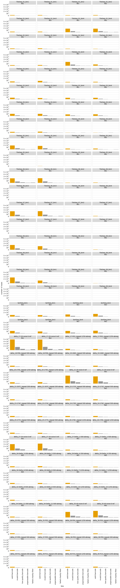

# Aggregate variant counts for all samples
Separate `Snakemake` rules count the observations of each variant in each sample from the Illumina barcode sequencing.
This Python Jupyter notebook aggregates all of this counts, and then adds them to a codon variant table.

## Set up analysis
### Import Python modules.
Use [plotnine](https://plotnine.readthedocs.io/en/stable/) for ggplot2-like plotting.

The analysis relies heavily on the Bloom lab's [dms_variants](https://jbloomlab.github.io/dms_variants) package:


```python
import glob
import itertools
import math
import os
import warnings

import Bio.SeqIO

import dms_variants.codonvarianttable
from dms_variants.constants import CBPALETTE
import dms_variants.utils
import dms_variants.plotnine_themes

from IPython.display import display, HTML

import pandas as pd

from plotnine import *

import yaml
```

Set [plotnine](https://plotnine.readthedocs.io/en/stable/) theme to the gray-grid one defined in `dms_variants`:


```python
theme_set(dms_variants.plotnine_themes.theme_graygrid())
```

Versions of key software:


```python
print(f"Using dms_variants version {dms_variants.__version__}")
```

    Using dms_variants version 0.8.10


Ignore warnings that clutter output:


```python
warnings.simplefilter('ignore')
```

Read the configuration file:


```python
with open('config.yaml') as f:
    config = yaml.safe_load(f)
```

Make output directory if needed:


```python
os.makedirs(config['counts_dir'], exist_ok=True)
```

## Initialize codon variant table
Initialize the [CodonVariantTable](https://jbloomlab.github.io/dms_variants/dms_variants.codonvarianttable.html#dms_variants.codonvarianttable.CodonVariantTable) using the wildtype gene sequence and the CSV file with the table of variants:


```python
wt_seqrecord = Bio.SeqIO.read(config['wildtype_sequence'], 'fasta')
geneseq = str(wt_seqrecord.seq)
primary_target = wt_seqrecord.name
print(f"Read sequence of {len(geneseq)} nt for {primary_target} from {config['wildtype_sequence']}")
      
print(f"Initializing CodonVariantTable from gene sequence and {config['codon_variant_table']}")
      
variants = dms_variants.codonvarianttable.CodonVariantTable(
                geneseq=geneseq,
                barcode_variant_file=config['codon_variant_table'],
                substitutions_are_codon=True,
                substitutions_col='codon_substitutions',
                primary_target=primary_target)
```

    Read sequence of 603 nt for Delta from data/wildtype_sequence.fasta
    Initializing CodonVariantTable from gene sequence and results/variants/codon_variant_table.csv


## Read barcode counts / fates
Read data frame with list of all samples (barcode runs):


```python
print(f"Reading list of barcode runs from {config['barcode_runs']}")

barcode_runs = (pd.read_csv(config['barcode_runs'])
                .assign(sample_lib=lambda x: x['sample'] + '_' + x['library'],
                        counts_file=lambda x: config['counts_dir'] + '/' + x['sample_lib'] + '_counts.csv',
                        fates_file=lambda x: config['counts_dir'] + '/' + x['sample_lib'] + '_fates.csv',
                        )
                .drop(columns='R1')  # don't need this column, and very large
                )

assert all(map(os.path.isfile, barcode_runs['counts_file'])), 'missing some counts files'
assert all(map(os.path.isfile, barcode_runs['fates_file'])), 'missing some fates files'

display(HTML(barcode_runs.to_html(index=False)))
```

    Reading list of barcode runs from data/barcode_runs.csv


<table border="1" class="dataframe">
  <thead>
    <tr style="text-align: right;">
      <th>date</th>
      <th>experiment</th>
      <th>library</th>
      <th>antibody</th>
      <th>concentration</th>
      <th>sort_bin</th>
      <th>HutchBase</th>
      <th>experiment_type</th>
      <th>number_cells</th>
      <th>frac_escape</th>
      <th>sample</th>
      <th>sample_lib</th>
      <th>counts_file</th>
      <th>fates_file</th>
    </tr>
  </thead>
  <tbody>
    <tr>
      <td>210930</td>
      <td>TiteSeq</td>
      <td>lib1</td>
      <td>monomeric_ACE2</td>
      <td>1.0</td>
      <td>1</td>
      <td>210930_s01-b1</td>
      <td>TiteSeq</td>
      <td>1051589.0</td>
      <td>NaN</td>
      <td>TiteSeq_01_bin1</td>
      <td>TiteSeq_01_bin1_lib1</td>
      <td>results/counts/TiteSeq_01_bin1_lib1_counts.csv</td>
      <td>results/counts/TiteSeq_01_bin1_lib1_fates.csv</td>
    </tr>
    <tr>
      <td>210930</td>
      <td>TiteSeq</td>
      <td>lib1</td>
      <td>monomeric_ACE2</td>
      <td>1.0</td>
      <td>2</td>
      <td>210930_s01-b2</td>
      <td>TiteSeq</td>
      <td>624665.0</td>
      <td>NaN</td>
      <td>TiteSeq_01_bin2</td>
      <td>TiteSeq_01_bin2_lib1</td>
      <td>results/counts/TiteSeq_01_bin2_lib1_counts.csv</td>
      <td>results/counts/TiteSeq_01_bin2_lib1_fates.csv</td>
    </tr>
    <tr>
      <td>210930</td>
      <td>TiteSeq</td>
      <td>lib1</td>
      <td>monomeric_ACE2</td>
      <td>1.0</td>
      <td>3</td>
      <td>210930_s01-b3</td>
      <td>TiteSeq</td>
      <td>1279752.0</td>
      <td>NaN</td>
      <td>TiteSeq_01_bin3</td>
      <td>TiteSeq_01_bin3_lib1</td>
      <td>results/counts/TiteSeq_01_bin3_lib1_counts.csv</td>
      <td>results/counts/TiteSeq_01_bin3_lib1_fates.csv</td>
    </tr>
    <tr>
      <td>210930</td>
      <td>TiteSeq</td>
      <td>lib1</td>
      <td>monomeric_ACE2</td>
      <td>1.0</td>
      <td>4</td>
      <td>210930_s01-b4</td>
      <td>TiteSeq</td>
      <td>8085751.0</td>
      <td>NaN</td>
      <td>TiteSeq_01_bin4</td>
      <td>TiteSeq_01_bin4_lib1</td>
      <td>results/counts/TiteSeq_01_bin4_lib1_counts.csv</td>
      <td>results/counts/TiteSeq_01_bin4_lib1_fates.csv</td>
    </tr>
    <tr>
      <td>210930</td>
      <td>TiteSeq</td>
      <td>lib1</td>
      <td>monomeric_ACE2</td>
      <td>2.0</td>
      <td>1</td>
      <td>210930_s02-b1</td>
      <td>TiteSeq</td>
      <td>1295531.0</td>
      <td>NaN</td>
      <td>TiteSeq_02_bin1</td>
      <td>TiteSeq_02_bin1_lib1</td>
      <td>results/counts/TiteSeq_02_bin1_lib1_counts.csv</td>
      <td>results/counts/TiteSeq_02_bin1_lib1_fates.csv</td>
    </tr>
    <tr>
      <td>210930</td>
      <td>TiteSeq</td>
      <td>lib1</td>
      <td>monomeric_ACE2</td>
      <td>2.0</td>
      <td>2</td>
      <td>210930_s02-b2</td>
      <td>TiteSeq</td>
      <td>751800.0</td>
      <td>NaN</td>
      <td>TiteSeq_02_bin2</td>
      <td>TiteSeq_02_bin2_lib1</td>
      <td>results/counts/TiteSeq_02_bin2_lib1_counts.csv</td>
      <td>results/counts/TiteSeq_02_bin2_lib1_fates.csv</td>
    </tr>
    <tr>
      <td>210930</td>
      <td>TiteSeq</td>
      <td>lib1</td>
      <td>monomeric_ACE2</td>
      <td>2.0</td>
      <td>3</td>
      <td>210930_s02-b3</td>
      <td>TiteSeq</td>
      <td>1384388.0</td>
      <td>NaN</td>
      <td>TiteSeq_02_bin3</td>
      <td>TiteSeq_02_bin3_lib1</td>
      <td>results/counts/TiteSeq_02_bin3_lib1_counts.csv</td>
      <td>results/counts/TiteSeq_02_bin3_lib1_fates.csv</td>
    </tr>
    <tr>
      <td>210930</td>
      <td>TiteSeq</td>
      <td>lib1</td>
      <td>monomeric_ACE2</td>
      <td>2.0</td>
      <td>4</td>
      <td>210930_s02-b4</td>
      <td>TiteSeq</td>
      <td>7525560.0</td>
      <td>NaN</td>
      <td>TiteSeq_02_bin4</td>
      <td>TiteSeq_02_bin4_lib1</td>
      <td>results/counts/TiteSeq_02_bin4_lib1_counts.csv</td>
      <td>results/counts/TiteSeq_02_bin4_lib1_fates.csv</td>
    </tr>
    <tr>
      <td>210930</td>
      <td>TiteSeq</td>
      <td>lib1</td>
      <td>monomeric_ACE2</td>
      <td>3.0</td>
      <td>1</td>
      <td>210930_s03-b1</td>
      <td>TiteSeq</td>
      <td>1907453.0</td>
      <td>NaN</td>
      <td>TiteSeq_03_bin1</td>
      <td>TiteSeq_03_bin1_lib1</td>
      <td>results/counts/TiteSeq_03_bin1_lib1_counts.csv</td>
      <td>results/counts/TiteSeq_03_bin1_lib1_fates.csv</td>
    </tr>
    <tr>
      <td>210930</td>
      <td>TiteSeq</td>
      <td>lib1</td>
      <td>monomeric_ACE2</td>
      <td>3.0</td>
      <td>2</td>
      <td>210930_s03-b2</td>
      <td>TiteSeq</td>
      <td>1014961.0</td>
      <td>NaN</td>
      <td>TiteSeq_03_bin2</td>
      <td>TiteSeq_03_bin2_lib1</td>
      <td>results/counts/TiteSeq_03_bin2_lib1_counts.csv</td>
      <td>results/counts/TiteSeq_03_bin2_lib1_fates.csv</td>
    </tr>
    <tr>
      <td>210930</td>
      <td>TiteSeq</td>
      <td>lib1</td>
      <td>monomeric_ACE2</td>
      <td>3.0</td>
      <td>3</td>
      <td>210930_s03-b3</td>
      <td>TiteSeq</td>
      <td>2828799.0</td>
      <td>NaN</td>
      <td>TiteSeq_03_bin3</td>
      <td>TiteSeq_03_bin3_lib1</td>
      <td>results/counts/TiteSeq_03_bin3_lib1_counts.csv</td>
      <td>results/counts/TiteSeq_03_bin3_lib1_fates.csv</td>
    </tr>
    <tr>
      <td>210930</td>
      <td>TiteSeq</td>
      <td>lib1</td>
      <td>monomeric_ACE2</td>
      <td>3.0</td>
      <td>4</td>
      <td>210930_s03-b4</td>
      <td>TiteSeq</td>
      <td>5160695.0</td>
      <td>NaN</td>
      <td>TiteSeq_03_bin4</td>
      <td>TiteSeq_03_bin4_lib1</td>
      <td>results/counts/TiteSeq_03_bin4_lib1_counts.csv</td>
      <td>results/counts/TiteSeq_03_bin4_lib1_fates.csv</td>
    </tr>
    <tr>
      <td>210930</td>
      <td>TiteSeq</td>
      <td>lib1</td>
      <td>monomeric_ACE2</td>
      <td>4.0</td>
      <td>1</td>
      <td>210930_s04-b1</td>
      <td>TiteSeq</td>
      <td>3974523.0</td>
      <td>NaN</td>
      <td>TiteSeq_04_bin1</td>
      <td>TiteSeq_04_bin1_lib1</td>
      <td>results/counts/TiteSeq_04_bin1_lib1_counts.csv</td>
      <td>results/counts/TiteSeq_04_bin1_lib1_fates.csv</td>
    </tr>
    <tr>
      <td>210930</td>
      <td>TiteSeq</td>
      <td>lib1</td>
      <td>monomeric_ACE2</td>
      <td>4.0</td>
      <td>2</td>
      <td>210930_s04-b2</td>
      <td>TiteSeq</td>
      <td>5063344.0</td>
      <td>NaN</td>
      <td>TiteSeq_04_bin2</td>
      <td>TiteSeq_04_bin2_lib1</td>
      <td>results/counts/TiteSeq_04_bin2_lib1_counts.csv</td>
      <td>results/counts/TiteSeq_04_bin2_lib1_fates.csv</td>
    </tr>
    <tr>
      <td>210930</td>
      <td>TiteSeq</td>
      <td>lib1</td>
      <td>monomeric_ACE2</td>
      <td>4.0</td>
      <td>3</td>
      <td>210930_s04-b3</td>
      <td>TiteSeq</td>
      <td>2535131.0</td>
      <td>NaN</td>
      <td>TiteSeq_04_bin3</td>
      <td>TiteSeq_04_bin3_lib1</td>
      <td>results/counts/TiteSeq_04_bin3_lib1_counts.csv</td>
      <td>results/counts/TiteSeq_04_bin3_lib1_fates.csv</td>
    </tr>
    <tr>
      <td>210930</td>
      <td>TiteSeq</td>
      <td>lib1</td>
      <td>monomeric_ACE2</td>
      <td>4.0</td>
      <td>4</td>
      <td>210930_s04-b4</td>
      <td>TiteSeq</td>
      <td>21217.0</td>
      <td>NaN</td>
      <td>TiteSeq_04_bin4</td>
      <td>TiteSeq_04_bin4_lib1</td>
      <td>results/counts/TiteSeq_04_bin4_lib1_counts.csv</td>
      <td>results/counts/TiteSeq_04_bin4_lib1_fates.csv</td>
    </tr>
    <tr>
      <td>210930</td>
      <td>TiteSeq</td>
      <td>lib1</td>
      <td>monomeric_ACE2</td>
      <td>5.0</td>
      <td>1</td>
      <td>210930_s05-b1</td>
      <td>TiteSeq</td>
      <td>8755411.0</td>
      <td>NaN</td>
      <td>TiteSeq_05_bin1</td>
      <td>TiteSeq_05_bin1_lib1</td>
      <td>results/counts/TiteSeq_05_bin1_lib1_counts.csv</td>
      <td>results/counts/TiteSeq_05_bin1_lib1_fates.csv</td>
    </tr>
    <tr>
      <td>210930</td>
      <td>TiteSeq</td>
      <td>lib1</td>
      <td>monomeric_ACE2</td>
      <td>5.0</td>
      <td>2</td>
      <td>210930_s05-b2</td>
      <td>TiteSeq</td>
      <td>1388715.0</td>
      <td>NaN</td>
      <td>TiteSeq_05_bin2</td>
      <td>TiteSeq_05_bin2_lib1</td>
      <td>results/counts/TiteSeq_05_bin2_lib1_counts.csv</td>
      <td>results/counts/TiteSeq_05_bin2_lib1_fates.csv</td>
    </tr>
    <tr>
      <td>210930</td>
      <td>TiteSeq</td>
      <td>lib1</td>
      <td>monomeric_ACE2</td>
      <td>5.0</td>
      <td>3</td>
      <td>210930_s05-b3</td>
      <td>TiteSeq</td>
      <td>15062.0</td>
      <td>NaN</td>
      <td>TiteSeq_05_bin3</td>
      <td>TiteSeq_05_bin3_lib1</td>
      <td>results/counts/TiteSeq_05_bin3_lib1_counts.csv</td>
      <td>results/counts/TiteSeq_05_bin3_lib1_fates.csv</td>
    </tr>
    <tr>
      <td>210930</td>
      <td>TiteSeq</td>
      <td>lib1</td>
      <td>monomeric_ACE2</td>
      <td>5.0</td>
      <td>4</td>
      <td>210930_s05-b4</td>
      <td>TiteSeq</td>
      <td>1177.0</td>
      <td>NaN</td>
      <td>TiteSeq_05_bin4</td>
      <td>TiteSeq_05_bin4_lib1</td>
      <td>results/counts/TiteSeq_05_bin4_lib1_counts.csv</td>
      <td>results/counts/TiteSeq_05_bin4_lib1_fates.csv</td>
    </tr>
    <tr>
      <td>210930</td>
      <td>TiteSeq</td>
      <td>lib1</td>
      <td>monomeric_ACE2</td>
      <td>6.0</td>
      <td>1</td>
      <td>210930_s06-b1</td>
      <td>TiteSeq</td>
      <td>10867246.0</td>
      <td>NaN</td>
      <td>TiteSeq_06_bin1</td>
      <td>TiteSeq_06_bin1_lib1</td>
      <td>results/counts/TiteSeq_06_bin1_lib1_counts.csv</td>
      <td>results/counts/TiteSeq_06_bin1_lib1_fates.csv</td>
    </tr>
    <tr>
      <td>210930</td>
      <td>TiteSeq</td>
      <td>lib1</td>
      <td>monomeric_ACE2</td>
      <td>6.0</td>
      <td>2</td>
      <td>210930_s06-b2</td>
      <td>TiteSeq</td>
      <td>361944.0</td>
      <td>NaN</td>
      <td>TiteSeq_06_bin2</td>
      <td>TiteSeq_06_bin2_lib1</td>
      <td>results/counts/TiteSeq_06_bin2_lib1_counts.csv</td>
      <td>results/counts/TiteSeq_06_bin2_lib1_fates.csv</td>
    </tr>
    <tr>
      <td>210930</td>
      <td>TiteSeq</td>
      <td>lib1</td>
      <td>monomeric_ACE2</td>
      <td>6.0</td>
      <td>3</td>
      <td>210930_s06-b3</td>
      <td>TiteSeq</td>
      <td>2821.0</td>
      <td>NaN</td>
      <td>TiteSeq_06_bin3</td>
      <td>TiteSeq_06_bin3_lib1</td>
      <td>results/counts/TiteSeq_06_bin3_lib1_counts.csv</td>
      <td>results/counts/TiteSeq_06_bin3_lib1_fates.csv</td>
    </tr>
    <tr>
      <td>210930</td>
      <td>TiteSeq</td>
      <td>lib1</td>
      <td>monomeric_ACE2</td>
      <td>6.0</td>
      <td>4</td>
      <td>210930_s06-b4</td>
      <td>TiteSeq</td>
      <td>420.0</td>
      <td>NaN</td>
      <td>TiteSeq_06_bin4</td>
      <td>TiteSeq_06_bin4_lib1</td>
      <td>results/counts/TiteSeq_06_bin4_lib1_counts.csv</td>
      <td>results/counts/TiteSeq_06_bin4_lib1_fates.csv</td>
    </tr>
    <tr>
      <td>210930</td>
      <td>TiteSeq</td>
      <td>lib1</td>
      <td>monomeric_ACE2</td>
      <td>7.0</td>
      <td>1</td>
      <td>210930_s07-b1</td>
      <td>TiteSeq</td>
      <td>10674416.0</td>
      <td>NaN</td>
      <td>TiteSeq_07_bin1</td>
      <td>TiteSeq_07_bin1_lib1</td>
      <td>results/counts/TiteSeq_07_bin1_lib1_counts.csv</td>
      <td>results/counts/TiteSeq_07_bin1_lib1_fates.csv</td>
    </tr>
    <tr>
      <td>210930</td>
      <td>TiteSeq</td>
      <td>lib1</td>
      <td>monomeric_ACE2</td>
      <td>7.0</td>
      <td>2</td>
      <td>210930_s07-b2</td>
      <td>TiteSeq</td>
      <td>317920.0</td>
      <td>NaN</td>
      <td>TiteSeq_07_bin2</td>
      <td>TiteSeq_07_bin2_lib1</td>
      <td>results/counts/TiteSeq_07_bin2_lib1_counts.csv</td>
      <td>results/counts/TiteSeq_07_bin2_lib1_fates.csv</td>
    </tr>
    <tr>
      <td>210930</td>
      <td>TiteSeq</td>
      <td>lib1</td>
      <td>monomeric_ACE2</td>
      <td>7.0</td>
      <td>3</td>
      <td>210930_s07-b3</td>
      <td>TiteSeq</td>
      <td>1751.0</td>
      <td>NaN</td>
      <td>TiteSeq_07_bin3</td>
      <td>TiteSeq_07_bin3_lib1</td>
      <td>results/counts/TiteSeq_07_bin3_lib1_counts.csv</td>
      <td>results/counts/TiteSeq_07_bin3_lib1_fates.csv</td>
    </tr>
    <tr>
      <td>210930</td>
      <td>TiteSeq</td>
      <td>lib1</td>
      <td>monomeric_ACE2</td>
      <td>7.0</td>
      <td>4</td>
      <td>210930_s07-b4</td>
      <td>TiteSeq</td>
      <td>379.0</td>
      <td>NaN</td>
      <td>TiteSeq_07_bin4</td>
      <td>TiteSeq_07_bin4_lib1</td>
      <td>results/counts/TiteSeq_07_bin4_lib1_counts.csv</td>
      <td>results/counts/TiteSeq_07_bin4_lib1_fates.csv</td>
    </tr>
    <tr>
      <td>210930</td>
      <td>TiteSeq</td>
      <td>lib1</td>
      <td>monomeric_ACE2</td>
      <td>8.0</td>
      <td>1</td>
      <td>210930_s08-b1</td>
      <td>TiteSeq</td>
      <td>10498611.0</td>
      <td>NaN</td>
      <td>TiteSeq_08_bin1</td>
      <td>TiteSeq_08_bin1_lib1</td>
      <td>results/counts/TiteSeq_08_bin1_lib1_counts.csv</td>
      <td>results/counts/TiteSeq_08_bin1_lib1_fates.csv</td>
    </tr>
    <tr>
      <td>210930</td>
      <td>TiteSeq</td>
      <td>lib1</td>
      <td>monomeric_ACE2</td>
      <td>8.0</td>
      <td>2</td>
      <td>210930_s08-b2</td>
      <td>TiteSeq</td>
      <td>273334.0</td>
      <td>NaN</td>
      <td>TiteSeq_08_bin2</td>
      <td>TiteSeq_08_bin2_lib1</td>
      <td>results/counts/TiteSeq_08_bin2_lib1_counts.csv</td>
      <td>results/counts/TiteSeq_08_bin2_lib1_fates.csv</td>
    </tr>
    <tr>
      <td>210930</td>
      <td>TiteSeq</td>
      <td>lib1</td>
      <td>monomeric_ACE2</td>
      <td>8.0</td>
      <td>3</td>
      <td>210930_s08-b3</td>
      <td>TiteSeq</td>
      <td>1358.0</td>
      <td>NaN</td>
      <td>TiteSeq_08_bin3</td>
      <td>TiteSeq_08_bin3_lib1</td>
      <td>results/counts/TiteSeq_08_bin3_lib1_counts.csv</td>
      <td>results/counts/TiteSeq_08_bin3_lib1_fates.csv</td>
    </tr>
    <tr>
      <td>210930</td>
      <td>TiteSeq</td>
      <td>lib1</td>
      <td>monomeric_ACE2</td>
      <td>8.0</td>
      <td>4</td>
      <td>210930_s08-b4</td>
      <td>TiteSeq</td>
      <td>326.0</td>
      <td>NaN</td>
      <td>TiteSeq_08_bin4</td>
      <td>TiteSeq_08_bin4_lib1</td>
      <td>results/counts/TiteSeq_08_bin4_lib1_counts.csv</td>
      <td>results/counts/TiteSeq_08_bin4_lib1_fates.csv</td>
    </tr>
    <tr>
      <td>210930</td>
      <td>TiteSeq</td>
      <td>lib1</td>
      <td>monomeric_ACE2</td>
      <td>9.0</td>
      <td>1</td>
      <td>210930_s09-b1</td>
      <td>TiteSeq</td>
      <td>10330150.0</td>
      <td>NaN</td>
      <td>TiteSeq_09_bin1</td>
      <td>TiteSeq_09_bin1_lib1</td>
      <td>results/counts/TiteSeq_09_bin1_lib1_counts.csv</td>
      <td>results/counts/TiteSeq_09_bin1_lib1_fates.csv</td>
    </tr>
    <tr>
      <td>210930</td>
      <td>TiteSeq</td>
      <td>lib1</td>
      <td>monomeric_ACE2</td>
      <td>9.0</td>
      <td>2</td>
      <td>210930_s09-b2</td>
      <td>TiteSeq</td>
      <td>230095.0</td>
      <td>NaN</td>
      <td>TiteSeq_09_bin2</td>
      <td>TiteSeq_09_bin2_lib1</td>
      <td>results/counts/TiteSeq_09_bin2_lib1_counts.csv</td>
      <td>results/counts/TiteSeq_09_bin2_lib1_fates.csv</td>
    </tr>
    <tr>
      <td>210930</td>
      <td>TiteSeq</td>
      <td>lib1</td>
      <td>monomeric_ACE2</td>
      <td>9.0</td>
      <td>3</td>
      <td>210930_s09-b3</td>
      <td>TiteSeq</td>
      <td>1127.0</td>
      <td>NaN</td>
      <td>TiteSeq_09_bin3</td>
      <td>TiteSeq_09_bin3_lib1</td>
      <td>results/counts/TiteSeq_09_bin3_lib1_counts.csv</td>
      <td>results/counts/TiteSeq_09_bin3_lib1_fates.csv</td>
    </tr>
    <tr>
      <td>210930</td>
      <td>TiteSeq</td>
      <td>lib1</td>
      <td>monomeric_ACE2</td>
      <td>9.0</td>
      <td>4</td>
      <td>210930_s09-b4</td>
      <td>TiteSeq</td>
      <td>306.0</td>
      <td>NaN</td>
      <td>TiteSeq_09_bin4</td>
      <td>TiteSeq_09_bin4_lib1</td>
      <td>results/counts/TiteSeq_09_bin4_lib1_counts.csv</td>
      <td>results/counts/TiteSeq_09_bin4_lib1_fates.csv</td>
    </tr>
    <tr>
      <td>210930</td>
      <td>TiteSeq</td>
      <td>lib2</td>
      <td>monomeric_ACE2</td>
      <td>1.0</td>
      <td>1</td>
      <td>211004_s10-b1</td>
      <td>TiteSeq</td>
      <td>1489987.0</td>
      <td>NaN</td>
      <td>TiteSeq_01_bin1</td>
      <td>TiteSeq_01_bin1_lib2</td>
      <td>results/counts/TiteSeq_01_bin1_lib2_counts.csv</td>
      <td>results/counts/TiteSeq_01_bin1_lib2_fates.csv</td>
    </tr>
    <tr>
      <td>210930</td>
      <td>TiteSeq</td>
      <td>lib2</td>
      <td>monomeric_ACE2</td>
      <td>1.0</td>
      <td>2</td>
      <td>211004_s10-b2</td>
      <td>TiteSeq</td>
      <td>1041294.0</td>
      <td>NaN</td>
      <td>TiteSeq_01_bin2</td>
      <td>TiteSeq_01_bin2_lib2</td>
      <td>results/counts/TiteSeq_01_bin2_lib2_counts.csv</td>
      <td>results/counts/TiteSeq_01_bin2_lib2_fates.csv</td>
    </tr>
    <tr>
      <td>210930</td>
      <td>TiteSeq</td>
      <td>lib2</td>
      <td>monomeric_ACE2</td>
      <td>1.0</td>
      <td>3</td>
      <td>211004_s10-b3</td>
      <td>TiteSeq</td>
      <td>1440735.0</td>
      <td>NaN</td>
      <td>TiteSeq_01_bin3</td>
      <td>TiteSeq_01_bin3_lib2</td>
      <td>results/counts/TiteSeq_01_bin3_lib2_counts.csv</td>
      <td>results/counts/TiteSeq_01_bin3_lib2_fates.csv</td>
    </tr>
    <tr>
      <td>210930</td>
      <td>TiteSeq</td>
      <td>lib2</td>
      <td>monomeric_ACE2</td>
      <td>1.0</td>
      <td>4</td>
      <td>211004_s10-b4</td>
      <td>TiteSeq</td>
      <td>6805287.0</td>
      <td>NaN</td>
      <td>TiteSeq_01_bin4</td>
      <td>TiteSeq_01_bin4_lib2</td>
      <td>results/counts/TiteSeq_01_bin4_lib2_counts.csv</td>
      <td>results/counts/TiteSeq_01_bin4_lib2_fates.csv</td>
    </tr>
    <tr>
      <td>210930</td>
      <td>TiteSeq</td>
      <td>lib2</td>
      <td>monomeric_ACE2</td>
      <td>2.0</td>
      <td>1</td>
      <td>211004_s11-b1</td>
      <td>TiteSeq</td>
      <td>1503469.0</td>
      <td>NaN</td>
      <td>TiteSeq_02_bin1</td>
      <td>TiteSeq_02_bin1_lib2</td>
      <td>results/counts/TiteSeq_02_bin1_lib2_counts.csv</td>
      <td>results/counts/TiteSeq_02_bin1_lib2_fates.csv</td>
    </tr>
    <tr>
      <td>210930</td>
      <td>TiteSeq</td>
      <td>lib2</td>
      <td>monomeric_ACE2</td>
      <td>2.0</td>
      <td>2</td>
      <td>211004_s11-b2</td>
      <td>TiteSeq</td>
      <td>1195636.0</td>
      <td>NaN</td>
      <td>TiteSeq_02_bin2</td>
      <td>TiteSeq_02_bin2_lib2</td>
      <td>results/counts/TiteSeq_02_bin2_lib2_counts.csv</td>
      <td>results/counts/TiteSeq_02_bin2_lib2_fates.csv</td>
    </tr>
    <tr>
      <td>210930</td>
      <td>TiteSeq</td>
      <td>lib2</td>
      <td>monomeric_ACE2</td>
      <td>2.0</td>
      <td>3</td>
      <td>211004_s11-b3</td>
      <td>TiteSeq</td>
      <td>1369891.0</td>
      <td>NaN</td>
      <td>TiteSeq_02_bin3</td>
      <td>TiteSeq_02_bin3_lib2</td>
      <td>results/counts/TiteSeq_02_bin3_lib2_counts.csv</td>
      <td>results/counts/TiteSeq_02_bin3_lib2_fates.csv</td>
    </tr>
    <tr>
      <td>210930</td>
      <td>TiteSeq</td>
      <td>lib2</td>
      <td>monomeric_ACE2</td>
      <td>2.0</td>
      <td>4</td>
      <td>211004_s11-b4</td>
      <td>TiteSeq</td>
      <td>6199468.0</td>
      <td>NaN</td>
      <td>TiteSeq_02_bin4</td>
      <td>TiteSeq_02_bin4_lib2</td>
      <td>results/counts/TiteSeq_02_bin4_lib2_counts.csv</td>
      <td>results/counts/TiteSeq_02_bin4_lib2_fates.csv</td>
    </tr>
    <tr>
      <td>210930</td>
      <td>TiteSeq</td>
      <td>lib2</td>
      <td>monomeric_ACE2</td>
      <td>3.0</td>
      <td>1</td>
      <td>211004_s12-b1</td>
      <td>TiteSeq</td>
      <td>2516347.0</td>
      <td>NaN</td>
      <td>TiteSeq_03_bin1</td>
      <td>TiteSeq_03_bin1_lib2</td>
      <td>results/counts/TiteSeq_03_bin1_lib2_counts.csv</td>
      <td>results/counts/TiteSeq_03_bin1_lib2_fates.csv</td>
    </tr>
    <tr>
      <td>210930</td>
      <td>TiteSeq</td>
      <td>lib2</td>
      <td>monomeric_ACE2</td>
      <td>3.0</td>
      <td>2</td>
      <td>211004_s12-b2</td>
      <td>TiteSeq</td>
      <td>1563793.0</td>
      <td>NaN</td>
      <td>TiteSeq_03_bin2</td>
      <td>TiteSeq_03_bin2_lib2</td>
      <td>results/counts/TiteSeq_03_bin2_lib2_counts.csv</td>
      <td>results/counts/TiteSeq_03_bin2_lib2_fates.csv</td>
    </tr>
    <tr>
      <td>210930</td>
      <td>TiteSeq</td>
      <td>lib2</td>
      <td>monomeric_ACE2</td>
      <td>3.0</td>
      <td>3</td>
      <td>211004_s12-b3</td>
      <td>TiteSeq</td>
      <td>2866509.0</td>
      <td>NaN</td>
      <td>TiteSeq_03_bin3</td>
      <td>TiteSeq_03_bin3_lib2</td>
      <td>results/counts/TiteSeq_03_bin3_lib2_counts.csv</td>
      <td>results/counts/TiteSeq_03_bin3_lib2_fates.csv</td>
    </tr>
    <tr>
      <td>210930</td>
      <td>TiteSeq</td>
      <td>lib2</td>
      <td>monomeric_ACE2</td>
      <td>3.0</td>
      <td>4</td>
      <td>211004_s12-b4</td>
      <td>TiteSeq</td>
      <td>3348279.0</td>
      <td>NaN</td>
      <td>TiteSeq_03_bin4</td>
      <td>TiteSeq_03_bin4_lib2</td>
      <td>results/counts/TiteSeq_03_bin4_lib2_counts.csv</td>
      <td>results/counts/TiteSeq_03_bin4_lib2_fates.csv</td>
    </tr>
    <tr>
      <td>210930</td>
      <td>TiteSeq</td>
      <td>lib2</td>
      <td>monomeric_ACE2</td>
      <td>4.0</td>
      <td>1</td>
      <td>211004_s13-b1</td>
      <td>TiteSeq</td>
      <td>3995432.0</td>
      <td>NaN</td>
      <td>TiteSeq_04_bin1</td>
      <td>TiteSeq_04_bin1_lib2</td>
      <td>results/counts/TiteSeq_04_bin1_lib2_counts.csv</td>
      <td>results/counts/TiteSeq_04_bin1_lib2_fates.csv</td>
    </tr>
    <tr>
      <td>210930</td>
      <td>TiteSeq</td>
      <td>lib2</td>
      <td>monomeric_ACE2</td>
      <td>4.0</td>
      <td>2</td>
      <td>211004_s13-b2</td>
      <td>TiteSeq</td>
      <td>3771838.0</td>
      <td>NaN</td>
      <td>TiteSeq_04_bin2</td>
      <td>TiteSeq_04_bin2_lib2</td>
      <td>results/counts/TiteSeq_04_bin2_lib2_counts.csv</td>
      <td>results/counts/TiteSeq_04_bin2_lib2_fates.csv</td>
    </tr>
    <tr>
      <td>210930</td>
      <td>TiteSeq</td>
      <td>lib2</td>
      <td>monomeric_ACE2</td>
      <td>4.0</td>
      <td>3</td>
      <td>211004_s13-b3</td>
      <td>TiteSeq</td>
      <td>2599381.0</td>
      <td>NaN</td>
      <td>TiteSeq_04_bin3</td>
      <td>TiteSeq_04_bin3_lib2</td>
      <td>results/counts/TiteSeq_04_bin3_lib2_counts.csv</td>
      <td>results/counts/TiteSeq_04_bin3_lib2_fates.csv</td>
    </tr>
    <tr>
      <td>210930</td>
      <td>TiteSeq</td>
      <td>lib2</td>
      <td>monomeric_ACE2</td>
      <td>4.0</td>
      <td>4</td>
      <td>211004_s13-b4</td>
      <td>TiteSeq</td>
      <td>21124.0</td>
      <td>NaN</td>
      <td>TiteSeq_04_bin4</td>
      <td>TiteSeq_04_bin4_lib2</td>
      <td>results/counts/TiteSeq_04_bin4_lib2_counts.csv</td>
      <td>results/counts/TiteSeq_04_bin4_lib2_fates.csv</td>
    </tr>
    <tr>
      <td>210930</td>
      <td>TiteSeq</td>
      <td>lib2</td>
      <td>monomeric_ACE2</td>
      <td>5.0</td>
      <td>1</td>
      <td>211004_s14-b1</td>
      <td>TiteSeq</td>
      <td>8309153.0</td>
      <td>NaN</td>
      <td>TiteSeq_05_bin1</td>
      <td>TiteSeq_05_bin1_lib2</td>
      <td>results/counts/TiteSeq_05_bin1_lib2_counts.csv</td>
      <td>results/counts/TiteSeq_05_bin1_lib2_fates.csv</td>
    </tr>
    <tr>
      <td>210930</td>
      <td>TiteSeq</td>
      <td>lib2</td>
      <td>monomeric_ACE2</td>
      <td>5.0</td>
      <td>2</td>
      <td>211004_s14-b2</td>
      <td>TiteSeq</td>
      <td>1832983.0</td>
      <td>NaN</td>
      <td>TiteSeq_05_bin2</td>
      <td>TiteSeq_05_bin2_lib2</td>
      <td>results/counts/TiteSeq_05_bin2_lib2_counts.csv</td>
      <td>results/counts/TiteSeq_05_bin2_lib2_fates.csv</td>
    </tr>
    <tr>
      <td>210930</td>
      <td>TiteSeq</td>
      <td>lib2</td>
      <td>monomeric_ACE2</td>
      <td>5.0</td>
      <td>3</td>
      <td>211004_s14-b3</td>
      <td>TiteSeq</td>
      <td>13763.0</td>
      <td>NaN</td>
      <td>TiteSeq_05_bin3</td>
      <td>TiteSeq_05_bin3_lib2</td>
      <td>results/counts/TiteSeq_05_bin3_lib2_counts.csv</td>
      <td>results/counts/TiteSeq_05_bin3_lib2_fates.csv</td>
    </tr>
    <tr>
      <td>210930</td>
      <td>TiteSeq</td>
      <td>lib2</td>
      <td>monomeric_ACE2</td>
      <td>5.0</td>
      <td>4</td>
      <td>211004_s14-b4</td>
      <td>TiteSeq</td>
      <td>1139.0</td>
      <td>NaN</td>
      <td>TiteSeq_05_bin4</td>
      <td>TiteSeq_05_bin4_lib2</td>
      <td>results/counts/TiteSeq_05_bin4_lib2_counts.csv</td>
      <td>results/counts/TiteSeq_05_bin4_lib2_fates.csv</td>
    </tr>
    <tr>
      <td>210930</td>
      <td>TiteSeq</td>
      <td>lib2</td>
      <td>monomeric_ACE2</td>
      <td>6.0</td>
      <td>1</td>
      <td>211004_s15-b1</td>
      <td>TiteSeq</td>
      <td>9251911.0</td>
      <td>NaN</td>
      <td>TiteSeq_06_bin1</td>
      <td>TiteSeq_06_bin1_lib2</td>
      <td>results/counts/TiteSeq_06_bin1_lib2_counts.csv</td>
      <td>results/counts/TiteSeq_06_bin1_lib2_fates.csv</td>
    </tr>
    <tr>
      <td>210930</td>
      <td>TiteSeq</td>
      <td>lib2</td>
      <td>monomeric_ACE2</td>
      <td>6.0</td>
      <td>2</td>
      <td>211004_s15-b2</td>
      <td>TiteSeq</td>
      <td>877051.0</td>
      <td>NaN</td>
      <td>TiteSeq_06_bin2</td>
      <td>TiteSeq_06_bin2_lib2</td>
      <td>results/counts/TiteSeq_06_bin2_lib2_counts.csv</td>
      <td>results/counts/TiteSeq_06_bin2_lib2_fates.csv</td>
    </tr>
    <tr>
      <td>210930</td>
      <td>TiteSeq</td>
      <td>lib2</td>
      <td>monomeric_ACE2</td>
      <td>6.0</td>
      <td>3</td>
      <td>211004_s15-b3</td>
      <td>TiteSeq</td>
      <td>1314.0</td>
      <td>NaN</td>
      <td>TiteSeq_06_bin3</td>
      <td>TiteSeq_06_bin3_lib2</td>
      <td>results/counts/TiteSeq_06_bin3_lib2_counts.csv</td>
      <td>results/counts/TiteSeq_06_bin3_lib2_fates.csv</td>
    </tr>
    <tr>
      <td>210930</td>
      <td>TiteSeq</td>
      <td>lib2</td>
      <td>monomeric_ACE2</td>
      <td>6.0</td>
      <td>4</td>
      <td>211004_s15-b4</td>
      <td>TiteSeq</td>
      <td>521.0</td>
      <td>NaN</td>
      <td>TiteSeq_06_bin4</td>
      <td>TiteSeq_06_bin4_lib2</td>
      <td>results/counts/TiteSeq_06_bin4_lib2_counts.csv</td>
      <td>results/counts/TiteSeq_06_bin4_lib2_fates.csv</td>
    </tr>
    <tr>
      <td>210930</td>
      <td>TiteSeq</td>
      <td>lib2</td>
      <td>monomeric_ACE2</td>
      <td>7.0</td>
      <td>1</td>
      <td>211004_s16-b1</td>
      <td>TiteSeq</td>
      <td>9666170.0</td>
      <td>NaN</td>
      <td>TiteSeq_07_bin1</td>
      <td>TiteSeq_07_bin1_lib2</td>
      <td>results/counts/TiteSeq_07_bin1_lib2_counts.csv</td>
      <td>results/counts/TiteSeq_07_bin1_lib2_fates.csv</td>
    </tr>
    <tr>
      <td>210930</td>
      <td>TiteSeq</td>
      <td>lib2</td>
      <td>monomeric_ACE2</td>
      <td>7.0</td>
      <td>2</td>
      <td>211004_s16-b2</td>
      <td>TiteSeq</td>
      <td>751446.0</td>
      <td>NaN</td>
      <td>TiteSeq_07_bin2</td>
      <td>TiteSeq_07_bin2_lib2</td>
      <td>results/counts/TiteSeq_07_bin2_lib2_counts.csv</td>
      <td>results/counts/TiteSeq_07_bin2_lib2_fates.csv</td>
    </tr>
    <tr>
      <td>210930</td>
      <td>TiteSeq</td>
      <td>lib2</td>
      <td>monomeric_ACE2</td>
      <td>7.0</td>
      <td>3</td>
      <td>211004_s16-b3</td>
      <td>TiteSeq</td>
      <td>502.0</td>
      <td>NaN</td>
      <td>TiteSeq_07_bin3</td>
      <td>TiteSeq_07_bin3_lib2</td>
      <td>results/counts/TiteSeq_07_bin3_lib2_counts.csv</td>
      <td>results/counts/TiteSeq_07_bin3_lib2_fates.csv</td>
    </tr>
    <tr>
      <td>210930</td>
      <td>TiteSeq</td>
      <td>lib2</td>
      <td>monomeric_ACE2</td>
      <td>7.0</td>
      <td>4</td>
      <td>211004_s16-b4</td>
      <td>TiteSeq</td>
      <td>461.0</td>
      <td>NaN</td>
      <td>TiteSeq_07_bin4</td>
      <td>TiteSeq_07_bin4_lib2</td>
      <td>results/counts/TiteSeq_07_bin4_lib2_counts.csv</td>
      <td>results/counts/TiteSeq_07_bin4_lib2_fates.csv</td>
    </tr>
    <tr>
      <td>210930</td>
      <td>TiteSeq</td>
      <td>lib2</td>
      <td>monomeric_ACE2</td>
      <td>8.0</td>
      <td>1</td>
      <td>211004_s17-b1</td>
      <td>TiteSeq</td>
      <td>9585938.0</td>
      <td>NaN</td>
      <td>TiteSeq_08_bin1</td>
      <td>TiteSeq_08_bin1_lib2</td>
      <td>results/counts/TiteSeq_08_bin1_lib2_counts.csv</td>
      <td>results/counts/TiteSeq_08_bin1_lib2_fates.csv</td>
    </tr>
    <tr>
      <td>210930</td>
      <td>TiteSeq</td>
      <td>lib2</td>
      <td>monomeric_ACE2</td>
      <td>8.0</td>
      <td>2</td>
      <td>211004_s17-b2</td>
      <td>TiteSeq</td>
      <td>597086.0</td>
      <td>NaN</td>
      <td>TiteSeq_08_bin2</td>
      <td>TiteSeq_08_bin2_lib2</td>
      <td>results/counts/TiteSeq_08_bin2_lib2_counts.csv</td>
      <td>results/counts/TiteSeq_08_bin2_lib2_fates.csv</td>
    </tr>
    <tr>
      <td>210930</td>
      <td>TiteSeq</td>
      <td>lib2</td>
      <td>monomeric_ACE2</td>
      <td>8.0</td>
      <td>3</td>
      <td>211004_s17-b3</td>
      <td>TiteSeq</td>
      <td>450.0</td>
      <td>NaN</td>
      <td>TiteSeq_08_bin3</td>
      <td>TiteSeq_08_bin3_lib2</td>
      <td>results/counts/TiteSeq_08_bin3_lib2_counts.csv</td>
      <td>results/counts/TiteSeq_08_bin3_lib2_fates.csv</td>
    </tr>
    <tr>
      <td>210930</td>
      <td>TiteSeq</td>
      <td>lib2</td>
      <td>monomeric_ACE2</td>
      <td>8.0</td>
      <td>4</td>
      <td>211004_s17-b4</td>
      <td>TiteSeq</td>
      <td>446.0</td>
      <td>NaN</td>
      <td>TiteSeq_08_bin4</td>
      <td>TiteSeq_08_bin4_lib2</td>
      <td>results/counts/TiteSeq_08_bin4_lib2_counts.csv</td>
      <td>results/counts/TiteSeq_08_bin4_lib2_fates.csv</td>
    </tr>
    <tr>
      <td>210930</td>
      <td>TiteSeq</td>
      <td>lib2</td>
      <td>monomeric_ACE2</td>
      <td>9.0</td>
      <td>1</td>
      <td>211004_s18-b1</td>
      <td>TiteSeq</td>
      <td>9781236.0</td>
      <td>NaN</td>
      <td>TiteSeq_09_bin1</td>
      <td>TiteSeq_09_bin1_lib2</td>
      <td>results/counts/TiteSeq_09_bin1_lib2_counts.csv</td>
      <td>results/counts/TiteSeq_09_bin1_lib2_fates.csv</td>
    </tr>
    <tr>
      <td>210930</td>
      <td>TiteSeq</td>
      <td>lib2</td>
      <td>monomeric_ACE2</td>
      <td>9.0</td>
      <td>2</td>
      <td>211004_s18-b2</td>
      <td>TiteSeq</td>
      <td>365660.0</td>
      <td>NaN</td>
      <td>TiteSeq_09_bin2</td>
      <td>TiteSeq_09_bin2_lib2</td>
      <td>results/counts/TiteSeq_09_bin2_lib2_counts.csv</td>
      <td>results/counts/TiteSeq_09_bin2_lib2_fates.csv</td>
    </tr>
    <tr>
      <td>210930</td>
      <td>TiteSeq</td>
      <td>lib2</td>
      <td>monomeric_ACE2</td>
      <td>9.0</td>
      <td>3</td>
      <td>211004_s18-b3</td>
      <td>TiteSeq</td>
      <td>572.0</td>
      <td>NaN</td>
      <td>TiteSeq_09_bin3</td>
      <td>TiteSeq_09_bin3_lib2</td>
      <td>results/counts/TiteSeq_09_bin3_lib2_counts.csv</td>
      <td>results/counts/TiteSeq_09_bin3_lib2_fates.csv</td>
    </tr>
    <tr>
      <td>210930</td>
      <td>TiteSeq</td>
      <td>lib2</td>
      <td>monomeric_ACE2</td>
      <td>9.0</td>
      <td>4</td>
      <td>211004_s18-b4</td>
      <td>TiteSeq</td>
      <td>587.0</td>
      <td>NaN</td>
      <td>TiteSeq_09_bin4</td>
      <td>TiteSeq_09_bin4_lib2</td>
      <td>results/counts/TiteSeq_09_bin4_lib2_counts.csv</td>
      <td>results/counts/TiteSeq_09_bin4_lib2_fates.csv</td>
    </tr>
    <tr>
      <td>210927</td>
      <td>SortSeq</td>
      <td>lib1</td>
      <td>NaN</td>
      <td>NaN</td>
      <td>1</td>
      <td>210927_lib1_bin1</td>
      <td>SortSeq</td>
      <td>3496000.0</td>
      <td>NaN</td>
      <td>SortSeq_bin1</td>
      <td>SortSeq_bin1_lib1</td>
      <td>results/counts/SortSeq_bin1_lib1_counts.csv</td>
      <td>results/counts/SortSeq_bin1_lib1_fates.csv</td>
    </tr>
    <tr>
      <td>210927</td>
      <td>SortSeq</td>
      <td>lib1</td>
      <td>NaN</td>
      <td>NaN</td>
      <td>2</td>
      <td>210927_lib1_bin2</td>
      <td>SortSeq</td>
      <td>5250000.0</td>
      <td>NaN</td>
      <td>SortSeq_bin2</td>
      <td>SortSeq_bin2_lib1</td>
      <td>results/counts/SortSeq_bin2_lib1_counts.csv</td>
      <td>results/counts/SortSeq_bin2_lib1_fates.csv</td>
    </tr>
    <tr>
      <td>210927</td>
      <td>SortSeq</td>
      <td>lib1</td>
      <td>NaN</td>
      <td>NaN</td>
      <td>3</td>
      <td>210927_lib1_bin3</td>
      <td>SortSeq</td>
      <td>4056000.0</td>
      <td>NaN</td>
      <td>SortSeq_bin3</td>
      <td>SortSeq_bin3_lib1</td>
      <td>results/counts/SortSeq_bin3_lib1_counts.csv</td>
      <td>results/counts/SortSeq_bin3_lib1_fates.csv</td>
    </tr>
    <tr>
      <td>210927</td>
      <td>SortSeq</td>
      <td>lib1</td>
      <td>NaN</td>
      <td>NaN</td>
      <td>4</td>
      <td>210927_lib1_bin4</td>
      <td>SortSeq</td>
      <td>5016000.0</td>
      <td>NaN</td>
      <td>SortSeq_bin4</td>
      <td>SortSeq_bin4_lib1</td>
      <td>results/counts/SortSeq_bin4_lib1_counts.csv</td>
      <td>results/counts/SortSeq_bin4_lib1_fates.csv</td>
    </tr>
    <tr>
      <td>210927</td>
      <td>SortSeq</td>
      <td>lib2</td>
      <td>NaN</td>
      <td>NaN</td>
      <td>1</td>
      <td>210927_lib2_bin1</td>
      <td>SortSeq</td>
      <td>3108000.0</td>
      <td>NaN</td>
      <td>SortSeq_bin1</td>
      <td>SortSeq_bin1_lib2</td>
      <td>results/counts/SortSeq_bin1_lib2_counts.csv</td>
      <td>results/counts/SortSeq_bin1_lib2_fates.csv</td>
    </tr>
    <tr>
      <td>210927</td>
      <td>SortSeq</td>
      <td>lib2</td>
      <td>NaN</td>
      <td>NaN</td>
      <td>2</td>
      <td>210927_lib2_bin2</td>
      <td>SortSeq</td>
      <td>4554000.0</td>
      <td>NaN</td>
      <td>SortSeq_bin2</td>
      <td>SortSeq_bin2_lib2</td>
      <td>results/counts/SortSeq_bin2_lib2_counts.csv</td>
      <td>results/counts/SortSeq_bin2_lib2_fates.csv</td>
    </tr>
    <tr>
      <td>210927</td>
      <td>SortSeq</td>
      <td>lib2</td>
      <td>NaN</td>
      <td>NaN</td>
      <td>3</td>
      <td>210927_lib2_bin3</td>
      <td>SortSeq</td>
      <td>4050000.0</td>
      <td>NaN</td>
      <td>SortSeq_bin3</td>
      <td>SortSeq_bin3_lib2</td>
      <td>results/counts/SortSeq_bin3_lib2_counts.csv</td>
      <td>results/counts/SortSeq_bin3_lib2_fates.csv</td>
    </tr>
    <tr>
      <td>210927</td>
      <td>SortSeq</td>
      <td>lib2</td>
      <td>NaN</td>
      <td>NaN</td>
      <td>4</td>
      <td>210927_lib2_bin4</td>
      <td>SortSeq</td>
      <td>5352000.0</td>
      <td>NaN</td>
      <td>SortSeq_bin4</td>
      <td>SortSeq_bin4_lib2</td>
      <td>results/counts/SortSeq_bin4_lib2_counts.csv</td>
      <td>results/counts/SortSeq_bin4_lib2_fates.csv</td>
    </tr>
    <tr>
      <td>211008</td>
      <td>delta_1</td>
      <td>lib1</td>
      <td>P02</td>
      <td>500.0</td>
      <td>abneg</td>
      <td>delta_1_lib1_abneg</td>
      <td>ab_selection</td>
      <td>601087.0</td>
      <td>0.048</td>
      <td>delta_1-P02-500-abneg</td>
      <td>delta_1-P02-500-abneg_lib1</td>
      <td>results/counts/delta_1-P02-500-abneg_lib1_counts.csv</td>
      <td>results/counts/delta_1-P02-500-abneg_lib1_fates.csv</td>
    </tr>
    <tr>
      <td>211008</td>
      <td>delta_1</td>
      <td>lib2</td>
      <td>P02</td>
      <td>500.0</td>
      <td>abneg</td>
      <td>delta_1_lib2_abneg</td>
      <td>ab_selection</td>
      <td>588481.0</td>
      <td>0.042</td>
      <td>delta_1-P02-500-abneg</td>
      <td>delta_1-P02-500-abneg_lib2</td>
      <td>results/counts/delta_1-P02-500-abneg_lib2_counts.csv</td>
      <td>results/counts/delta_1-P02-500-abneg_lib2_fates.csv</td>
    </tr>
    <tr>
      <td>211008</td>
      <td>delta_2</td>
      <td>lib1</td>
      <td>P03</td>
      <td>1250.0</td>
      <td>abneg</td>
      <td>delta_2_lib1_abneg</td>
      <td>ab_selection</td>
      <td>554708.0</td>
      <td>0.050</td>
      <td>delta_2-P03-1250-abneg</td>
      <td>delta_2-P03-1250-abneg_lib1</td>
      <td>results/counts/delta_2-P03-1250-abneg_lib1_counts.csv</td>
      <td>results/counts/delta_2-P03-1250-abneg_lib1_fates.csv</td>
    </tr>
    <tr>
      <td>211008</td>
      <td>delta_2</td>
      <td>lib2</td>
      <td>P03</td>
      <td>1250.0</td>
      <td>abneg</td>
      <td>delta_2_lib2_abneg</td>
      <td>ab_selection</td>
      <td>553123.0</td>
      <td>0.044</td>
      <td>delta_2-P03-1250-abneg</td>
      <td>delta_2-P03-1250-abneg_lib2</td>
      <td>results/counts/delta_2-P03-1250-abneg_lib2_counts.csv</td>
      <td>results/counts/delta_2-P03-1250-abneg_lib2_fates.csv</td>
    </tr>
    <tr>
      <td>211008</td>
      <td>delta_3</td>
      <td>lib1</td>
      <td>P04</td>
      <td>1250.0</td>
      <td>abneg</td>
      <td>delta_3_lib1_abneg</td>
      <td>ab_selection</td>
      <td>603708.0</td>
      <td>0.052</td>
      <td>delta_3-P04-1250-abneg</td>
      <td>delta_3-P04-1250-abneg_lib1</td>
      <td>results/counts/delta_3-P04-1250-abneg_lib1_counts.csv</td>
      <td>results/counts/delta_3-P04-1250-abneg_lib1_fates.csv</td>
    </tr>
    <tr>
      <td>211008</td>
      <td>delta_3</td>
      <td>lib2</td>
      <td>P04</td>
      <td>1250.0</td>
      <td>abneg</td>
      <td>delta_3_lib2_abneg</td>
      <td>ab_selection</td>
      <td>601718.0</td>
      <td>0.047</td>
      <td>delta_3-P04-1250-abneg</td>
      <td>delta_3-P04-1250-abneg_lib2</td>
      <td>results/counts/delta_3-P04-1250-abneg_lib2_counts.csv</td>
      <td>results/counts/delta_3-P04-1250-abneg_lib2_fates.csv</td>
    </tr>
    <tr>
      <td>211008</td>
      <td>delta_4</td>
      <td>lib1</td>
      <td>P05</td>
      <td>500.0</td>
      <td>abneg</td>
      <td>delta_4_lib1_abneg</td>
      <td>ab_selection</td>
      <td>387010.0</td>
      <td>0.035</td>
      <td>delta_4-P05-500-abneg</td>
      <td>delta_4-P05-500-abneg_lib1</td>
      <td>results/counts/delta_4-P05-500-abneg_lib1_counts.csv</td>
      <td>results/counts/delta_4-P05-500-abneg_lib1_fates.csv</td>
    </tr>
    <tr>
      <td>211008</td>
      <td>delta_4</td>
      <td>lib2</td>
      <td>P05</td>
      <td>500.0</td>
      <td>abneg</td>
      <td>delta_4_lib2_abneg</td>
      <td>ab_selection</td>
      <td>319803.0</td>
      <td>0.024</td>
      <td>delta_4-P05-500-abneg</td>
      <td>delta_4-P05-500-abneg_lib2</td>
      <td>results/counts/delta_4-P05-500-abneg_lib2_counts.csv</td>
      <td>results/counts/delta_4-P05-500-abneg_lib2_fates.csv</td>
    </tr>
    <tr>
      <td>211008</td>
      <td>delta_5</td>
      <td>lib1</td>
      <td>P08</td>
      <td>500.0</td>
      <td>abneg</td>
      <td>delta_5_lib1_abneg</td>
      <td>ab_selection</td>
      <td>834746.0</td>
      <td>0.061</td>
      <td>delta_5-P08-500-abneg</td>
      <td>delta_5-P08-500-abneg_lib1</td>
      <td>results/counts/delta_5-P08-500-abneg_lib1_counts.csv</td>
      <td>results/counts/delta_5-P08-500-abneg_lib1_fates.csv</td>
    </tr>
    <tr>
      <td>211008</td>
      <td>delta_5</td>
      <td>lib2</td>
      <td>P08</td>
      <td>500.0</td>
      <td>abneg</td>
      <td>delta_5_lib2_abneg</td>
      <td>ab_selection</td>
      <td>762248.0</td>
      <td>0.053</td>
      <td>delta_5-P08-500-abneg</td>
      <td>delta_5-P08-500-abneg_lib2</td>
      <td>results/counts/delta_5-P08-500-abneg_lib2_counts.csv</td>
      <td>results/counts/delta_5-P08-500-abneg_lib2_fates.csv</td>
    </tr>
    <tr>
      <td>211008</td>
      <td>delta_6</td>
      <td>lib1</td>
      <td>P09</td>
      <td>200.0</td>
      <td>abneg</td>
      <td>delta_6_lib1_abneg</td>
      <td>ab_selection</td>
      <td>738910.0</td>
      <td>0.058</td>
      <td>delta_6-P09-200-abneg</td>
      <td>delta_6-P09-200-abneg_lib1</td>
      <td>results/counts/delta_6-P09-200-abneg_lib1_counts.csv</td>
      <td>results/counts/delta_6-P09-200-abneg_lib1_fates.csv</td>
    </tr>
    <tr>
      <td>211008</td>
      <td>delta_6</td>
      <td>lib2</td>
      <td>P09</td>
      <td>200.0</td>
      <td>abneg</td>
      <td>delta_6_lib2_abneg</td>
      <td>ab_selection</td>
      <td>675626.0</td>
      <td>0.048</td>
      <td>delta_6-P09-200-abneg</td>
      <td>delta_6-P09-200-abneg_lib2</td>
      <td>results/counts/delta_6-P09-200-abneg_lib2_counts.csv</td>
      <td>results/counts/delta_6-P09-200-abneg_lib2_fates.csv</td>
    </tr>
    <tr>
      <td>211008</td>
      <td>delta_7</td>
      <td>lib1</td>
      <td>P12</td>
      <td>200.0</td>
      <td>abneg</td>
      <td>delta_7_lib1_abneg</td>
      <td>ab_selection</td>
      <td>652641.0</td>
      <td>0.051</td>
      <td>delta_7-P12-200-abneg</td>
      <td>delta_7-P12-200-abneg_lib1</td>
      <td>results/counts/delta_7-P12-200-abneg_lib1_counts.csv</td>
      <td>results/counts/delta_7-P12-200-abneg_lib1_fates.csv</td>
    </tr>
    <tr>
      <td>211008</td>
      <td>delta_7</td>
      <td>lib2</td>
      <td>P12</td>
      <td>200.0</td>
      <td>abneg</td>
      <td>delta_7_lib2_abneg</td>
      <td>ab_selection</td>
      <td>588742.0</td>
      <td>0.042</td>
      <td>delta_7-P12-200-abneg</td>
      <td>delta_7-P12-200-abneg_lib2</td>
      <td>results/counts/delta_7-P12-200-abneg_lib2_counts.csv</td>
      <td>results/counts/delta_7-P12-200-abneg_lib2_fates.csv</td>
    </tr>
    <tr>
      <td>211008</td>
      <td>delta_8</td>
      <td>lib1</td>
      <td>P14</td>
      <td>1250.0</td>
      <td>abneg</td>
      <td>delta_8_lib1_abneg</td>
      <td>ab_selection</td>
      <td>765130.0</td>
      <td>0.057</td>
      <td>delta_8-P14-1250-abneg</td>
      <td>delta_8-P14-1250-abneg_lib1</td>
      <td>results/counts/delta_8-P14-1250-abneg_lib1_counts.csv</td>
      <td>results/counts/delta_8-P14-1250-abneg_lib1_fates.csv</td>
    </tr>
    <tr>
      <td>211008</td>
      <td>delta_8</td>
      <td>lib2</td>
      <td>P14</td>
      <td>1250.0</td>
      <td>abneg</td>
      <td>delta_8_lib2_abneg</td>
      <td>ab_selection</td>
      <td>711021.0</td>
      <td>0.050</td>
      <td>delta_8-P14-1250-abneg</td>
      <td>delta_8-P14-1250-abneg_lib2</td>
      <td>results/counts/delta_8-P14-1250-abneg_lib2_counts.csv</td>
      <td>results/counts/delta_8-P14-1250-abneg_lib2_fates.csv</td>
    </tr>
    <tr>
      <td>211015</td>
      <td>delta_9</td>
      <td>lib1</td>
      <td>267C</td>
      <td>200.0</td>
      <td>abneg</td>
      <td>delta_9_lib1_abneg</td>
      <td>ab_selection</td>
      <td>607515.0</td>
      <td>0.053</td>
      <td>delta_9-267C-200-abneg</td>
      <td>delta_9-267C-200-abneg_lib1</td>
      <td>results/counts/delta_9-267C-200-abneg_lib1_counts.csv</td>
      <td>results/counts/delta_9-267C-200-abneg_lib1_fates.csv</td>
    </tr>
    <tr>
      <td>211015</td>
      <td>delta_9</td>
      <td>lib2</td>
      <td>267C</td>
      <td>200.0</td>
      <td>abneg</td>
      <td>delta_9_lib2_abneg</td>
      <td>ab_selection</td>
      <td>573755.0</td>
      <td>0.044</td>
      <td>delta_9-267C-200-abneg</td>
      <td>delta_9-267C-200-abneg_lib2</td>
      <td>results/counts/delta_9-267C-200-abneg_lib2_counts.csv</td>
      <td>results/counts/delta_9-267C-200-abneg_lib2_fates.csv</td>
    </tr>
    <tr>
      <td>211015</td>
      <td>delta_10</td>
      <td>lib1</td>
      <td>268C</td>
      <td>500.0</td>
      <td>abneg</td>
      <td>delta_10_lib1_abneg</td>
      <td>ab_selection</td>
      <td>594157.0</td>
      <td>0.047</td>
      <td>delta_10-268C-500-abneg</td>
      <td>delta_10-268C-500-abneg_lib1</td>
      <td>results/counts/delta_10-268C-500-abneg_lib1_counts.csv</td>
      <td>results/counts/delta_10-268C-500-abneg_lib1_fates.csv</td>
    </tr>
    <tr>
      <td>211015</td>
      <td>delta_10</td>
      <td>lib2</td>
      <td>268C</td>
      <td>500.0</td>
      <td>abneg</td>
      <td>delta_10_lib2_abneg</td>
      <td>ab_selection</td>
      <td>558357.0</td>
      <td>0.041</td>
      <td>delta_10-268C-500-abneg</td>
      <td>delta_10-268C-500-abneg_lib2</td>
      <td>results/counts/delta_10-268C-500-abneg_lib2_counts.csv</td>
      <td>results/counts/delta_10-268C-500-abneg_lib2_fates.csv</td>
    </tr>
    <tr>
      <td>211015</td>
      <td>delta_11</td>
      <td>lib1</td>
      <td>273C</td>
      <td>500.0</td>
      <td>abneg</td>
      <td>delta_11_lib1_abneg</td>
      <td>ab_selection</td>
      <td>611575.0</td>
      <td>0.046</td>
      <td>delta_11-273C-500-abneg</td>
      <td>delta_11-273C-500-abneg_lib1</td>
      <td>results/counts/delta_11-273C-500-abneg_lib1_counts.csv</td>
      <td>results/counts/delta_11-273C-500-abneg_lib1_fates.csv</td>
    </tr>
    <tr>
      <td>211015</td>
      <td>delta_11</td>
      <td>lib2</td>
      <td>273C</td>
      <td>500.0</td>
      <td>abneg</td>
      <td>delta_11_lib2_abneg</td>
      <td>ab_selection</td>
      <td>542611.0</td>
      <td>0.041</td>
      <td>delta_11-273C-500-abneg</td>
      <td>delta_11-273C-500-abneg_lib2</td>
      <td>results/counts/delta_11-273C-500-abneg_lib2_counts.csv</td>
      <td>results/counts/delta_11-273C-500-abneg_lib2_fates.csv</td>
    </tr>
    <tr>
      <td>211015</td>
      <td>delta_12</td>
      <td>lib1</td>
      <td>274C</td>
      <td>500.0</td>
      <td>abneg</td>
      <td>delta_12_lib1_abneg</td>
      <td>ab_selection</td>
      <td>571317.0</td>
      <td>0.044</td>
      <td>delta_12-274C-500-abneg</td>
      <td>delta_12-274C-500-abneg_lib1</td>
      <td>results/counts/delta_12-274C-500-abneg_lib1_counts.csv</td>
      <td>results/counts/delta_12-274C-500-abneg_lib1_fates.csv</td>
    </tr>
    <tr>
      <td>211015</td>
      <td>delta_12</td>
      <td>lib2</td>
      <td>274C</td>
      <td>500.0</td>
      <td>abneg</td>
      <td>delta_12_lib2_abneg</td>
      <td>ab_selection</td>
      <td>560293.0</td>
      <td>0.044</td>
      <td>delta_12-274C-500-abneg</td>
      <td>delta_12-274C-500-abneg_lib2</td>
      <td>results/counts/delta_12-274C-500-abneg_lib2_counts.csv</td>
      <td>results/counts/delta_12-274C-500-abneg_lib2_fates.csv</td>
    </tr>
    <tr>
      <td>211015</td>
      <td>delta_13</td>
      <td>lib1</td>
      <td>276C</td>
      <td>500.0</td>
      <td>abneg</td>
      <td>delta_13_lib1_abneg</td>
      <td>ab_selection</td>
      <td>558556.0</td>
      <td>0.047</td>
      <td>delta_13-276C-500-abneg</td>
      <td>delta_13-276C-500-abneg_lib1</td>
      <td>results/counts/delta_13-276C-500-abneg_lib1_counts.csv</td>
      <td>results/counts/delta_13-276C-500-abneg_lib1_fates.csv</td>
    </tr>
    <tr>
      <td>211015</td>
      <td>delta_13</td>
      <td>lib2</td>
      <td>276C</td>
      <td>500.0</td>
      <td>abneg</td>
      <td>delta_13_lib2_abneg</td>
      <td>ab_selection</td>
      <td>524897.0</td>
      <td>0.044</td>
      <td>delta_13-276C-500-abneg</td>
      <td>delta_13-276C-500-abneg_lib2</td>
      <td>results/counts/delta_13-276C-500-abneg_lib2_counts.csv</td>
      <td>results/counts/delta_13-276C-500-abneg_lib2_fates.csv</td>
    </tr>
    <tr>
      <td>211015</td>
      <td>delta_14</td>
      <td>lib1</td>
      <td>277C</td>
      <td>500.0</td>
      <td>abneg</td>
      <td>delta_14_lib1_abneg</td>
      <td>ab_selection</td>
      <td>548187.0</td>
      <td>0.045</td>
      <td>delta_14-277C-500-abneg</td>
      <td>delta_14-277C-500-abneg_lib1</td>
      <td>results/counts/delta_14-277C-500-abneg_lib1_counts.csv</td>
      <td>results/counts/delta_14-277C-500-abneg_lib1_fates.csv</td>
    </tr>
    <tr>
      <td>211015</td>
      <td>delta_14</td>
      <td>lib2</td>
      <td>277C</td>
      <td>500.0</td>
      <td>abneg</td>
      <td>delta_14_lib2_abneg</td>
      <td>ab_selection</td>
      <td>535808.0</td>
      <td>0.041</td>
      <td>delta_14-277C-500-abneg</td>
      <td>delta_14-277C-500-abneg_lib2</td>
      <td>results/counts/delta_14-277C-500-abneg_lib2_counts.csv</td>
      <td>results/counts/delta_14-277C-500-abneg_lib2_fates.csv</td>
    </tr>
    <tr>
      <td>211015</td>
      <td>delta_15</td>
      <td>lib1</td>
      <td>278C</td>
      <td>1250.0</td>
      <td>abneg</td>
      <td>delta_15_lib1_abneg</td>
      <td>ab_selection</td>
      <td>551478.0</td>
      <td>0.046</td>
      <td>delta_15-278C-1250-abneg</td>
      <td>delta_15-278C-1250-abneg_lib1</td>
      <td>results/counts/delta_15-278C-1250-abneg_lib1_counts.csv</td>
      <td>results/counts/delta_15-278C-1250-abneg_lib1_fates.csv</td>
    </tr>
    <tr>
      <td>211015</td>
      <td>delta_15</td>
      <td>lib2</td>
      <td>278C</td>
      <td>1250.0</td>
      <td>abneg</td>
      <td>delta_15_lib2_abneg</td>
      <td>ab_selection</td>
      <td>550815.0</td>
      <td>0.043</td>
      <td>delta_15-278C-1250-abneg</td>
      <td>delta_15-278C-1250-abneg_lib2</td>
      <td>results/counts/delta_15-278C-1250-abneg_lib2_counts.csv</td>
      <td>results/counts/delta_15-278C-1250-abneg_lib2_fates.csv</td>
    </tr>
    <tr>
      <td>211015</td>
      <td>delta_16</td>
      <td>lib1</td>
      <td>279C</td>
      <td>1250.0</td>
      <td>abneg</td>
      <td>delta_16_lib1_abneg</td>
      <td>ab_selection</td>
      <td>540196.0</td>
      <td>0.044</td>
      <td>delta_16-279C-1250-abneg</td>
      <td>delta_16-279C-1250-abneg_lib1</td>
      <td>results/counts/delta_16-279C-1250-abneg_lib1_counts.csv</td>
      <td>results/counts/delta_16-279C-1250-abneg_lib1_fates.csv</td>
    </tr>
    <tr>
      <td>211015</td>
      <td>delta_16</td>
      <td>lib2</td>
      <td>279C</td>
      <td>1250.0</td>
      <td>abneg</td>
      <td>delta_16_lib2_abneg</td>
      <td>ab_selection</td>
      <td>525820.0</td>
      <td>0.040</td>
      <td>delta_16-279C-1250-abneg</td>
      <td>delta_16-279C-1250-abneg_lib2</td>
      <td>results/counts/delta_16-279C-1250-abneg_lib2_counts.csv</td>
      <td>results/counts/delta_16-279C-1250-abneg_lib2_fates.csv</td>
    </tr>
    <tr>
      <td>211008</td>
      <td>delta_1-8</td>
      <td>lib1</td>
      <td>none</td>
      <td>0.0</td>
      <td>ref</td>
      <td>delta_1-8_lib1_ref*</td>
      <td>ab_selection</td>
      <td>NaN</td>
      <td>NaN</td>
      <td>delta_1-8-none-0-ref</td>
      <td>delta_1-8-none-0-ref_lib1</td>
      <td>results/counts/delta_1-8-none-0-ref_lib1_counts.csv</td>
      <td>results/counts/delta_1-8-none-0-ref_lib1_fates.csv</td>
    </tr>
    <tr>
      <td>211008</td>
      <td>delta_1-8</td>
      <td>lib2</td>
      <td>none</td>
      <td>0.0</td>
      <td>ref</td>
      <td>delta_1-8_lib2_ref*</td>
      <td>ab_selection</td>
      <td>NaN</td>
      <td>NaN</td>
      <td>delta_1-8-none-0-ref</td>
      <td>delta_1-8-none-0-ref_lib2</td>
      <td>results/counts/delta_1-8-none-0-ref_lib2_counts.csv</td>
      <td>results/counts/delta_1-8-none-0-ref_lib2_fates.csv</td>
    </tr>
    <tr>
      <td>211015</td>
      <td>delta_9-16</td>
      <td>lib1</td>
      <td>none</td>
      <td>0.0</td>
      <td>ref</td>
      <td>delta_9-16_lib1_ref*</td>
      <td>ab_selection</td>
      <td>NaN</td>
      <td>NaN</td>
      <td>delta_9-16-none-0-ref</td>
      <td>delta_9-16-none-0-ref_lib1</td>
      <td>results/counts/delta_9-16-none-0-ref_lib1_counts.csv</td>
      <td>results/counts/delta_9-16-none-0-ref_lib1_fates.csv</td>
    </tr>
    <tr>
      <td>211015</td>
      <td>delta_9-16</td>
      <td>lib2</td>
      <td>none</td>
      <td>0.0</td>
      <td>ref</td>
      <td>delta_9-16_lib2_ref*</td>
      <td>ab_selection</td>
      <td>NaN</td>
      <td>NaN</td>
      <td>delta_9-16-none-0-ref</td>
      <td>delta_9-16-none-0-ref_lib2</td>
      <td>results/counts/delta_9-16-none-0-ref_lib2_counts.csv</td>
      <td>results/counts/delta_9-16-none-0-ref_lib2_fates.csv</td>
    </tr>
    <tr>
      <td>211112</td>
      <td>delta_17-20</td>
      <td>lib1</td>
      <td>none</td>
      <td>0.0</td>
      <td>ref</td>
      <td>delta_17-20_lib1_ref</td>
      <td>ab_selection</td>
      <td>NaN</td>
      <td>NaN</td>
      <td>delta_17-20-none-0-ref</td>
      <td>delta_17-20-none-0-ref_lib1</td>
      <td>results/counts/delta_17-20-none-0-ref_lib1_counts.csv</td>
      <td>results/counts/delta_17-20-none-0-ref_lib1_fates.csv</td>
    </tr>
    <tr>
      <td>211112</td>
      <td>delta_17-20</td>
      <td>lib2</td>
      <td>none</td>
      <td>0.0</td>
      <td>ref</td>
      <td>delta_17-20_lib2_ref</td>
      <td>ab_selection</td>
      <td>NaN</td>
      <td>NaN</td>
      <td>delta_17-20-none-0-ref</td>
      <td>delta_17-20-none-0-ref_lib2</td>
      <td>results/counts/delta_17-20-none-0-ref_lib2_counts.csv</td>
      <td>results/counts/delta_17-20-none-0-ref_lib2_fates.csv</td>
    </tr>
    <tr>
      <td>211112</td>
      <td>delta_17</td>
      <td>lib1</td>
      <td>P03_repeat</td>
      <td>1250.0</td>
      <td>abneg</td>
      <td>delta_17_lib1_abneg</td>
      <td>ab_selection</td>
      <td>1022039.0</td>
      <td>0.094</td>
      <td>delta_17-P03_repeat-1250-abneg</td>
      <td>delta_17-P03_repeat-1250-abneg_lib1</td>
      <td>results/counts/delta_17-P03_repeat-1250-abneg_lib1_counts.csv</td>
      <td>results/counts/delta_17-P03_repeat-1250-abneg_lib1_fates.csv</td>
    </tr>
    <tr>
      <td>211112</td>
      <td>delta_17</td>
      <td>lib2</td>
      <td>P03_repeat</td>
      <td>1250.0</td>
      <td>abneg</td>
      <td>delta_17_lib2_abneg</td>
      <td>ab_selection</td>
      <td>1012373.0</td>
      <td>0.087</td>
      <td>delta_17-P03_repeat-1250-abneg</td>
      <td>delta_17-P03_repeat-1250-abneg_lib2</td>
      <td>results/counts/delta_17-P03_repeat-1250-abneg_lib2_counts.csv</td>
      <td>results/counts/delta_17-P03_repeat-1250-abneg_lib2_fates.csv</td>
    </tr>
    <tr>
      <td>211112</td>
      <td>delta_18</td>
      <td>lib1</td>
      <td>P08_repeat</td>
      <td>500.0</td>
      <td>abneg</td>
      <td>delta_18_lib1_abneg</td>
      <td>ab_selection</td>
      <td>1015086.0</td>
      <td>0.112</td>
      <td>delta_18-P08_repeat-500-abneg</td>
      <td>delta_18-P08_repeat-500-abneg_lib1</td>
      <td>results/counts/delta_18-P08_repeat-500-abneg_lib1_counts.csv</td>
      <td>results/counts/delta_18-P08_repeat-500-abneg_lib1_fates.csv</td>
    </tr>
    <tr>
      <td>211112</td>
      <td>delta_18</td>
      <td>lib2</td>
      <td>P08_repeat</td>
      <td>500.0</td>
      <td>abneg</td>
      <td>delta_18_lib2_abneg</td>
      <td>ab_selection</td>
      <td>1045993.0</td>
      <td>0.121</td>
      <td>delta_18-P08_repeat-500-abneg</td>
      <td>delta_18-P08_repeat-500-abneg_lib2</td>
      <td>results/counts/delta_18-P08_repeat-500-abneg_lib2_counts.csv</td>
      <td>results/counts/delta_18-P08_repeat-500-abneg_lib2_fates.csv</td>
    </tr>
    <tr>
      <td>211112</td>
      <td>delta_19</td>
      <td>lib1</td>
      <td>268C_repeat</td>
      <td>500.0</td>
      <td>abneg</td>
      <td>delta_19_lib1_abneg</td>
      <td>ab_selection</td>
      <td>1012056.0</td>
      <td>0.107</td>
      <td>delta_19-268C_repeat-500-abneg</td>
      <td>delta_19-268C_repeat-500-abneg_lib1</td>
      <td>results/counts/delta_19-268C_repeat-500-abneg_lib1_counts.csv</td>
      <td>results/counts/delta_19-268C_repeat-500-abneg_lib1_fates.csv</td>
    </tr>
    <tr>
      <td>211112</td>
      <td>delta_19</td>
      <td>lib2</td>
      <td>268C_repeat</td>
      <td>500.0</td>
      <td>abneg</td>
      <td>delta_19_lib2_abneg</td>
      <td>ab_selection</td>
      <td>1023050.0</td>
      <td>0.119</td>
      <td>delta_19-268C_repeat-500-abneg</td>
      <td>delta_19-268C_repeat-500-abneg_lib2</td>
      <td>results/counts/delta_19-268C_repeat-500-abneg_lib2_counts.csv</td>
      <td>results/counts/delta_19-268C_repeat-500-abneg_lib2_fates.csv</td>
    </tr>
    <tr>
      <td>211112</td>
      <td>delta_20</td>
      <td>lib1</td>
      <td>279C_repeat</td>
      <td>1250.0</td>
      <td>abneg</td>
      <td>delta_20_lib1_abneg</td>
      <td>ab_selection</td>
      <td>1026589.0</td>
      <td>0.097</td>
      <td>delta_20-279C_repeat-1250-abneg</td>
      <td>delta_20-279C_repeat-1250-abneg_lib1</td>
      <td>results/counts/delta_20-279C_repeat-1250-abneg_lib1_counts.csv</td>
      <td>results/counts/delta_20-279C_repeat-1250-abneg_lib1_fates.csv</td>
    </tr>
    <tr>
      <td>211112</td>
      <td>delta_20</td>
      <td>lib2</td>
      <td>279C_repeat</td>
      <td>1250.0</td>
      <td>abneg</td>
      <td>delta_20_lib2_abneg</td>
      <td>ab_selection</td>
      <td>1077475.0</td>
      <td>0.097</td>
      <td>delta_20-279C_repeat-1250-abneg</td>
      <td>delta_20-279C_repeat-1250-abneg_lib2</td>
      <td>results/counts/delta_20-279C_repeat-1250-abneg_lib2_counts.csv</td>
      <td>results/counts/delta_20-279C_repeat-1250-abneg_lib2_fates.csv</td>
    </tr>
    <tr>
      <td>211119</td>
      <td>delta_21-26</td>
      <td>lib1</td>
      <td>none</td>
      <td>0.0</td>
      <td>ref</td>
      <td>delta_21-26_lib1_ref</td>
      <td>ab_selection</td>
      <td>NaN</td>
      <td>NaN</td>
      <td>delta_21-26-none-0-ref</td>
      <td>delta_21-26-none-0-ref_lib1</td>
      <td>results/counts/delta_21-26-none-0-ref_lib1_counts.csv</td>
      <td>results/counts/delta_21-26-none-0-ref_lib1_fates.csv</td>
    </tr>
    <tr>
      <td>211119</td>
      <td>delta_21-26</td>
      <td>lib2</td>
      <td>none</td>
      <td>0.0</td>
      <td>ref</td>
      <td>delta_21-26_lib2_ref</td>
      <td>ab_selection</td>
      <td>NaN</td>
      <td>NaN</td>
      <td>delta_21-26-none-0-ref</td>
      <td>delta_21-26-none-0-ref_lib2</td>
      <td>results/counts/delta_21-26-none-0-ref_lib2_counts.csv</td>
      <td>results/counts/delta_21-26-none-0-ref_lib2_fates.csv</td>
    </tr>
    <tr>
      <td>211119</td>
      <td>delta_21</td>
      <td>lib1</td>
      <td>267C_repeat</td>
      <td>200.0</td>
      <td>abneg</td>
      <td>delta_21_lib1_abneg</td>
      <td>ab_selection</td>
      <td>1206433.0</td>
      <td>0.112</td>
      <td>delta_21-267C_repeat-200-abneg</td>
      <td>delta_21-267C_repeat-200-abneg_lib1</td>
      <td>results/counts/delta_21-267C_repeat-200-abneg_lib1_counts.csv</td>
      <td>results/counts/delta_21-267C_repeat-200-abneg_lib1_fates.csv</td>
    </tr>
    <tr>
      <td>211119</td>
      <td>delta_21</td>
      <td>lib2</td>
      <td>267C_repeat</td>
      <td>200.0</td>
      <td>abneg</td>
      <td>delta_21_lib2_abneg</td>
      <td>ab_selection</td>
      <td>1078707.0</td>
      <td>0.094</td>
      <td>delta_21-267C_repeat-200-abneg</td>
      <td>delta_21-267C_repeat-200-abneg_lib2</td>
      <td>results/counts/delta_21-267C_repeat-200-abneg_lib2_counts.csv</td>
      <td>results/counts/delta_21-267C_repeat-200-abneg_lib2_fates.csv</td>
    </tr>
    <tr>
      <td>211119</td>
      <td>delta_22</td>
      <td>lib1</td>
      <td>273C_repeat</td>
      <td>500.0</td>
      <td>abneg</td>
      <td>delta_22_lib1_abneg</td>
      <td>ab_selection</td>
      <td>1269137.0</td>
      <td>0.126</td>
      <td>delta_22-273C_repeat-500-abneg</td>
      <td>delta_22-273C_repeat-500-abneg_lib1</td>
      <td>results/counts/delta_22-273C_repeat-500-abneg_lib1_counts.csv</td>
      <td>results/counts/delta_22-273C_repeat-500-abneg_lib1_fates.csv</td>
    </tr>
    <tr>
      <td>211119</td>
      <td>delta_22</td>
      <td>lib2</td>
      <td>273C_repeat</td>
      <td>500.0</td>
      <td>abneg</td>
      <td>delta_22_lib2_abneg</td>
      <td>ab_selection</td>
      <td>1249629.0</td>
      <td>0.125</td>
      <td>delta_22-273C_repeat-500-abneg</td>
      <td>delta_22-273C_repeat-500-abneg_lib2</td>
      <td>results/counts/delta_22-273C_repeat-500-abneg_lib2_counts.csv</td>
      <td>results/counts/delta_22-273C_repeat-500-abneg_lib2_fates.csv</td>
    </tr>
    <tr>
      <td>211119</td>
      <td>delta_23</td>
      <td>lib1</td>
      <td>274C_repeat</td>
      <td>500.0</td>
      <td>abneg</td>
      <td>delta_23_lib1_abneg</td>
      <td>ab_selection</td>
      <td>1233005.0</td>
      <td>0.122</td>
      <td>delta_23-274C_repeat-500-abneg</td>
      <td>delta_23-274C_repeat-500-abneg_lib1</td>
      <td>results/counts/delta_23-274C_repeat-500-abneg_lib1_counts.csv</td>
      <td>results/counts/delta_23-274C_repeat-500-abneg_lib1_fates.csv</td>
    </tr>
    <tr>
      <td>211119</td>
      <td>delta_23</td>
      <td>lib2</td>
      <td>274C_repeat</td>
      <td>500.0</td>
      <td>abneg</td>
      <td>delta_23_lib2_abneg</td>
      <td>ab_selection</td>
      <td>1094894.0</td>
      <td>0.108</td>
      <td>delta_23-274C_repeat-500-abneg</td>
      <td>delta_23-274C_repeat-500-abneg_lib2</td>
      <td>results/counts/delta_23-274C_repeat-500-abneg_lib2_counts.csv</td>
      <td>results/counts/delta_23-274C_repeat-500-abneg_lib2_fates.csv</td>
    </tr>
    <tr>
      <td>211119</td>
      <td>delta_24</td>
      <td>lib1</td>
      <td>276C_repeat</td>
      <td>500.0</td>
      <td>abneg</td>
      <td>delta_24_lib1_abneg</td>
      <td>ab_selection</td>
      <td>1263014.0</td>
      <td>0.126</td>
      <td>delta_24-276C_repeat-500-abneg</td>
      <td>delta_24-276C_repeat-500-abneg_lib1</td>
      <td>results/counts/delta_24-276C_repeat-500-abneg_lib1_counts.csv</td>
      <td>results/counts/delta_24-276C_repeat-500-abneg_lib1_fates.csv</td>
    </tr>
    <tr>
      <td>211119</td>
      <td>delta_24</td>
      <td>lib2</td>
      <td>276C_repeat</td>
      <td>500.0</td>
      <td>abneg</td>
      <td>delta_24_lib2_abneg</td>
      <td>ab_selection</td>
      <td>1091168.0</td>
      <td>0.108</td>
      <td>delta_24-276C_repeat-500-abneg</td>
      <td>delta_24-276C_repeat-500-abneg_lib2</td>
      <td>results/counts/delta_24-276C_repeat-500-abneg_lib2_counts.csv</td>
      <td>results/counts/delta_24-276C_repeat-500-abneg_lib2_fates.csv</td>
    </tr>
    <tr>
      <td>211119</td>
      <td>delta_25</td>
      <td>lib1</td>
      <td>277C_repeat</td>
      <td>500.0</td>
      <td>abneg</td>
      <td>delta_25_lib1_abneg</td>
      <td>ab_selection</td>
      <td>1137613.0</td>
      <td>0.112</td>
      <td>delta_25-277C_repeat-500-abneg</td>
      <td>delta_25-277C_repeat-500-abneg_lib1</td>
      <td>results/counts/delta_25-277C_repeat-500-abneg_lib1_counts.csv</td>
      <td>results/counts/delta_25-277C_repeat-500-abneg_lib1_fates.csv</td>
    </tr>
    <tr>
      <td>211119</td>
      <td>delta_25</td>
      <td>lib2</td>
      <td>277C_repeat</td>
      <td>500.0</td>
      <td>abneg</td>
      <td>delta_25_lib2_abneg</td>
      <td>ab_selection</td>
      <td>1135069.0</td>
      <td>0.108</td>
      <td>delta_25-277C_repeat-500-abneg</td>
      <td>delta_25-277C_repeat-500-abneg_lib2</td>
      <td>results/counts/delta_25-277C_repeat-500-abneg_lib2_counts.csv</td>
      <td>results/counts/delta_25-277C_repeat-500-abneg_lib2_fates.csv</td>
    </tr>
    <tr>
      <td>211119</td>
      <td>delta_26</td>
      <td>lib1</td>
      <td>278C_repeat</td>
      <td>1250.0</td>
      <td>abneg</td>
      <td>delta_26_lib1_abneg</td>
      <td>ab_selection</td>
      <td>1106454.0</td>
      <td>0.110</td>
      <td>delta_26-278C_repeat-1250-abneg</td>
      <td>delta_26-278C_repeat-1250-abneg_lib1</td>
      <td>results/counts/delta_26-278C_repeat-1250-abneg_lib1_counts.csv</td>
      <td>results/counts/delta_26-278C_repeat-1250-abneg_lib1_fates.csv</td>
    </tr>
    <tr>
      <td>211119</td>
      <td>delta_26</td>
      <td>lib2</td>
      <td>278C_repeat</td>
      <td>1250.0</td>
      <td>abneg</td>
      <td>delta_26_lib2_abneg</td>
      <td>ab_selection</td>
      <td>1106060.0</td>
      <td>0.106</td>
      <td>delta_26-278C_repeat-1250-abneg</td>
      <td>delta_26-278C_repeat-1250-abneg_lib2</td>
      <td>results/counts/delta_26-278C_repeat-1250-abneg_lib2_counts.csv</td>
      <td>results/counts/delta_26-278C_repeat-1250-abneg_lib2_fates.csv</td>
    </tr>
    <tr>
      <td>211122</td>
      <td>delta_27-34</td>
      <td>lib1</td>
      <td>none</td>
      <td>0.0</td>
      <td>ref</td>
      <td>delta_27-34_lib1_ref</td>
      <td>ab_selection</td>
      <td>NaN</td>
      <td>NaN</td>
      <td>delta_27-34-none-0-ref</td>
      <td>delta_27-34-none-0-ref_lib1</td>
      <td>results/counts/delta_27-34-none-0-ref_lib1_counts.csv</td>
      <td>results/counts/delta_27-34-none-0-ref_lib1_fates.csv</td>
    </tr>
    <tr>
      <td>211122</td>
      <td>delta_27-34</td>
      <td>lib2</td>
      <td>none</td>
      <td>0.0</td>
      <td>ref</td>
      <td>delta_27-34_lib2_ref</td>
      <td>ab_selection</td>
      <td>NaN</td>
      <td>NaN</td>
      <td>delta_27-34-none-0-ref</td>
      <td>delta_27-34-none-0-ref_lib2</td>
      <td>results/counts/delta_27-34-none-0-ref_lib2_counts.csv</td>
      <td>results/counts/delta_27-34-none-0-ref_lib2_fates.csv</td>
    </tr>
    <tr>
      <td>211122</td>
      <td>delta_27</td>
      <td>lib1</td>
      <td>Delta_1</td>
      <td>500.0</td>
      <td>abneg</td>
      <td>delta_27_lib1_abneg</td>
      <td>ab_selection</td>
      <td>1061841.0</td>
      <td>0.101</td>
      <td>delta_27-Delta_1-500-abneg</td>
      <td>delta_27-Delta_1-500-abneg_lib1</td>
      <td>results/counts/delta_27-Delta_1-500-abneg_lib1_counts.csv</td>
      <td>results/counts/delta_27-Delta_1-500-abneg_lib1_fates.csv</td>
    </tr>
    <tr>
      <td>211122</td>
      <td>delta_27</td>
      <td>lib2</td>
      <td>Delta_1</td>
      <td>500.0</td>
      <td>abneg</td>
      <td>delta_27_lib2_abneg</td>
      <td>ab_selection</td>
      <td>1044979.0</td>
      <td>0.094</td>
      <td>delta_27-Delta_1-500-abneg</td>
      <td>delta_27-Delta_1-500-abneg_lib2</td>
      <td>results/counts/delta_27-Delta_1-500-abneg_lib2_counts.csv</td>
      <td>results/counts/delta_27-Delta_1-500-abneg_lib2_fates.csv</td>
    </tr>
    <tr>
      <td>211122</td>
      <td>delta_28</td>
      <td>lib1</td>
      <td>Delta_3</td>
      <td>350.0</td>
      <td>abneg</td>
      <td>delta_28_lib1_abneg</td>
      <td>ab_selection</td>
      <td>1031277.0</td>
      <td>0.096</td>
      <td>delta_28-Delta_3-350-abneg</td>
      <td>delta_28-Delta_3-350-abneg_lib1</td>
      <td>results/counts/delta_28-Delta_3-350-abneg_lib1_counts.csv</td>
      <td>results/counts/delta_28-Delta_3-350-abneg_lib1_fates.csv</td>
    </tr>
    <tr>
      <td>211122</td>
      <td>delta_28</td>
      <td>lib2</td>
      <td>Delta_3</td>
      <td>350.0</td>
      <td>abneg</td>
      <td>delta_28_lib2_abneg</td>
      <td>ab_selection</td>
      <td>1180295.0</td>
      <td>0.098</td>
      <td>delta_28-Delta_3-350-abneg</td>
      <td>delta_28-Delta_3-350-abneg_lib2</td>
      <td>results/counts/delta_28-Delta_3-350-abneg_lib2_counts.csv</td>
      <td>results/counts/delta_28-Delta_3-350-abneg_lib2_fates.csv</td>
    </tr>
    <tr>
      <td>211122</td>
      <td>delta_29</td>
      <td>lib1</td>
      <td>Delta_4</td>
      <td>350.0</td>
      <td>abneg</td>
      <td>delta_29_lib1_abneg</td>
      <td>ab_selection</td>
      <td>701150.0</td>
      <td>0.069</td>
      <td>delta_29-Delta_4-350-abneg</td>
      <td>delta_29-Delta_4-350-abneg_lib1</td>
      <td>results/counts/delta_29-Delta_4-350-abneg_lib1_counts.csv</td>
      <td>results/counts/delta_29-Delta_4-350-abneg_lib1_fates.csv</td>
    </tr>
    <tr>
      <td>211122</td>
      <td>delta_29</td>
      <td>lib2</td>
      <td>Delta_4</td>
      <td>350.0</td>
      <td>abneg</td>
      <td>delta_29_lib2_abneg</td>
      <td>ab_selection</td>
      <td>693528.0</td>
      <td>0.068</td>
      <td>delta_29-Delta_4-350-abneg</td>
      <td>delta_29-Delta_4-350-abneg_lib2</td>
      <td>results/counts/delta_29-Delta_4-350-abneg_lib2_counts.csv</td>
      <td>results/counts/delta_29-Delta_4-350-abneg_lib2_fates.csv</td>
    </tr>
    <tr>
      <td>211122</td>
      <td>delta_30</td>
      <td>lib1</td>
      <td>Delta_6</td>
      <td>500.0</td>
      <td>abneg</td>
      <td>delta_30_lib1_abneg</td>
      <td>ab_selection</td>
      <td>1093297.0</td>
      <td>0.108</td>
      <td>delta_30-Delta_6-500-abneg</td>
      <td>delta_30-Delta_6-500-abneg_lib1</td>
      <td>results/counts/delta_30-Delta_6-500-abneg_lib1_counts.csv</td>
      <td>results/counts/delta_30-Delta_6-500-abneg_lib1_fates.csv</td>
    </tr>
    <tr>
      <td>211122</td>
      <td>delta_30</td>
      <td>lib2</td>
      <td>Delta_6</td>
      <td>500.0</td>
      <td>abneg</td>
      <td>delta_30_lib2_abneg</td>
      <td>ab_selection</td>
      <td>1091332.0</td>
      <td>0.109</td>
      <td>delta_30-Delta_6-500-abneg</td>
      <td>delta_30-Delta_6-500-abneg_lib2</td>
      <td>results/counts/delta_30-Delta_6-500-abneg_lib2_counts.csv</td>
      <td>results/counts/delta_30-Delta_6-500-abneg_lib2_fates.csv</td>
    </tr>
    <tr>
      <td>211122</td>
      <td>delta_31</td>
      <td>lib1</td>
      <td>Delta_7</td>
      <td>1250.0</td>
      <td>abneg</td>
      <td>delta_31_lib1_abneg</td>
      <td>ab_selection</td>
      <td>1231047.0</td>
      <td>0.099</td>
      <td>delta_31-Delta_7-1250-abneg</td>
      <td>delta_31-Delta_7-1250-abneg_lib1</td>
      <td>results/counts/delta_31-Delta_7-1250-abneg_lib1_counts.csv</td>
      <td>results/counts/delta_31-Delta_7-1250-abneg_lib1_fates.csv</td>
    </tr>
    <tr>
      <td>211122</td>
      <td>delta_31</td>
      <td>lib2</td>
      <td>Delta_7</td>
      <td>1250.0</td>
      <td>abneg</td>
      <td>delta_31_lib2_abneg</td>
      <td>ab_selection</td>
      <td>926411.0</td>
      <td>0.091</td>
      <td>delta_31-Delta_7-1250-abneg</td>
      <td>delta_31-Delta_7-1250-abneg_lib2</td>
      <td>results/counts/delta_31-Delta_7-1250-abneg_lib2_counts.csv</td>
      <td>results/counts/delta_31-Delta_7-1250-abneg_lib2_fates.csv</td>
    </tr>
    <tr>
      <td>211122</td>
      <td>delta_32</td>
      <td>lib1</td>
      <td>Delta_8</td>
      <td>500.0</td>
      <td>abneg</td>
      <td>delta_32_lib1_abneg</td>
      <td>ab_selection</td>
      <td>1024951.0</td>
      <td>0.102</td>
      <td>delta_32-Delta_8-500-abneg</td>
      <td>delta_32-Delta_8-500-abneg_lib1</td>
      <td>results/counts/delta_32-Delta_8-500-abneg_lib1_counts.csv</td>
      <td>results/counts/delta_32-Delta_8-500-abneg_lib1_fates.csv</td>
    </tr>
    <tr>
      <td>211122</td>
      <td>delta_32</td>
      <td>lib2</td>
      <td>Delta_8</td>
      <td>500.0</td>
      <td>abneg</td>
      <td>delta_32_lib2_abneg</td>
      <td>ab_selection</td>
      <td>967074.0</td>
      <td>0.095</td>
      <td>delta_32-Delta_8-500-abneg</td>
      <td>delta_32-Delta_8-500-abneg_lib2</td>
      <td>results/counts/delta_32-Delta_8-500-abneg_lib2_counts.csv</td>
      <td>results/counts/delta_32-Delta_8-500-abneg_lib2_fates.csv</td>
    </tr>
    <tr>
      <td>211122</td>
      <td>delta_33</td>
      <td>lib1</td>
      <td>Delta_10</td>
      <td>1250.0</td>
      <td>abneg</td>
      <td>delta_33_lib1_abneg</td>
      <td>ab_selection</td>
      <td>846975.0</td>
      <td>0.084</td>
      <td>delta_33-Delta_10-1250-abneg</td>
      <td>delta_33-Delta_10-1250-abneg_lib1</td>
      <td>results/counts/delta_33-Delta_10-1250-abneg_lib1_counts.csv</td>
      <td>results/counts/delta_33-Delta_10-1250-abneg_lib1_fates.csv</td>
    </tr>
    <tr>
      <td>211122</td>
      <td>delta_33</td>
      <td>lib2</td>
      <td>Delta_10</td>
      <td>1250.0</td>
      <td>abneg</td>
      <td>delta_33_lib2_abneg</td>
      <td>ab_selection</td>
      <td>749075.0</td>
      <td>0.073</td>
      <td>delta_33-Delta_10-1250-abneg</td>
      <td>delta_33-Delta_10-1250-abneg_lib2</td>
      <td>results/counts/delta_33-Delta_10-1250-abneg_lib2_counts.csv</td>
      <td>results/counts/delta_33-Delta_10-1250-abneg_lib2_fates.csv</td>
    </tr>
    <tr>
      <td>211122</td>
      <td>delta_34</td>
      <td>lib1</td>
      <td>Delta_11</td>
      <td>500.0</td>
      <td>abneg</td>
      <td>delta_34_lib1_abneg</td>
      <td>ab_selection</td>
      <td>1017425.0</td>
      <td>0.101</td>
      <td>delta_34-Delta_11-500-abneg</td>
      <td>delta_34-Delta_11-500-abneg_lib1</td>
      <td>results/counts/delta_34-Delta_11-500-abneg_lib1_counts.csv</td>
      <td>results/counts/delta_34-Delta_11-500-abneg_lib1_fates.csv</td>
    </tr>
    <tr>
      <td>211122</td>
      <td>delta_34</td>
      <td>lib2</td>
      <td>Delta_11</td>
      <td>500.0</td>
      <td>abneg</td>
      <td>delta_34_lib2_abneg</td>
      <td>ab_selection</td>
      <td>847856.0</td>
      <td>0.084</td>
      <td>delta_34-Delta_11-500-abneg</td>
      <td>delta_34-Delta_11-500-abneg_lib2</td>
      <td>results/counts/delta_34-Delta_11-500-abneg_lib2_counts.csv</td>
      <td>results/counts/delta_34-Delta_11-500-abneg_lib2_fates.csv</td>
    </tr>
    <tr>
      <td>211124</td>
      <td>delta_35-40</td>
      <td>lib1</td>
      <td>none</td>
      <td>0.0</td>
      <td>ref</td>
      <td>delta_35-40_lib1_ref</td>
      <td>ab_selection</td>
      <td>NaN</td>
      <td>NaN</td>
      <td>delta_35-40-none-0-ref</td>
      <td>delta_35-40-none-0-ref_lib1</td>
      <td>results/counts/delta_35-40-none-0-ref_lib1_counts.csv</td>
      <td>results/counts/delta_35-40-none-0-ref_lib1_fates.csv</td>
    </tr>
    <tr>
      <td>211124</td>
      <td>delta_35-40</td>
      <td>lib2</td>
      <td>none</td>
      <td>0.0</td>
      <td>ref</td>
      <td>delta_35-40_lib2_ref</td>
      <td>ab_selection</td>
      <td>NaN</td>
      <td>NaN</td>
      <td>delta_35-40-none-0-ref</td>
      <td>delta_35-40-none-0-ref_lib2</td>
      <td>results/counts/delta_35-40-none-0-ref_lib2_counts.csv</td>
      <td>results/counts/delta_35-40-none-0-ref_lib2_fates.csv</td>
    </tr>
    <tr>
      <td>211124</td>
      <td>delta_35</td>
      <td>lib1</td>
      <td>P02_repeat</td>
      <td>500.0</td>
      <td>abneg</td>
      <td>delta_35_lib1_abneg</td>
      <td>ab_selection</td>
      <td>927272.0</td>
      <td>0.088</td>
      <td>delta_35-P02_repeat-500-abneg</td>
      <td>delta_35-P02_repeat-500-abneg_lib1</td>
      <td>results/counts/delta_35-P02_repeat-500-abneg_lib1_counts.csv</td>
      <td>results/counts/delta_35-P02_repeat-500-abneg_lib1_fates.csv</td>
    </tr>
    <tr>
      <td>211124</td>
      <td>delta_35</td>
      <td>lib2</td>
      <td>P02_repeat</td>
      <td>500.0</td>
      <td>abneg</td>
      <td>delta_35_lib2_abneg</td>
      <td>ab_selection</td>
      <td>808248.0</td>
      <td>0.079</td>
      <td>delta_35-P02_repeat-500-abneg</td>
      <td>delta_35-P02_repeat-500-abneg_lib2</td>
      <td>results/counts/delta_35-P02_repeat-500-abneg_lib2_counts.csv</td>
      <td>results/counts/delta_35-P02_repeat-500-abneg_lib2_fates.csv</td>
    </tr>
    <tr>
      <td>211124</td>
      <td>delta_36</td>
      <td>lib1</td>
      <td>P04_repeat</td>
      <td>1250.0</td>
      <td>abneg</td>
      <td>delta_36_lib1_abneg</td>
      <td>ab_selection</td>
      <td>1079672.0</td>
      <td>0.107</td>
      <td>delta_36-P04_repeat-1250-abneg</td>
      <td>delta_36-P04_repeat-1250-abneg_lib1</td>
      <td>results/counts/delta_36-P04_repeat-1250-abneg_lib1_counts.csv</td>
      <td>results/counts/delta_36-P04_repeat-1250-abneg_lib1_fates.csv</td>
    </tr>
    <tr>
      <td>211124</td>
      <td>delta_36</td>
      <td>lib2</td>
      <td>P04_repeat</td>
      <td>1250.0</td>
      <td>abneg</td>
      <td>delta_36_lib2_abneg</td>
      <td>ab_selection</td>
      <td>875369.0</td>
      <td>0.087</td>
      <td>delta_36-P04_repeat-1250-abneg</td>
      <td>delta_36-P04_repeat-1250-abneg_lib2</td>
      <td>results/counts/delta_36-P04_repeat-1250-abneg_lib2_counts.csv</td>
      <td>results/counts/delta_36-P04_repeat-1250-abneg_lib2_fates.csv</td>
    </tr>
    <tr>
      <td>211124</td>
      <td>delta_37</td>
      <td>lib1</td>
      <td>P05_repeat</td>
      <td>500.0</td>
      <td>abneg</td>
      <td>delta_37_lib1_abneg</td>
      <td>ab_selection</td>
      <td>909556.0</td>
      <td>0.085</td>
      <td>delta_37-P05_repeat-500-abneg</td>
      <td>delta_37-P05_repeat-500-abneg_lib1</td>
      <td>results/counts/delta_37-P05_repeat-500-abneg_lib1_counts.csv</td>
      <td>results/counts/delta_37-P05_repeat-500-abneg_lib1_fates.csv</td>
    </tr>
    <tr>
      <td>211124</td>
      <td>delta_37</td>
      <td>lib2</td>
      <td>P05_repeat</td>
      <td>500.0</td>
      <td>abneg</td>
      <td>delta_37_lib2_abneg</td>
      <td>ab_selection</td>
      <td>892227.0</td>
      <td>0.086</td>
      <td>delta_37-P05_repeat-500-abneg</td>
      <td>delta_37-P05_repeat-500-abneg_lib2</td>
      <td>results/counts/delta_37-P05_repeat-500-abneg_lib2_counts.csv</td>
      <td>results/counts/delta_37-P05_repeat-500-abneg_lib2_fates.csv</td>
    </tr>
    <tr>
      <td>211124</td>
      <td>delta_38</td>
      <td>lib1</td>
      <td>P09_repeat</td>
      <td>200.0</td>
      <td>abneg</td>
      <td>delta_38_lib1_abneg</td>
      <td>ab_selection</td>
      <td>964559.0</td>
      <td>0.096</td>
      <td>delta_38-P09_repeat-200-abneg</td>
      <td>delta_38-P09_repeat-200-abneg_lib1</td>
      <td>results/counts/delta_38-P09_repeat-200-abneg_lib1_counts.csv</td>
      <td>results/counts/delta_38-P09_repeat-200-abneg_lib1_fates.csv</td>
    </tr>
    <tr>
      <td>211124</td>
      <td>delta_38</td>
      <td>lib2</td>
      <td>P09_repeat</td>
      <td>200.0</td>
      <td>abneg</td>
      <td>delta_38_lib2_abneg</td>
      <td>ab_selection</td>
      <td>904976.0</td>
      <td>0.089</td>
      <td>delta_38-P09_repeat-200-abneg</td>
      <td>delta_38-P09_repeat-200-abneg_lib2</td>
      <td>results/counts/delta_38-P09_repeat-200-abneg_lib2_counts.csv</td>
      <td>results/counts/delta_38-P09_repeat-200-abneg_lib2_fates.csv</td>
    </tr>
    <tr>
      <td>211124</td>
      <td>delta_39</td>
      <td>lib1</td>
      <td>P12_repeat</td>
      <td>200.0</td>
      <td>abneg</td>
      <td>delta_39_lib1_abneg</td>
      <td>ab_selection</td>
      <td>1017353.0</td>
      <td>0.101</td>
      <td>delta_39-P12_repeat-200-abneg</td>
      <td>delta_39-P12_repeat-200-abneg_lib1</td>
      <td>results/counts/delta_39-P12_repeat-200-abneg_lib1_counts.csv</td>
      <td>results/counts/delta_39-P12_repeat-200-abneg_lib1_fates.csv</td>
    </tr>
    <tr>
      <td>211124</td>
      <td>delta_39</td>
      <td>lib2</td>
      <td>P12_repeat</td>
      <td>200.0</td>
      <td>abneg</td>
      <td>delta_39_lib2_abneg</td>
      <td>ab_selection</td>
      <td>964926.0</td>
      <td>0.096</td>
      <td>delta_39-P12_repeat-200-abneg</td>
      <td>delta_39-P12_repeat-200-abneg_lib2</td>
      <td>results/counts/delta_39-P12_repeat-200-abneg_lib2_counts.csv</td>
      <td>results/counts/delta_39-P12_repeat-200-abneg_lib2_fates.csv</td>
    </tr>
    <tr>
      <td>211124</td>
      <td>delta_40</td>
      <td>lib1</td>
      <td>P14_repeat</td>
      <td>1250.0</td>
      <td>abneg</td>
      <td>delta_40_lib1_abneg</td>
      <td>ab_selection</td>
      <td>953329.0</td>
      <td>0.094</td>
      <td>delta_40-P14_repeat-1250-abneg</td>
      <td>delta_40-P14_repeat-1250-abneg_lib1</td>
      <td>results/counts/delta_40-P14_repeat-1250-abneg_lib1_counts.csv</td>
      <td>results/counts/delta_40-P14_repeat-1250-abneg_lib1_fates.csv</td>
    </tr>
    <tr>
      <td>211124</td>
      <td>delta_40</td>
      <td>lib2</td>
      <td>P14_repeat</td>
      <td>1250.0</td>
      <td>abneg</td>
      <td>delta_40_lib2_abneg</td>
      <td>ab_selection</td>
      <td>872522.0</td>
      <td>0.087</td>
      <td>delta_40-P14_repeat-1250-abneg</td>
      <td>delta_40-P14_repeat-1250-abneg_lib2</td>
      <td>results/counts/delta_40-P14_repeat-1250-abneg_lib2_counts.csv</td>
      <td>results/counts/delta_40-P14_repeat-1250-abneg_lib2_fates.csv</td>
    </tr>
  </tbody>
</table>


Confirm sample / library combinations unique:


```python
assert len(barcode_runs) == len(barcode_runs.groupby(['sample', 'library']))
```

Make sure the the libraries for which we have barcode runs are all in our variant table:


```python
unknown_libs = set(barcode_runs['library']) - set(variants.libraries)
if unknown_libs:
    raise ValueError(f"Libraries with barcode runs not in variant table: {unknown_libs}")
```

Now concatenate the barcode counts and fates for each sample:


```python
counts = pd.concat([pd.read_csv(f) for f in barcode_runs['counts_file']],
                   sort=False,
                   ignore_index=True)

print('First few lines of counts data frame:')
display(HTML(counts.head().to_html(index=False)))

fates = pd.concat([pd.read_csv(f) for f in barcode_runs['fates_file']],
                  sort=False,
                  ignore_index=True)

print('First few lines of fates data frame:')
display(HTML(fates.head().to_html(index=False)))
```

    First few lines of counts data frame:


<table border="1" class="dataframe">
  <thead>
    <tr style="text-align: right;">
      <th>barcode</th>
      <th>count</th>
      <th>library</th>
      <th>sample</th>
    </tr>
  </thead>
  <tbody>
    <tr>
      <td>TTAAATCTACTAAAAG</td>
      <td>2877</td>
      <td>lib1</td>
      <td>TiteSeq_01_bin1</td>
    </tr>
    <tr>
      <td>AAAAGCTCCCACCCGA</td>
      <td>1883</td>
      <td>lib1</td>
      <td>TiteSeq_01_bin1</td>
    </tr>
    <tr>
      <td>AATGACATGGAGCTTA</td>
      <td>1727</td>
      <td>lib1</td>
      <td>TiteSeq_01_bin1</td>
    </tr>
    <tr>
      <td>TCACAATATCGCGTGT</td>
      <td>1708</td>
      <td>lib1</td>
      <td>TiteSeq_01_bin1</td>
    </tr>
    <tr>
      <td>ATCCAAACAAATTGCA</td>
      <td>1630</td>
      <td>lib1</td>
      <td>TiteSeq_01_bin1</td>
    </tr>
  </tbody>
</table>


    First few lines of fates data frame:


<table border="1" class="dataframe">
  <thead>
    <tr style="text-align: right;">
      <th>fate</th>
      <th>count</th>
      <th>library</th>
      <th>sample</th>
    </tr>
  </thead>
  <tbody>
    <tr>
      <td>valid barcode</td>
      <td>2149473</td>
      <td>lib1</td>
      <td>TiteSeq_01_bin1</td>
    </tr>
    <tr>
      <td>invalid barcode</td>
      <td>667523</td>
      <td>lib1</td>
      <td>TiteSeq_01_bin1</td>
    </tr>
    <tr>
      <td>low quality barcode</td>
      <td>152056</td>
      <td>lib1</td>
      <td>TiteSeq_01_bin1</td>
    </tr>
    <tr>
      <td>unparseable barcode</td>
      <td>55375</td>
      <td>lib1</td>
      <td>TiteSeq_01_bin1</td>
    </tr>
    <tr>
      <td>failed chastity filter</td>
      <td>53116</td>
      <td>lib1</td>
      <td>TiteSeq_01_bin1</td>
    </tr>
  </tbody>
</table>


## Examine fates of parsed barcodes
First, we'll analyze the "fates" of the parsed barcodes.
These fates represent what happened to each Illumina read we parsed:
 - Did the barcode read fail the Illumina chastity filter?
 - Was the barcode *unparseable* (i.e., the read didn't appear to be a valid barcode based on flanking regions)?
 - Was the barcode sequence too *low quality* based on the Illumina quality scores?
 - Was the barcode parseable but *invalid* (i.e., not in our list of variant-associated barcodes in the codon variant table)?
 - Was the barcode *valid*, and so will be added to variant counts.
 
First, we just write a CSV file with all the barcode fates:


```python
fatesfile = os.path.join(config['counts_dir'], 'barcode_fates.csv')
print(f"Writing barcode fates to {fatesfile}")
fates.to_csv(fatesfile, index=False)
```

    Writing barcode fates to results/counts/barcode_fates.csv


Next, we tabulate the barcode fates in wide format:


```python
display(HTML(fates
             .pivot_table(columns='fate',
                          values='count',
                          index=['sample', 'library'])
             .applymap('{:.1e}'.format)  # scientific notation
             .to_html()
             ))
```


<table border="1" class="dataframe">
  <thead>
    <tr style="text-align: right;">
      <th></th>
      <th>fate</th>
      <th>failed chastity filter</th>
      <th>invalid barcode</th>
      <th>low quality barcode</th>
      <th>unparseable barcode</th>
      <th>valid barcode</th>
    </tr>
    <tr>
      <th>sample</th>
      <th>library</th>
      <th></th>
      <th></th>
      <th></th>
      <th></th>
      <th></th>
    </tr>
  </thead>
  <tbody>
    <tr>
      <th rowspan="2" valign="top">SortSeq_bin1</th>
      <th>lib1</th>
      <td>2.0e+05</td>
      <td>2.7e+06</td>
      <td>5.5e+05</td>
      <td>2.2e+05</td>
      <td>7.3e+06</td>
    </tr>
    <tr>
      <th>lib2</th>
      <td>1.8e+05</td>
      <td>2.6e+06</td>
      <td>5.1e+05</td>
      <td>2.2e+05</td>
      <td>6.8e+06</td>
    </tr>
    <tr>
      <th rowspan="2" valign="top">SortSeq_bin2</th>
      <th>lib1</th>
      <td>2.4e+05</td>
      <td>3.0e+06</td>
      <td>7.0e+05</td>
      <td>2.6e+05</td>
      <td>9.7e+06</td>
    </tr>
    <tr>
      <th>lib2</th>
      <td>3.2e+05</td>
      <td>4.0e+06</td>
      <td>9.0e+05</td>
      <td>3.3e+05</td>
      <td>1.2e+07</td>
    </tr>
    <tr>
      <th rowspan="2" valign="top">SortSeq_bin3</th>
      <th>lib1</th>
      <td>2.7e+05</td>
      <td>3.3e+06</td>
      <td>7.8e+05</td>
      <td>2.8e+05</td>
      <td>1.1e+07</td>
    </tr>
    <tr>
      <th>lib2</th>
      <td>2.2e+05</td>
      <td>2.6e+06</td>
      <td>6.2e+05</td>
      <td>2.1e+05</td>
      <td>8.4e+06</td>
    </tr>
    <tr>
      <th rowspan="2" valign="top">SortSeq_bin4</th>
      <th>lib1</th>
      <td>2.8e+05</td>
      <td>3.1e+06</td>
      <td>7.8e+05</td>
      <td>2.8e+05</td>
      <td>1.1e+07</td>
    </tr>
    <tr>
      <th>lib2</th>
      <td>3.0e+05</td>
      <td>3.5e+06</td>
      <td>8.4e+05</td>
      <td>2.9e+05</td>
      <td>1.2e+07</td>
    </tr>
    <tr>
      <th rowspan="2" valign="top">TiteSeq_01_bin1</th>
      <th>lib1</th>
      <td>5.3e+04</td>
      <td>6.7e+05</td>
      <td>1.5e+05</td>
      <td>5.5e+04</td>
      <td>2.1e+06</td>
    </tr>
    <tr>
      <th>lib2</th>
      <td>5.3e+04</td>
      <td>6.7e+05</td>
      <td>1.5e+05</td>
      <td>5.1e+04</td>
      <td>2.0e+06</td>
    </tr>
    <tr>
      <th rowspan="2" valign="top">TiteSeq_01_bin2</th>
      <th>lib1</th>
      <td>3.7e+04</td>
      <td>4.7e+05</td>
      <td>1.0e+05</td>
      <td>5.8e+04</td>
      <td>1.5e+06</td>
    </tr>
    <tr>
      <th>lib2</th>
      <td>4.7e+04</td>
      <td>6.1e+05</td>
      <td>1.4e+05</td>
      <td>4.5e+04</td>
      <td>1.8e+06</td>
    </tr>
    <tr>
      <th rowspan="2" valign="top">TiteSeq_01_bin3</th>
      <th>lib1</th>
      <td>6.7e+04</td>
      <td>8.3e+05</td>
      <td>1.9e+05</td>
      <td>7.0e+04</td>
      <td>2.7e+06</td>
    </tr>
    <tr>
      <th>lib2</th>
      <td>6.5e+04</td>
      <td>7.8e+05</td>
      <td>1.8e+05</td>
      <td>5.9e+04</td>
      <td>2.5e+06</td>
    </tr>
    <tr>
      <th rowspan="2" valign="top">TiteSeq_01_bin4</th>
      <th>lib1</th>
      <td>4.1e+05</td>
      <td>4.6e+06</td>
      <td>1.2e+06</td>
      <td>3.8e+05</td>
      <td>1.6e+07</td>
    </tr>
    <tr>
      <th>lib2</th>
      <td>9.4e+05</td>
      <td>4.7e+06</td>
      <td>1.6e+06</td>
      <td>4.4e+05</td>
      <td>1.6e+07</td>
    </tr>
    <tr>
      <th rowspan="2" valign="top">TiteSeq_02_bin1</th>
      <th>lib1</th>
      <td>6.0e+04</td>
      <td>7.5e+05</td>
      <td>1.7e+05</td>
      <td>6.4e+04</td>
      <td>2.4e+06</td>
    </tr>
    <tr>
      <th>lib2</th>
      <td>2.0e+05</td>
      <td>1.0e+06</td>
      <td>3.1e+05</td>
      <td>8.8e+04</td>
      <td>3.0e+06</td>
    </tr>
    <tr>
      <th rowspan="2" valign="top">TiteSeq_02_bin2</th>
      <th>lib1</th>
      <td>3.9e+04</td>
      <td>4.7e+05</td>
      <td>1.1e+05</td>
      <td>4.1e+04</td>
      <td>1.5e+06</td>
    </tr>
    <tr>
      <th>lib2</th>
      <td>2.9e+04</td>
      <td>3.5e+05</td>
      <td>7.8e+04</td>
      <td>2.9e+04</td>
      <td>1.1e+06</td>
    </tr>
    <tr>
      <th rowspan="2" valign="top">TiteSeq_02_bin3</th>
      <th>lib1</th>
      <td>6.0e+04</td>
      <td>7.3e+05</td>
      <td>1.7e+05</td>
      <td>7.4e+04</td>
      <td>2.4e+06</td>
    </tr>
    <tr>
      <th>lib2</th>
      <td>7.5e+04</td>
      <td>9.2e+05</td>
      <td>2.1e+05</td>
      <td>6.7e+04</td>
      <td>3.0e+06</td>
    </tr>
    <tr>
      <th rowspan="2" valign="top">TiteSeq_02_bin4</th>
      <th>lib1</th>
      <td>4.2e+05</td>
      <td>4.8e+06</td>
      <td>1.2e+06</td>
      <td>4.1e+05</td>
      <td>1.7e+07</td>
    </tr>
    <tr>
      <th>lib2</th>
      <td>1.5e+05</td>
      <td>1.7e+06</td>
      <td>4.2e+05</td>
      <td>1.4e+05</td>
      <td>5.7e+06</td>
    </tr>
    <tr>
      <th rowspan="2" valign="top">TiteSeq_03_bin1</th>
      <th>lib1</th>
      <td>1.1e+05</td>
      <td>1.3e+06</td>
      <td>3.1e+05</td>
      <td>1.1e+05</td>
      <td>4.2e+06</td>
    </tr>
    <tr>
      <th>lib2</th>
      <td>1.7e+05</td>
      <td>2.1e+06</td>
      <td>4.7e+05</td>
      <td>1.5e+05</td>
      <td>6.5e+06</td>
    </tr>
    <tr>
      <th rowspan="2" valign="top">TiteSeq_03_bin2</th>
      <th>lib1</th>
      <td>5.6e+04</td>
      <td>6.8e+05</td>
      <td>1.5e+05</td>
      <td>6.0e+04</td>
      <td>2.2e+06</td>
    </tr>
    <tr>
      <th>lib2</th>
      <td>7.0e+04</td>
      <td>9.3e+05</td>
      <td>2.0e+05</td>
      <td>6.8e+04</td>
      <td>2.9e+06</td>
    </tr>
    <tr>
      <th rowspan="2" valign="top">TiteSeq_03_bin3</th>
      <th>lib1</th>
      <td>1.6e+05</td>
      <td>1.9e+06</td>
      <td>4.5e+05</td>
      <td>1.5e+05</td>
      <td>6.2e+06</td>
    </tr>
    <tr>
      <th>lib2</th>
      <td>1.3e+05</td>
      <td>1.5e+06</td>
      <td>3.5e+05</td>
      <td>1.2e+05</td>
      <td>5.0e+06</td>
    </tr>
    <tr>
      <th rowspan="2" valign="top">TiteSeq_03_bin4</th>
      <th>lib1</th>
      <td>1.4e+05</td>
      <td>1.6e+06</td>
      <td>3.9e+05</td>
      <td>1.5e+05</td>
      <td>5.6e+06</td>
    </tr>
    <tr>
      <th>lib2</th>
      <td>1.4e+05</td>
      <td>1.7e+06</td>
      <td>4.1e+05</td>
      <td>1.4e+05</td>
      <td>5.9e+06</td>
    </tr>
    <tr>
      <th rowspan="2" valign="top">TiteSeq_04_bin1</th>
      <th>lib1</th>
      <td>2.3e+05</td>
      <td>2.8e+06</td>
      <td>6.4e+05</td>
      <td>2.3e+05</td>
      <td>9.0e+06</td>
    </tr>
    <tr>
      <th>lib2</th>
      <td>2.3e+05</td>
      <td>2.9e+06</td>
      <td>6.3e+05</td>
      <td>2.1e+05</td>
      <td>8.9e+06</td>
    </tr>
    <tr>
      <th rowspan="2" valign="top">TiteSeq_04_bin2</th>
      <th>lib1</th>
      <td>1.7e+05</td>
      <td>2.0e+06</td>
      <td>4.7e+05</td>
      <td>1.5e+05</td>
      <td>6.7e+06</td>
    </tr>
    <tr>
      <th>lib2</th>
      <td>1.7e+05</td>
      <td>2.1e+06</td>
      <td>4.9e+05</td>
      <td>1.6e+05</td>
      <td>6.9e+06</td>
    </tr>
    <tr>
      <th rowspan="2" valign="top">TiteSeq_04_bin3</th>
      <th>lib1</th>
      <td>8.4e+04</td>
      <td>9.4e+05</td>
      <td>2.4e+05</td>
      <td>7.7e+04</td>
      <td>3.4e+06</td>
    </tr>
    <tr>
      <th>lib2</th>
      <td>1.1e+05</td>
      <td>1.2e+06</td>
      <td>3.0e+05</td>
      <td>1.2e+05</td>
      <td>4.3e+06</td>
    </tr>
    <tr>
      <th rowspan="2" valign="top">TiteSeq_04_bin4</th>
      <th>lib1</th>
      <td>1.2e+03</td>
      <td>8.7e+03</td>
      <td>2.2e+03</td>
      <td>3.4e+03</td>
      <td>3.0e+04</td>
    </tr>
    <tr>
      <th>lib2</th>
      <td>1.1e+03</td>
      <td>8.5e+03</td>
      <td>1.9e+03</td>
      <td>4.4e+03</td>
      <td>2.7e+04</td>
    </tr>
    <tr>
      <th rowspan="2" valign="top">TiteSeq_05_bin1</th>
      <th>lib1</th>
      <td>1.1e+06</td>
      <td>5.1e+06</td>
      <td>1.7e+06</td>
      <td>5.0e+05</td>
      <td>1.7e+07</td>
    </tr>
    <tr>
      <th>lib2</th>
      <td>3.9e+05</td>
      <td>4.8e+06</td>
      <td>1.1e+06</td>
      <td>3.6e+05</td>
      <td>1.6e+07</td>
    </tr>
    <tr>
      <th rowspan="2" valign="top">TiteSeq_05_bin2</th>
      <th>lib1</th>
      <td>2.1e+05</td>
      <td>9.6e+05</td>
      <td>3.3e+05</td>
      <td>1.1e+05</td>
      <td>3.4e+06</td>
    </tr>
    <tr>
      <th>lib2</th>
      <td>2.5e+05</td>
      <td>1.1e+06</td>
      <td>3.8e+05</td>
      <td>1.1e+05</td>
      <td>3.6e+06</td>
    </tr>
    <tr>
      <th rowspan="2" valign="top">TiteSeq_05_bin3</th>
      <th>lib1</th>
      <td>1.3e+03</td>
      <td>5.2e+03</td>
      <td>1.3e+03</td>
      <td>5.7e+03</td>
      <td>1.8e+04</td>
    </tr>
    <tr>
      <th>lib2</th>
      <td>4.6e+04</td>
      <td>1.9e+05</td>
      <td>6.8e+04</td>
      <td>1.9e+04</td>
      <td>6.6e+05</td>
    </tr>
    <tr>
      <th rowspan="2" valign="top">TiteSeq_05_bin4</th>
      <th>lib1</th>
      <td>1.3e+03</td>
      <td>2.2e+03</td>
      <td>4.1e+02</td>
      <td>1.4e+04</td>
      <td>2.8e+03</td>
    </tr>
    <tr>
      <th>lib2</th>
      <td>4.1e+02</td>
      <td>5.8e+02</td>
      <td>1.1e+02</td>
      <td>5.1e+03</td>
      <td>1.4e+03</td>
    </tr>
    <tr>
      <th rowspan="2" valign="top">TiteSeq_06_bin1</th>
      <th>lib1</th>
      <td>1.4e+06</td>
      <td>5.9e+06</td>
      <td>2.1e+06</td>
      <td>6.1e+05</td>
      <td>2.0e+07</td>
    </tr>
    <tr>
      <th>lib2</th>
      <td>5.2e+05</td>
      <td>6.3e+06</td>
      <td>1.5e+06</td>
      <td>4.7e+05</td>
      <td>2.1e+07</td>
    </tr>
    <tr>
      <th rowspan="2" valign="top">TiteSeq_06_bin2</th>
      <th>lib1</th>
      <td>1.5e+04</td>
      <td>1.8e+05</td>
      <td>4.2e+04</td>
      <td>1.6e+04</td>
      <td>6.1e+05</td>
    </tr>
    <tr>
      <th>lib2</th>
      <td>3.3e+04</td>
      <td>4.0e+05</td>
      <td>9.3e+04</td>
      <td>3.1e+04</td>
      <td>1.3e+06</td>
    </tr>
    <tr>
      <th rowspan="2" valign="top">TiteSeq_06_bin3</th>
      <th>lib1</th>
      <td>1.2e+03</td>
      <td>1.3e+04</td>
      <td>2.8e+03</td>
      <td>2.1e+03</td>
      <td>3.9e+04</td>
    </tr>
    <tr>
      <th>lib2</th>
      <td>2.6e+02</td>
      <td>9.9e+02</td>
      <td>2.1e+02</td>
      <td>4.4e+03</td>
      <td>2.6e+03</td>
    </tr>
    <tr>
      <th rowspan="2" valign="top">TiteSeq_06_bin4</th>
      <th>lib1</th>
      <td>1.1e+03</td>
      <td>6.7e+03</td>
      <td>1.6e+03</td>
      <td>7.7e+03</td>
      <td>2.2e+04</td>
    </tr>
    <tr>
      <th>lib2</th>
      <td>3.4e+02</td>
      <td>1.7e+02</td>
      <td>3.0e+01</td>
      <td>6.1e+03</td>
      <td>1.8e+02</td>
    </tr>
    <tr>
      <th rowspan="2" valign="top">TiteSeq_07_bin1</th>
      <th>lib1</th>
      <td>5.7e+05</td>
      <td>6.6e+06</td>
      <td>1.6e+06</td>
      <td>5.4e+05</td>
      <td>2.3e+07</td>
    </tr>
    <tr>
      <th>lib2</th>
      <td>1.5e+06</td>
      <td>7.0e+06</td>
      <td>2.3e+06</td>
      <td>6.5e+05</td>
      <td>2.3e+07</td>
    </tr>
    <tr>
      <th rowspan="2" valign="top">TiteSeq_07_bin2</th>
      <th>lib1</th>
      <td>2.5e+04</td>
      <td>2.8e+05</td>
      <td>6.6e+04</td>
      <td>3.5e+04</td>
      <td>9.2e+05</td>
    </tr>
    <tr>
      <th>lib2</th>
      <td>4.0e+04</td>
      <td>4.9e+05</td>
      <td>1.1e+05</td>
      <td>4.5e+04</td>
      <td>1.6e+06</td>
    </tr>
    <tr>
      <th rowspan="2" valign="top">TiteSeq_07_bin3</th>
      <th>lib1</th>
      <td>1.4e+03</td>
      <td>1.4e+04</td>
      <td>3.2e+03</td>
      <td>2.3e+03</td>
      <td>4.5e+04</td>
    </tr>
    <tr>
      <th>lib2</th>
      <td>2.4e+02</td>
      <td>8.0e+02</td>
      <td>1.9e+02</td>
      <td>4.5e+03</td>
      <td>2.2e+03</td>
    </tr>
    <tr>
      <th rowspan="2" valign="top">TiteSeq_07_bin4</th>
      <th>lib1</th>
      <td>4.5e+02</td>
      <td>2.7e+03</td>
      <td>6.5e+02</td>
      <td>1.0e+03</td>
      <td>8.9e+03</td>
    </tr>
    <tr>
      <th>lib2</th>
      <td>2.6e+03</td>
      <td>1.8e+02</td>
      <td>3.1e+01</td>
      <td>1.2e+04</td>
      <td>2.9e+02</td>
    </tr>
    <tr>
      <th rowspan="2" valign="top">TiteSeq_08_bin1</th>
      <th>lib1</th>
      <td>5.1e+05</td>
      <td>6.2e+06</td>
      <td>1.5e+06</td>
      <td>4.8e+05</td>
      <td>2.1e+07</td>
    </tr>
    <tr>
      <th>lib2</th>
      <td>4.0e+05</td>
      <td>4.8e+06</td>
      <td>1.1e+06</td>
      <td>4.3e+05</td>
      <td>1.6e+07</td>
    </tr>
    <tr>
      <th rowspan="2" valign="top">TiteSeq_08_bin2</th>
      <th>lib1</th>
      <td>1.1e+04</td>
      <td>1.1e+05</td>
      <td>2.5e+04</td>
      <td>2.3e+04</td>
      <td>3.5e+05</td>
    </tr>
    <tr>
      <th>lib2</th>
      <td>2.3e+04</td>
      <td>2.8e+05</td>
      <td>6.6e+04</td>
      <td>2.6e+04</td>
      <td>9.1e+05</td>
    </tr>
    <tr>
      <th rowspan="2" valign="top">TiteSeq_08_bin3</th>
      <th>lib1</th>
      <td>1.3e+03</td>
      <td>1.1e+04</td>
      <td>2.6e+03</td>
      <td>2.4e+03</td>
      <td>3.4e+04</td>
    </tr>
    <tr>
      <th>lib2</th>
      <td>4.1e+02</td>
      <td>5.3e+02</td>
      <td>1.2e+02</td>
      <td>8.3e+03</td>
      <td>1.4e+03</td>
    </tr>
    <tr>
      <th rowspan="2" valign="top">TiteSeq_08_bin4</th>
      <th>lib1</th>
      <td>4.3e+02</td>
      <td>3.0e+03</td>
      <td>2.3e+02</td>
      <td>3.1e+03</td>
      <td>7.7e+02</td>
    </tr>
    <tr>
      <th>lib2</th>
      <td>2.4e+02</td>
      <td>7.6e+01</td>
      <td>2.0e+01</td>
      <td>3.9e+03</td>
      <td>1.0e+02</td>
    </tr>
    <tr>
      <th rowspan="2" valign="top">TiteSeq_09_bin1</th>
      <th>lib1</th>
      <td>6.5e+05</td>
      <td>7.6e+06</td>
      <td>1.8e+06</td>
      <td>6.1e+05</td>
      <td>2.6e+07</td>
    </tr>
    <tr>
      <th>lib2</th>
      <td>3.0e+05</td>
      <td>3.6e+06</td>
      <td>8.7e+05</td>
      <td>2.9e+05</td>
      <td>1.2e+07</td>
    </tr>
    <tr>
      <th rowspan="2" valign="top">TiteSeq_09_bin2</th>
      <th>lib1</th>
      <td>8.1e+03</td>
      <td>9.2e+04</td>
      <td>2.2e+04</td>
      <td>1.1e+04</td>
      <td>3.2e+05</td>
    </tr>
    <tr>
      <th>lib2</th>
      <td>1.2e+04</td>
      <td>1.5e+05</td>
      <td>3.4e+04</td>
      <td>1.4e+04</td>
      <td>4.8e+05</td>
    </tr>
    <tr>
      <th rowspan="2" valign="top">TiteSeq_09_bin3</th>
      <th>lib1</th>
      <td>8.2e+02</td>
      <td>7.5e+02</td>
      <td>1.5e+02</td>
      <td>5.2e+03</td>
      <td>1.7e+03</td>
    </tr>
    <tr>
      <th>lib2</th>
      <td>7.6e+02</td>
      <td>1.8e+03</td>
      <td>1.5e+02</td>
      <td>9.5e+03</td>
      <td>3.1e+02</td>
    </tr>
    <tr>
      <th rowspan="2" valign="top">TiteSeq_09_bin4</th>
      <th>lib1</th>
      <td>1.8e+02</td>
      <td>8.5e+02</td>
      <td>2.0e+02</td>
      <td>1.8e+03</td>
      <td>2.4e+03</td>
    </tr>
    <tr>
      <th>lib2</th>
      <td>3.1e+02</td>
      <td>1.2e+02</td>
      <td>3.3e+01</td>
      <td>3.0e+03</td>
      <td>1.4e+02</td>
    </tr>
    <tr>
      <th rowspan="2" valign="top">delta_1-8-none-0-ref</th>
      <th>lib1</th>
      <td>2.5e+06</td>
      <td>8.5e+06</td>
      <td>3.1e+06</td>
      <td>1.0e+06</td>
      <td>2.9e+07</td>
    </tr>
    <tr>
      <th>lib2</th>
      <td>2.7e+06</td>
      <td>9.3e+06</td>
      <td>3.4e+06</td>
      <td>1.2e+06</td>
      <td>3.1e+07</td>
    </tr>
    <tr>
      <th rowspan="2" valign="top">delta_1-P02-500-abneg</th>
      <th>lib1</th>
      <td>1.8e+05</td>
      <td>6.7e+05</td>
      <td>2.4e+05</td>
      <td>9.1e+04</td>
      <td>2.1e+06</td>
    </tr>
    <tr>
      <th>lib2</th>
      <td>1.9e+05</td>
      <td>7.1e+05</td>
      <td>2.4e+05</td>
      <td>8.2e+04</td>
      <td>2.2e+06</td>
    </tr>
    <tr>
      <th rowspan="2" valign="top">delta_10-268C-500-abneg</th>
      <th>lib1</th>
      <td>2.0e+05</td>
      <td>7.2e+05</td>
      <td>2.5e+05</td>
      <td>7.8e+04</td>
      <td>2.2e+06</td>
    </tr>
    <tr>
      <th>lib2</th>
      <td>1.7e+05</td>
      <td>6.3e+05</td>
      <td>2.1e+05</td>
      <td>7.7e+04</td>
      <td>1.9e+06</td>
    </tr>
    <tr>
      <th rowspan="2" valign="top">delta_11-273C-500-abneg</th>
      <th>lib1</th>
      <td>2.1e+05</td>
      <td>7.7e+05</td>
      <td>2.6e+05</td>
      <td>9.2e+04</td>
      <td>2.4e+06</td>
    </tr>
    <tr>
      <th>lib2</th>
      <td>1.7e+05</td>
      <td>6.3e+05</td>
      <td>2.1e+05</td>
      <td>7.6e+04</td>
      <td>1.9e+06</td>
    </tr>
    <tr>
      <th rowspan="2" valign="top">delta_12-274C-500-abneg</th>
      <th>lib1</th>
      <td>2.2e+05</td>
      <td>8.1e+05</td>
      <td>2.8e+05</td>
      <td>9.5e+04</td>
      <td>2.5e+06</td>
    </tr>
    <tr>
      <th>lib2</th>
      <td>1.9e+05</td>
      <td>7.2e+05</td>
      <td>2.5e+05</td>
      <td>9.2e+04</td>
      <td>2.1e+06</td>
    </tr>
    <tr>
      <th rowspan="2" valign="top">delta_13-276C-500-abneg</th>
      <th>lib1</th>
      <td>2.2e+05</td>
      <td>7.8e+05</td>
      <td>2.7e+05</td>
      <td>8.7e+04</td>
      <td>2.4e+06</td>
    </tr>
    <tr>
      <th>lib2</th>
      <td>1.9e+05</td>
      <td>7.0e+05</td>
      <td>2.4e+05</td>
      <td>8.7e+04</td>
      <td>2.1e+06</td>
    </tr>
    <tr>
      <th rowspan="2" valign="top">delta_14-277C-500-abneg</th>
      <th>lib1</th>
      <td>1.9e+05</td>
      <td>6.7e+05</td>
      <td>2.3e+05</td>
      <td>7.9e+04</td>
      <td>2.1e+06</td>
    </tr>
    <tr>
      <th>lib2</th>
      <td>1.6e+05</td>
      <td>6.3e+05</td>
      <td>2.0e+05</td>
      <td>7.4e+04</td>
      <td>1.9e+06</td>
    </tr>
    <tr>
      <th rowspan="2" valign="top">delta_15-278C-1250-abneg</th>
      <th>lib1</th>
      <td>2.0e+05</td>
      <td>7.2e+05</td>
      <td>2.5e+05</td>
      <td>8.5e+04</td>
      <td>2.2e+06</td>
    </tr>
    <tr>
      <th>lib2</th>
      <td>1.8e+05</td>
      <td>6.7e+05</td>
      <td>2.2e+05</td>
      <td>7.9e+04</td>
      <td>2.0e+06</td>
    </tr>
    <tr>
      <th rowspan="2" valign="top">delta_16-279C-1250-abneg</th>
      <th>lib1</th>
      <td>1.8e+05</td>
      <td>6.6e+05</td>
      <td>2.2e+05</td>
      <td>7.6e+04</td>
      <td>2.0e+06</td>
    </tr>
    <tr>
      <th>lib2</th>
      <td>1.6e+05</td>
      <td>5.8e+05</td>
      <td>1.9e+05</td>
      <td>7.0e+04</td>
      <td>1.8e+06</td>
    </tr>
    <tr>
      <th rowspan="2" valign="top">delta_17-20-none-0-ref</th>
      <th>lib1</th>
      <td>3.4e+06</td>
      <td>1.4e+07</td>
      <td>5.1e+06</td>
      <td>1.4e+06</td>
      <td>4.8e+07</td>
    </tr>
    <tr>
      <th>lib2</th>
      <td>3.4e+06</td>
      <td>1.4e+07</td>
      <td>5.0e+06</td>
      <td>1.4e+06</td>
      <td>4.8e+07</td>
    </tr>
    <tr>
      <th rowspan="2" valign="top">delta_17-P03_repeat-1250-abneg</th>
      <th>lib1</th>
      <td>3.9e+05</td>
      <td>1.7e+06</td>
      <td>5.7e+05</td>
      <td>1.7e+05</td>
      <td>5.3e+06</td>
    </tr>
    <tr>
      <th>lib2</th>
      <td>3.4e+05</td>
      <td>1.6e+06</td>
      <td>5.2e+05</td>
      <td>1.5e+05</td>
      <td>4.7e+06</td>
    </tr>
    <tr>
      <th rowspan="2" valign="top">delta_18-P08_repeat-500-abneg</th>
      <th>lib1</th>
      <td>3.5e+05</td>
      <td>1.5e+06</td>
      <td>5.2e+05</td>
      <td>1.5e+05</td>
      <td>4.8e+06</td>
    </tr>
    <tr>
      <th>lib2</th>
      <td>4.1e+05</td>
      <td>2.1e+06</td>
      <td>6.1e+05</td>
      <td>1.9e+05</td>
      <td>5.3e+06</td>
    </tr>
    <tr>
      <th rowspan="2" valign="top">delta_19-268C_repeat-500-abneg</th>
      <th>lib1</th>
      <td>3.3e+05</td>
      <td>1.4e+06</td>
      <td>4.9e+05</td>
      <td>1.4e+05</td>
      <td>4.5e+06</td>
    </tr>
    <tr>
      <th>lib2</th>
      <td>3.5e+05</td>
      <td>1.6e+06</td>
      <td>5.4e+05</td>
      <td>1.7e+05</td>
      <td>4.9e+06</td>
    </tr>
    <tr>
      <th rowspan="2" valign="top">delta_2-P03-1250-abneg</th>
      <th>lib1</th>
      <td>1.8e+05</td>
      <td>6.6e+05</td>
      <td>2.2e+05</td>
      <td>7.5e+04</td>
      <td>2.0e+06</td>
    </tr>
    <tr>
      <th>lib2</th>
      <td>1.9e+05</td>
      <td>6.9e+05</td>
      <td>2.3e+05</td>
      <td>8.6e+04</td>
      <td>2.1e+06</td>
    </tr>
    <tr>
      <th rowspan="2" valign="top">delta_20-279C_repeat-1250-abneg</th>
      <th>lib1</th>
      <td>3.9e+05</td>
      <td>1.7e+06</td>
      <td>5.7e+05</td>
      <td>1.6e+05</td>
      <td>5.3e+06</td>
    </tr>
    <tr>
      <th>lib2</th>
      <td>4.3e+05</td>
      <td>1.9e+06</td>
      <td>6.4e+05</td>
      <td>2.0e+05</td>
      <td>5.9e+06</td>
    </tr>
    <tr>
      <th rowspan="2" valign="top">delta_21-26-none-0-ref</th>
      <th>lib1</th>
      <td>0.0e+00</td>
      <td>4.2e+06</td>
      <td>3.6e+06</td>
      <td>3.4e+05</td>
      <td>1.5e+07</td>
    </tr>
    <tr>
      <th>lib2</th>
      <td>0.0e+00</td>
      <td>3.9e+06</td>
      <td>3.2e+06</td>
      <td>3.0e+05</td>
      <td>1.3e+07</td>
    </tr>
    <tr>
      <th rowspan="2" valign="top">delta_21-267C_repeat-200-abneg</th>
      <th>lib1</th>
      <td>0.0e+00</td>
      <td>5.5e+05</td>
      <td>4.4e+05</td>
      <td>4.1e+04</td>
      <td>1.7e+06</td>
    </tr>
    <tr>
      <th>lib2</th>
      <td>0.0e+00</td>
      <td>5.5e+05</td>
      <td>4.4e+05</td>
      <td>4.5e+04</td>
      <td>1.7e+06</td>
    </tr>
    <tr>
      <th rowspan="2" valign="top">delta_22-273C_repeat-500-abneg</th>
      <th>lib1</th>
      <td>0.0e+00</td>
      <td>5.5e+05</td>
      <td>4.4e+05</td>
      <td>4.1e+04</td>
      <td>1.7e+06</td>
    </tr>
    <tr>
      <th>lib2</th>
      <td>0.0e+00</td>
      <td>5.4e+05</td>
      <td>4.1e+05</td>
      <td>4.2e+04</td>
      <td>1.6e+06</td>
    </tr>
    <tr>
      <th rowspan="2" valign="top">delta_23-274C_repeat-500-abneg</th>
      <th>lib1</th>
      <td>0.0e+00</td>
      <td>5.7e+05</td>
      <td>4.7e+05</td>
      <td>4.3e+04</td>
      <td>1.8e+06</td>
    </tr>
    <tr>
      <th>lib2</th>
      <td>0.0e+00</td>
      <td>5.2e+05</td>
      <td>4.1e+05</td>
      <td>4.1e+04</td>
      <td>1.6e+06</td>
    </tr>
    <tr>
      <th rowspan="2" valign="top">delta_24-276C_repeat-500-abneg</th>
      <th>lib1</th>
      <td>0.0e+00</td>
      <td>5.5e+05</td>
      <td>4.5e+05</td>
      <td>4.3e+04</td>
      <td>1.7e+06</td>
    </tr>
    <tr>
      <th>lib2</th>
      <td>0.0e+00</td>
      <td>5.9e+05</td>
      <td>4.6e+05</td>
      <td>4.6e+04</td>
      <td>1.8e+06</td>
    </tr>
    <tr>
      <th rowspan="2" valign="top">delta_25-277C_repeat-500-abneg</th>
      <th>lib1</th>
      <td>0.0e+00</td>
      <td>5.8e+05</td>
      <td>4.7e+05</td>
      <td>4.5e+04</td>
      <td>1.8e+06</td>
    </tr>
    <tr>
      <th>lib2</th>
      <td>0.0e+00</td>
      <td>5.7e+05</td>
      <td>4.5e+05</td>
      <td>4.4e+04</td>
      <td>1.7e+06</td>
    </tr>
    <tr>
      <th rowspan="2" valign="top">delta_26-278C_repeat-1250-abneg</th>
      <th>lib1</th>
      <td>0.0e+00</td>
      <td>5.3e+05</td>
      <td>4.3e+05</td>
      <td>4.0e+04</td>
      <td>1.7e+06</td>
    </tr>
    <tr>
      <th>lib2</th>
      <td>0.0e+00</td>
      <td>5.0e+05</td>
      <td>3.9e+05</td>
      <td>3.9e+04</td>
      <td>1.5e+06</td>
    </tr>
    <tr>
      <th rowspan="2" valign="top">delta_27-34-none-0-ref</th>
      <th>lib1</th>
      <td>0.0e+00</td>
      <td>3.5e+06</td>
      <td>3.0e+06</td>
      <td>2.8e+05</td>
      <td>1.2e+07</td>
    </tr>
    <tr>
      <th>lib2</th>
      <td>0.0e+00</td>
      <td>3.9e+06</td>
      <td>3.2e+06</td>
      <td>2.9e+05</td>
      <td>1.3e+07</td>
    </tr>
    <tr>
      <th rowspan="2" valign="top">delta_27-Delta_1-500-abneg</th>
      <th>lib1</th>
      <td>0.0e+00</td>
      <td>4.7e+05</td>
      <td>3.8e+05</td>
      <td>3.6e+04</td>
      <td>1.5e+06</td>
    </tr>
    <tr>
      <th>lib2</th>
      <td>0.0e+00</td>
      <td>5.2e+05</td>
      <td>4.1e+05</td>
      <td>4.1e+04</td>
      <td>1.6e+06</td>
    </tr>
    <tr>
      <th rowspan="2" valign="top">delta_28-Delta_3-350-abneg</th>
      <th>lib1</th>
      <td>0.0e+00</td>
      <td>4.7e+05</td>
      <td>3.8e+05</td>
      <td>3.6e+04</td>
      <td>1.5e+06</td>
    </tr>
    <tr>
      <th>lib2</th>
      <td>0.0e+00</td>
      <td>5.6e+05</td>
      <td>4.4e+05</td>
      <td>4.3e+04</td>
      <td>1.7e+06</td>
    </tr>
    <tr>
      <th rowspan="2" valign="top">delta_29-Delta_4-350-abneg</th>
      <th>lib1</th>
      <td>0.0e+00</td>
      <td>3.3e+05</td>
      <td>2.6e+05</td>
      <td>2.4e+04</td>
      <td>1.0e+06</td>
    </tr>
    <tr>
      <th>lib2</th>
      <td>0.0e+00</td>
      <td>3.3e+05</td>
      <td>2.5e+05</td>
      <td>2.6e+04</td>
      <td>9.8e+05</td>
    </tr>
    <tr>
      <th rowspan="2" valign="top">delta_3-P04-1250-abneg</th>
      <th>lib1</th>
      <td>2.0e+05</td>
      <td>7.3e+05</td>
      <td>2.6e+05</td>
      <td>9.2e+04</td>
      <td>2.2e+06</td>
    </tr>
    <tr>
      <th>lib2</th>
      <td>1.9e+05</td>
      <td>7.0e+05</td>
      <td>2.3e+05</td>
      <td>8.9e+04</td>
      <td>2.1e+06</td>
    </tr>
    <tr>
      <th rowspan="2" valign="top">delta_30-Delta_6-500-abneg</th>
      <th>lib1</th>
      <td>0.0e+00</td>
      <td>5.0e+05</td>
      <td>4.0e+05</td>
      <td>3.7e+04</td>
      <td>1.6e+06</td>
    </tr>
    <tr>
      <th>lib2</th>
      <td>0.0e+00</td>
      <td>5.3e+05</td>
      <td>4.2e+05</td>
      <td>4.2e+04</td>
      <td>1.6e+06</td>
    </tr>
    <tr>
      <th rowspan="2" valign="top">delta_31-Delta_7-1250-abneg</th>
      <th>lib1</th>
      <td>0.0e+00</td>
      <td>5.5e+05</td>
      <td>4.5e+05</td>
      <td>4.0e+04</td>
      <td>1.7e+06</td>
    </tr>
    <tr>
      <th>lib2</th>
      <td>0.0e+00</td>
      <td>4.1e+05</td>
      <td>3.2e+05</td>
      <td>3.2e+04</td>
      <td>1.3e+06</td>
    </tr>
    <tr>
      <th rowspan="2" valign="top">delta_32-Delta_8-500-abneg</th>
      <th>lib1</th>
      <td>0.0e+00</td>
      <td>4.8e+05</td>
      <td>3.8e+05</td>
      <td>3.5e+04</td>
      <td>1.5e+06</td>
    </tr>
    <tr>
      <th>lib2</th>
      <td>0.0e+00</td>
      <td>3.8e+05</td>
      <td>3.0e+05</td>
      <td>3.0e+04</td>
      <td>1.1e+06</td>
    </tr>
    <tr>
      <th rowspan="2" valign="top">delta_33-Delta_10-1250-abneg</th>
      <th>lib1</th>
      <td>0.0e+00</td>
      <td>3.8e+05</td>
      <td>3.0e+05</td>
      <td>2.8e+04</td>
      <td>1.2e+06</td>
    </tr>
    <tr>
      <th>lib2</th>
      <td>0.0e+00</td>
      <td>3.3e+05</td>
      <td>2.6e+05</td>
      <td>2.6e+04</td>
      <td>9.9e+05</td>
    </tr>
    <tr>
      <th rowspan="2" valign="top">delta_34-Delta_11-500-abneg</th>
      <th>lib1</th>
      <td>0.0e+00</td>
      <td>4.6e+05</td>
      <td>3.7e+05</td>
      <td>3.5e+04</td>
      <td>1.5e+06</td>
    </tr>
    <tr>
      <th>lib2</th>
      <td>0.0e+00</td>
      <td>4.1e+05</td>
      <td>3.2e+05</td>
      <td>3.4e+04</td>
      <td>1.2e+06</td>
    </tr>
    <tr>
      <th rowspan="2" valign="top">delta_35-40-none-0-ref</th>
      <th>lib1</th>
      <td>0.0e+00</td>
      <td>2.9e+06</td>
      <td>2.5e+06</td>
      <td>2.3e+05</td>
      <td>9.9e+06</td>
    </tr>
    <tr>
      <th>lib2</th>
      <td>0.0e+00</td>
      <td>3.6e+06</td>
      <td>3.1e+06</td>
      <td>2.7e+05</td>
      <td>1.2e+07</td>
    </tr>
    <tr>
      <th rowspan="2" valign="top">delta_35-P02_repeat-500-abneg</th>
      <th>lib1</th>
      <td>0.0e+00</td>
      <td>4.5e+05</td>
      <td>3.5e+05</td>
      <td>3.5e+04</td>
      <td>1.4e+06</td>
    </tr>
    <tr>
      <th>lib2</th>
      <td>0.0e+00</td>
      <td>3.2e+05</td>
      <td>2.5e+05</td>
      <td>2.5e+04</td>
      <td>9.7e+05</td>
    </tr>
    <tr>
      <th rowspan="2" valign="top">delta_36-P04_repeat-1250-abneg</th>
      <th>lib1</th>
      <td>0.0e+00</td>
      <td>4.3e+05</td>
      <td>3.3e+05</td>
      <td>3.2e+04</td>
      <td>1.3e+06</td>
    </tr>
    <tr>
      <th>lib2</th>
      <td>0.0e+00</td>
      <td>3.9e+05</td>
      <td>3.1e+05</td>
      <td>3.0e+04</td>
      <td>1.2e+06</td>
    </tr>
    <tr>
      <th rowspan="2" valign="top">delta_37-P05_repeat-500-abneg</th>
      <th>lib1</th>
      <td>0.0e+00</td>
      <td>3.9e+05</td>
      <td>3.1e+05</td>
      <td>2.8e+04</td>
      <td>1.2e+06</td>
    </tr>
    <tr>
      <th>lib2</th>
      <td>0.0e+00</td>
      <td>4.3e+05</td>
      <td>3.4e+05</td>
      <td>3.5e+04</td>
      <td>1.3e+06</td>
    </tr>
    <tr>
      <th rowspan="2" valign="top">delta_38-P09_repeat-200-abneg</th>
      <th>lib1</th>
      <td>0.0e+00</td>
      <td>4.6e+05</td>
      <td>3.7e+05</td>
      <td>3.4e+04</td>
      <td>1.4e+06</td>
    </tr>
    <tr>
      <th>lib2</th>
      <td>0.0e+00</td>
      <td>3.5e+05</td>
      <td>2.7e+05</td>
      <td>2.7e+04</td>
      <td>1.0e+06</td>
    </tr>
    <tr>
      <th rowspan="2" valign="top">delta_39-P12_repeat-200-abneg</th>
      <th>lib1</th>
      <td>0.0e+00</td>
      <td>4.0e+05</td>
      <td>3.3e+05</td>
      <td>3.0e+04</td>
      <td>1.3e+06</td>
    </tr>
    <tr>
      <th>lib2</th>
      <td>0.0e+00</td>
      <td>4.3e+05</td>
      <td>3.3e+05</td>
      <td>3.4e+04</td>
      <td>1.3e+06</td>
    </tr>
    <tr>
      <th rowspan="2" valign="top">delta_4-P05-500-abneg</th>
      <th>lib1</th>
      <td>1.3e+05</td>
      <td>4.8e+05</td>
      <td>1.7e+05</td>
      <td>7.1e+04</td>
      <td>1.5e+06</td>
    </tr>
    <tr>
      <th>lib2</th>
      <td>1.1e+05</td>
      <td>4.2e+05</td>
      <td>1.4e+05</td>
      <td>5.1e+04</td>
      <td>1.2e+06</td>
    </tr>
    <tr>
      <th rowspan="2" valign="top">delta_40-P14_repeat-1250-abneg</th>
      <th>lib1</th>
      <td>0.0e+00</td>
      <td>4.0e+05</td>
      <td>3.2e+05</td>
      <td>3.0e+04</td>
      <td>1.2e+06</td>
    </tr>
    <tr>
      <th>lib2</th>
      <td>0.0e+00</td>
      <td>5.5e+05</td>
      <td>4.3e+05</td>
      <td>4.3e+04</td>
      <td>1.6e+06</td>
    </tr>
    <tr>
      <th rowspan="2" valign="top">delta_5-P08-500-abneg</th>
      <th>lib1</th>
      <td>3.2e+05</td>
      <td>1.2e+06</td>
      <td>3.9e+05</td>
      <td>1.4e+05</td>
      <td>3.6e+06</td>
    </tr>
    <tr>
      <th>lib2</th>
      <td>2.6e+05</td>
      <td>9.8e+05</td>
      <td>3.3e+05</td>
      <td>1.2e+05</td>
      <td>3.0e+06</td>
    </tr>
    <tr>
      <th rowspan="2" valign="top">delta_6-P09-200-abneg</th>
      <th>lib1</th>
      <td>2.6e+05</td>
      <td>9.4e+05</td>
      <td>3.2e+05</td>
      <td>1.0e+05</td>
      <td>2.9e+06</td>
    </tr>
    <tr>
      <th>lib2</th>
      <td>2.2e+05</td>
      <td>8.0e+05</td>
      <td>2.7e+05</td>
      <td>9.2e+04</td>
      <td>2.4e+06</td>
    </tr>
    <tr>
      <th rowspan="2" valign="top">delta_7-P12-200-abneg</th>
      <th>lib1</th>
      <td>2.1e+05</td>
      <td>7.7e+05</td>
      <td>2.6e+05</td>
      <td>8.3e+04</td>
      <td>2.3e+06</td>
    </tr>
    <tr>
      <th>lib2</th>
      <td>1.9e+05</td>
      <td>7.2e+05</td>
      <td>2.4e+05</td>
      <td>8.4e+04</td>
      <td>2.2e+06</td>
    </tr>
    <tr>
      <th rowspan="2" valign="top">delta_8-P14-1250-abneg</th>
      <th>lib1</th>
      <td>3.1e+05</td>
      <td>1.1e+06</td>
      <td>3.8e+05</td>
      <td>1.2e+05</td>
      <td>3.4e+06</td>
    </tr>
    <tr>
      <th>lib2</th>
      <td>2.4e+05</td>
      <td>8.9e+05</td>
      <td>3.0e+05</td>
      <td>1.1e+05</td>
      <td>2.7e+06</td>
    </tr>
    <tr>
      <th rowspan="2" valign="top">delta_9-16-none-0-ref</th>
      <th>lib1</th>
      <td>3.0e+06</td>
      <td>1.0e+07</td>
      <td>3.7e+06</td>
      <td>1.2e+06</td>
      <td>3.5e+07</td>
    </tr>
    <tr>
      <th>lib2</th>
      <td>3.2e+06</td>
      <td>1.1e+07</td>
      <td>4.1e+06</td>
      <td>1.3e+06</td>
      <td>3.8e+07</td>
    </tr>
    <tr>
      <th rowspan="2" valign="top">delta_9-267C-200-abneg</th>
      <th>lib1</th>
      <td>2.0e+05</td>
      <td>7.3e+05</td>
      <td>2.5e+05</td>
      <td>8.3e+04</td>
      <td>2.3e+06</td>
    </tr>
    <tr>
      <th>lib2</th>
      <td>1.6e+05</td>
      <td>6.1e+05</td>
      <td>2.1e+05</td>
      <td>7.1e+04</td>
      <td>1.9e+06</td>
    </tr>
  </tbody>
</table>


Now we plot the barcode-read fates for each library / sample, showing the bars for valid barcodes in orange and the others in gray.
We see that the largest fraction of barcode reads correspond to valid barcodes, and most of the others are invalid barcodes (probably because the map to variants that aren't present in our variant table since we didn't associate all variants with barcodes). The exception to this is lib2 Titeseq_03_bin3; the PCR for this sample in the original sequencing run failed, so we followed it up with a single MiSeq lane. We did not filter out the PhiX reads from this data before parsing, so these PhiX reads will deflate the fraction of valid barcode reads as expected, but does not indicate any problems.


```python
ncol = 4
nfacets = len(fates.groupby(['sample', 'library']))

barcode_fate_plot = (
    ggplot(
        fates
        .assign(sample=lambda x: pd.Categorical(x['sample'],
                                                x['sample'].unique(),
                                                ordered=True),
                fate=lambda x: pd.Categorical(x['fate'],
                                              x['fate'].unique(),
                                              ordered=True),
                is_valid=lambda x: x['fate'] == 'valid barcode'
                ), 
        aes('fate', 'count', fill='is_valid')) +
    geom_bar(stat='identity') +
    facet_wrap('~ sample + library', ncol=ncol) +
    scale_fill_manual(CBPALETTE, guide=False) +
    theme(figure_size=(3.25 * ncol, 2 * math.ceil(nfacets / ncol)),
          axis_text_x=element_text(angle=90),
          panel_grid_major_x=element_blank()
          ) +
    scale_y_continuous(labels=dms_variants.utils.latex_sci_not,
                       name='number of reads')
    )

_ = barcode_fate_plot.draw()
```


    

    


## Add barcode counts to variant table
Now we use the [CodonVariantTable.add_sample_counts_df](https://jbloomlab.github.io/dms_variants/dms_variants.codonvarianttable.html#dms_variants.codonvarianttable.CodonVariantTable.add_sample_counts_df) method to add the barcode counts to the variant table:


```python
variants.add_sample_counts_df(counts)
```

The variant table now has a `variant_count_df` attribute that gives a data frame of all the variant counts.
Here are the first few lines:


```python
display(HTML(variants.variant_count_df.head().to_html(index=False)))
```


<table border="1" class="dataframe">
  <thead>
    <tr style="text-align: right;">
      <th>target</th>
      <th>library</th>
      <th>sample</th>
      <th>barcode</th>
      <th>count</th>
      <th>variant_call_support</th>
      <th>codon_substitutions</th>
      <th>aa_substitutions</th>
      <th>n_codon_substitutions</th>
      <th>n_aa_substitutions</th>
    </tr>
  </thead>
  <tbody>
    <tr>
      <td>Delta</td>
      <td>lib1</td>
      <td>TiteSeq_01_bin1</td>
      <td>TTAAATCTACTAAAAG</td>
      <td>2877</td>
      <td>80</td>
      <td>CAG176CCA</td>
      <td>Q176P</td>
      <td>1</td>
      <td>1</td>
    </tr>
    <tr>
      <td>Delta</td>
      <td>lib1</td>
      <td>TiteSeq_01_bin1</td>
      <td>AAAAGCTCCCACCCGA</td>
      <td>1883</td>
      <td>31</td>
      <td>GGT9GAT CAG176CCA</td>
      <td>G9D Q176P</td>
      <td>2</td>
      <td>2</td>
    </tr>
    <tr>
      <td>Delta</td>
      <td>lib1</td>
      <td>TiteSeq_01_bin1</td>
      <td>AATGACATGGAGCTTA</td>
      <td>1727</td>
      <td>92</td>
      <td>TTC70GAT AAC171AGA</td>
      <td>F70D N171R</td>
      <td>2</td>
      <td>2</td>
    </tr>
    <tr>
      <td>Delta</td>
      <td>lib1</td>
      <td>TiteSeq_01_bin1</td>
      <td>TCACAATATCGCGTGT</td>
      <td>1708</td>
      <td>59</td>
      <td>GGC86TTT CTG95CTT GCA192TTG</td>
      <td>G86F A192L</td>
      <td>3</td>
      <td>2</td>
    </tr>
    <tr>
      <td>Delta</td>
      <td>lib1</td>
      <td>TiteSeq_01_bin1</td>
      <td>ATCCAAACAAATTGCA</td>
      <td>1630</td>
      <td>65</td>
      <td>GGA172TCT</td>
      <td>G172S</td>
      <td>1</td>
      <td>1</td>
    </tr>
  </tbody>
</table>


Write the variant counts data frame to a CSV file.
It can then be used to re-initialize a [CodonVariantTable](https://jbloomlab.github.io/dms_variants/dms_variants.codonvarianttable.html#dms_variants.codonvarianttable.CodonVariantTable) via its [from_variant_count_df](https://jbloomlab.github.io/dms_variants/dms_variants.codonvarianttable.html#dms_variants.codonvarianttable.CodonVariantTable.from_variant_count_df) method:


```python
print(f"Writing variant counts to {config['variant_counts']}")
variants.variant_count_df.to_csv(config['variant_counts'], index=False, compression='gzip')
```

    Writing variant counts to results/counts/variant_counts.csv.gz


The [CodonVariantTable](https://jbloomlab.github.io/dms_variants/dms_variants.codonvarianttable.html#dms_variants.codonvarianttable.CodonVariantTable) has lots of nice functions that can be used to analyze the counts it contains.
However, we do that in the next notebook so we don't have to re-run this entire (rather computationally intensive) notebook every time we want to analyze a new aspect of the counts.
