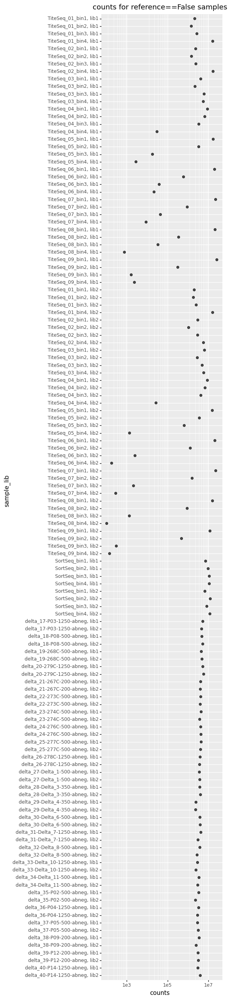
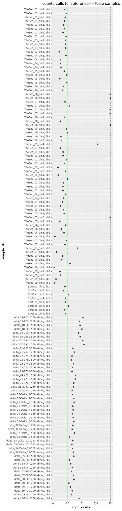

# Ratio of sequencing counts to cells sorted
This Python Jupyter notebook looks at the ratio of sequencing counts to cells sorted for each sample, and flags any where this ratio seems too low.

First, import Python modules:


```python
import Bio.SeqIO

from IPython.display import display, HTML

import matplotlib.pyplot as plt

import pandas as pd

from plotnine import *

import yaml
```

Read the configuration file:


```python
with open('config.yaml') as f:
    config = yaml.safe_load(f)
```

Read information about the samples:


```python
samples_df = pd.read_csv(config['barcode_runs'])
```

Read the variant counts:


```python
variant_counts = pd.read_csv(config['variant_counts'])
```

Get the "primary target"


```python
wt_seqrecord = Bio.SeqIO.read(config['wildtype_sequence'], 'fasta')
primary_target = wt_seqrecord.name
print(f"Primary target is {primary_target}")
```

    Primary target is Delta


Merge the sample information and aggregated variant counts data frames into a new data frame that has the number of cells sorted and the total variant counts for each sample, as well as the ratio of the variant counts to cells.
Importantly, counts and ratios are computed using counts for all variants (SARS-CoV-2) and counts for just variants of the primary target (SARS-CoV-2).
The cell counts aren't meaningful for reference samples, so set to `NA`.


```python
counts_cells = (
    samples_df
    .assign(sort_bin=lambda x: x['sort_bin'].astype(str),
            sample_lib=lambda x: x['sample'] + ', ' + x['library'],
            number_cells=lambda x: x['number_cells'].where(x['sort_bin'] != 'ref', pd.NA))
    [['sample_lib', 'date', 'experiment', 'antibody', 'concentration', 'sort_bin', 'number_cells']]
    .merge(variant_counts
           .assign(sample_lib=lambda x: x['sample'] + ', ' + x['library'])
           .groupby('sample_lib')
           .aggregate(counts=pd.NamedAgg('count', 'sum'))
           .astype(float)
           .reset_index(),
           on='sample_lib', how='left', validate='one_to_one',
           )
    .assign(sample_lib=lambda x: pd.Categorical(x['sample_lib'], reversed(x['sample_lib'].unique()), ordered=True),
            counts_to_cells=lambda x: x['counts'] / x['number_cells'],
            is_reference=lambda x: x['sort_bin'].isin(['trans', 'ref']),
           )
    .rename(columns={'counts_to_cells': 'counts:cells',
                     })
    )

print(f"First few lines of the data frame, writing entirety to {config['counts_to_cells_csv']}:")
display(HTML(counts_cells.head().to_html(index=False, float_format='{:.2g}'.format)))
counts_cells.to_csv(config['counts_to_cells_csv'], index=False, float_format='%.3g')
```

    First few lines of the data frame, writing entirety to results/counts/counts_to_cells_csv.csv:


<table border="1" class="dataframe">
  <thead>
    <tr style="text-align: right;">
      <th>sample_lib</th>
      <th>date</th>
      <th>experiment</th>
      <th>antibody</th>
      <th>concentration</th>
      <th>sort_bin</th>
      <th>number_cells</th>
      <th>counts</th>
      <th>counts:cells</th>
      <th>is_reference</th>
    </tr>
  </thead>
  <tbody>
    <tr>
      <td>TiteSeq_01_bin1, lib1</td>
      <td>210930</td>
      <td>TiteSeq</td>
      <td>monomeric_ACE2</td>
      <td>1</td>
      <td>1</td>
      <td>1.1e+06</td>
      <td>2.1e+06</td>
      <td>2</td>
      <td>False</td>
    </tr>
    <tr>
      <td>TiteSeq_01_bin2, lib1</td>
      <td>210930</td>
      <td>TiteSeq</td>
      <td>monomeric_ACE2</td>
      <td>1</td>
      <td>2</td>
      <td>6.2e+05</td>
      <td>1.5e+06</td>
      <td>2.3</td>
      <td>False</td>
    </tr>
    <tr>
      <td>TiteSeq_01_bin3, lib1</td>
      <td>210930</td>
      <td>TiteSeq</td>
      <td>monomeric_ACE2</td>
      <td>1</td>
      <td>3</td>
      <td>1.3e+06</td>
      <td>2.7e+06</td>
      <td>2.1</td>
      <td>False</td>
    </tr>
    <tr>
      <td>TiteSeq_01_bin4, lib1</td>
      <td>210930</td>
      <td>TiteSeq</td>
      <td>monomeric_ACE2</td>
      <td>1</td>
      <td>4</td>
      <td>8.1e+06</td>
      <td>1.6e+07</td>
      <td>2</td>
      <td>False</td>
    </tr>
    <tr>
      <td>TiteSeq_02_bin1, lib1</td>
      <td>210930</td>
      <td>TiteSeq</td>
      <td>monomeric_ACE2</td>
      <td>2</td>
      <td>1</td>
      <td>1.3e+06</td>
      <td>2.4e+06</td>
      <td>1.8</td>
      <td>False</td>
    </tr>
  </tbody>
</table>


Now we plot the number of counts or the counts:cells ratio for all samples.
We stratify by reference samples and escape samples, and only plot the counts:cells ratio for escape samples as cells are not sorted for reference samples.
We plot the counts / ratios for all variants, and primary target (SARS-CoV-2) variants.

In order to have the axis limits be reasonable, we clip very high / low values and draw dotted black lines to indicate the clipping.
For reference sample counts, and escape sample counts:cells ratio, we have minimum desired values.
We draw dashed green lines at these minimum values, and keep track of samples that don't achieve the minimum.


```python
config['min_counts_to_cells_ratio']
```


    2.5


```python
min_fail_sample_libs = set([])  # sample_lib that fail desired min

for var, is_reference, lower_clip, upper_clip, desired_min in [
            #('counts', True, 1e5, None, config['reference_min_counts']),
            ('counts', False, 1e2, None, None),
            ('counts:cells', False, 0.1, 10, config['min_counts_to_cells_ratio']),
            ]:

    # get tidy data frame with samples of interest
    tidy_df = (
        counts_cells
        .query('is_reference == @is_reference')
        )
    tidy_df[var] = tidy_df[var].clip(lower=lower_clip, upper=upper_clip).astype(float)

    # make plot
    p = (ggplot(tidy_df) +
         aes(var, 'sample_lib') +
         geom_point(size=2, alpha=0.7) +
         theme(figure_size=(4, 0.25 * tidy_df['sample_lib'].nunique())) +
         ggtitle(f"{var} for reference=={is_reference} samples")
         )
    
    if var == 'counts':  # plot counts on log scale
        p = p + scale_x_log10()
        
    # add dotted vertical lines if clipping if data
    if (lower_clip is not None) and (lower_clip >= tidy_df[var].min()):
        p = p + geom_vline(xintercept=lower_clip, color='black', linetype='dotted')
    if (upper_clip is not None) and (upper_clip <= tidy_df[var].max()):
        p = p + geom_vline(xintercept=upper_clip, color='black', linetype='dotted')
        
    # draw line at desired minimum value, and identify any samples that fail minimum
    if desired_min is not None:
        p = p + geom_vline(xintercept=desired_min, color='green', linetype='dashed')
        min_fail_sample_libs.update(set(
            tidy_df
            .assign(fail_min=lambda x: x[var] < desired_min)
            .query('fail_min')
            ['sample_lib']
            ))
    
    # draw figure
    fig = p.draw()
    display(fig)
    plt.close(fig)
```

    /loc/scratch/43106783/ipykernel_2767/1882431916.py:14: SettingWithCopyWarning: 
    A value is trying to be set on a copy of a slice from a DataFrame.
    Try using .loc[row_indexer,col_indexer] = value instead
    
    See the caveats in the documentation: https://pandas.pydata.org/pandas-docs/stable/user_guide/indexing.html#returning-a-view-versus-a-copy


    

    


    /loc/scratch/43106783/ipykernel_2767/1882431916.py:14: SettingWithCopyWarning: 
    A value is trying to be set on a copy of a slice from a DataFrame.
    Try using .loc[row_indexer,col_indexer] = value instead
    
    See the caveats in the documentation: https://pandas.pydata.org/pandas-docs/stable/user_guide/indexing.html#returning-a-view-versus-a-copy


    

    


Now list any samples that fail the minimum counts or counts:cell ratio:


```python
print(f"Reference samples with < {config['reference_min_counts']} counts, "
      f"or escape samples with a counts:cell ratio < {config['min_counts_to_cells_ratio']}.")

display(HTML(
    counts_cells
    .query('sample_lib in @min_fail_sample_libs')
    .to_html(index=False, float_format='{:.2g}'.format)
    ))
```

    Reference samples with < 25000000.0 counts, or escape samples with a counts:cell ratio < 2.5.


<table border="1" class="dataframe">
  <thead>
    <tr style="text-align: right;">
      <th>sample_lib</th>
      <th>date</th>
      <th>experiment</th>
      <th>antibody</th>
      <th>concentration</th>
      <th>sort_bin</th>
      <th>number_cells</th>
      <th>counts</th>
      <th>counts:cells</th>
      <th>is_reference</th>
    </tr>
  </thead>
  <tbody>
    <tr>
      <td>TiteSeq_01_bin1, lib1</td>
      <td>210930</td>
      <td>TiteSeq</td>
      <td>monomeric_ACE2</td>
      <td>1</td>
      <td>1</td>
      <td>1.1e+06</td>
      <td>2.1e+06</td>
      <td>2</td>
      <td>False</td>
    </tr>
    <tr>
      <td>TiteSeq_01_bin2, lib1</td>
      <td>210930</td>
      <td>TiteSeq</td>
      <td>monomeric_ACE2</td>
      <td>1</td>
      <td>2</td>
      <td>6.2e+05</td>
      <td>1.5e+06</td>
      <td>2.3</td>
      <td>False</td>
    </tr>
    <tr>
      <td>TiteSeq_01_bin3, lib1</td>
      <td>210930</td>
      <td>TiteSeq</td>
      <td>monomeric_ACE2</td>
      <td>1</td>
      <td>3</td>
      <td>1.3e+06</td>
      <td>2.7e+06</td>
      <td>2.1</td>
      <td>False</td>
    </tr>
    <tr>
      <td>TiteSeq_01_bin4, lib1</td>
      <td>210930</td>
      <td>TiteSeq</td>
      <td>monomeric_ACE2</td>
      <td>1</td>
      <td>4</td>
      <td>8.1e+06</td>
      <td>1.6e+07</td>
      <td>2</td>
      <td>False</td>
    </tr>
    <tr>
      <td>TiteSeq_02_bin1, lib1</td>
      <td>210930</td>
      <td>TiteSeq</td>
      <td>monomeric_ACE2</td>
      <td>2</td>
      <td>1</td>
      <td>1.3e+06</td>
      <td>2.4e+06</td>
      <td>1.8</td>
      <td>False</td>
    </tr>
    <tr>
      <td>TiteSeq_02_bin2, lib1</td>
      <td>210930</td>
      <td>TiteSeq</td>
      <td>monomeric_ACE2</td>
      <td>2</td>
      <td>2</td>
      <td>7.5e+05</td>
      <td>1.5e+06</td>
      <td>2</td>
      <td>False</td>
    </tr>
    <tr>
      <td>TiteSeq_02_bin3, lib1</td>
      <td>210930</td>
      <td>TiteSeq</td>
      <td>monomeric_ACE2</td>
      <td>2</td>
      <td>3</td>
      <td>1.4e+06</td>
      <td>2.4e+06</td>
      <td>1.8</td>
      <td>False</td>
    </tr>
    <tr>
      <td>TiteSeq_02_bin4, lib1</td>
      <td>210930</td>
      <td>TiteSeq</td>
      <td>monomeric_ACE2</td>
      <td>2</td>
      <td>4</td>
      <td>7.5e+06</td>
      <td>1.7e+07</td>
      <td>2.3</td>
      <td>False</td>
    </tr>
    <tr>
      <td>TiteSeq_03_bin1, lib1</td>
      <td>210930</td>
      <td>TiteSeq</td>
      <td>monomeric_ACE2</td>
      <td>3</td>
      <td>1</td>
      <td>1.9e+06</td>
      <td>4.2e+06</td>
      <td>2.2</td>
      <td>False</td>
    </tr>
    <tr>
      <td>TiteSeq_03_bin2, lib1</td>
      <td>210930</td>
      <td>TiteSeq</td>
      <td>monomeric_ACE2</td>
      <td>3</td>
      <td>2</td>
      <td>1e+06</td>
      <td>2.2e+06</td>
      <td>2.2</td>
      <td>False</td>
    </tr>
    <tr>
      <td>TiteSeq_03_bin3, lib1</td>
      <td>210930</td>
      <td>TiteSeq</td>
      <td>monomeric_ACE2</td>
      <td>3</td>
      <td>3</td>
      <td>2.8e+06</td>
      <td>6.2e+06</td>
      <td>2.2</td>
      <td>False</td>
    </tr>
    <tr>
      <td>TiteSeq_03_bin4, lib1</td>
      <td>210930</td>
      <td>TiteSeq</td>
      <td>monomeric_ACE2</td>
      <td>3</td>
      <td>4</td>
      <td>5.2e+06</td>
      <td>5.6e+06</td>
      <td>1.1</td>
      <td>False</td>
    </tr>
    <tr>
      <td>TiteSeq_04_bin1, lib1</td>
      <td>210930</td>
      <td>TiteSeq</td>
      <td>monomeric_ACE2</td>
      <td>4</td>
      <td>1</td>
      <td>4e+06</td>
      <td>9e+06</td>
      <td>2.3</td>
      <td>False</td>
    </tr>
    <tr>
      <td>TiteSeq_04_bin2, lib1</td>
      <td>210930</td>
      <td>TiteSeq</td>
      <td>monomeric_ACE2</td>
      <td>4</td>
      <td>2</td>
      <td>5.1e+06</td>
      <td>6.7e+06</td>
      <td>1.3</td>
      <td>False</td>
    </tr>
    <tr>
      <td>TiteSeq_04_bin3, lib1</td>
      <td>210930</td>
      <td>TiteSeq</td>
      <td>monomeric_ACE2</td>
      <td>4</td>
      <td>3</td>
      <td>2.5e+06</td>
      <td>3.4e+06</td>
      <td>1.3</td>
      <td>False</td>
    </tr>
    <tr>
      <td>TiteSeq_04_bin4, lib1</td>
      <td>210930</td>
      <td>TiteSeq</td>
      <td>monomeric_ACE2</td>
      <td>4</td>
      <td>4</td>
      <td>2.1e+04</td>
      <td>3e+04</td>
      <td>1.4</td>
      <td>False</td>
    </tr>
    <tr>
      <td>TiteSeq_05_bin1, lib1</td>
      <td>210930</td>
      <td>TiteSeq</td>
      <td>monomeric_ACE2</td>
      <td>5</td>
      <td>1</td>
      <td>8.8e+06</td>
      <td>1.7e+07</td>
      <td>2</td>
      <td>False</td>
    </tr>
    <tr>
      <td>TiteSeq_05_bin2, lib1</td>
      <td>210930</td>
      <td>TiteSeq</td>
      <td>monomeric_ACE2</td>
      <td>5</td>
      <td>2</td>
      <td>1.4e+06</td>
      <td>3.4e+06</td>
      <td>2.4</td>
      <td>False</td>
    </tr>
    <tr>
      <td>TiteSeq_05_bin3, lib1</td>
      <td>210930</td>
      <td>TiteSeq</td>
      <td>monomeric_ACE2</td>
      <td>5</td>
      <td>3</td>
      <td>1.5e+04</td>
      <td>1.8e+04</td>
      <td>1.2</td>
      <td>False</td>
    </tr>
    <tr>
      <td>TiteSeq_05_bin4, lib1</td>
      <td>210930</td>
      <td>TiteSeq</td>
      <td>monomeric_ACE2</td>
      <td>5</td>
      <td>4</td>
      <td>1.2e+03</td>
      <td>2.8e+03</td>
      <td>2.4</td>
      <td>False</td>
    </tr>
    <tr>
      <td>TiteSeq_06_bin1, lib1</td>
      <td>210930</td>
      <td>TiteSeq</td>
      <td>monomeric_ACE2</td>
      <td>6</td>
      <td>1</td>
      <td>1.1e+07</td>
      <td>2e+07</td>
      <td>1.9</td>
      <td>False</td>
    </tr>
    <tr>
      <td>TiteSeq_06_bin2, lib1</td>
      <td>210930</td>
      <td>TiteSeq</td>
      <td>monomeric_ACE2</td>
      <td>6</td>
      <td>2</td>
      <td>3.6e+05</td>
      <td>6.1e+05</td>
      <td>1.7</td>
      <td>False</td>
    </tr>
    <tr>
      <td>TiteSeq_07_bin1, lib1</td>
      <td>210930</td>
      <td>TiteSeq</td>
      <td>monomeric_ACE2</td>
      <td>7</td>
      <td>1</td>
      <td>1.1e+07</td>
      <td>2.3e+07</td>
      <td>2.1</td>
      <td>False</td>
    </tr>
    <tr>
      <td>TiteSeq_08_bin1, lib1</td>
      <td>210930</td>
      <td>TiteSeq</td>
      <td>monomeric_ACE2</td>
      <td>8</td>
      <td>1</td>
      <td>1e+07</td>
      <td>2.1e+07</td>
      <td>2</td>
      <td>False</td>
    </tr>
    <tr>
      <td>TiteSeq_08_bin2, lib1</td>
      <td>210930</td>
      <td>TiteSeq</td>
      <td>monomeric_ACE2</td>
      <td>8</td>
      <td>2</td>
      <td>2.7e+05</td>
      <td>3.5e+05</td>
      <td>1.3</td>
      <td>False</td>
    </tr>
    <tr>
      <td>TiteSeq_08_bin4, lib1</td>
      <td>210930</td>
      <td>TiteSeq</td>
      <td>monomeric_ACE2</td>
      <td>8</td>
      <td>4</td>
      <td>3.3e+02</td>
      <td>7.7e+02</td>
      <td>2.4</td>
      <td>False</td>
    </tr>
    <tr>
      <td>TiteSeq_09_bin2, lib1</td>
      <td>210930</td>
      <td>TiteSeq</td>
      <td>monomeric_ACE2</td>
      <td>9</td>
      <td>2</td>
      <td>2.3e+05</td>
      <td>3.2e+05</td>
      <td>1.4</td>
      <td>False</td>
    </tr>
    <tr>
      <td>TiteSeq_09_bin3, lib1</td>
      <td>210930</td>
      <td>TiteSeq</td>
      <td>monomeric_ACE2</td>
      <td>9</td>
      <td>3</td>
      <td>1.1e+03</td>
      <td>1.7e+03</td>
      <td>1.5</td>
      <td>False</td>
    </tr>
    <tr>
      <td>TiteSeq_01_bin1, lib2</td>
      <td>210930</td>
      <td>TiteSeq</td>
      <td>monomeric_ACE2</td>
      <td>1</td>
      <td>1</td>
      <td>1.5e+06</td>
      <td>2e+06</td>
      <td>1.4</td>
      <td>False</td>
    </tr>
    <tr>
      <td>TiteSeq_01_bin2, lib2</td>
      <td>210930</td>
      <td>TiteSeq</td>
      <td>monomeric_ACE2</td>
      <td>1</td>
      <td>2</td>
      <td>1e+06</td>
      <td>1.8e+06</td>
      <td>1.8</td>
      <td>False</td>
    </tr>
    <tr>
      <td>TiteSeq_01_bin3, lib2</td>
      <td>210930</td>
      <td>TiteSeq</td>
      <td>monomeric_ACE2</td>
      <td>1</td>
      <td>3</td>
      <td>1.4e+06</td>
      <td>2.5e+06</td>
      <td>1.8</td>
      <td>False</td>
    </tr>
    <tr>
      <td>TiteSeq_01_bin4, lib2</td>
      <td>210930</td>
      <td>TiteSeq</td>
      <td>monomeric_ACE2</td>
      <td>1</td>
      <td>4</td>
      <td>6.8e+06</td>
      <td>1.6e+07</td>
      <td>2.4</td>
      <td>False</td>
    </tr>
    <tr>
      <td>TiteSeq_02_bin1, lib2</td>
      <td>210930</td>
      <td>TiteSeq</td>
      <td>monomeric_ACE2</td>
      <td>2</td>
      <td>1</td>
      <td>1.5e+06</td>
      <td>3e+06</td>
      <td>2</td>
      <td>False</td>
    </tr>
    <tr>
      <td>TiteSeq_02_bin2, lib2</td>
      <td>210930</td>
      <td>TiteSeq</td>
      <td>monomeric_ACE2</td>
      <td>2</td>
      <td>2</td>
      <td>1.2e+06</td>
      <td>1.1e+06</td>
      <td>0.9</td>
      <td>False</td>
    </tr>
    <tr>
      <td>TiteSeq_02_bin3, lib2</td>
      <td>210930</td>
      <td>TiteSeq</td>
      <td>monomeric_ACE2</td>
      <td>2</td>
      <td>3</td>
      <td>1.4e+06</td>
      <td>3e+06</td>
      <td>2.2</td>
      <td>False</td>
    </tr>
    <tr>
      <td>TiteSeq_02_bin4, lib2</td>
      <td>210930</td>
      <td>TiteSeq</td>
      <td>monomeric_ACE2</td>
      <td>2</td>
      <td>4</td>
      <td>6.2e+06</td>
      <td>5.7e+06</td>
      <td>0.93</td>
      <td>False</td>
    </tr>
    <tr>
      <td>TiteSeq_03_bin2, lib2</td>
      <td>210930</td>
      <td>TiteSeq</td>
      <td>monomeric_ACE2</td>
      <td>3</td>
      <td>2</td>
      <td>1.6e+06</td>
      <td>2.9e+06</td>
      <td>1.8</td>
      <td>False</td>
    </tr>
    <tr>
      <td>TiteSeq_03_bin3, lib2</td>
      <td>210930</td>
      <td>TiteSeq</td>
      <td>monomeric_ACE2</td>
      <td>3</td>
      <td>3</td>
      <td>2.9e+06</td>
      <td>5e+06</td>
      <td>1.7</td>
      <td>False</td>
    </tr>
    <tr>
      <td>TiteSeq_03_bin4, lib2</td>
      <td>210930</td>
      <td>TiteSeq</td>
      <td>monomeric_ACE2</td>
      <td>3</td>
      <td>4</td>
      <td>3.3e+06</td>
      <td>5.9e+06</td>
      <td>1.8</td>
      <td>False</td>
    </tr>
    <tr>
      <td>TiteSeq_04_bin1, lib2</td>
      <td>210930</td>
      <td>TiteSeq</td>
      <td>monomeric_ACE2</td>
      <td>4</td>
      <td>1</td>
      <td>4e+06</td>
      <td>8.9e+06</td>
      <td>2.2</td>
      <td>False</td>
    </tr>
    <tr>
      <td>TiteSeq_04_bin2, lib2</td>
      <td>210930</td>
      <td>TiteSeq</td>
      <td>monomeric_ACE2</td>
      <td>4</td>
      <td>2</td>
      <td>3.8e+06</td>
      <td>6.9e+06</td>
      <td>1.8</td>
      <td>False</td>
    </tr>
    <tr>
      <td>TiteSeq_04_bin3, lib2</td>
      <td>210930</td>
      <td>TiteSeq</td>
      <td>monomeric_ACE2</td>
      <td>4</td>
      <td>3</td>
      <td>2.6e+06</td>
      <td>4.3e+06</td>
      <td>1.6</td>
      <td>False</td>
    </tr>
    <tr>
      <td>TiteSeq_04_bin4, lib2</td>
      <td>210930</td>
      <td>TiteSeq</td>
      <td>monomeric_ACE2</td>
      <td>4</td>
      <td>4</td>
      <td>2.1e+04</td>
      <td>2.7e+04</td>
      <td>1.3</td>
      <td>False</td>
    </tr>
    <tr>
      <td>TiteSeq_05_bin1, lib2</td>
      <td>210930</td>
      <td>TiteSeq</td>
      <td>monomeric_ACE2</td>
      <td>5</td>
      <td>1</td>
      <td>8.3e+06</td>
      <td>1.6e+07</td>
      <td>1.9</td>
      <td>False</td>
    </tr>
    <tr>
      <td>TiteSeq_05_bin2, lib2</td>
      <td>210930</td>
      <td>TiteSeq</td>
      <td>monomeric_ACE2</td>
      <td>5</td>
      <td>2</td>
      <td>1.8e+06</td>
      <td>3.6e+06</td>
      <td>2</td>
      <td>False</td>
    </tr>
    <tr>
      <td>TiteSeq_05_bin4, lib2</td>
      <td>210930</td>
      <td>TiteSeq</td>
      <td>monomeric_ACE2</td>
      <td>5</td>
      <td>4</td>
      <td>1.1e+03</td>
      <td>1.4e+03</td>
      <td>1.2</td>
      <td>False</td>
    </tr>
    <tr>
      <td>TiteSeq_06_bin1, lib2</td>
      <td>210930</td>
      <td>TiteSeq</td>
      <td>monomeric_ACE2</td>
      <td>6</td>
      <td>1</td>
      <td>9.3e+06</td>
      <td>2.1e+07</td>
      <td>2.3</td>
      <td>False</td>
    </tr>
    <tr>
      <td>TiteSeq_06_bin2, lib2</td>
      <td>210930</td>
      <td>TiteSeq</td>
      <td>monomeric_ACE2</td>
      <td>6</td>
      <td>2</td>
      <td>8.8e+05</td>
      <td>1.3e+06</td>
      <td>1.5</td>
      <td>False</td>
    </tr>
    <tr>
      <td>TiteSeq_06_bin3, lib2</td>
      <td>210930</td>
      <td>TiteSeq</td>
      <td>monomeric_ACE2</td>
      <td>6</td>
      <td>3</td>
      <td>1.3e+03</td>
      <td>2.6e+03</td>
      <td>1.9</td>
      <td>False</td>
    </tr>
    <tr>
      <td>TiteSeq_06_bin4, lib2</td>
      <td>210930</td>
      <td>TiteSeq</td>
      <td>monomeric_ACE2</td>
      <td>6</td>
      <td>4</td>
      <td>5.2e+02</td>
      <td>1.8e+02</td>
      <td>0.35</td>
      <td>False</td>
    </tr>
    <tr>
      <td>TiteSeq_07_bin1, lib2</td>
      <td>210930</td>
      <td>TiteSeq</td>
      <td>monomeric_ACE2</td>
      <td>7</td>
      <td>1</td>
      <td>9.7e+06</td>
      <td>2.3e+07</td>
      <td>2.4</td>
      <td>False</td>
    </tr>
    <tr>
      <td>TiteSeq_07_bin2, lib2</td>
      <td>210930</td>
      <td>TiteSeq</td>
      <td>monomeric_ACE2</td>
      <td>7</td>
      <td>2</td>
      <td>7.5e+05</td>
      <td>1.6e+06</td>
      <td>2.1</td>
      <td>False</td>
    </tr>
    <tr>
      <td>TiteSeq_07_bin4, lib2</td>
      <td>210930</td>
      <td>TiteSeq</td>
      <td>monomeric_ACE2</td>
      <td>7</td>
      <td>4</td>
      <td>4.6e+02</td>
      <td>2.9e+02</td>
      <td>0.63</td>
      <td>False</td>
    </tr>
    <tr>
      <td>TiteSeq_08_bin1, lib2</td>
      <td>210930</td>
      <td>TiteSeq</td>
      <td>monomeric_ACE2</td>
      <td>8</td>
      <td>1</td>
      <td>9.6e+06</td>
      <td>1.6e+07</td>
      <td>1.7</td>
      <td>False</td>
    </tr>
    <tr>
      <td>TiteSeq_08_bin2, lib2</td>
      <td>210930</td>
      <td>TiteSeq</td>
      <td>monomeric_ACE2</td>
      <td>8</td>
      <td>2</td>
      <td>6e+05</td>
      <td>9.1e+05</td>
      <td>1.5</td>
      <td>False</td>
    </tr>
    <tr>
      <td>TiteSeq_08_bin4, lib2</td>
      <td>210930</td>
      <td>TiteSeq</td>
      <td>monomeric_ACE2</td>
      <td>8</td>
      <td>4</td>
      <td>4.5e+02</td>
      <td>1.0e+02</td>
      <td>0.24</td>
      <td>False</td>
    </tr>
    <tr>
      <td>TiteSeq_09_bin1, lib2</td>
      <td>210930</td>
      <td>TiteSeq</td>
      <td>monomeric_ACE2</td>
      <td>9</td>
      <td>1</td>
      <td>9.8e+06</td>
      <td>1.2e+07</td>
      <td>1.2</td>
      <td>False</td>
    </tr>
    <tr>
      <td>TiteSeq_09_bin2, lib2</td>
      <td>210930</td>
      <td>TiteSeq</td>
      <td>monomeric_ACE2</td>
      <td>9</td>
      <td>2</td>
      <td>3.7e+05</td>
      <td>4.8e+05</td>
      <td>1.3</td>
      <td>False</td>
    </tr>
    <tr>
      <td>TiteSeq_09_bin3, lib2</td>
      <td>210930</td>
      <td>TiteSeq</td>
      <td>monomeric_ACE2</td>
      <td>9</td>
      <td>3</td>
      <td>5.7e+02</td>
      <td>3.1e+02</td>
      <td>0.54</td>
      <td>False</td>
    </tr>
    <tr>
      <td>TiteSeq_09_bin4, lib2</td>
      <td>210930</td>
      <td>TiteSeq</td>
      <td>monomeric_ACE2</td>
      <td>9</td>
      <td>4</td>
      <td>5.9e+02</td>
      <td>1.4e+02</td>
      <td>0.25</td>
      <td>False</td>
    </tr>
    <tr>
      <td>SortSeq_bin1, lib1</td>
      <td>210927</td>
      <td>SortSeq</td>
      <td>NaN</td>
      <td>NaN</td>
      <td>1</td>
      <td>3.5e+06</td>
      <td>7.3e+06</td>
      <td>2.1</td>
      <td>False</td>
    </tr>
    <tr>
      <td>SortSeq_bin2, lib1</td>
      <td>210927</td>
      <td>SortSeq</td>
      <td>NaN</td>
      <td>NaN</td>
      <td>2</td>
      <td>5.2e+06</td>
      <td>9.7e+06</td>
      <td>1.9</td>
      <td>False</td>
    </tr>
    <tr>
      <td>SortSeq_bin4, lib1</td>
      <td>210927</td>
      <td>SortSeq</td>
      <td>NaN</td>
      <td>NaN</td>
      <td>4</td>
      <td>5e+06</td>
      <td>1.1e+07</td>
      <td>2.2</td>
      <td>False</td>
    </tr>
    <tr>
      <td>SortSeq_bin1, lib2</td>
      <td>210927</td>
      <td>SortSeq</td>
      <td>NaN</td>
      <td>NaN</td>
      <td>1</td>
      <td>3.1e+06</td>
      <td>6.8e+06</td>
      <td>2.2</td>
      <td>False</td>
    </tr>
    <tr>
      <td>SortSeq_bin3, lib2</td>
      <td>210927</td>
      <td>SortSeq</td>
      <td>NaN</td>
      <td>NaN</td>
      <td>3</td>
      <td>4.0e+06</td>
      <td>8.4e+06</td>
      <td>2.1</td>
      <td>False</td>
    </tr>
    <tr>
      <td>SortSeq_bin4, lib2</td>
      <td>210927</td>
      <td>SortSeq</td>
      <td>NaN</td>
      <td>NaN</td>
      <td>4</td>
      <td>5.4e+06</td>
      <td>1.2e+07</td>
      <td>2.2</td>
      <td>False</td>
    </tr>
    <tr>
      <td>delta_21-267C_repeat-200-abneg, lib1</td>
      <td>211119</td>
      <td>delta_21</td>
      <td>267C_repeat</td>
      <td>2e+02</td>
      <td>abneg</td>
      <td>1.2e+06</td>
      <td>1.7e+06</td>
      <td>1.4</td>
      <td>False</td>
    </tr>
    <tr>
      <td>delta_21-267C_repeat-200-abneg, lib2</td>
      <td>211119</td>
      <td>delta_21</td>
      <td>267C_repeat</td>
      <td>2e+02</td>
      <td>abneg</td>
      <td>1.1e+06</td>
      <td>1.7e+06</td>
      <td>1.6</td>
      <td>False</td>
    </tr>
    <tr>
      <td>delta_22-273C_repeat-500-abneg, lib1</td>
      <td>211119</td>
      <td>delta_22</td>
      <td>273C_repeat</td>
      <td>5e+02</td>
      <td>abneg</td>
      <td>1.3e+06</td>
      <td>1.7e+06</td>
      <td>1.4</td>
      <td>False</td>
    </tr>
    <tr>
      <td>delta_22-273C_repeat-500-abneg, lib2</td>
      <td>211119</td>
      <td>delta_22</td>
      <td>273C_repeat</td>
      <td>5e+02</td>
      <td>abneg</td>
      <td>1.2e+06</td>
      <td>1.6e+06</td>
      <td>1.3</td>
      <td>False</td>
    </tr>
    <tr>
      <td>delta_23-274C_repeat-500-abneg, lib1</td>
      <td>211119</td>
      <td>delta_23</td>
      <td>274C_repeat</td>
      <td>5e+02</td>
      <td>abneg</td>
      <td>1.2e+06</td>
      <td>1.8e+06</td>
      <td>1.5</td>
      <td>False</td>
    </tr>
    <tr>
      <td>delta_23-274C_repeat-500-abneg, lib2</td>
      <td>211119</td>
      <td>delta_23</td>
      <td>274C_repeat</td>
      <td>5e+02</td>
      <td>abneg</td>
      <td>1.1e+06</td>
      <td>1.6e+06</td>
      <td>1.4</td>
      <td>False</td>
    </tr>
    <tr>
      <td>delta_24-276C_repeat-500-abneg, lib1</td>
      <td>211119</td>
      <td>delta_24</td>
      <td>276C_repeat</td>
      <td>5e+02</td>
      <td>abneg</td>
      <td>1.3e+06</td>
      <td>1.7e+06</td>
      <td>1.4</td>
      <td>False</td>
    </tr>
    <tr>
      <td>delta_24-276C_repeat-500-abneg, lib2</td>
      <td>211119</td>
      <td>delta_24</td>
      <td>276C_repeat</td>
      <td>5e+02</td>
      <td>abneg</td>
      <td>1.1e+06</td>
      <td>1.8e+06</td>
      <td>1.6</td>
      <td>False</td>
    </tr>
    <tr>
      <td>delta_25-277C_repeat-500-abneg, lib1</td>
      <td>211119</td>
      <td>delta_25</td>
      <td>277C_repeat</td>
      <td>5e+02</td>
      <td>abneg</td>
      <td>1.1e+06</td>
      <td>1.8e+06</td>
      <td>1.6</td>
      <td>False</td>
    </tr>
    <tr>
      <td>delta_25-277C_repeat-500-abneg, lib2</td>
      <td>211119</td>
      <td>delta_25</td>
      <td>277C_repeat</td>
      <td>5e+02</td>
      <td>abneg</td>
      <td>1.1e+06</td>
      <td>1.7e+06</td>
      <td>1.5</td>
      <td>False</td>
    </tr>
    <tr>
      <td>delta_26-278C_repeat-1250-abneg, lib1</td>
      <td>211119</td>
      <td>delta_26</td>
      <td>278C_repeat</td>
      <td>1.2e+03</td>
      <td>abneg</td>
      <td>1.1e+06</td>
      <td>1.7e+06</td>
      <td>1.5</td>
      <td>False</td>
    </tr>
    <tr>
      <td>delta_26-278C_repeat-1250-abneg, lib2</td>
      <td>211119</td>
      <td>delta_26</td>
      <td>278C_repeat</td>
      <td>1.2e+03</td>
      <td>abneg</td>
      <td>1.1e+06</td>
      <td>1.5e+06</td>
      <td>1.4</td>
      <td>False</td>
    </tr>
    <tr>
      <td>delta_27-Delta_1-500-abneg, lib1</td>
      <td>211122</td>
      <td>delta_27</td>
      <td>Delta_1</td>
      <td>5e+02</td>
      <td>abneg</td>
      <td>1.1e+06</td>
      <td>1.5e+06</td>
      <td>1.4</td>
      <td>False</td>
    </tr>
    <tr>
      <td>delta_27-Delta_1-500-abneg, lib2</td>
      <td>211122</td>
      <td>delta_27</td>
      <td>Delta_1</td>
      <td>5e+02</td>
      <td>abneg</td>
      <td>1e+06</td>
      <td>1.6e+06</td>
      <td>1.5</td>
      <td>False</td>
    </tr>
    <tr>
      <td>delta_28-Delta_3-350-abneg, lib1</td>
      <td>211122</td>
      <td>delta_28</td>
      <td>Delta_3</td>
      <td>3.5e+02</td>
      <td>abneg</td>
      <td>1e+06</td>
      <td>1.5e+06</td>
      <td>1.5</td>
      <td>False</td>
    </tr>
    <tr>
      <td>delta_28-Delta_3-350-abneg, lib2</td>
      <td>211122</td>
      <td>delta_28</td>
      <td>Delta_3</td>
      <td>3.5e+02</td>
      <td>abneg</td>
      <td>1.2e+06</td>
      <td>1.7e+06</td>
      <td>1.4</td>
      <td>False</td>
    </tr>
    <tr>
      <td>delta_29-Delta_4-350-abneg, lib1</td>
      <td>211122</td>
      <td>delta_29</td>
      <td>Delta_4</td>
      <td>3.5e+02</td>
      <td>abneg</td>
      <td>7e+05</td>
      <td>1e+06</td>
      <td>1.5</td>
      <td>False</td>
    </tr>
    <tr>
      <td>delta_29-Delta_4-350-abneg, lib2</td>
      <td>211122</td>
      <td>delta_29</td>
      <td>Delta_4</td>
      <td>3.5e+02</td>
      <td>abneg</td>
      <td>6.9e+05</td>
      <td>9.8e+05</td>
      <td>1.4</td>
      <td>False</td>
    </tr>
    <tr>
      <td>delta_30-Delta_6-500-abneg, lib1</td>
      <td>211122</td>
      <td>delta_30</td>
      <td>Delta_6</td>
      <td>5e+02</td>
      <td>abneg</td>
      <td>1.1e+06</td>
      <td>1.6e+06</td>
      <td>1.4</td>
      <td>False</td>
    </tr>
    <tr>
      <td>delta_30-Delta_6-500-abneg, lib2</td>
      <td>211122</td>
      <td>delta_30</td>
      <td>Delta_6</td>
      <td>5e+02</td>
      <td>abneg</td>
      <td>1.1e+06</td>
      <td>1.6e+06</td>
      <td>1.5</td>
      <td>False</td>
    </tr>
    <tr>
      <td>delta_31-Delta_7-1250-abneg, lib1</td>
      <td>211122</td>
      <td>delta_31</td>
      <td>Delta_7</td>
      <td>1.2e+03</td>
      <td>abneg</td>
      <td>1.2e+06</td>
      <td>1.7e+06</td>
      <td>1.4</td>
      <td>False</td>
    </tr>
    <tr>
      <td>delta_31-Delta_7-1250-abneg, lib2</td>
      <td>211122</td>
      <td>delta_31</td>
      <td>Delta_7</td>
      <td>1.2e+03</td>
      <td>abneg</td>
      <td>9.3e+05</td>
      <td>1.3e+06</td>
      <td>1.4</td>
      <td>False</td>
    </tr>
    <tr>
      <td>delta_32-Delta_8-500-abneg, lib1</td>
      <td>211122</td>
      <td>delta_32</td>
      <td>Delta_8</td>
      <td>5e+02</td>
      <td>abneg</td>
      <td>1e+06</td>
      <td>1.5e+06</td>
      <td>1.5</td>
      <td>False</td>
    </tr>
    <tr>
      <td>delta_32-Delta_8-500-abneg, lib2</td>
      <td>211122</td>
      <td>delta_32</td>
      <td>Delta_8</td>
      <td>5e+02</td>
      <td>abneg</td>
      <td>9.7e+05</td>
      <td>1.1e+06</td>
      <td>1.2</td>
      <td>False</td>
    </tr>
    <tr>
      <td>delta_33-Delta_10-1250-abneg, lib1</td>
      <td>211122</td>
      <td>delta_33</td>
      <td>Delta_10</td>
      <td>1.2e+03</td>
      <td>abneg</td>
      <td>8.5e+05</td>
      <td>1.2e+06</td>
      <td>1.4</td>
      <td>False</td>
    </tr>
    <tr>
      <td>delta_33-Delta_10-1250-abneg, lib2</td>
      <td>211122</td>
      <td>delta_33</td>
      <td>Delta_10</td>
      <td>1.2e+03</td>
      <td>abneg</td>
      <td>7.5e+05</td>
      <td>9.9e+05</td>
      <td>1.3</td>
      <td>False</td>
    </tr>
    <tr>
      <td>delta_34-Delta_11-500-abneg, lib1</td>
      <td>211122</td>
      <td>delta_34</td>
      <td>Delta_11</td>
      <td>5e+02</td>
      <td>abneg</td>
      <td>1e+06</td>
      <td>1.5e+06</td>
      <td>1.4</td>
      <td>False</td>
    </tr>
    <tr>
      <td>delta_34-Delta_11-500-abneg, lib2</td>
      <td>211122</td>
      <td>delta_34</td>
      <td>Delta_11</td>
      <td>5e+02</td>
      <td>abneg</td>
      <td>8.5e+05</td>
      <td>1.2e+06</td>
      <td>1.5</td>
      <td>False</td>
    </tr>
    <tr>
      <td>delta_35-P02_repeat-500-abneg, lib1</td>
      <td>211124</td>
      <td>delta_35</td>
      <td>P02_repeat</td>
      <td>5e+02</td>
      <td>abneg</td>
      <td>9.3e+05</td>
      <td>1.4e+06</td>
      <td>1.5</td>
      <td>False</td>
    </tr>
    <tr>
      <td>delta_35-P02_repeat-500-abneg, lib2</td>
      <td>211124</td>
      <td>delta_35</td>
      <td>P02_repeat</td>
      <td>5e+02</td>
      <td>abneg</td>
      <td>8.1e+05</td>
      <td>9.7e+05</td>
      <td>1.2</td>
      <td>False</td>
    </tr>
    <tr>
      <td>delta_36-P04_repeat-1250-abneg, lib1</td>
      <td>211124</td>
      <td>delta_36</td>
      <td>P04_repeat</td>
      <td>1.2e+03</td>
      <td>abneg</td>
      <td>1.1e+06</td>
      <td>1.3e+06</td>
      <td>1.2</td>
      <td>False</td>
    </tr>
    <tr>
      <td>delta_36-P04_repeat-1250-abneg, lib2</td>
      <td>211124</td>
      <td>delta_36</td>
      <td>P04_repeat</td>
      <td>1.2e+03</td>
      <td>abneg</td>
      <td>8.8e+05</td>
      <td>1.2e+06</td>
      <td>1.4</td>
      <td>False</td>
    </tr>
    <tr>
      <td>delta_37-P05_repeat-500-abneg, lib1</td>
      <td>211124</td>
      <td>delta_37</td>
      <td>P05_repeat</td>
      <td>5e+02</td>
      <td>abneg</td>
      <td>9.1e+05</td>
      <td>1.2e+06</td>
      <td>1.3</td>
      <td>False</td>
    </tr>
    <tr>
      <td>delta_37-P05_repeat-500-abneg, lib2</td>
      <td>211124</td>
      <td>delta_37</td>
      <td>P05_repeat</td>
      <td>5e+02</td>
      <td>abneg</td>
      <td>8.9e+05</td>
      <td>1.3e+06</td>
      <td>1.5</td>
      <td>False</td>
    </tr>
    <tr>
      <td>delta_38-P09_repeat-200-abneg, lib1</td>
      <td>211124</td>
      <td>delta_38</td>
      <td>P09_repeat</td>
      <td>2e+02</td>
      <td>abneg</td>
      <td>9.6e+05</td>
      <td>1.4e+06</td>
      <td>1.5</td>
      <td>False</td>
    </tr>
    <tr>
      <td>delta_38-P09_repeat-200-abneg, lib2</td>
      <td>211124</td>
      <td>delta_38</td>
      <td>P09_repeat</td>
      <td>2e+02</td>
      <td>abneg</td>
      <td>9e+05</td>
      <td>1e+06</td>
      <td>1.2</td>
      <td>False</td>
    </tr>
    <tr>
      <td>delta_39-P12_repeat-200-abneg, lib1</td>
      <td>211124</td>
      <td>delta_39</td>
      <td>P12_repeat</td>
      <td>2e+02</td>
      <td>abneg</td>
      <td>1e+06</td>
      <td>1.3e+06</td>
      <td>1.2</td>
      <td>False</td>
    </tr>
    <tr>
      <td>delta_39-P12_repeat-200-abneg, lib2</td>
      <td>211124</td>
      <td>delta_39</td>
      <td>P12_repeat</td>
      <td>2e+02</td>
      <td>abneg</td>
      <td>9.6e+05</td>
      <td>1.3e+06</td>
      <td>1.3</td>
      <td>False</td>
    </tr>
    <tr>
      <td>delta_40-P14_repeat-1250-abneg, lib1</td>
      <td>211124</td>
      <td>delta_40</td>
      <td>P14_repeat</td>
      <td>1.2e+03</td>
      <td>abneg</td>
      <td>9.5e+05</td>
      <td>1.2e+06</td>
      <td>1.3</td>
      <td>False</td>
    </tr>
    <tr>
      <td>delta_40-P14_repeat-1250-abneg, lib2</td>
      <td>211124</td>
      <td>delta_40</td>
      <td>P14_repeat</td>
      <td>1.2e+03</td>
      <td>abneg</td>
      <td>8.7e+05</td>
      <td>1.6e+06</td>
      <td>1.9</td>
      <td>False</td>
    </tr>
  </tbody>
</table>


```python

```
