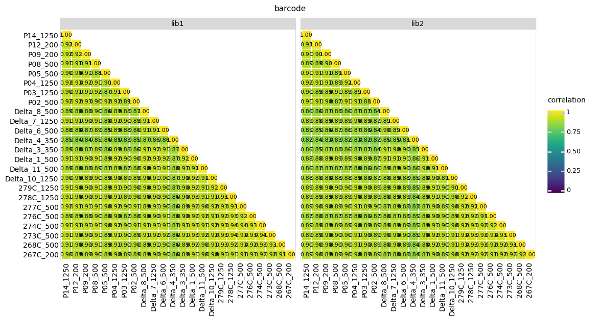
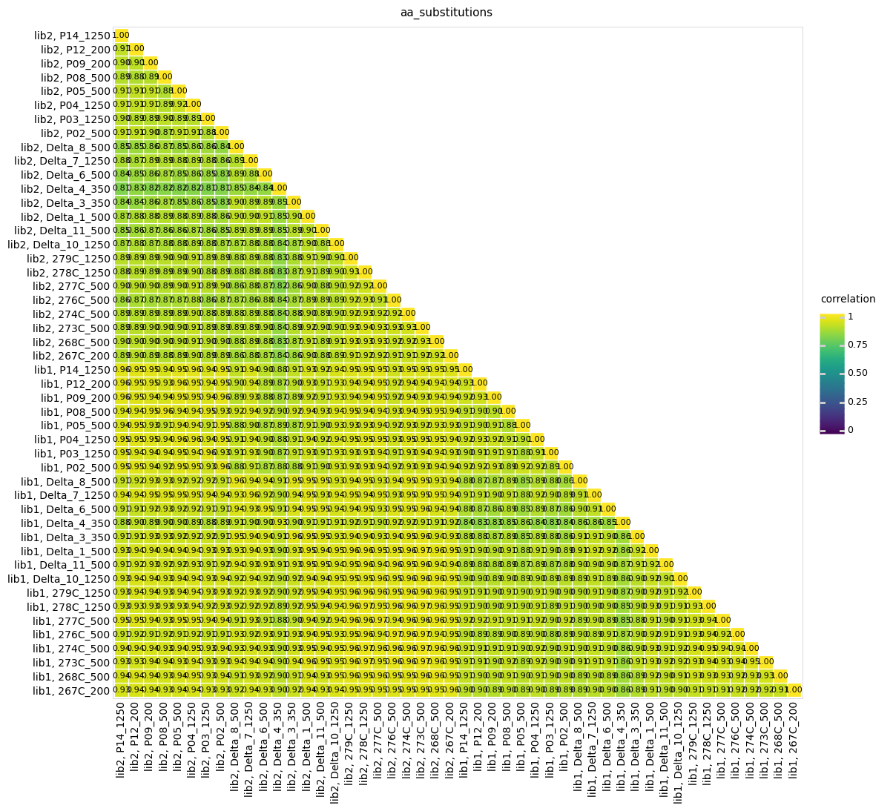
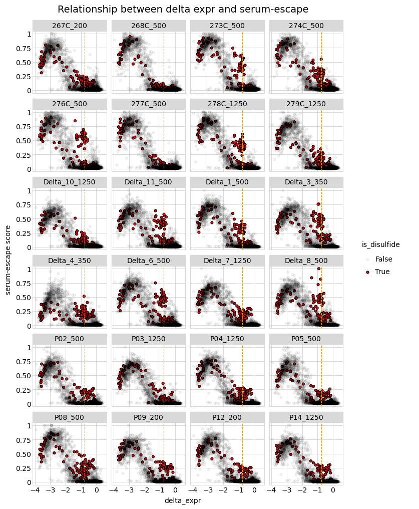

# Investigate Delta serum-escape scores

After analyzing the first set of serum-escape data, I think that the ~5% of cells that I was sorting out were essentially all non-functional RBD variants that are being purged by the computational filters on RBD binding and expression.

I want to investigate the escape scores before I filter anything out.

## Set up analysis 


```python
import os

from dms_variants.constants import CBPALETTE
import dms_variants.plotnine_themes
import dms_variants.utils

from IPython.display import display, HTML

# import matplotlib.pyplot as plt

import math
import numpy as np

import pandas as pd

import plotnine
from plotnine import *

# import seaborn

import yaml
```

Set the theme


```python
theme_set(dms_variants.plotnine_themes.theme_graygrid())
```

Versions of key software:


```python
print(f"Using dms_variants version {dms_variants.__version__}")
print(f"Using pandas version {pd.__version__}")
print(f"Using plotnine version {plotnine.__version__}")
```

    Using dms_variants version 0.8.10
    Using pandas version 1.3.4
    Using plotnine version 0.8.0


Define results directory


```python
resultsdir = 'results/investigate_scores'
os.makedirs(resultsdir, exist_ok=True)
```

Read config file


```python
with open('config.yaml') as f:
    config = yaml.safe_load(f)
```

Read in escape scores, only keep the relevant columns, and sort by escape score (descending).
I want to see what the highest scores are.

We can clearly tell from this plot [(escape score vs. variant_class)](https://github.com/jbloomlab/SARS-CoV-2-RBD_Delta/blob/main/results/summary/counts_to_scores_files/counts_to_scores_63_0.png) that multiple-mutants are more likely to have large escape scores -- this suggests that stability-mediated effects are dominating here. 


```python
escape_scores = (pd.read_csv(config['escape_scores'])
                            [['name', 'library', 'barcode',
                              'score', 'pre_count', 'post_count',
                              'aa_substitutions', 'n_aa_substitutions', 'variant_class', 
                              'pre_count_filter_cutoff', 'pass_pre_count_filter',
                              'muts_pass_bind_filter', 'muts_pass_expr_filter',
                              'pass_ACE2bind_expr_filter']]
                           )
```


```python
display(HTML(escape_scores
             .query('variant_class=="1 nonsynonymous" & pass_pre_count_filter')
             .sort_values(by=['score'], ascending=False)
             .rename(columns={'name': 'selection', 'aa_substitutions': 'mutation'})
             .drop(columns=['n_aa_substitutions','variant_class'])
             .assign(site=lambda x: x['mutation'].str[1: -1].astype(int) + config['site_number_offset'],
                     wildtype=lambda x: x['mutation'].str[0],
                     mutant=lambda x: x['mutation'].str[-1],
                     mutation=lambda x: x['wildtype']+x['site'].astype(str)+x['mutant']
                    )
             .head(5)
             .to_html(index=False)
            )
       )
```


<table border="1" class="dataframe">
  <thead>
    <tr style="text-align: right;">
      <th>selection</th>
      <th>library</th>
      <th>barcode</th>
      <th>score</th>
      <th>pre_count</th>
      <th>post_count</th>
      <th>mutation</th>
      <th>pre_count_filter_cutoff</th>
      <th>pass_pre_count_filter</th>
      <th>muts_pass_bind_filter</th>
      <th>muts_pass_expr_filter</th>
      <th>pass_ACE2bind_expr_filter</th>
      <th>site</th>
      <th>wildtype</th>
      <th>mutant</th>
    </tr>
  </thead>
  <tbody>
    <tr>
      <td>277C_repeat_500</td>
      <td>lib1</td>
      <td>CCTAGTATTCCGAACG</td>
      <td>1.0</td>
      <td>376</td>
      <td>439</td>
      <td>Y380L</td>
      <td>153.1</td>
      <td>True</td>
      <td>True</td>
      <td>False</td>
      <td>False</td>
      <td>380</td>
      <td>Y</td>
      <td>L</td>
    </tr>
    <tr>
      <td>278C_repeat_1250</td>
      <td>lib2</td>
      <td>CGCCATGCCTCTTAAC</td>
      <td>1.0</td>
      <td>774</td>
      <td>1005</td>
      <td>F342S</td>
      <td>116.0</td>
      <td>True</td>
      <td>True</td>
      <td>False</td>
      <td>False</td>
      <td>342</td>
      <td>F</td>
      <td>S</td>
    </tr>
    <tr>
      <td>Delta_8_500</td>
      <td>lib2</td>
      <td>CGCGAAATCTCACTAT</td>
      <td>1.0</td>
      <td>143</td>
      <td>147</td>
      <td>Y495A</td>
      <td>117.0</td>
      <td>True</td>
      <td>False</td>
      <td>False</td>
      <td>False</td>
      <td>495</td>
      <td>Y</td>
      <td>A</td>
    </tr>
    <tr>
      <td>P04_repeat_1250</td>
      <td>lib2</td>
      <td>CAATAGCACTATTGAA</td>
      <td>1.0</td>
      <td>148</td>
      <td>200</td>
      <td>I410T</td>
      <td>122.0</td>
      <td>True</td>
      <td>False</td>
      <td>False</td>
      <td>False</td>
      <td>410</td>
      <td>I</td>
      <td>T</td>
    </tr>
    <tr>
      <td>277C_repeat_500</td>
      <td>lib2</td>
      <td>TGATTCAACGGTAAGA</td>
      <td>1.0</td>
      <td>158</td>
      <td>197</td>
      <td>V407P</td>
      <td>116.0</td>
      <td>True</td>
      <td>False</td>
      <td>False</td>
      <td>False</td>
      <td>407</td>
      <td>V</td>
      <td>P</td>
    </tr>
  </tbody>
</table>


Can we make a correlation matrix to look at correlations of escape scores between samples (after filtering for min_counts but before filtering for bind and expr scores)


```python
for score_by in ['barcode', 'aa_substitutions']:
    
    # get correlations
    if score_by=="barcode":
        corr = dms_variants.utils.tidy_to_corr(
                df=escape_scores
                   .query('pass_pre_count_filter')
                   .assign(sample=lambda x: (x['name'] if score_by == 'barcode'
                                             else x['library'] + ', ' + x['name'])
                           ),
                sample_col='sample',
                label_col=score_by,
                value_col='score',
                group_cols='library' if score_by == 'barcode' else None,
                method='pearson',
                )
    else:
        corr = dms_variants.utils.tidy_to_corr(
                df=(escape_scores
                    .query('pass_pre_count_filter')
                    .groupby(['name', score_by, 'library'])
                    .agg({'score': np.mean})
                    .reset_index()
                   .assign(sample=lambda x: (x['name'] if score_by == 'barcode'
                                             else x['library'] + ', ' + x['name'])
                           )),
                sample_col='sample',
                label_col=score_by,
                value_col='score',
                group_cols='library' if score_by == 'barcode' else None,
                method='pearson',
                )
    
    # plot the correlations
    if score_by == 'barcode':
        npanels = corr['library'].nunique()
    else:
        npanels = 1
    nsamples = corr['sample_1'].nunique()
    p = (
        ggplot(corr.query('sample_1 >= sample_2')
               .assign(corr_str=lambda x: x['correlation'].map('{:.2f}'.format),
                       sample_1=lambda x: pd.Categorical(x['sample_1'],
                                                         reversed(x['sample_1'].unique()),
                                                         ordered=True)
                       ), 
               aes('sample_1', 'sample_2',
                   fill='correlation', label='corr_str')) +
        geom_tile(color='white', size=0.5) +
        geom_text(size=8) +
        labs(title=score_by) +
        theme(figure_size=(0.25 * nsamples * npanels, 0.25 * nsamples),
              panel_grid_major=element_blank(),
              axis_text_x=element_text(angle=90),
              plot_title=element_text(size=11),
              ) +
        scale_fill_continuous(limits=(0, 1)) +
        xlab('') +
        ylab('')
        )
    if score_by == 'barcode' and corr['library'].nunique() > 1:
        p = p + facet_wrap('~ library', nrow=1)
    _ = p.draw()
    p.save(f'{resultsdir}/escape-corr-by-{score_by}.pdf', limitsize=False)
```

    /fh/fast/bloom_j/computational_notebooks/agreaney/2021/SARS-CoV-2-RBD_Delta/env/lib/python3.8/site-packages/plotnine/ggplot.py:719: PlotnineWarning: Saving 20.0 x 10.0 in image.
    /fh/fast/bloom_j/computational_notebooks/agreaney/2021/SARS-CoV-2-RBD_Delta/env/lib/python3.8/site-packages/plotnine/ggplot.py:722: PlotnineWarning: Filename: results/investigate_scores/escape-corr-by-barcode.pdf
    /fh/fast/bloom_j/computational_notebooks/agreaney/2021/SARS-CoV-2-RBD_Delta/env/lib/python3.8/site-packages/plotnine/ggplot.py:719: PlotnineWarning: Saving 20.0 x 20.0 in image.
    /fh/fast/bloom_j/computational_notebooks/agreaney/2021/SARS-CoV-2-RBD_Delta/env/lib/python3.8/site-packages/plotnine/ggplot.py:722: PlotnineWarning: Filename: results/investigate_scores/escape-corr-by-aa_substitutions.pdf


    

    


    

    


Read in DMS ACE2 binding and RBD expression scores


```python
dms_scores = pd.read_csv(config['final_variant_scores_mut_file'])
```


```python
scores= (escape_scores
        .query('variant_class=="1 nonsynonymous" & pass_pre_count_filter')
        .rename(columns={'name': 'selection', 'aa_substitutions': 'mutation'})
        .drop(columns=['n_aa_substitutions','variant_class', 'pre_count', 'post_count', 'pre_count_filter_cutoff'])
        .assign(site=lambda x: x['mutation'].str[1: -1].astype(int) + config['site_number_offset'],
                wildtype=lambda x: x['mutation'].str[0], 
                mutant=lambda x: x['mutation'].str[-1],
                mutation=lambda x: x['wildtype']+x['site'].astype(str)+x['mutant']
               )
        .merge(dms_scores[['mutation', 'delta_bind', 'delta_expr']],
               how='left',
               on='mutation',
               validate='many_to_one'
              )
       )

display(HTML(scores.head().to_html(index=False)))
```


<table border="1" class="dataframe">
  <thead>
    <tr style="text-align: right;">
      <th>selection</th>
      <th>library</th>
      <th>barcode</th>
      <th>score</th>
      <th>mutation</th>
      <th>pass_pre_count_filter</th>
      <th>muts_pass_bind_filter</th>
      <th>muts_pass_expr_filter</th>
      <th>pass_ACE2bind_expr_filter</th>
      <th>site</th>
      <th>wildtype</th>
      <th>mutant</th>
      <th>delta_bind</th>
      <th>delta_expr</th>
    </tr>
  </thead>
  <tbody>
    <tr>
      <td>267C_200</td>
      <td>lib1</td>
      <td>GCTACAAAGTCCGCAG</td>
      <td>0.557400</td>
      <td>D398T</td>
      <td>True</td>
      <td>True</td>
      <td>False</td>
      <td>False</td>
      <td>398</td>
      <td>D</td>
      <td>T</td>
      <td>-0.91858</td>
      <td>-2.61807</td>
    </tr>
    <tr>
      <td>267C_200</td>
      <td>lib1</td>
      <td>AAAGCCGAGTTAATAA</td>
      <td>0.004908</td>
      <td>C336S</td>
      <td>True</td>
      <td>True</td>
      <td>False</td>
      <td>False</td>
      <td>336</td>
      <td>C</td>
      <td>S</td>
      <td>-0.47241</td>
      <td>-0.77123</td>
    </tr>
    <tr>
      <td>267C_200</td>
      <td>lib1</td>
      <td>ATCGAAATTGAGTGAT</td>
      <td>0.029110</td>
      <td>F429I</td>
      <td>True</td>
      <td>True</td>
      <td>False</td>
      <td>False</td>
      <td>429</td>
      <td>F</td>
      <td>I</td>
      <td>-0.56820</td>
      <td>-2.10913</td>
    </tr>
    <tr>
      <td>267C_200</td>
      <td>lib1</td>
      <td>TACAAAGCACGCTAAA</td>
      <td>0.000079</td>
      <td>Q506N</td>
      <td>True</td>
      <td>True</td>
      <td>True</td>
      <td>True</td>
      <td>506</td>
      <td>Q</td>
      <td>N</td>
      <td>-0.10570</td>
      <td>-0.49199</td>
    </tr>
    <tr>
      <td>267C_200</td>
      <td>lib1</td>
      <td>TTAAAGTAGTACGACA</td>
      <td>0.000083</td>
      <td>P337T</td>
      <td>True</td>
      <td>True</td>
      <td>True</td>
      <td>True</td>
      <td>337</td>
      <td>P</td>
      <td>T</td>
      <td>-0.09541</td>
      <td>-0.24318</td>
    </tr>
  </tbody>
</table>


Plot relationship between bind and expr scores and serum escape scores for each selection:


```python
for metric in ['bind', 'expr']:

    nfacets = scores['selection'].nunique()
    ncol = min(nfacets, 4)
    nrow = math.ceil(nfacets / ncol)
    xmin = scores[f'delta_{metric}'].min()
    xspan = scores[f'delta_{metric}'].max() - xmin
    ymin = scores['score'].min()
    yspan = scores['score'].max() - ymin
    p = (ggplot(scores
                .assign(is_disulfide=lambda x: x['mutation'].apply(lambda s: s[0]).isin(["C"]))
                .groupby(['selection', 'mutation', 'delta_bind', 'delta_expr', 'is_disulfide'])
                .agg({'score': np.mean})
                .rename(columns={'score':'serum-escape score'})
                .reset_index()
               ) +
         aes(x=f'delta_{metric}', y='serum-escape score', fill='is_disulfide', alpha='is_disulfide') +
         geom_point() +
         geom_vline(xintercept=config[f'escape_score_min_{metric}_mut'], 
                linetype='dashed',
                color=CBPALETTE[1]) +
         facet_wrap('~ selection', ncol=ncol) +
         theme(figure_size=(2 * ncol, 2 * nrow),
               plot_title=element_text(size=14),
              ) +
         ggtitle(f'Relationship between delta {metric} and serum-escape') +
         scale_fill_manual(values=['black', 'red']) +
         scale_alpha_manual(values=[0.05,1])
         )

    _ = p.draw()
    
    p.save(f'{resultsdir}/escape-vs-{metric}.pdf', limitsize=False)
```

    /fh/fast/bloom_j/computational_notebooks/agreaney/2021/SARS-CoV-2-RBD_Delta/env/lib/python3.8/site-packages/plotnine/ggplot.py:719: PlotnineWarning: Saving 8 x 20 in image.
    /fh/fast/bloom_j/computational_notebooks/agreaney/2021/SARS-CoV-2-RBD_Delta/env/lib/python3.8/site-packages/plotnine/ggplot.py:722: PlotnineWarning: Filename: results/investigate_scores/escape-vs-bind.pdf
    /fh/fast/bloom_j/computational_notebooks/agreaney/2021/SARS-CoV-2-RBD_Delta/env/lib/python3.8/site-packages/plotnine/ggplot.py:719: PlotnineWarning: Saving 8 x 20 in image.
    /fh/fast/bloom_j/computational_notebooks/agreaney/2021/SARS-CoV-2-RBD_Delta/env/lib/python3.8/site-packages/plotnine/ggplot.py:722: PlotnineWarning: Filename: results/investigate_scores/escape-vs-expr.pdf


    

    


    

    


## Thoughts / Conclusions:

The correlations are very high at the barcode and amino-acid level among all the sera.

The serum-escape scores have a strong relationship with RBD expression score.

My conclusion from all this is that I was indeed very cleanly sorting out highly deleterious mutants that were well-folded and ACE2-binding enough to get through my RBD+/ACE2+ pre-sort (incubating with 1e-8M dimeric ACE2, gating on WT incuabted with 1e-10M dimeric ACE2).


```python

```
