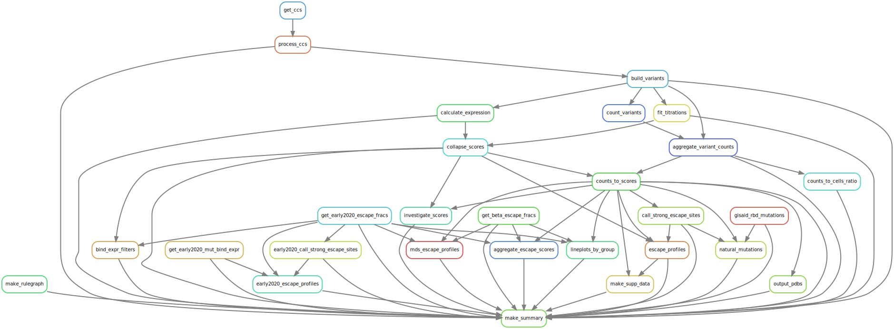

# Summary

Analysis run by [Snakefile](../../Snakefile)
using [this config file](../../config.yaml).
See the [README in the top directory](../../README.md)
for details.

Here is the rule graph of the computational workflow:

Here is the Markdown output of each notebook in the workflow:
1. Get prior DMS mutation-level [binding and expression data](../prior_DMS_data/early2020_mutant_ACE2binding_expression.csv).

2. Get prior MAPping [escape_fracs](../prior_DMS_data/early2020_escape_fracs.csv) for polyclonal plasmas from early 2020 against the Wuhan-1 RBD library.

2. [Process PacBio CCSs](process_ccs.md).

3. [Build variants from CCSs](build_variants.md).
   Creates a [codon variant table](../variants/codon_variant_table.csv)
   linking barcodes to the mutations in the variants.

4. Count variants and then
    [aggregate counts](aggregate_variant_counts.md) 
    to create [variant counts file](../counts/variant_counts.csv.gz).

5. [Analyze sequencing counts to cells ratio](counts_to_cells_ratio.md);
   this prints a list of any samples where this ratio too low. Also
   creates [a CSV](../counts/counts_to_cells_csv.csv) with the
   sequencing counts, number of sorted cells, and ratios for
   all samples.

6. [Fit titration curves](compute_binding_Kd.md) to calculate per-barcode KD, recorded in [this file](../binding_Kd/bc_binding.csv).

7. [Analyze Sort-seq](compute_expression_meanF.md) to calculate per-barcode RBD expression, recorded in [this file](../expression_meanF/bc_expression.csv).

8. [Derive final genotype-level phenotypes from replicate barcoded sequences](collapse_scores.md).
   Generates final phenotypes, recorded in [this file](../final_variant_scores/final_variant_scores.csv).

9. Determine [cutoffs](bind_expr_filters.md) for ACE2 binding and RBD expression for serum-escape experiments. 

10. [Count mutations in GISAID RBD sequences](gisaid_rbd_mutations.md)
    to create [this counts file](../GISAID_mutations/mutation_counts.csv).